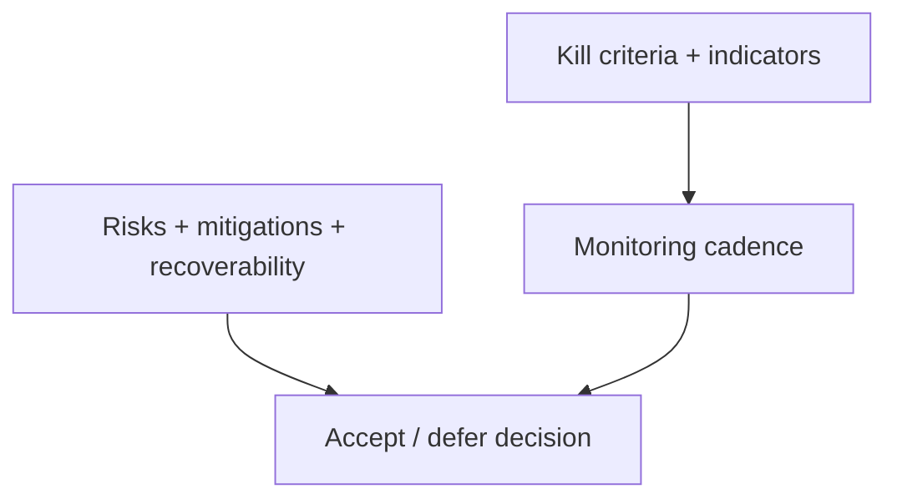

# ADR-0023: Decision Framework — risk framing and kill criteria

## Status
Proposed

## Date
2026-04-17

## Intellectual property rights
Repository authorship and licensing: see project LICENSE; contact maintainers for clarification.

## Privacy and confidentiality
This ADR contains no personal data. Implementers must follow the repository privacy and confidentiality policies, avoid committing secrets, and document any sensitive data handling in implementation steps.

## Related ADRs

- [README.md](README.md) — ADR index *(no tightly coupled ADR beyond references below)*.

## Context
The NextVision Suite's risk and mitigation documentation defines a decision framework for evaluating new initiatives and kill criteria for continuing work. This framework guides go/no-go decisions across phases.

## Decision
- Adopt a lightweight decision framework requiring explicit answers for: introduced risks, mitigations, worst-case scenarios, recoverability, and acceptability given upside.
- Use stated "Kill criteria" (3 consecutive phase failures, unit economics broken, fundamental technical impossibility, or market shift) as formal stop conditions for projects.
- Document risk acceptance levels and monitoring cadence in project roadmaps.

## Consequences
- Teams must include explicit risk assessments and recovery plans in decision artifacts.
- Project dashboards must track monitoring indicators tied to the framework.

## Diagrams

Initiatives document **risks, mitigations, worst case**; **kill criteria** and monitoring cadence bound continued investment.

## Testing

Contract / unit coverage as cited in **References**; extend this section when a dedicated gate exists. Revisit this ADR if enforcement drifts or the decision is bypassed in code review.

## References
(Automated migration entry created 2026-04-17)
