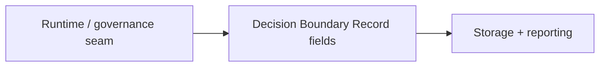

# ADR-0024: Decision Boundary Record — minimum schema for decision boundary recording

## Status
Not Finished

## Implementation Status

**Schema defined; runtime emission not implemented.**

- The `Decision Boundary Record` minimum schema (decision_name, decision_class, owner_layer, input_seam_ref, chosen_path, validation_result, failure_seam_used, notes_code) is documented.
- No `DecisionBoundaryRecord` class or runtime emitter was found in `backend/`, `world-engine/`, or `ai_stack/`.
- ADR-0033 and `ai_stack/live_runtime_commit_semantics.py` produce diagnostics fields that partially fulfill the intent (route_id, validation_status, commit_applied, etc.) but do not use the standardized Decision Boundary Record schema.
- Required before: formal governance audit trails with cross-seam decision boundary records can be produced.
- This ADR describes future instrumentation work; it has not been prioritized ahead of MVP4 runtime concerns.

## Date
2026-04-17

## Intellectual property rights
Repository authorship and licensing: see project LICENSE; contact maintainers for clarification.

## Privacy and confidentiality
This ADR contains no personal data. Implementers must follow the repository privacy and confidentiality policies, avoid committing secrets, and document any sensitive data handling in implementation steps.

## Related ADRs

- [README.md](README.md) — ADR index *(no tightly coupled ADR beyond references below)*.

## Context
The `ROADMAP_MVP_GoC.md` documents a set of minimum fields for runtime records including a Decision Boundary Record. Capturing decision boundary metadata consistently supports auditability and governance.

## Decision
- Standardize a `Decision Boundary Record` with the following minimum fields:
  - `decision_name`
  - `decision_class`
  - `owner_layer`
  - `input_seam_ref`
  - `chosen_path`
  - `validation_result`
  - `failure_seam_used`
  - `notes_code`

- Ensure runtime and governance layers emit this record when a decision boundary is crossed.

## Consequences
- Instrumentation work required in runtime components to populate the record.
- Downstream storage, retrieval, and reporting should include these fields for governance views.

## Diagrams

Each **decision boundary crossing** emits a minimum **Decision Boundary Record** for audit and governance views.

## Testing

Contract / unit coverage as cited in **References**; extend this section when a dedicated gate exists. Revisit this ADR if enforcement drifts or the decision is bypassed in code review.

## References
(Automated migration entry created 2026-04-17)
