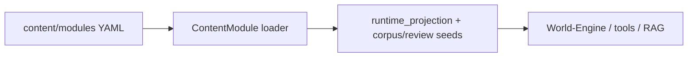

# ADR-0025: Canonical Authored Content Model

## Status
Accepted

## Implementation Status

**Implemented and stable.**

- `content/modules/<module_id>/` YAML format is the canonical authored content
  model (god_of_carnage/, etc.). Current modules may be folder-based: canonical
  path, locations, objects, characters, knowledge, direction, and module policy
  live as separate authority surfaces.
- `backend/app/content/module_loader.py` and `backend/app/content/module_models.py` are the authoritative ingestion surface.
- `backend/app/content/compiler/` compiles to three projections: `runtime_projection`, `retrieval_corpus_seed`, `review_export_seed`.
- World-Engine, review tools, and RAG (`ai_stack/rag.py`) consume compiled projections.
- `docs/technical/content/canonical_authored_content_model.md` and `docs/dev/architecture/content-modules-and-compiler-pipeline.md` document the pipeline with "Migrated Decision: See ADR-0025" pointers.
- YAML > published snapshots > writers-room > builtins authority precedence is enforced in the loader.
- Status promoted from "Proposed" because the decision has been stable through MVP1–MVP4.

## Date
2026-04-17

## Intellectual property rights
Repository authorship and licensing: see project LICENSE; contact maintainers for clarification.

## Privacy and confidentiality
This ADR contains no personal data. Implementers must follow the repository privacy and confidentiality policies, avoid committing secrets, and document any sensitive data handling in implementation steps.

## Related ADRs

- [README.md](README.md) — ADR index *(no tightly coupled ADR beyond references below)*.

## Context
Content authoring in the repository uses structured content modules under
`content/modules/<module_id>/`. Multiple tools and projections consume these
sources; a single canonical authored content model avoids divergence.

The model has moved beyond the early flat scene/trigger/ending file set. The
current contract prefers modular authority surfaces: locations describe places,
objects describe inspectable things, character folders describe people and
relationships, and `canonical_path/` describes directed story order by
reference.

## Decision
- Declare the structured module format under `content/modules/<module_id>/` as
  the canonical authored content model.
- Treat `ContentModule` and the backend loader (`backend/app/content/module_loader.py`) as the authoritative ingestion surface for authored content.
- Compile authored content into projection outputs: `runtime_projection`, `retrieval_corpus_seed`, and `review_export_seed`.
- Content modules must not duplicate location, object, character, or language
  meaning in parallel lookup databases. Directed story and runtime guidance
  reference canonical content IDs rather than restating prose.

## Consequences
- Consumers (World-Engine, review tools, RAG ingestion) must read the canonical compiled projections rather than ad-hoc source variants.
- Changes to the canonical model require an ADR and coordination across the runtime and backend teams.

## Diagrams

Authoring lives under **`content/modules/`**; ingestion and **compiled projections** are what downstream consumers read.

## Testing

Contract / unit coverage as cited in **References**; extend this section when a dedicated gate exists. Revisit this ADR if enforcement drifts or the decision is bypassed in code review.

## References
(Automated migration entry created 2026-04-17)
