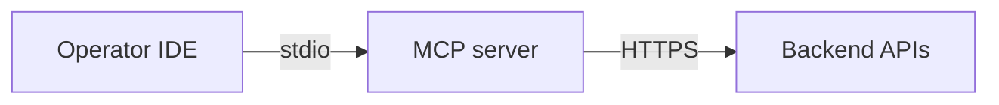

# ADR-0026: MCP Phase A — Host & Runtime defaults

## Status
Accepted

## Implementation Status

**Implemented — MCP server exists as local stdio operator console.**

- `tools/mcp_server/` is the MCP server implementation for operator workflows.
- Runs locally (stdio transport) and communicates with backend via HTTPS — matches the ADR decision exactly.
- Used as operator console (inspect/debug), not as in-game mechanic.
- `docs/mcp/01_M0_host_and_runtime.md` has "Migrated Decision: See ADR-0026" pointer.
- Status promoted from "Proposed" because the Phase A implementation is in place and stable.

## Date
2026-04-17

## Intellectual property rights
Repository authorship and licensing: see project LICENSE; contact maintainers for clarification.

## Privacy and confidentiality
This ADR contains no personal data. Implementers must follow the repository privacy and confidentiality policies, avoid committing secrets, and document any sensitive data handling in implementation steps.

## Related ADRs

- [README.md](README.md) — ADR index *(no tightly coupled ADR beyond references below)*.

## Context
MCP (Model Context Protocol) usage during Phase A requires a safe, low-friction host and runtime contract for operator workflows and debugging.

## Decision
- Run the MCP server locally (stdio transport) for Phase A operator workflows.
- MCP tools communicate with the backend remotely over HTTPS.
- MCP in Phase A functions as an operator console (inspect/debug) and must not be used as an in-game mechanic.

## Consequences
- Operator tooling should be documented for local setup and required backend access.
- Future phases may evolve the host and runtime assumptions; changes require ADRs.

## Diagrams

Phase A MCP: **local stdio** server, **HTTPS** to backend — **operator console** only, not an in-game mechanic.

## Testing

Contract / unit coverage as cited in **References**; extend this section when a dedicated gate exists. Revisit this ADR if enforcement drifts or the decision is bypassed in code review.

## References
(Automated migration entry created 2026-04-17)
