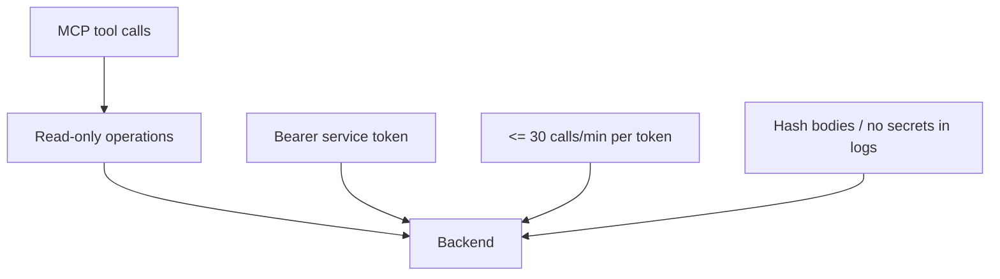

# ADR-0028: MCP Security Baseline — Phase A minimal policy

## Status
Accepted

## Implementation Status

**Implemented at policy level; MCP rate-limiting is verified by the central limit inventory and MCP rate-limit tests. Log-hashing remains governed by separate logging coverage.**

- Phase A MCP is read/preview-only for operator workflows; write operations are not exposed through the MCP tool set.
- Bearer token authentication (`Authorization: Bearer <SERVICE_TOKEN>`) is used for backend calls per the ADR.
- Tokens are stored in local config, not committed to repo.
- Rate limiting (30 calls/min per token) is enforced in `tools/mcp_server/server.py`, sourced from `ai_stack/quality_lab/limit_inventory.py`, and mirrored per tool in `tools/list` metadata. Request-body hashing in logs remains a separate logging constraint.
- Status promoted from "Proposed" because the Phase A security posture is in force and the MCP server is operational.
- Review if rate limiting is not implemented in `tools/mcp_server/` before expanding Phase A scope.

## Date
2026-04-17

## Intellectual property rights
Repository authorship and licensing: see project LICENSE; contact maintainers for clarification.

## Privacy and confidentiality
This ADR contains no personal data. Implementers must follow the repository privacy and confidentiality policies, avoid committing secrets, and document any sensitive data handling in implementation steps.

## Related ADRs

- [README.md](README.md) — ADR index *(no tightly coupled ADR beyond references below)*.

## Context
Phase A for MCP requires conservative security defaults to prevent accidental state changes and exposure of secrets during operator workflows.

## Decision
- Restrict MCP to read/preview-only behavior in Phase A; `write` operations are forbidden.
- Use `Authorization: Bearer <SERVICE_TOKEN>` for backend calls; tokens stored securely and not committed to repo.
- Rate limit MCP locally to max 30 calls/min per token.
- Logs must not contain PII or secrets; request bodies should be hashed when stored.

## Consequences
- Tooling and endpoints must respect permission levels and logging constraints.
- Future phases may relax or change these rules with an ADR.

## Diagrams

Phase A MCP is **read/preview-only**, **Bearer**-authenticated, **rate-limited**, and logs **redact** secrets/PII.

## Testing

Contract / unit coverage as cited in **References**. Rate-limit drift is covered by `tools/mcp_server/tests/test_rate_limit.py` and the backend info inventory tests. Revisit this ADR if enforcement drifts or the decision is bypassed in code review.

## References
(Automated migration entry created 2026-04-17)
