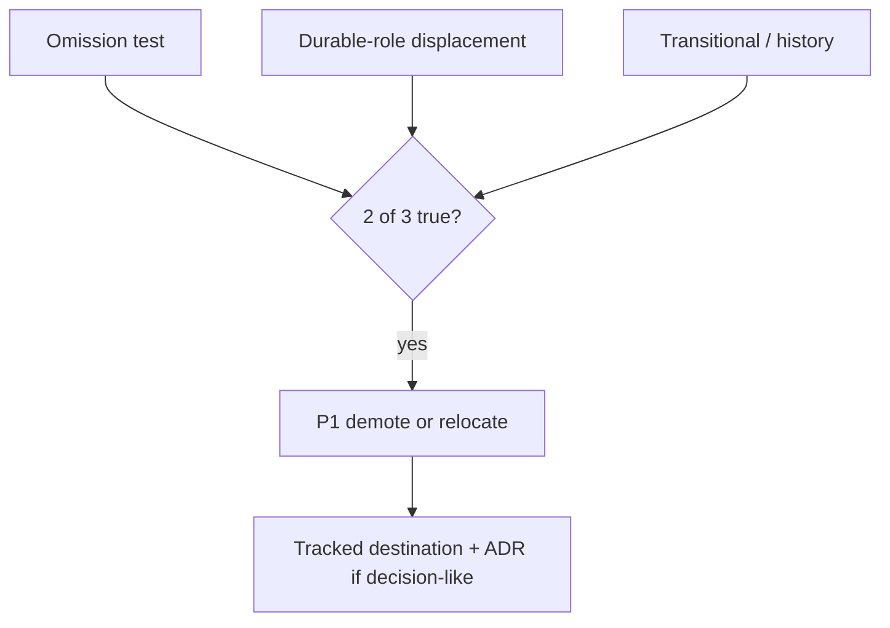

# ADR-0029: Residue Removal Policy — operational criteria and handling

## Status
Proposed

## Date
2026-04-17

## Intellectual property rights
Repository authorship and licensing: see project LICENSE; contact maintainers for clarification.

## Privacy and confidentiality
This ADR contains no personal data. Implementers must follow the repository privacy and confidentiality policies, avoid committing secrets, and document any sensitive data handling in implementation steps.

## Related ADRs

- [README.md](README.md) — ADR index *(no tightly coupled ADR beyond references below)*.

## Context
An audit pass (Task 4 — Residue Removal Report) applied operational criteria to classify documentation and artifacts as keep, demote/archive, or relocate. The audit used a 2-of-3 rule across omission, durable-role displacement, and transitional/history tests.

## Decision
- Adopt the 2-of-3 residue criteria for operational cleanup:
  - Evaluate `omission` (active-value omission), `displacement` (durable-role displacement), and `transitional/history` status.
  - If at least 2 of 3 criteria are satisfied, mark the surface as a residue-candidate and plan demotion/archival or relocation.
- Use priority tiers (`P0` keep; `P1` candidate demote/relocate) to sequence work.
- For mixed-case collections (e.g., `docs/reports/*`) apply per-file evaluation and demote on a case-by-case basis.
- Move executed removals or relocations to tracked fixtures/locations (e.g., `backend/fixtures/…`, `docs/reports/` corrected paths).

## Consequences
- Requires a downstream cleanup plan and owners to execute demotion/archival for `P1` candidates.
- Instrumentation and gating for relocation must be explicit (do not delete without provenance capture).
- Some files require extraction of decision-like content into canonical ADRs before demotion.

## Diagrams

**2-of-3** residue signals (omission, displacement, transitional) drive **P1** candidates; execution stays **provenance-preserving** (relocate/demote, not silent delete).

## Testing

Contract / unit coverage as cited in **References**; extend this section when a dedicated gate exists. Revisit this ADR if enforcement drifts or the decision is bypassed in code review.

## References
(Automated migration entry created 2026-04-17)
