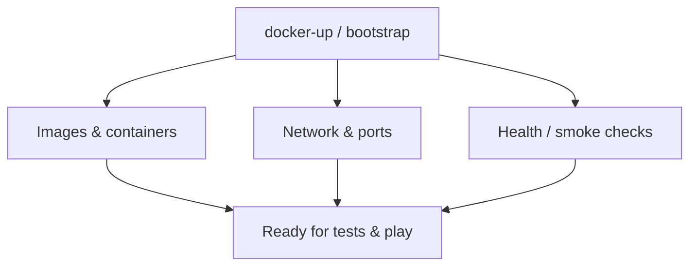

# ADR-0030: `docker-up.py` as Complete Local Bootstrap

## Status

Accepted

## Implementation Status

**Implemented and tested.**

- `docker-up.py` is the canonical operator entry point; it materializes `.env` before any Compose operation.
- All required secrets (`SECRET_KEY`, `JWT_SECRET_KEY`, `SECRETS_KEK`, `PLAY_SERVICE_SHARED_SECRET`, `PLAY_SERVICE_INTERNAL_API_KEY`, `FRONTEND_SECRET_KEY`, `INTERNAL_RUNTIME_CONFIG_TOKEN`) and runtime URLs (`REDIS_URL`, etc.) are generated on first run.
- `docker-compose.yml` includes `redis` service; Redis is not optional in the standard Docker path.
- Langfuse bootstrap is optional import (credentials from `.env` only if both keys present); not governed by legacy `LANGFUSE_ENABLED` flag.
- Production secret stores are explicitly out of scope for `docker-up.py`; the helper remains the local `.env` bootstrap path and must not require Vault/KMS/cloud-secret access.
- Production Redis hardening for Compose is automated through `docker-up.py init-production-redis` and `docker-compose.redis-production.yml`.
- Exit-code contract (0–6) is in force.
- Test coverage: `tests/test_docker_up_complete_bootstrap.py`.
- First-party Compose service images use **Python 3.14** per [ADR-0064](adr-0064-python-314-unified-interpreter-standard.md) (`backend`, `play-service`, `frontend`, `administration-tool` Dockerfiles).

## Date

2026-05-05

## Intellectual property rights

Repository authorship and licensing: see project LICENSE; contact maintainers for clarification.

## Privacy and confidentiality

This ADR documents local bootstrap behavior. Do not commit live secrets or operator credentials to tracked files.

## Related ADRs

- [ADR-0031](adr-0031-env-configuration-governance.md) - Environment and secrets governance
- [ADR-0032](adr-0032-mvp4-live-runtime-setup-requirements.md) - MVP4 live runtime requirements
- [ADR-0064](adr-0064-python-314-unified-interpreter-standard.md) - Unified Python 3.14 images for Compose services

## Context

`docker-up.py` is the canonical operator entry point for a local World of Shadows stack. The current implementation is no longer a thin wrapper around `docker compose up`; it is responsible for preparing a usable runtime before Compose starts.

Three implementation realities are important:

1. Platform secrets are generated on the host and persisted in the repository-root `.env`.
2. The Docker stack now includes Redis as shared runtime-governance storage because backend runs multiple Gunicorn workers.
3. Langfuse is runtime-configured in backend settings; `docker-up.py` only imports `LANGFUSE_*` credentials when they are explicitly present in `.env`.
4. Local Redis and production Redis have different security postures: local app Redis remains internal with no host port, while production must enforce separate app/Langfuse Redis instances, passwords, ACL users, and TLS.

This ADR replaces older assumptions such as:

- "docker-up only starts containers"
- "Langfuse is enabled through `LANGFUSE_ENABLED` in `.env`"
- "governance runtime state can safely live in process memory in Docker"

## Decision

### 1. `docker-up.py` owns first-run environment materialization

Before any `up`, `build`, or `restart` flow, `docker-up.py` ensures the repository-root `.env` exists and contains:

- generated stable platform secrets:
  - `SECRET_KEY`
  - `JWT_SECRET_KEY`
  - `SECRETS_KEK`
  - `PLAY_SERVICE_SHARED_SECRET`
  - `PLAY_SERVICE_INTERNAL_API_KEY`
  - `FRONTEND_SECRET_KEY`
  - `INTERNAL_RUNTIME_CONFIG_TOKEN`
- defaulted runtime URLs:
  - `OPENAI_BASE_URL`
  - `OPENROUTER_BASE_URL`
  - `OLLAMA_BASE_URL`
  - `ANTHROPIC_BASE_URL`
  - `ANTHROPIC_VERSION`
  - `REDIS_URL`
- empty-but-present provider credential slots:
  - `OPENAI_API_KEY`
  - `OPENROUTER_API_KEY`
  - `ANTHROPIC_API_KEY`
  - `LANGFUSE_PUBLIC_KEY`
  - `LANGFUSE_SECRET_KEY`

This is the authoritative first-run behavior. Operators are not expected to hand-author a minimal `.env` before the stack can start.

### 2. Docker bootstrap includes a shared Redis runtime-governance store

The local Compose stack must start:

- `backend`
- `frontend`
- `administration-tool`
- `play-service`
- `redis`

Redis is not optional in the standard Docker path because MVP4 runtime governance now persists:

- token budget state
- truthful cost summaries
- evaluation annotations and baselines
- recent turn quality signals
- active override indexes

Without Redis, each backend worker would keep its own in-memory view, which is not acceptable for Docker-operated observability and governance.

### 3. Backend initialization remains the source of governed runtime truth

`docker-up.py up` must:

1. ensure `.env`
2. run `docker compose up -d --build`
3. wait for backend health
4. create the bootstrap admin user
5. optionally import Langfuse config into backend settings

`docker-up.py` does not become the long-term owner of runtime settings. It only helps seed them.

### 4. Langfuse bootstrap is optional import, not env-flag activation

Current behavior is:

- if both `LANGFUSE_PUBLIC_KEY` and `LANGFUSE_SECRET_KEY` are absent in `.env`, `docker-up.py` leaves backend observability settings unchanged
- if both are present, `docker-up.py` calls the backend initialization endpoint and imports the Langfuse configuration
- if only one key is present, bootstrap fails loudly

This means Docker bootstrap supports two valid operator flows:

1. Configure Langfuse later in backend/admin settings
2. Preseed Langfuse from `.env` during bootstrap

It does not rely on a legacy `LANGFUSE_ENABLED` environment toggle.

### 5. Failure must remain explicit

The current exit-code contract stays in force for `up`:

- `0` success
- `1` Docker/Compose failure
- `2` backend migration/bootstrap failure
- `3` admin-user creation failure
- `4` Langfuse initialization failure when credentials were supplied
- `5` backend health check failure
- `6` `.env` validation/materialization failure

### 6. Production secret stores must not break local bootstrap

Production deployments should source secrets from a dedicated secret store with rotation, audit logging, and separated access. That production store is a deployment responsibility outside this local helper.

`docker-up.py` must remain able to create or repair a local repository-root `.env` without contacting a central secret manager. Any future production integration must inject environment variables before the services start, or wrap deployment-specific infrastructure outside `docker-up.py`, while preserving the existing `init-env`, `up`, `build`, and `restart` behavior for local Compose.

### 7. Production Redis hardening is a first-class bootstrap path

`docker-up.py init-production-redis` must materialize the production Redis contract without manual file authoring:

- `APP_REDIS_USERNAME`, `APP_REDIS_PASSWORD`, `APP_REDIS_URL`, and TLS CA path for backend runtime governance Redis
- `LANGFUSE_REDIS_USERNAME`, `LANGFUSE_REDIS_PASSWORD`, `LANGFUSE_REDIS_CONNECTION_STRING`, TLS paths, and CA validation for Langfuse Redis
- ignored local ACL files under `.docker/redis-production/` with `default` disabled
- ignored local TLS certificates for the separate app Redis and Langfuse Redis services

`docker-compose.redis-production.yml` is layered only when `--production-redis`, `WOS_DOCKER_PRODUCTION_REDIS=1`, or `production-redis-up` is used. The override keeps Redis services internal, switches Redis to TLS-only, and injects the hardened app Redis URL into backend as `REDIS_URL`.

Validation is explicit: `python docker-up.py validate-production-redis` fails if URLs are not `rediss://`, TLS flags are false, ACL users/passwords are missing or shared, app and Langfuse Redis hosts are not separate, or generated ACL/cert assets are missing.

## Consequences

### Positive

- Local operators get a runnable stack from one command path.
- The generated `.env` and Redis service reflect the actual current runtime architecture.
- MVP4 governance data stays coherent across backend workers in Docker.
- Langfuse setup supports both env-preseed and backend-managed configuration.
- Production operators get a repeatable Redis hardening path instead of hand-editing passwords, ACL files, and TLS paths.

### Negative / risks

- The repository-root `.env` becomes part of normal local operations and must be preserved carefully.
- Redis is now a standard local dependency for Docker-based governance truth.
- Older docs or habits that assume env-only observability control are incorrect and must not be followed.

## Diagrams

Bootstrap entrypoint brings the dev stack to a known-good state (see **Decision**).

## Operational Notes

### What `docker-up.py` guarantees

- `.env` is created or repaired before Compose needs it
- missing placeholder secrets are regenerated
- `REDIS_URL` is present by default
- backend bootstrap can import Langfuse credentials if explicitly provided
- production Redis password/TLS/ACL material can be generated and validated on demand

### What it does not guarantee

- live provider API keys are valid
- Langfuse is enabled unless credentials were supplied or backend settings already contain it
- operator dashboards are meaningful outside the running backend/play-service traffic they summarize
- production-grade secret rotation, audit, or access separation; use a dedicated deployment secret store for that

## Testing

### Verification checklist

- [ ] `python docker-up.py init-env` creates or repairs repository-root `.env`
- [ ] generated secrets are non-placeholder values
- [ ] `REDIS_URL=redis://redis:6379/0` is present unless intentionally overridden
- [ ] `docker compose config --services` includes `redis`
- [ ] `python docker-up.py up` reaches healthy backend and bootstrap admin creation
- [ ] if both `LANGFUSE_*` keys are present, backend observability initialization succeeds
- [ ] if only one `LANGFUSE_*` key is present, `docker-up.py up` fails with exit code `4`
- [ ] `python docker-up.py init-production-redis` creates Redis ACL/TLS material and distinct app/Langfuse Redis URLs
- [ ] `python docker-up.py validate-production-redis` fails if Redis TLS, ACL users, passwords, or instance separation are missing

### Canonical test locations

- `tests/test_docker_up_complete_bootstrap.py`
- `tests/test_production_redis_docker_config.py`
- Compose validation via `docker compose -f docker-compose.yml config`

## References

- `docker-up.py`
- `docker-compose.yml`
- `docker-compose.redis-production.yml`
- `.env.example`
- `backend/.env.example`
- `backend/app/factory_app.py`
- `backend/app/services/observability_governance_service.py`
- `backend/app/api/v1/observability_governance_routes.py`
