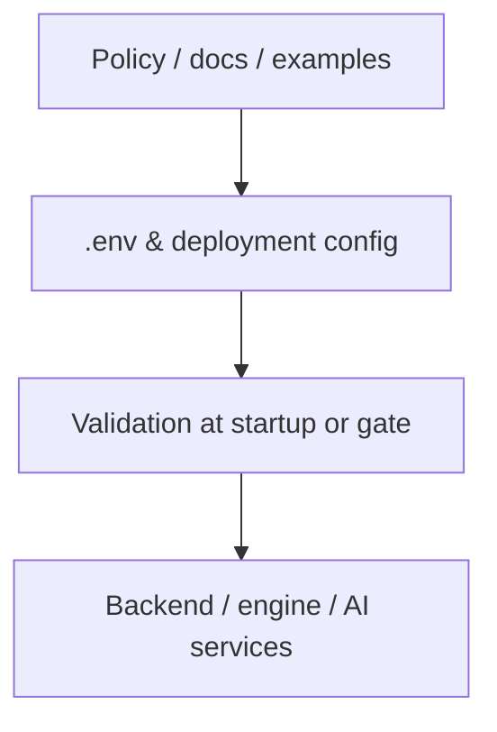

# ADR-0031: Environment Configuration Governance

## Status

Accepted

## Date

2026-05-05

## Intellectual property rights

Repository authorship and licensing: see project LICENSE; contact maintainers for clarification.

## Privacy and confidentiality

This ADR governs secrets and runtime configuration boundaries. Never commit live credentials to tracked files.

## Related ADRs

- [ADR-0030](adr-0030-docker-up-complete-bootstrap.md) - Local Docker bootstrap
- [ADR-0032](adr-0032-mvp4-live-runtime-setup-requirements.md) - MVP4 live runtime setup

## Context

The previous environment-governance description overstated the role of `.env` and encoded obsolete Langfuse assumptions.

Those older assumptions are no longer correct:

1. `.env` is not the single source of truth for all runtime configuration.
2. Langfuse is not governed by a legacy mandatory `LANGFUSE_ENABLED` switch.
3. Some runtime truth now lives in backend-managed settings and shared runtime storage, not directly in static environment variables.

The current architecture uses three configuration layers:

### Layer 1: Platform bootstrap and wiring

These values belong in environment variables because containers and services need them before the application runtime is fully available.

Examples:

- `SECRET_KEY`
- `JWT_SECRET_KEY`
- `SECRETS_KEK`
- `FRONTEND_SECRET_KEY`
- `PLAY_SERVICE_SHARED_SECRET`
- `PLAY_SERVICE_INTERNAL_API_KEY`
- `INTERNAL_RUNTIME_CONFIG_TOKEN`
- `BACKEND_RUNTIME_CONFIG_URL`
- `PLAY_SERVICE_INTERNAL_URL`
- `PLAY_SERVICE_PUBLIC_URL`
- `REDIS_URL`
- provider base URLs

### Layer 2: Provider credentials

These may originate from `.env` in local Docker setups, but they are still credentials, not behavioral governance rules.

Examples:

- `OPENAI_API_KEY`
- `OPENROUTER_API_KEY`
- `ANTHROPIC_API_KEY`
- optional `LANGFUSE_PUBLIC_KEY` / `LANGFUSE_SECRET_KEY` for bootstrap import

### Layer 3: Governed runtime settings

These are backend-managed settings that the application consumes operationally and may store encrypted or in database-backed form.

Examples:

- active Langfuse observability configuration
- runtime routing and provider governance
- evaluation, override, and session governance state

This ADR aligns environment governance with that actual split.

## Decision

### 1. `.env` is a bootstrap contract, not the sole runtime truth

The repository-root `.env` is authoritative for:

- local platform secret generation
- container-to-container wiring
- startup URLs
- local credential injection for provider access

It is not authoritative for all live operational behavior after startup.

In particular, MVP4 observability behavior is governed through backend configuration and runtime state, not by env flags alone.

### 2. Runtime-managed settings must not be reduced to legacy env toggles

For observability, the current correct model is:

- backend stores and exposes current observability status
- credentials can be written or rotated through backend routes
- `docker-up.py` may import `LANGFUSE_*` from `.env` into backend settings as a bootstrap convenience

The incorrect older model was:

- env toggle decides if observability exists
- missing toggle silently disables the feature
- services treat env as the primary Langfuse control plane

That model must not be reintroduced in docs or code.

### 3. Variable classes

All environment variables must fit one of these classes.

| Class | Purpose | Examples | Governance rule |
|---|---|---|---|
| Platform secrets | cross-service trust and cryptography | `JWT_SECRET_KEY`, `SECRETS_KEK`, `INTERNAL_RUNTIME_CONFIG_TOKEN` | generated once, preserved, never committed live |
| Runtime wiring | service discovery and URLs | `BACKEND_RUNTIME_CONFIG_URL`, `PLAY_SERVICE_PUBLIC_URL`, `REDIS_URL` | explicit in Docker/local deployment |
| Provider endpoints | non-secret upstream URLs/versions | `OPENAI_BASE_URL`, `ANTHROPIC_VERSION` | safe defaults allowed |
| Provider credentials | access to upstream providers | `OPENAI_API_KEY`, `ANTHROPIC_API_KEY`, `OPENROUTER_API_KEY`, `HF_TOKEN` (Hugging Face Hub read token for fastembed / hub downloads) | optional unless that provider path is used |
| Bootstrap import credentials | optional seeding into managed config | `LANGFUSE_PUBLIC_KEY`, `LANGFUSE_SECRET_KEY` | if present, must be complete pair |

**`docker-up.py` and optional credential slots:** For keys in `OPTIONAL_SECRET_KEYS`, the bootstrap only inserts a **missing key** with an empty value. It does **not** overwrite keys that already exist in `.env`, so saved AI provider keys, `HF_TOKEN`, and Langfuse bootstrap pairs remain stable across `init-env` / `up` runs.

**Admin UI coverage:** Langfuse operational credentials are managed under **Observability Settings** (`/manage/observability-settings`) once imported into backend storage. There is **no** administration-tool screen for `HF_TOKEN` or other Hugging Face Hub tokens today — operators set `HF_TOKEN` in the repository-root `.env` (see `.env.example`); compose `env_file` injects it into backend / play-service at runtime.

### 4. Environment validation must match actual ownership

Validation rules should be strict, but only for what env truly owns.

Valid examples:

- fail if required platform secrets are missing
- fail if `LANGFUSE_PUBLIC_KEY` is present without `LANGFUSE_SECRET_KEY`
- fail if Docker runtime expects Redis and `REDIS_URL` is malformed

Invalid examples:

- fail startup because `LANGFUSE_ENABLED` is absent
- document `.env` as the single source of truth for backend observability state
- require env toggles for settings that are intentionally backend-managed

### 5. Current Langfuse governance rule

The current correct Langfuse rule is:

- `.env` may contain optional bootstrap credentials
- backend settings are the operational source of truth
- play-service and runtime behavior consume the resolved backend-published configuration

This means a local operator can:

1. leave `LANGFUSE_*` blank and configure observability later through backend/admin settings, or
2. place both credentials in `.env` and let `docker-up.py` import them during bootstrap

### 6. Current Redis governance rule

Because backend runs multiple workers in Docker, shared runtime-governance state must not rely on per-process memory in the standard Docker path.

Therefore:

- `REDIS_URL` is part of bootstrap environment governance
- Docker Compose provisions Redis by default
- backend may fall back to in-process storage outside Docker, but that fallback is not the canonical Docker truth path

## Consequences

### Positive

- Documentation now matches the actual ownership boundaries in the implementation.
- Langfuse setup is described in a way that supports encrypted backend-managed settings.
- Redis-backed runtime-governance storage is treated as an operational requirement in Docker.

### Negative / risks

- Some older comments or examples may still mention `LANGFUSE_ENABLED`; they should be treated as transitional or historical, not normative.
- New features must be careful not to push backend-governed state back into `.env` out of convenience.

## Diagrams

Configuration governance flows from policy through runtime surfaces (see **Decision** and **Consequences**).

## Rules for New Configuration

When adding a new variable:

1. Decide whether it is bootstrap wiring, provider access, or governed runtime state.
2. If it is governed runtime state, do not default to `.env` ownership.
3. If it is a bootstrap-import credential, document the import path and completeness rules.
4. Add or update `.env.example` only for variables that truly belong in environment space.
5. Add startup validation only for env-owned invariants.

## Testing

### Verification checklist

- [ ] `docker-up.py init-env` materializes required platform secrets
- [ ] incomplete `LANGFUSE_*` pairs fail bootstrap clearly
- [ ] complete `LANGFUSE_*` pairs can be imported into backend observability settings
- [ ] backend starts with valid env even when Langfuse is managed later through backend settings
- [ ] Docker path uses shared Redis-backed governance storage rather than worker-local state

## References

- `.env.example`
- `backend/.env.example`
- `docker-up.py`
- `docker-compose.yml`
- `backend/app/config.py`
- `backend/app/factory_app.py`
- `backend/app/api/v1/observability_governance_routes.py`
- `backend/app/services/observability_governance_service.py`
