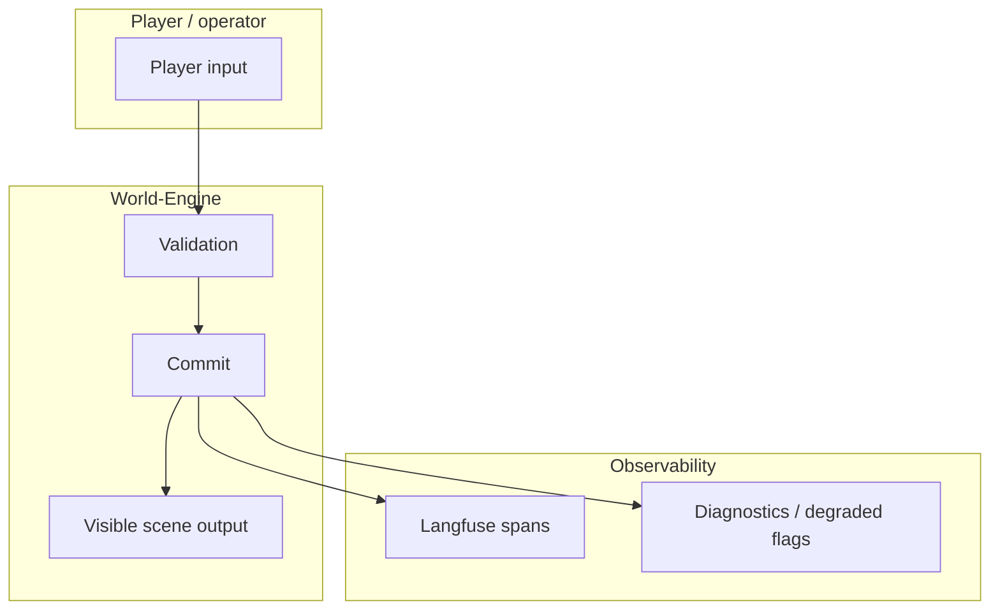

# ADR: Live Runtime Commit Semantics for Real AI, Mock, Fallback, and Visible Story Output

- **Status:** Accepted
- **Date:** 2026-05-05

## Implementation Status

**Core semantic gate implemented; some diagnostics fields and frontend contracts still in progress.**

**Implemented:**
- `ai_stack/live_runtime_commit_semantics.py`: `evaluate_live_turn_success_gate()` computes `live_success`, `adapter_kind`, `visible_output_present`, `visible_output_count`, `quality_class`, `degradation_signals` per ADR definitions.
- `adapter_kind` classification: `real`, `mock`, `fallback`, `placeholder`.
- Mock and fallback paths set `live_success=false`; `opening_leniency_approved=True` marks degraded diagnostic commits.
- §13.5 (Langfuse trace-level scores): `LangfuseAdapter.add_score` emits scores both at observation level and trace level via `create_score(trace_id=...)`. Regression guard in `world-engine/tests/test_trace_middleware.py`.
- §13.6 (player input observability): `player_input_length` and `player_input_sha256` on `backend.turn.execute` (Backend) and `world-engine.turn.execute` spans. Regression guards in `backend/tests/test_game_routes.py`, `backend/tests/test_session_routes.py`, `world-engine/tests/test_trace_middleware.py`.

**Not yet fully implemented:**
- Not all required diagnostic fields from §6 are present on every trace (some are partial depending on adapter/provider path).
- Frontend does not yet fully enforce all §7 readiness states (ready_with_opening vs. creating_opening vs. blocked_missing_opening) — see ADR-0034 for shell contract.
- Hard gate tests (§10) are defined but not all paths covered.
- **Project:** World of Shadows
- **Decision owner:** Runtime / AI / Observability maintainers
- **Related areas:** World-Engine, Backend, AI Stack, LangGraph/LangChain, Langfuse, Frontend Player Shell, Narrative Governance
- **Related ADR:** [ADR-0034](adr-0034-player-facing-narrative-shell-contract.md) — player shell / MVP5 presentation contract (orthogonal to commit semantics)
- **Supersedes:** None
- **Superseded by:** None

---

## 1. Context

The current World of Shadows live story path is instrumented with Langfuse tracing, but recent runtime evidence shows that tracing presence does not prove that a real live story turn happened.

Observed local traces show the following pattern:

```text
world-engine.turn.execute
route=True
invoke=True
fallback_used=True
model=openai_gpt_5_4_nano
adapter=mock
quality=degraded
degradation=fallback_used
```

The same turn trace contains a model invocation phase that reports success while using a mock adapter:

```text
story.phase.model_invoke
called=True
attempted=True
success=True
adapter=mock
api_model=unknown
error=none
parser_error=none
inputUsage=0
outputUsage=0
totalUsage=0
```

The commit phase can still report that a commit was applied:

```text
story.phase.commit
called=True
commit_applied=True
quality=degraded
degradation=fallback_used
```

Session creation traces also show the presence of runtime phases such as `story.phase.narrator`, `story.phase.model_invoke`, `story.phase.validation`, and `story.phase.commit`, but with empty `input`, empty `output`, empty `metadata`, empty status messages, no prompt/model data, and zero usage. This indicates that the system can produce observability spans without proving that an actual narrator opening or visible story output was generated.

This creates a false-green risk:

```text
Trace exists
Route exists
Invoke phase exists
Validation approved
Commit applied
```

None of the above is sufficient proof of a real live story turn if the turn used a mock adapter, fallback-only output, empty generation output, or no frontend-visible story content.

---

## 2. Problem Statement

The current live runtime contract does not strictly distinguish between:

1. A real governed live story turn.
2. A mocked diagnostic/test turn.
3. A degraded fallback turn.
4. A traced but effectively empty runtime path.
5. A committed runtime event that does not produce visible story output.

This weakens the project’s core runtime guarantees:

- **AI Proposal ≠ Engine Truth** becomes ambiguous if mock/fallback output can be treated like a valid live AI proposal.
- **Traceable Decisions** become misleading if spans exist without meaningful generation evidence.
- **Controlled Fallback Capability** becomes unsafe if fallback output satisfies live success gates.
- **Narrative Governance** becomes unreliable if a session can enter the play shell without a real opening.
- **Frontend E2E validation** becomes weak if play readiness is based on session existence rather than visible committed story output.

The live runtime must not treat instrumentation, routing, mocked invocation, fallback completion, validation approval, or degraded commit as equivalent to real live story generation.

---

## 3. Decision

For governed live story runtime, a story turn is considered **live-successful** only when all of the following are true:

1. The runtime profile resolves to a valid runtime/content binding.
2. The selected player role is bound to `human_actor_id`.
3. The selected human actor is excluded from AI-authored speech/action generation.
4. A real non-mock model adapter is used.
5. The model invocation produces non-empty structured narrative output.
6. The produced output is validated by the engine.
7. The engine commits the approved output.
8. The commit creates non-empty frontend-visible story output.
9. Diagnostics and Langfuse expose enough evidence to distinguish live, mock, fallback, degraded, and empty paths.

Therefore:

```text
Tracing presence is not live proof.
Routing success is not live proof.
Mock invocation success is not live proof.
Fallback completion is not live proof.
Validation approval alone is not live proof.
Commit applied alone is not live proof.
A live turn is proven only by real non-mock generation, approved engine commit, and visible story output.
```

---

## 4. Definitions

### 4.1 Real live story turn

A turn executed under a governed live runtime profile that uses a real model provider/adapter, produces structured narrative output, passes engine validation, commits state, and emits non-empty visible story output.

### 4.2 Mock turn

A turn that uses a mock adapter, mock provider, test responder, placeholder responder, local stub, canned response, deterministic fake model, or any equivalent non-real generation source.

Mock turns are allowed for tests, local diagnostics, preview isolation, and fixture-driven validation, but they must not satisfy live-runtime success gates.

### 4.3 Fallback turn

A turn that could not complete the primary live route and used a fallback model, fallback adapter, fallback response, degraded responder, retry exhaustion handler, placeholder output, or rescue path.

Fallback turns may be committed only under explicitly allowed degraded-mode semantics. They must be marked as degraded and must not be counted as healthy live success.

### 4.4 Empty traced path

A path that emits Langfuse spans or diagnostics phases but does not contain meaningful input, prompt/model data, model usage, generated output, validation payload, commit payload, or visible story output.

Empty traced paths are observability events, not successful story turns.

### 4.5 Visible story output

The player-visible narrative payload emitted by the engine/backend and renderable by the frontend. At minimum, this must include one of the canonical frontend contracts:

```text
story_entries[*]
visible_scene_output.blocks[*]
narrator_stream event payloads
```

The chosen contract must be consistent between backend response and frontend rendering.

---

## 5. Required Runtime Semantics

### 5.1 Session creation

A newly created governed story session must not be considered ready for meaningful play unless one of the following is true:

1. It returns a committed non-empty narrator opening.
2. It explicitly marks itself as awaiting opening generation and blocks player-ready UI.
3. It fails closed with a clear diagnostic reason.

A session creation trace that only contains spans is insufficient.

### 5.2 Turn execution

A live turn may be marked `healthy`, `live_success`, or equivalent only if:

```text
adapter != mock
provider is real and configured
model invocation attempted == true
model invocation success == true
generated output is non-empty
validation status == approved
commit_applied == true
visible output is non-empty
quality == healthy
degradation_signals is empty or contains no live-blocking degradation
```

### 5.3 Mock behavior

If `adapter=mock`, `provider=mock`, `mock_model_id` is used, or equivalent mock output is detected:

```text
live_success = false
quality != healthy
runtime_mode = mock_or_test
commit may be allowed only if explicitly configured for test/preview mode
Langfuse and diagnostics must mark the path as non-live
live gates must fail
```

### 5.4 Fallback behavior

If `fallback_used=True`:

```text
quality = degraded
live_success = false unless a future ADR explicitly allows a specific fallback class as live-safe
commit_applied may be true only as degraded commit
frontend must not present degraded fallback as normal healthy live output
Narrative Governance must expose fallback usage
Langfuse must expose fallback model/adapter/reason
```

### 5.5 Commit behavior

`commit_applied=True` means only that the engine accepted and persisted some event/state/output. It does not by itself mean that a healthy live story turn occurred.

A commit must expose:

```text
commit_reason_code
commit_quality
commit_source
visible_output_count
story_entry_count
actor_event_count
degradation_signals
live_success
```

### 5.6 Validation behavior

`validation=approved` means only that the candidate payload passed the validator that received it. It does not prove that the candidate was real, live, non-mock, or visible.

Validation must include enough provenance to make this distinction explicit:

```text
candidate_source = real_model | fallback_model | mock | placeholder | empty | imported
candidate_output_non_empty = true | false
actor_lane_status = approved | rejected
human_actor_protected = true | false
visible_output_expected = true | false
visible_output_present = true | false
```

---

## 6. Langfuse and Diagnostics Requirements

Every live session create and live turn execute trace must include enough information to answer these questions without reading local logs:

1. Which runtime profile was used?
2. Which content module was used?
3. Which runtime module was used?
4. Which selected player role became `human_actor_id`?
5. Which actors were AI-controlled NPCs?
6. Which model route was selected?
7. Which provider and adapter actually executed?
8. Was the adapter real or mock?
9. Was fallback used?
10. Was a real generation observation recorded?
11. Was generated output non-empty?
12. Did validation approve or reject it?
13. Did commit apply it?
14. Did commit create visible story output?
15. Did the frontend receive renderable output?
16. Is the result healthy, degraded, blocked, failed, or mock/test-only?

Minimum required diagnostic fields:

```text
trace_id
story_session_id
run_id
turn_number
operation = session.create | turn.execute
runtime_profile_id
content_module_id
runtime_module_id
selected_player_role
human_actor_id
npc_actor_ids
route_id
provider_id
model_id
adapter_id
adapter_kind = real | mock | fallback | placeholder
fallback_used
fallback_reason
model_invocation_attempted
model_invocation_success
model_usage_input
model_usage_output
generated_output_present
generated_output_type
validation_status
actor_lane_status
human_actor_protected
commit_applied
commit_reason_code
commit_quality
visible_output_present
visible_output_count
story_entry_count
quality_class
degradation_signals
live_success
```

---

## 7. Frontend Contract Requirements

The backend and frontend must agree on the canonical visible story payload.

The live player shell must not enter a misleading ready state when no opening exists. It must distinguish:

```text
ready_with_opening
creating_opening
blocked_missing_opening
failed_opening_generation
degraded_fallback_output
mock_test_output
```

If the backend returns `story_entries`, the frontend must render them both on initial load and after turn execution.

If the backend returns `visible_scene_output.blocks`, the backend must ensure these blocks are populated for every live-successful turn.

If narrator streaming is advertised as active, the SSE route must exist and must emit real narrator payloads or explicit terminal failure events.

---

## 8. Consequences

### 8.1 Positive consequences

- Prevents false-green live runtime tests.
- Makes Langfuse traces useful for runtime truth instead of only span presence.
- Separates diagnostic/test execution from real live story execution.
- Makes degraded fallback behavior explicit and visible.
- Forces session creation to produce a real opening or fail/hold honestly.
- Gives the frontend a reliable readiness contract.
- Protects the `AI Proposal ≠ Engine Truth` boundary.

### 8.2 Negative consequences

- Some currently green tests may fail because they rely on mock/fallback success.
- Local development may need an explicit preview/test mode to allow mock commits.
- Live mode may fail closed more often until provider credentials, routing, and output contracts are fixed.
- Diagnostics payloads and Langfuse metadata will become larger.
- Frontend/backend contract tests must be stricter.

### 8.3 Migration consequences

Existing tests and runtime paths that treat these as success must be updated:

```text
adapter=mock + success=True
fallback_used=True + quality=healthy
commit_applied=True + visible_output_count=0
validation=approved + generated_output_present=false
session.create + no opening + frontend ready
trace exists + no real generation observation
```

---

## Diagrams

Live runtime commit path and truth surfaces (see **§5 Required Runtime Semantics** and **§8 Consequences**).



## 9. Rejected Alternatives

### 9.1 Treat Langfuse trace presence as live proof

Rejected. Trace presence proves observability only. It does not prove real model generation, validation correctness, commit correctness, or frontend visibility.

### 9.2 Treat mock invocation success as live success

Rejected. Mock invocation can be useful for tests and diagnostics, but it cannot represent a real live player experience.

### 9.3 Allow fallback output to silently pass as healthy

Rejected. Fallback may be necessary, but it must be visible, degraded, and excluded from healthy live success unless a future ADR defines a specific safe fallback class.

### 9.4 Allow session creation without opening but still mark play shell ready

Rejected. A story session without a narrator opening is not ready for meaningful play unless the UI explicitly communicates that opening generation is pending or failed.

### 9.5 Let frontend infer readiness from session existence

Rejected. Readiness must come from explicit backend/runtime state and visible story output presence.

---

## 10. Required Gate Tests

### 10.1 Live turn must reject mock success

Fail if a governed live turn has:

```text
adapter=mock
provider=mock
mock_model_id used
```

and is marked as:

```text
live_success=true
quality=healthy
commit_quality=healthy
```

### 10.2 Live turn must reject fallback as healthy

Fail if:

```text
fallback_used=True
quality=healthy
```

unless explicitly allowed by a future ADR and marked with a specific safe-fallback class.

### 10.3 Live turn must require visible output

Fail if:

```text
commit_applied=True
visible_output_present=False
```

or:

```text
story_entries=[]
visible_scene_output.blocks=[]
narrator_stream emitted no content
```

### 10.4 Live turn must require real generation evidence

Fail if no real generation observation exists with:

```text
adapter_kind=real
model_id present
provider_id present
generated_output_present=True
```

Usage counters should be greater than zero when the provider supports usage reporting. If a provider does not support usage reporting, the trace must include a provider-specific generation proof field.

### 10.5 Session start must produce or block opening

Fail if session creation returns ready/playable state while:

```text
opening_present=False
story_entries=[]
visible_scene_output.blocks=[]
```

Pass only if one of these is true:

```text
opening_present=True
opening_generation_status=pending and frontend blocks meaningful play
opening_generation_status=failed and frontend shows actionable failure
```

### 10.6 Diagnostics must expose runtime truth

Fail if diagnostics cannot distinguish:

```text
real live generation
mock/test generation
fallback/degraded generation
empty traced path
commit without visible output
```

### 10.7 Frontend must render canonical output

Fail if backend returns non-empty canonical visible output but the player shell does not render it.

Fail if frontend enters ready state based only on `session_id` without confirming opening/visible story output readiness.

---

## 11. Implementation Notes

### 11.1 Runtime

- Add explicit `live_success` computation.
- Add explicit `adapter_kind` classification.
- Add explicit `visible_output_present` and `visible_output_count` fields.
- Prevent mock/fallback from being counted as healthy live success.
- Make `commit_applied` separate from `live_success`.
- Make `validation_status` separate from source provenance.

### 11.2 AI Stack

- Ensure provider routing and adapter resolution expose the actual adapter used.
- Ensure route selection is not confused with invocation execution.
- Ensure mock adapters are marked as mock from route through commit.
- Ensure fallback reason and fallback model are always recorded.
- Ensure parser success does not imply real generation.

### 11.3 Langfuse

- Add metadata to trace and observations, not only status messages.
- Add generation observations for real model calls where supported.
- Ensure mock/fallback spans are clearly labeled.
- Include `live_success`, `quality_class`, and `degradation_signals` at trace level.
- Emit deterministic gate scores **both** on the active observation (`span.score`) **and** at **trace** scope via `create_score(trace_id=...)` so exports and the trace Scores tab stay aligned (see §13.5).

### 11.4 Backend

- Ensure session creation returns either a committed opening or an explicit non-ready state.
- Ensure turn execution returns canonical visible story payload.
- Ensure API responses expose runtime quality and readiness status.

### 11.5 Frontend

- Do not treat session existence as play readiness.
- Render the canonical visible output contract consistently.
- Show explicit degraded/mock/failure states.
- Do not hide missing opening behind an empty play shell.

### 11.6 Narrative Governance

- Surface whether the latest runtime trace is real-live, mock, fallback, degraded, blocked, or empty.
- Show runtime profile/content/runtime module provenance.
- Show opening readiness and latest visible output evidence.
- Show whether live gates passed or failed.

---

## 12. Acceptance Criteria

This ADR is satisfied when all of the following are true:

1. A governed live session cannot be marked ready unless it has a real opening or an explicit non-ready state.
2. A governed live turn using a mock adapter cannot pass live success gates.
3. A fallback turn cannot be marked healthy live success.
4. `commit_applied=True` no longer implies `live_success=True`.
5. `validation=approved` no longer implies real generation.
6. Langfuse traces expose real provider/model/adapter/fallback/output facts.
7. Diagnostics expose source provenance, visible output presence, and live success.
8. Frontend renders committed opening/turn output from the canonical contract.
9. Tests fail on trace-only, mock-only, fallback-only, and empty-output paths.
10. Narrative Governance can explain why a live turn is healthy, degraded, blocked, mock, or failed.

---

## 13. Follow-up Work

Create implementation tasks for:

1. Runtime truth fields and `live_success` computation.
2. AI adapter kind/provenance propagation.
3. Langfuse metadata enrichment.
4. Session-create opening contract.
5. Frontend visible-output contract alignment.
6. Hard gate tests for mock/fallback/empty-output false greens.
7. Narrative Governance runtime truth panel updates.

---

## 13. Amendment: Opening Leniency, Actor-Lane Violations, and Degraded Commits

### 13.1 Actor-Lane and Human-Actor Protection

Hard live-success blockers based on Langfuse traces:

```text
human_actor_selected_as_responder=True   → live_success = false
actor_lane=unknown                       → live_success = false
actor_lane=protected_human_actor         → live_success = false
```

If the human player's assigned actor is selected as the responder (speaker/actor for a turn), the turn cannot be live-successful because it violates the core `AI Proposal ≠ Engine Truth` contract. The human player may only observe the world; the engine must never ask the human-bound actor to generate or validate its own speech/actions.

If the actor lane status cannot be determined or is explicitly marked unknown, live success must not be granted. The runtime must definitively know which actors are human-protected and which are AI-controllable.

### 13.2 Fallback and Leniency Semantics

- `ldss_fallback=True` is never real live AI generation. It is diagnostic fallback, not a live-path commitment.
- `fallback_used=True` prevents healthy live-runtime success. It must be marked degraded or disabled at the live-success gate.
- `opening_leniency_approved=True` may permit degraded diagnostic output to be committed for diagnostics/testing, but:
  - It must not count as a healthy live opening.
  - It must not set `runtime_session_ready`, `can_execute`, or `opening_generation_status` to healthy/live-ready.
  - Frontend must be aware that the opening is degraded/diagnostic, not production-ready.
  - Cannot allow meaningful player engagement (e.g., turn execution) until a real live opening is committed.

### 13.3 Degraded Commit Semantics

- `commit_applied=True` may persist degraded diagnostic output for observability and test harness use.
- Degraded commits must not set production-ready state fields:
  - `runtime_session_ready` must remain `false`
  - `can_execute_turn` must remain `false`
  - `opening_generation_status` must not be `healthy`
- Degraded commits must carry explicit quality markers:
  - `quality=degraded`
  - `degradation_reason` (e.g., `fallback_used`, `ldss_fallback`, `opening_leniency_approved`)
  - `live_success=false`

### 13.4 Traceable Live-Success Decisions

Live-success decisions must be:
- Scoreable in Langfuse (exact decision rule, pass/fail, signal values)
- Reproducible from trace metadata (not inferred from session state alone)
- Distinguishable from diagnostic/degraded/mock paths
- Documented at trace level with decision fields

Langfuse score/usage implementation details are deferred to follow-up ADRs, but live-success computations must be exposed in trace metadata so that future scoring strategies can audit live-success decisions.

### 13.5 Langfuse deterministic gates: trace-level vs observation-level scores

**Problem (regression risk):** The Langfuse Python SDK attaches scores to whatever observation is currently active when `span.score(...)` is called. Those scores appear in exports/API with an **`observationId`**. Langfuse trace JSON exports populate **`trace.scores`** only for **trace-level** scores. Operators who open the trace overview therefore see **empty trace scores** even when gate scores were written successfully—unless they drill into the correct observation (e.g. `world-engine.session.create` or `world-engine.turn.execute`).

**Required behavior (World-Engine):** For every ADR-0033 deterministic gate score emitted from `LangfuseAdapter.add_score`, the implementation **must**:

1. Keep calling `parent_span.score(...)` on the active story span (observation-level, preserves drill-down on the executing span).
2. **Also** call `Langfuse.create_score(..., trace_id=<active_span.trace_id>, ...)` **without** tying the score to a specific observation, so the same gate appears under the trace’s **`scores`** list and in the Langfuse UI trace detail **Scores** tab at trace scope.

**Non-goals:** This is intentional duplication for UX and export parity, not a second semantic definition of the gate. Metadata may tag trace duplicates (e.g. `score_attachment=trace_duplicate`) for filtering.

**Regression guard:** A unit test **must** assert that `create_score` is invoked with the span’s `trace_id` whenever observation-level `score` is written (`world-engine/tests/test_trace_middleware.py`). Removing trace-level submission is a contract break for ADR-0033 observability.

### 13.6 Player input observability (Langfuse + API contract)

**Problem:** Operators cannot audit whether a specific Langfuse trace belongs to a specific player utterance if traces omit durable, non-PII correlation fields. That recreates “blind man’s bluff” debugging: traces exist, but the causal link from **typed player line → engine turn** is weak.

**Required behavior (canonical play turn, Backend):** For `POST /api/v1/game/player-sessions/<run_id>/turns`, when `LangfuseAdapter.start_trace(name="backend.turn.execute", …)` runs, metadata **must** include:

- `player_input_length` (integer, UTF-8 bytes length of the trimmed request body field)
- `player_input_sha256` (64-char hex digest of the trimmed UTF-8 player line)

The same digest **must** be repeated on span completion in `output` (so exports that prefer `output` over `metadata` still correlate).

**Privacy:** Do **not** place raw `player_input` text into Langfuse metadata/output by default. Hash + length is sufficient for correlation with server-side logs that may store redacted or hashed forms.

**Regression guard:** Backend tests **must** assert the adapter receives these fields (`backend/tests/test_game_routes.py`).

**Required behavior (operator / legacy Backend proxy turn):** For `POST /api/v1/sessions/<session_id>/turns` ([`backend/app/api/v1/session_routes.py`](../../backend/app/api/v1/session_routes.py) `execute_session_turn`), the same `backend.turn.execute` trace **must** include `player_input_length` and `player_input_sha256` in `start_trace` metadata and repeat both in `root_span.update(..., output=...)` on success (and on `GameServiceError` / world-engine bridge failure when a trace was opened), using the **trimmed** player line from the request body. This path is not the canonical play shell contract, but operators and MCP integrations still need Langfuse correlation parity with the game route.

**Regression guard:** `backend/tests/test_session_routes.py` (`test_execute_turn_langfuse_correlates_player_input_hash`).

**Required behavior (World-Engine, same trace):** For `POST /api/story/sessions/{session_id}/turns`, when `LangfuseAdapter.start_span_in_trace(name="world-engine.turn.execute", trace_id=<backend Langfuse id>, …)` runs (distributed trace under the Backend root), **`input` and `metadata` must** include the same two fields computed from the **trimmed** `player_input` string passed to `StoryRuntimeManager.execute_turn`:

- `player_input_length`
- `player_input_sha256` (SHA-256 over UTF-8 bytes, identical algorithm as Backend)

The span completion `update(..., output=..., metadata=...)` **must** repeat both fields so trace exports remain correlatable from either service entrypoint.

**Authoritative story truth:** World-Engine continues to commit `raw_input` in diagnostics/history; hashing is for **observability correlation only**, not a replacement for committed text.

**Regression guard:** World-Engine tests **must** assert these fields on `world-engine.turn.execute` (`world-engine/tests/test_trace_middleware.py`).

---

## 14. Summary

A traced runtime path is not automatically a live runtime path.

A live story turn must be proven by real non-mock generation, engine validation, committed state, and visible player-facing story output.

Mock, fallback, degraded, and empty traced paths are valid diagnostic states, but they must not satisfy healthy live-runtime success gates.

Opening leniency and fallback-only commits may produce observable degraded outputs for diagnostics, but they must not enable production play or claim live-success status.
