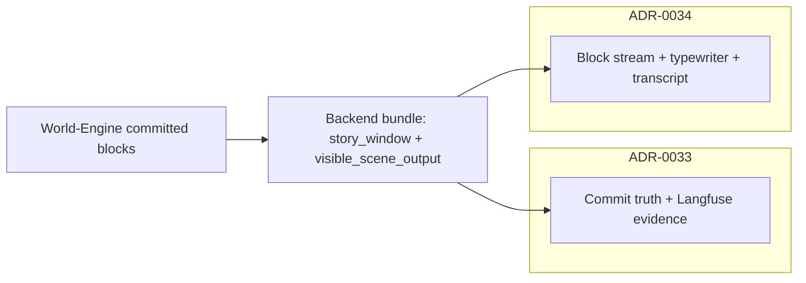

# ADR-0034: Player-Facing Narrative Shell Contract (MVP5)

## Status

Accepted

## Implementation Status

**Core shell contract implemented; some test tiers pending.**

**Implemented:**
- `frontend/static/play_block_display_text.js`: shared `blockDisplayTextForShell(block)` — `player_display_text != null ? player_display_text : text` (same rule for renderer, orchestrator fill, and typewriter duration/DOM).
- `frontend/static/play_blocks_orchestrator.js`: HTTP `loadTurn()` builds **`sliceQueue`** (indices `>= typewriter_slice_start_index`, excluding diagnostics); indices below the slice render **full text immediately**; the slice is delivered **sequentially** via `TypewriterEngine.startDelivery` + **`setOnDeliveryComplete`** (`currentSliceIndex` advances after each block). **`skipCurrentBlock`** completes the active block (full text) then continues the slice; **`revealAll`** fills all remaining slice blocks, clears the queue, and detaches the completion hook. **`appendNarratorBlock`** clears slice state and keeps **one block per stream chunk** (unchanged streaming semantics).
- `frontend/static/play_typewriter_engine.js`: single active block; single `VirtualClock` listener; **`setOnDeliveryComplete(blockId)`** fires after natural completion, skip, or empty display immediate resolve; display text uses `blockDisplayTextForShell`.
- `frontend/static/play_block_renderer.js`: block rendering with `block_type` semantic distinction; optional `narration_beat` on narrator blocks for presentation (e.g. opening **role anchor** uses extra CSS class).
- `frontend/static/style.css`: distinct lane chrome per `block_type` (including `player_input_outcome`, narrator role-anchor accent).
- `frontend/static/play_shell.js`: orchestrates renderer + typewriter + controls.
- Legacy fallback: if `typewriter_slice_start_index` absent, last block is animated (pre-2026-05 behavior preserved).
- `appendNarratorBlock()` finalizes in-flight typewriter before starting delivery for streamed blocks.
- No debug surface in player UI (operator diagnostics stay in Langfuse / explicit diagnostic endpoints).
- Jest tests: `frontend/tests/test_blocks_orchestrator.js`, `frontend/tests/test_typewriter_engine.js`, `frontend/tests/test_block_renderer.js`.

**World-Engine — committed visible block shaping (God of Carnage live path):**
- **Invariant (no fixed card count):** The number of NPC transcript cards per turn is **not** a product constant; it emerges from structured rows, split/merge policy, validation, and prune rules. Tests assert **invariants** (no megablock jam, no colon stutter, no redundant action lane), not a fixed DOM node count.
- **One NPC, one `actor_line` block:** If the model jams multiple speakers into a single `actor_line` string (e.g. `Veronique: … Alain: …`), `_expand_multi_speaker_actor_lines` in `world-engine/app/story_runtime/manager.py` splits it into **separate** `actor_line` blocks (per `actor_id` / `speaker_label`). Speaker-prefix detection is **roster-driven** from `session.runtime_projection` via `ai_stack/goc_npc_transcript_projection.py` (not a hardcoded name union in the engine). Consecutive spans for the **same** speaker may be merged depending on governed `story_runtime_experience` flags (`goc_transcript_merge_consecutive_same_actor`, optional `goc_transcript_split_speech_stage_same_actor` after dialogue-then-stage boundaries).
- **No duplicate lane rows:** `_prune_actor_actions_subsumed_by_prior_actor_lines` drops an `actor_action` when its visible text (length-gated, normalized) is already contained in an **earlier** `actor_line` in the same turn (typical `spoken_lines` + `action_lines` echo).
- **Finalize hook:** Split + prune run inside `_finalize_visible_blocks_with_goc_actor_split` immediately before / after `ai_stack.visible_narrative_contract.finalize_visible_scene_blocks` (both the pre-built `scene_blocks` path and the bundle-built path). Effective experience flags are passed from governed `story_runtime_experience` (see `ai_stack/story_runtime_experience.py`).
- **Regie lane mapping (policy):** When `goc_map_action_lines_to_actor_line_lane` is true, structured `action_lines` rows project as `actor_line` blocks (same shell lane as speech) so staging does not force a second colour lane; default remains `actor_action` for distinct stage-direction chrome.
- **Structured row diagnostics:** If a single `spoken_lines` dict row’s text contains multiple roster speaker prefixes, `ai_stack/goc_turn_seams.run_visible_render` adds marker `goc_multi_speaker_merged_into_single_spoken_line_row` (soft signal for operators / quality gates; projection still splits at commit when the jam appears in projected `actor_line` text).
- **PLAYER-SHELL-NARRATIVE-CARD-01:** HTTP `visible_scene_output.blocks` are **player-facing narrative cards** built by `ai_stack/player_narrative_cards.build_player_facing_narrative_cards` from semantic `scene_blocks` (semantic `block_type` preserved; `card_style` / `visible_lane` / `player_display_text` added). Adjacent same-actor `actor_action` folds into the prior `actor_line` card; subsumed duplicates are dropped from the shell list; diagnostics live under `player_shell_narrative_card_diagnostics`.
- **Human-bound player transcript (GoC live):** `_player_input_scene_blocks_for_story_window` **always** emits **two** blocks when `human_actor_id` is set: `player_input` (verbatim typing) then `player_input_outcome` (diegetic attributed line; imperative greets still use the scripted polite outcome for the second card). The shell renders each as its own card (see §4b).
- **Opening narrator beats:** After `_maybe_split_goc_opening_into_two_movements`, `_annotate_goc_opening_narration_beats` sets `narration_beat` on the first three GoC turn-0 narrator blocks (`premise` / `scene_setup` / `role_anchor`) for UI accent only; `block_type` stays `narrator` for shape contracts.
- Pytests: `world-engine/tests/test_goc_multi_speaker_actor_line_split.py`, `world-engine/tests/test_goc_player_input_greeting_imperative.py`, `ai_stack/tests/test_goc_npc_transcript_projection.py`, `ai_stack/tests/test_wave3_multi_actor_vitality.py` (jammed-row marker).

**Not yet fully implemented:**
- Live Langfuse gate (`test_langfuse_live_c640_gate.py`) requires opt-in `RUN_LANGFUSE_LIVE=1` — not run in standard CI.
- Backend cumulative `scene_blocks` / `typewriter_slice_start_index` propagation from turn responses: partially implemented (verified in `tests/test_mvp4_contract_playability.py`).
- **Staging correctness** (e.g. which character may “welcome” guests) remains **model / prompt / content** responsibility; this ADR does not hard-code dialogue rewrites beyond structural de-duplication and lane split.

## Date

2026-05-06

## Context

MVP4 establishes truthful runtime, diagnostics, and canonical HTTP bundles for the play path. MVP5 adds modular block rendering and typewriter delivery in the player shell (`frontend/static/play_shell.js`, `play_blocks_orchestrator.js`, `play_typewriter_engine.js`, `play_block_renderer.js`).

Product feedback indicates a gap between **theatrical narrative goals** (narrator as literate scene-setter and subtle cueing; NPC speech carrying the play) and **current runtime output pacing** (narrator too “complete” in few lines, UI not yet supporting script-like reading).

Separately, ADR-0033 now requires **non-PII player-input correlation** on Backend Langfuse spans for canonical turns. This ADR covers **what the shell must prove** once narrative semantics stabilize.

## Decision

1. **Scope boundary:** ADR-0033 governs commit truth, Langfuse evidence gates, and player-input **hash correlation** on `backend.turn.execute`. **This ADR** governs the **player-visible shell contract**: block stream semantics, transcript vs. live-append rules, and acceptance tests that fail when the shell misrepresents committed runtime truth.

2. **Transcript vs. live delivery:** After each successful turn, the shell must not give the appearance that earlier committed story vanished. The HTTP contract already exposes `story_window.entries` and `visible_scene_output.blocks`; MVP5 orchestration must align with the **cumulative** block policy on the Backend bundle (see `backend/app/api/v1/game_routes.py` cumulative `scene_blocks` when entries carry `scene_blocks`).

3. **Narrator role (product, not only UI):** The narrator is a **literary scene presenter**: atmosphere, perception, and **light guidance** (what is noticeable, what the room offers). The shell must **not** prescribe crude player emotions (“you feel afraid”) or substitute for player agency. Narration density, “show vs tell”, and lane separation (narrator vs NPC vs stage direction) remain **content and graph policy** concerns; the shell **renders** committed lanes faithfully when the engine emits typed blocks and text. Specific literary rules live in narrative governance / prompt packs.

4. **Dramaturgical block types:** The contract assumes distinct block kinds (e.g. narrator, actor line, stage direction) when the API provides `block_type` / structure. The shell must preserve typographic and semantic distinction **when the bundle supplies it** — no collapsing lanes into an undifferentiated blob.

4b. **Extended player-facing block kinds (shell must render faithfully):**
   - **`player_input_outcome`:** Second card in the **always-two** human-bound player pair: echo (`player_input`) then diegetic shell line (`player_input_outcome`, e.g. *Annette sagt: „…“* or scripted greet outcome after *Begrüße …*). Same cumulative rules as other blocks; **distinct** CSS lane from `player_input` (darker green bar / panel — presentation only).
   - **`narration_beat` (optional metadata on `narrator` blocks):** Opaque to lane typing; renderer may add a class (e.g. opening **role anchor**) for accent. Consumers must not treat unknown keys as errors.

4c. **NPC lane cardinality (engine projection):** For God of Carnage live projection, **distinct NPC speakers must appear as separate `actor_line` blocks** when the model merged them into one visible string. The World-Engine normalizes before finalize (see Implementation Status). **One jammed string → N blocks** (N emerges from content); **redundant `actor_action` tail already present in a prior `actor_line` → dropped**. This is **structural** truthfulness of the transcript, not a substitute for model-side dramaturgy.

5. **Single-active typewriter:** Exactly **one** block uses the typewriter at a time. On HTTP `loadTurn`, the shell delivers blocks sequentially according to **`typewriter_slice_start_index`** (see §7). On streamed `appendNarratorBlock`, any in-progress queue is **finalized** (`revealAll`) before starting delivery for the new block (each appended stream chunk is one block — it animates as the active slice). `TypewriterEngine` registers **one** `VirtualClock` tick handler for its lifetime (no duplicate `onTick` listeners per block).

6. **No debug surface in player UI:** Diagnostic or technical payloads must not appear as ordinary narrative blocks in the player shell. Debug belongs in operator tools, Langfuse, or explicit diagnostics endpoints — not mixed into the theatrical transcript.

7. **Cumulative blocks + typewriter slice (HTTP):** `visible_scene_output.blocks` remains the **full committed transcript** (cumulative across `story_window.entries` when each entry carries `scene_blocks`). To animate **only the newly committed blocks** for this response — while showing earlier blocks as stable transcript — the Backend adds **`typewriter_slice_start_index`**: an integer index into `blocks` such that indices `< index` render as **full text immediately**, and indices `>= index` through `len(blocks)-1` are delivered **one after another** via the typewriter (still only one block animating at a time). **Legacy clients:** if the field is absent, the shell may fall back to animating **only the last** block (`blocks.length - 1`), preserving pre-2026-05 behavior.

8. **Streamed narrator chunks:** Each WebSocket/appended narrator block is treated as **one** new block for presentation: finalize any in-flight typewriter (`revealAll`), then run typewriter for **that** block only (decision **5**). HTTP slice indices do not apply to incremental stream delivery.

## Consequences

### Positive

- Clear split: **0033** = truth + observability, **0034** = presentation + shell acceptance.
- E2E and frontend unit tests can target a stable shell contract without overloading runtime ADRs.

### Negative / risks

- Without engine-side block typing and stable `scene_blocks` IDs, the shell cannot deliver theater-grade layout; UI work alone will not satisfy this ADR.
- **Split heuristics** build speaker-prefix alternation from the **runtime NPC roster** (`runtime_projection.npc_actor_ids`, canonical ids, alias expansion) plus display tokens; a static GoC display-name tuple remains a **fallback** only for colon-stutter dedupe when block context is missing. Novel modules/languages need their own roster/vocab, not silent extension of GoC literals in the engine core.
- **Prune rule** uses substring containment on normalized text; very short actions are kept; long duplicated stage tails are removed. False positives are unlikely but possible if an unrelated short clause repeats.

## Diagrams

Split of responsibilities with ADR-0033 and the player shell data path.

## Verification

### Test tiers (see `docs/testing/TEST_SUITE_CONTRACT.md`)

- **Contract tests:** mocks allowed for wiring (e.g. orchestrator + mock typewriter).
- **Live Langfuse gate:** opt-in `RUN_LANGFUSE_LIVE=1` — `backend/tests/test_observability/test_langfuse_live_c640_gate.py` (c640-style regression; no soft skip when live is on).

### Repository tests

- Backend: `tests/test_mvp4_contract_playability.py` (cumulative `visible_scene_output` for MVP5).
- Backend: `tests/test_game_routes.py` (Langfuse player-input hash on canonical turn; ADR-0033 §13.6).
- Backend: `tests/test_session_routes.py` (`test_execute_turn_langfuse_correlates_player_input_hash`; operator path §13.6).
- World-Engine: `tests/test_trace_middleware.py` (`test_world_engine_turn_execute_langfuse_correlates_player_input_hash`; ADR-0033 §13.6).
- Frontend: Jest — `frontend/tests/test_blocks_orchestrator.js`, `frontend/tests/test_typewriter_engine.js` (single listener; `typewriter_slice_start_index` sequential delivery when present; legacy last-block fallback when absent). Run via `npm test` in `frontend/`, orchestrated after pytest by `python tests/run_tests.py --suite frontend` or `--mvp5`.
- World-Engine: `world-engine/tests/test_goc_multi_speaker_actor_line_split.py`, `world-engine/tests/test_goc_player_input_greeting_imperative.py` (split / prune / two-card player transcript).

CI environments that run shell gates must install frontend npm devDependencies so Jest can execute.

## References

- [ADR-0032](adr-0032-mvp4-live-runtime-setup-requirements.md)
- [ADR-0033](adr-0033-live-runtime-commit-semantics.md)
- [ADR-MVP5-001](MVP_Live_Runtime_Completion/adr-mvp5-001-modular-block-rendering-architecture.md) (modular renderer; block-per-div)
- [TEST_SUITE_CONTRACT](../testing/TEST_SUITE_CONTRACT.md)
- `backend/app/api/v1/game_routes.py`
- `world-engine/app/story_runtime/manager.py` (`_finalize_visible_blocks_with_goc_actor_split`, `_player_input_scene_blocks_for_story_window`, `_annotate_goc_opening_narration_beats`)
- `ai_stack/goc_npc_transcript_projection.py`, `ai_stack/story_runtime_experience.py`, `ai_stack/goc_turn_seams.py` (`run_visible_render` diagnostics)
- `frontend/static/play_shell.js`
- `frontend/static/play_blocks_orchestrator.js`
- `frontend/static/play_typewriter_engine.js`
- `frontend/static/play_block_renderer.js`
- `frontend/static/style.css`
