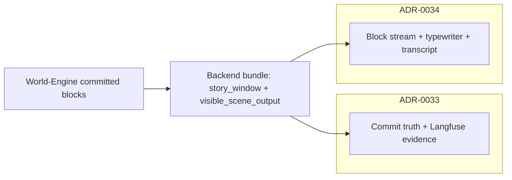

# ADR-0034: Player-Facing Narrative Shell Contract (MVP5)

## Status

Accepted

## Implementation Status

**Core shell contract implemented; some test tiers pending.**

**Implemented:**
- `frontend/static/play_blocks_orchestrator.js`: `BlocksOrchestrator` implements `loadTurn()` with `typewriter_slice_start_index` support (blocks before index rendered as full transcript, blocks at/after index sequenced through typewriter).
- `frontend/static/play_typewriter_engine.js`: single `VirtualClock` tick handler per lifetime; `TypewriterEngine` registered once — no duplicate `onTick` listeners.
- `frontend/static/play_block_renderer.js`: block rendering with `block_type` semantic distinction.
- `frontend/static/play_shell.js`: orchestrates renderer + typewriter + controls.
- Legacy fallback: if `typewriter_slice_start_index` absent, last block is animated (pre-2026-05 behavior preserved).
- `appendNarratorBlock()` finalizes in-flight typewriter before starting delivery for streamed blocks.
- No debug surface in player UI (operator diagnostics stay in Langfuse / explicit diagnostic endpoints).
- Jest tests: `frontend/tests/test_blocks_orchestrator.js`, `frontend/tests/test_typewriter_engine.js`.

**Not yet fully implemented:**
- Live Langfuse gate (`test_langfuse_live_c640_gate.py`) requires opt-in `RUN_LANGFUSE_LIVE=1` — not run in standard CI.
- Backend cumulative `scene_blocks` / `typewriter_slice_start_index` propagation from turn responses: partially implemented (verified in `tests/test_mvp4_contract_playability.py`).

## Date

2026-05-06

## Context

MVP4 establishes truthful runtime, diagnostics, and canonical HTTP bundles for the play path. MVP5 adds modular block rendering and typewriter delivery in the player shell (`frontend/static/play_shell.js`, `play_blocks_orchestrator.js`, `play_typewriter_engine.js`, `play_block_renderer.js`).

Product feedback indicates a gap between **theatrical narrative goals** (narrator as literate scene-setter and subtle cueing; NPC speech carrying the play) and **current runtime output pacing** (narrator too “complete” in few lines, UI not yet supporting script-like reading).

Separately, ADR-0033 now requires **non-PII player-input correlation** on Backend Langfuse spans for canonical turns. This ADR covers **what the shell must prove** once narrative semantics stabilize.

## Decision

1. **Scope boundary:** ADR-0033 governs commit truth, Langfuse evidence gates, and player-input **hash correlation** on `backend.turn.execute`. **This ADR** governs the **player-visible shell contract**: block stream semantics, transcript vs. live-append rules, and acceptance tests that fail when the shell misrepresents committed runtime truth.

2. **Transcript vs. live delivery:** After each successful turn, the shell must not give the appearance that earlier committed story vanished. The HTTP contract already exposes `story_window.entries` and `visible_scene_output.blocks`; MVP5 orchestration must align with the **cumulative** block policy on the Backend bundle (see `backend/app/api/v1/game_routes.py` cumulative `scene_blocks` when entries carry `scene_blocks`).

3. **Narrator role (product, not only UI):** The narrator is a **literary scene presenter**: atmosphere, perception, and **light guidance** (what is noticeable, what the room offers). The shell must **not** prescribe crude player emotions (“you feel afraid”) or substitute for player agency. Narration density, “show vs tell”, and lane separation (narrator vs NPC vs stage direction) remain **content and graph policy** concerns; the shell **renders** committed lanes faithfully when the engine emits typed blocks and text. Specific literary rules live in narrative governance / prompt packs.

4. **Dramaturgical block types:** The contract assumes distinct block kinds (e.g. narrator, actor line, stage direction) when the API provides `block_type` / structure. The shell must preserve typographic and semantic distinction **when the bundle supplies it** — no collapsing lanes into an undifferentiated blob.

5. **Single-active typewriter:** Exactly **one** block uses the typewriter at a time. On HTTP `loadTurn`, the shell delivers blocks sequentially according to **`typewriter_slice_start_index`** (see §7). On streamed `appendNarratorBlock`, any in-progress queue is **finalized** (`revealAll`) before starting delivery for the new block (each appended stream chunk is one block — it animates as the active slice). `TypewriterEngine` registers **one** `VirtualClock` tick handler for its lifetime (no duplicate `onTick` listeners per block).

6. **No debug surface in player UI:** Diagnostic or technical payloads must not appear as ordinary narrative blocks in the player shell. Debug belongs in operator tools, Langfuse, or explicit diagnostics endpoints — not mixed into the theatrical transcript.

7. **Cumulative blocks + typewriter slice (HTTP):** `visible_scene_output.blocks` remains the **full committed transcript** (cumulative across `story_window.entries` when each entry carries `scene_blocks`). To animate **only the newly committed blocks** for this response — while showing earlier blocks as stable transcript — the Backend adds **`typewriter_slice_start_index`**: an integer index into `blocks` such that indices `< index` render as **full text immediately**, and indices `>= index` through `len(blocks)-1` are delivered **one after another** via the typewriter (still only one block animating at a time). **Legacy clients:** if the field is absent, the shell may fall back to animating **only the last** block (`blocks.length - 1`), preserving pre-2026-05 behavior.

8. **Streamed narrator chunks:** Each WebSocket/appended narrator block is treated as **one** new block for presentation: finalize any in-flight typewriter (`revealAll`), then run typewriter for **that** block only (§5). HTTP slice indices do not apply to incremental stream delivery.

## Consequences

### Positive

- Clear split: **0033** = truth + observability, **0034** = presentation + shell acceptance.
- E2E and frontend unit tests can target a stable shell contract without overloading runtime ADRs.

### Negative / risks

- Without engine-side block typing and stable `scene_blocks` IDs, the shell cannot deliver theater-grade layout; UI work alone will not satisfy this ADR.

## Diagrams

Split of responsibilities with ADR-0033 and the player shell data path.

## Verification

### Test tiers (see `docs/testing/TEST_SUITE_CONTRACT.md`)

- **Contract tests:** mocks allowed for wiring (e.g. orchestrator + mock typewriter).
- **Live Langfuse gate:** opt-in `RUN_LANGFUSE_LIVE=1` — `backend/tests/test_observability/test_langfuse_live_c640_gate.py` (c640-style regression; no soft skip when live is on).

### Repository tests

- Backend: `tests/test_mvp4_contract_playability.py` (cumulative `visible_scene_output` for MVP5).
- Backend: `tests/test_game_routes.py` (Langfuse player-input hash on canonical turn; ADR-0033 §13.6).
- Backend: `tests/test_session_routes.py` (`test_execute_turn_langfuse_correlates_player_input_hash`; operator path §13.6).
- World-Engine: `tests/test_trace_middleware.py` (`test_world_engine_turn_execute_langfuse_correlates_player_input_hash`; ADR-0033 §13.6).
- Frontend: Jest — `frontend/tests/test_blocks_orchestrator.js`, `frontend/tests/test_typewriter_engine.js` (single listener; `typewriter_slice_start_index` sequential delivery when present; legacy last-block fallback when absent). Run via `npm test` in `frontend/`, orchestrated after pytest by `python tests/run_tests.py --suite frontend` or `--mvp5`.

CI environments that run shell gates must install frontend npm devDependencies so Jest can execute.

## References

- [ADR-0032](adr-0032-mvp4-live-runtime-setup-requirements.md)
- [ADR-0033](adr-0033-live-runtime-commit-semantics.md)
- [TEST_SUITE_CONTRACT](../testing/TEST_SUITE_CONTRACT.md)
- `backend/app/api/v1/game_routes.py`
- `frontend/static/play_shell.js`
- `frontend/static/play_blocks_orchestrator.js`
- `frontend/static/play_typewriter_engine.js`
- `frontend/static/play_block_renderer.js`
