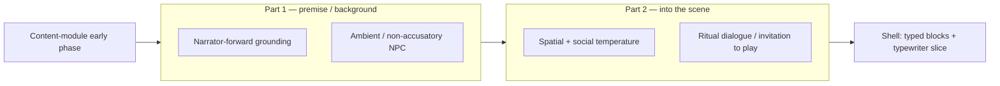

# ADR-0035: Story Opening Economy, Warmup, and Phase Alignment

## Status

Accepted

## Implementation Status

**Accepted and implemented as a bounded GoC opening/runtime-state contract.**

- Implemented opening contract surfaces: `content/modules/god_of_carnage/canonical_path/`, `locations/opening/`, `locations/building/`, `locations/appartment_vallon/`, `objects/`, `characters/`, `knowledge/opening_scene_sequence.yaml`, `knowledge/opening_quote_anchors.yaml`, `direction/opening_sequence.yaml`, `scene_graph.yaml`, and `phase_beat_policy.yaml` are loaded through the module runtime policy and GoC YAML slice.
- Runtime prompt/support wiring now carries opening event ids, required establishment facts, handover phase, hard-forbidden detection policy, and no-forced-player-speech constraints through `world-engine/app/story_runtime/manager.py`, `ai_stack/langgraph_runtime_executor.py`, and `ai_stack/goc_knowledge_runtime_gates.py`.
- Runtime validation now records and gates opening event coverage, handover phase, summary-only absence, and hard-forbidden opening violations through structured diagnostics rather than narrator wording.
- The bounded Pi15 environment-state slice initializes the opening room/object context in `StorySession.environment_state` and carries the same state into generation, render support, shell readout, and get-state projections.
- Still outside this ADR: a multi-request warmup choreography, a global relaxation of NPC visibility/passivity rules, and any free-form literary quality judge.
- Related: ADR-0033 governs opening readiness/commit truth; ADR-0034 governs block rendering; ADR-0039 governs tests for this contract.

## Date

2026-05-06

## Context

Canonical content modules already describe an early dramaturgical phase that favors **orientation over escalation**. Example (God of Carnage): the opening canonical path steps, `scene_graph.yaml`, and `phase_beat_policy.yaml` define a polite handover into the Vallon apartment — ritual civility, light framing, **no** substantive disagreement yet, escalation beats intentionally constrained.

Separately, several runtime layers optimize for **immediate visible narrative mass** and **dramatic pressure**:

- Opening-generation prompts currently emphasize establishing tension and stakes early (`world-engine` story runtime opening prompt construction).
- LDSS validation historically expects visible NPC participation (dramatic mass, passivity gates) on ordinary turns; deterministic fallback stubs may emit **mid-conflict** sample dialogue despite phase semantics (`ai_stack/live_dramatic_scene_simulator.py`).
- Product and literary goals (see [ADR-0034](adr-0034-player-facing-narrative-shell-contract.md)) favor a **literary narrator**: atmosphere and perception, not a synopsis of the entire plot before play begins.

Together these forces can produce an **exposition-heavy opening**: cast, conflict spine, and moral stakes spelled out before the player has taken an action — contradicting both canonical phase intent and the literary principle that strong openings often **withhold** context (single image, skew, or invitation to infer).

**Reference dramaturgy (film shooting script):** `resources/carnage-2011.pdf` (*Carnage*, Roman Polanski shooting script dated 2011-01-30) sequences the opening in a way we treat as **normative inspiration** for “economy + handover” (not a literal transcript for the interactive module). Extracted structure of the **first beats**:

1. **Title / form** — script identification only.
2. **Part A — Background without living-room dialogue (EXT. PLAYGROUND — DAY):** Pure **scene description**: Brooklyn playground, winter light, the two boys, verbal abuse, shove, strike with the branch, injured child, crowd. No character dialogue yet; the audience receives the **precipitating event** through **action and image**, not through a narrator explaining morals.
3. **Part B — Into the scene (INT. LONGSTREET APARTMENT — DEN — DAY):** **Slugline + spatial description** (narrow den, light, table objects, laptop). **Blocking and social temperature** in prose (“these two couples are not close… serious, cordial and tolerant”). **Then** the first **spoken** lines begin — Penelope **reads** the prepared statement (the incident restated as *in-world document text*, not as omniscient voiceover dumping the whole evening).

That split matches the product intent: **(1)** premise / fact pattern / “why we meet” can be **longer** if it is **shown** (action, document, ritual) rather than **told** as argumentative recap; **(2)** entering the playable space is a **second movement** — room, bodies, mood — before dialogue does the heavy lifting. **Narrator-style support** in our engine should mirror the screenplay’s **scene description** function: complete **sensory and social imagination** at hinge moments, **without** parroting what a dialogue block or obvious staging already conveys.

> **Licensing:** The PDF may be subject to copyright; keep distribution and CI policy aligned with your license. The ADR cites it as a **dramaturgical reference**, not as text to ship verbatim.

> **Repository:** `resources/carnage-2011.pdf` is present in-repo for maintainer analysis; clones may omit large binaries via sparse checkout — the structural claims above remain valid without the file.

Opening **readiness** and **truthful degradation** remain governed by [ADR-0033](adr-0033-live-runtime-commit-semantics.md); this ADR does **not** relax opening-evidence requirements. It defines **what kind** of opening text is desirable once evidence exists.

## Problem Statement

1. **Semantic drift:** Canonical phase 1 (“warmup / polite framing”) can be undermined by runtime defaults that prioritize confrontation-like NPC lines or plot recap.
2. **Economy vs. encyclopedia:** Player-facing first beats risk reading like half the synopsis instead of a **hook** (orientation without resolving the whole arc).
3. **Unclear contract:** We lack an explicit product/engine agreement on **opening composition**: how much scene-setting vs. how much withheld until play advances.

## Decision

This section is the accepted runtime contract for GoC-style openings. Module-specific content remains the source of truth; runtime code may enforce and project the contract but must not invent new opening truth.

### D1 — Opening economy principle

The **first committed player-visible narrative beat** after session acceptance should prioritize:

- **Grounding:** place, time-quality (evening, indoor ritual), who is present — shown through observable behavior or setting detail, not exhaustive backstory.
- **Invitation:** one clear dramatic question or imbalance in the room — **without** naming every faction’s moral thesis upfront.
- **Restraint:** defer systematic exposition (full incident recap, legal framing, character dossiers) to **later beats** driven by player curiosity or escalation.

“Economy” here means **fewer predicates per sentence**, not fewer tokens arbitrarily.

### D2 — Phase alignment

Runtime-generated openings (narrator + NPC lanes as applicable) should **honor the active content-module phase** when `current_scene_id` / phase metadata maps to an early phase:

- Early-phase openings avoid **trigger-shaped conflict** and **attack-shaped NPC dialogue** unless the phase definition explicitly allows them.
- Phase transitions remain **engine-owned** (authoritative content rules); the opening text must not pretend a phase transition occurred.

### D3 — Two-part opening (product default for GoC-style modules)

For drawing-room and similar modules, the **first session narrative** should be composable as **at least two committed narrative movements** (not necessarily two HTTP requests — see Open Questions), each delivered as **one or more typed blocks** so the player shell can hand over attention **block by block** (typewriter pacing per [ADR-0034](adr-0034-player-facing-narrative-shell-contract.md)):

| Part | Dramaturgic job | Typical lane mix (illustrative) |
|------|-----------------|----------------------------------|
| **Part 1 — Background / premise** | Establish *why we are here* and the off-stage fact pattern the characters already share — enough that later lines land, **without** playing the whole fight in advance. | Narrator-forward; optional brief documentary-style framing if the module contract allows; NPC lines stay **non-accusatory** and phase-1 compatible. |
| **Part 2 — Into the scene** | Land the **room**: physical layout, ritual (seating, drink, food), who faces whom; let subtext breathe; end on an **invitation to play** (silence, glance, social trap) rather than on an NPC attack line. | Narrator inserts **complete imagination** (sensory, spatial, social temperature) at **hinge moments**; NPC speech favors ritual and avoidance until the player steers. |

**Narrator bar:** Interjections should **not** restate what the block stream already shows (e.g. repeating dialogue the player just read). They add what **staging alone cannot**: atmosphere, timing, social nuance — the script’s “intelligent narrator” role, not a wikipedia voiceover.

**Typewriter:** The shell’s typewriter is a **first-read experience** instrument: within each committed envelope, blocks reveal in order so the player is **guided into fiction** rather than wall-of-text dumped. Policy details (last-block-only vs. per-block) remain under ADR-0034; this ADR only requires that **opening envelopes are authored** so that block boundaries **match** natural handover beats.

### D4 — Deterministic and degraded openings

Deterministic / mock / fallback openings must **not** contradict phase-1 civility when simulating God-of-Carnage-style modules unless diagnostics explicitly label an intentional stress scenario. Degraded output remains truthful under ADR-0033 but should not become the **canonical literary template** for production tone.

### D5 — Relationship to shell contract

[ADR-0034](adr-0034-player-facing-narrative-shell-contract.md) continues to govern **how** blocks render (lanes, typewriter). This ADR governs **what literary posture** the committed bundle should carry at session start.

## Non-goals (This ADR)

- Replacing content-module YAML with runtime-authored story truth.
- Removing NPC visibility or validation gates globally — any relaxation applies **only** to explicitly designated opening beats and must be specified in a follow-on technical ADR or task list.
- Guaranteeing LLM creativity (“beautiful sentences”) — only **constraints** and **composition rules**.

## Consequences

### Positive

- Shared vocabulary (**economy**, **warmup**, **phase alignment**) for narrative, engine, and QA.
- Clear rationale when rejecting prompts or stubs that recap the whole arc at minute zero.

### Negative / Risks

- Stricter opening composition may require validation rule updates and golden-fixture refreshes.
- Tension with pipelines tuned for “always show NPC speaking early” — requires deliberate redesign where necessary.

## Diagrams

Intended two-part opening handover (literary economy vs. shell pacing in ADR-0034).

## Resolved / Deferred Boundaries

1. **Single vs. multi-step warmup:** **Resolved for UX:** One HTTP player-bundle refresh can carry **multiple committed blocks** (cumulative transcript). The shell animates **only the slice** corresponding to the latest commit using `visible_scene_output.typewriter_slice_start_index` (ADR-0034 §7). Warmup may still be authored as **one or more** runtime commits depending on engine policy; the UI does not require a separate “phase UI” if blocks are ordered correctly.
2. **NPC silence threshold:** Deferred as a broader LDSS/passivity-policy question. The implemented contract requires visible opening evidence and forbids forced player speech; it does not globally redefine ordinary-turn NPC visibility gates.
3. **Provider-backed vs. deterministic openings:** Deferred to runtime mode/operator policy. The opening contract applies to both provider and deterministic paths by validating structured evidence and diagnostics.
4. **Module variability:** Resolved for the bounded slice through module content and `ModuleRuntimePolicy`; new genres should add or amend module policy rather than hardcoding GoC-specific phase semantics in runtime code.
5. **Localization:** Resolved for tests by ADR-0039 discipline: regression tests assert structured contract fields, policy-derived ids, handover phases, and failure codes, not exact German or English narrator prose.

## Verification

Current verification uses structured/content-derived assertions:

- `ai_stack/tests/test_goc_knowledge_runtime_gates.py`
- `ai_stack/tests/test_goc_structured_setting_knowledge.py`
- `ai_stack/tests/test_goc_opening_handover.py`
- `world-engine/tests/test_goc_knowledge_runtime_path_summary.py`
- `backend/tests/content/test_content_compiler.py`
- `backend/tests/content/test_module_loader.py`
- Pi15 environment-state tests that assert opening/session state projection from canonical content

## References

- `resources/carnage-2011.pdf` — *Carnage* (2011) shooting script; opening sequencing (playground → apartment) as dramaturgical reference
- `content/modules/god_of_carnage/canonical_path/` — numbered directed opening spine, including park incident, building hallway, apartment handover, and first playable courtesy gap
- `content/modules/god_of_carnage/locations/` — opening, building, and apartment place authority used by the opening path
- `content/modules/god_of_carnage/objects/` — one-file-per-object authority referenced by rooms and path steps
- `content/modules/god_of_carnage/direction/opening_sequence.yaml` — canonical two-part opening + narrator bar + premise seeds (bundled as `opening_sequence` in GoC YAML slice)
- `content/modules/god_of_carnage/scene_graph.yaml` — runtime node index that references canonical path/location ids; not a second scene description database
- `content/modules/god_of_carnage/phase_beat_policy.yaml` — early-phase pacing and forbidden escalation policy
- `content/modules/god_of_carnage/direction/system_prompt.md` — phase semantics (“structural, not stage directions”)
- `world-engine/app/story_runtime/manager.py` — `_build_opening_prompt` (opening prompt construction)
- `ai_stack/live_dramatic_scene_simulator.py` — deterministic LDSS blocks and validation commentary
- `ai_stack/goc_knowledge_runtime_gates.py` — opening event coverage, hard-forbidden opening detection, and path-summary projection
- `ai_stack/goc_opening_handover.py` — opening handover diagnostics and block-level normalization support
- `ai_stack/environment_state_contracts.py` — bounded Pi15 room/object state initialized from canonical module content
- `world-engine/app/story_runtime_shell_readout.py` — player/operator projection of committed environment state
- [ADR-0033](adr-0033-live-runtime-commit-semantics.md) — opening readiness / commit truth
- [ADR-0034](adr-0034-player-facing-narrative-shell-contract.md) — player shell / narrator lane presentation
- [ADR-0039](adr-0039-gate-tests-no-hardcoded-oracle-bypass.md) — no hardcoded narrative oracles in gate tests

## Promotion Record

Promoted from **Proposed** to **Accepted** after the bounded opening contract, structured diagnostics, hard-forbidden opening gates, handover checks, typewriter-slice shell contract, and Pi15 environment-state initialization reached implementation-backed test coverage. Remaining items above are explicit future extensions, not blockers for the accepted GoC opening contract.
