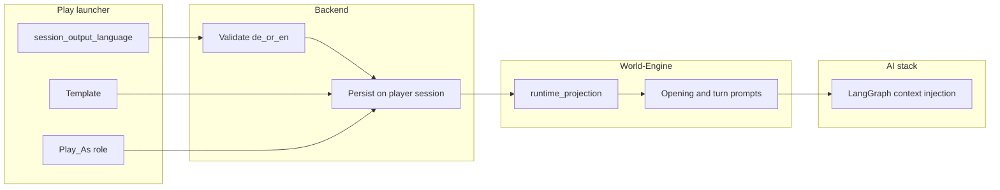

# ADR-0036: Player Session Output Language (Launch-Time Selection)

Normative contract for **which natural language the runtime must use for player-visible generation** in a session, independent of template, role, or incidental French proper nouns in canonical content.

## Status

Accepted

## Date

2026-05-07

## Acceptance Date

2026-05-07

## Acceptance Evidence

- Grill-me session completed (2026-05-07) — full design tree walked, all branches resolved
- Integration approach confirmed: per-session language selection, User-attribute in Langfuse, parameter to `create_story_session()`
- Backend persistence via `GameSaveSlot.metadata["session_output_language"]` confirmed
- Default language (`de`) established
- Error codes defined: `invalid_output_language`, `unsupported_language`

## Intellectual property rights

Repository authorship and licensing: see project **LICENSE**; contact maintainers for clarification.

## Privacy and confidentiality

This ADR contains no personal data. Implementers must follow repository privacy policies; do not log raw prompts containing secrets.

## Related ADRs

- [ADR-0033](adr-0033-live-runtime-commit-semantics.md) — commit truth and observability surfaces (language must be attributable on spans and session state).
- [ADR-0034](adr-0034-player-facing-narrative-shell-contract.md) — player shell renders committed blocks; language choice affects **text generation**, not block typing mechanics.
- [ADR-0035](adr-0035-story-opening-economy-and-warmup.md) — opening composition; opening beats must respect the selected output language once implemented.

## Context

1. **Observed failure mode:** Generated narrative sometimes **drifts into French** (e.g. when prompts, module metadata, character names, or Paris-setting cues stack with model defaults), even when the player expects **German or English**. That is a product defect: language is part of the **experience contract**, not an emergent side effect of setting.

2. **Missing control surface:** Today the play launcher exposes **template** and **Play As** (role). There is no first-class **output language** choice, so the stack cannot consistently steer the model or validate “wrong language” drift.

3. **Scope for v1:** The product needs **German** and **English** as the first supported **player-visible output languages** for generation. Additional locales are out of scope for this ADR but must remain **extensible** (registry or enum, not hard-coded `if` trees scattered across services).

## Decision

### D1 — Canonical notion: `session_output_language`

- Introduce a session-scoped, normative field **`session_output_language`** (working name; implementation may use `output_language` in API JSON if aliased in OpenAPI).
- **Allowed values (v1):** `de` and `en` (BCP 47 primary language tags; region subtags optional later).
- **Semantics:** All **player-visible** model-generated prose for that session (narrator, NPC lines, stage directions where generated) SHALL be produced in this language unless a future **module-declared exception** is accepted in a separate ADR (not in v1).

### D2 — Launch-time selection (UX)

- At **game start** (same step as template selection and **Play As**), the player SHALL choose **`session_output_language`** explicitly.
- **Default value (v1):** `de` (German-first product). If player does not choose, backend defaults to `de`.
- Browser locale MAY inform the UI default (suggested pre-selection), but does not override explicit backend default of `de`.
- The launcher MUST persist the chosen/resolved language tag on the session so it is not lost on resume.

#### D2a — Frontend implementation contract

The language selector is part of the existing play launcher form (`frontend/templates/session_start.html`) and its server-side handler (`frontend/app/routes_play.py`).

**UI widget:** A `<select name="session_output_language">` element with exactly two options:

```html
<label>Sprache / Language
  <select name="session_output_language">
    <option value="de" selected>Deutsch</option>
    <option value="en">English</option>
  </select>
</label>
```

- Shown for **all** templates that reach the `POST /api/v1/game/player-sessions` endpoint (not only `god_of_carnage_solo`); it is a session-level, not template-level, choice.
- Default `selected` attribute is `de` (German-first); browser locale detection is not required for v1.
- Widget position: immediately after the **Play as** role selector and before the submit button.

**Server-side handler** (`routes_play.py`, function `play_create`):

- Read `session_output_language` from `request.form` (or query param if the launcher uses AJAX).
- Fall back to `"de"` if absent or empty.
- Include in the `json_data` dict for **both** the `runtime_profile_id` path and the `template_id` path:
  ```python
  session_output_language = (request.form.get("session_output_language") or "de").strip()
  json_data["session_output_language"] = session_output_language
  ```
- Do **not** duplicate backend validation in the frontend — the backend is the authority. If the backend returns `unsupported_language` or `invalid_output_language`, surface the backend error message via `flash()` and redirect, same as other validation errors.

**Idempotent resume:** Language is fixed at session creation and stored server-side; the resume path (`GET /api/v1/game/player-sessions/<id>`) does not re-submit `session_output_language`. Frontend tests need not assert language on resume.

### D3 — Propagation (runtime contract)

The chosen language MUST flow through the canonical play path so all generation seams see it:

1. **Frontend** — submit `session_output_language` with `POST /api/v1/game/player-sessions` payload (same request as `runtime_profile_id`, `selected_player_role`).

2. **Backend** — validate allowed values (`de` or `en`; reject with `invalid_output_language` or `unsupported_language` error code); store on **`GameSaveSlot.metadata[“session_output_language”]`**; forward to World-Engine `create_story_session()` call as parameter.

3. **World-Engine** — receive `session_output_language` parameter; store on **`StorySession.session_output_language`** (session-level attribute, not runtime_projection). World-Engine passes language to all downstream consumers (`_build_opening_prompt`, turn prompts, LDSS, graph packaging) from this single source.

4. **Observability (Langfuse)** — attach `session_output_language` as **User-level attribute** in Langfuse User object, so traces can be filtered by language (e.g., “show all sessions where output_language=de”).

5. **AI stack / LangGraph** — inject a **hard instruction block** (system or structured context) of the form: “Write all player-visible narrative in **{language}**,” plus negative guidance (“Do not switch to French unless quoting in-world French text marked as such”).

### D4 — Relationship to canonical module content

- **Character names, place names, and in-world documents** may remain French or mixed where the module is faithful to source material; the ADR governs **narrative language**, not renaming **Véronique** to **Veronika**.
- If a beat requires **quoted** French (e.g. a letter read aloud), the module or director policy may emit it as **quoted** content; the surrounding frame stays in `session_output_language`.

### D5 — Observability and QA

- **Langfuse / trace attributes:** User-level attribute **`session_output_language`** MUST be set in Langfuse User object so operators can filter traces by language (e.g., “show all turns where user.session_output_language=de”).
- **Tests:** Contract tests SHALL assert that both `de` and `en` values reach World-Engine `StorySession`, appear in prompt assembly (golden or snapshot tests acceptable), and are tagged in Langfuse User attributes; optional LLM-as-judge **not** required for CI.

### D5a — Error Codes

Backend validation of `session_output_language` uses two structured error codes:

- **`invalid_output_language`** — Request contains malformed value (null, empty string, non-string type). HTTP 400.
- **`unsupported_language`** — Request contains valid string but not in allowed set (`de`, `en`). HTTP 400. Response body includes allowed values.

Both errors are returned in the standard game API error response format (see `backend/app/api/errors.py`).

### D6 — Non-goals (this ADR)

- Full **UI i18n** (menus, errors) — orthogonal; only **generated story text**.
- Automatic **translation** of existing committed transcript when the user changes language mid-session — not in v1; language is fixed at session create unless a future ADR defines migration.
- **Per-block** language tags — v1 is session-wide unless superseded.

## Consequences

### Positive

- Reproducible language behavior; easier QA and player trust.
- Clear seam for prompts and validation; reduces “model picked French” incidents.

### Negative / risks

- Models may still code-mix; mitigated by prompt discipline and optional lightweight post-checks later.
- German-first copy in YAML prompts may need alignment so English sessions do not receive contradictory static German instructions.

### Follow-ups

- OpenAPI schema: add `session_output_language` field to `game_player_session` request/response.
- Launcher UI + routes_play.py: implement per D2a (frontend not yet implemented as of 2026-05-07).
- ADR-0035 opening prompt alignment: opening beats must respect `session_output_language`; static German copy in YAML prompts must not contradict an English session.
- Graph prompt injection: `ai_stack/langgraph_runtime_executor.py` — mirror language directive into all turn prompts, not only the opening prompt (currently only `_build_opening_prompt()` injects it).
- Langfuse `update_user` verification: confirm `session_output_language` appears on User objects in Langfuse dashboard after live session create.

## Diagrams



## Testing

- **Contract:** Assert `session_output_language` round-trips Frontend → Backend → World-Engine projection for `de` and `en`.
- **Prompt assembly:** Unit or golden tests that prompt text contains the selected language directive.
- **Manual:** Start two sessions (`de` vs `en`) with the same template; compare opening narration language (subjective checklist until automated judge exists).
- **Failure mode triggering ADR review:** Sustained player-visible text predominantly not in `session_output_language` across golden runs.

## References and Affected Services

### Frontend
- `frontend/templates/session_start.html` — add `<select name="session_output_language">` widget (de/en, default de) after the Play-as role selector, before the submit button; visible for all templates
- `frontend/app/routes_play.py` — in `play_create()`: read `session_output_language` from `request.form`, fall back to `"de"`, inject into `json_data` for both the `runtime_profile_id` path and the `template_id` path; surface backend `unsupported_language` / `invalid_output_language` errors via `flash()` same as other form errors
- `frontend/tests/test_mvp1_play_launcher.py` — assert `session_output_language` is forwarded to backend in POST payload; assert default `"de"` when field omitted

### Backend
- `backend/app/api/v1/game_routes.py` — extend `POST /api/v1/game/player-sessions` to accept `session_output_language` parameter
- `backend/app/services/game_service.py` — pass language to `create_story_session()` call
- `backend/app/models/game_save_slot.py` — persist in `GameSaveSlot.metadata["session_output_language"]`
- `backend/app/api/errors.py` — add error codes `invalid_output_language`, `unsupported_language`

### World-Engine
- `world-engine/app/runtime/session_manager.py` — add `session_output_language` field to `StorySession`
- `world-engine/app/api/http.py` — accept `session_output_language` parameter in `CreateStorySessionRequest`
- `world-engine/app/story_runtime/manager.py` — pass language to `_build_opening_prompt()` and downstream consumers

### AI Stack
- `ai_stack/langgraph_runtime_executor.py` — inject language directive into prompt context
- `ai_stack/diagnostics_envelope.py` — mirror `session_output_language` in diagnostics for observability

### Observability
- Langfuse trace integration — set User-level attribute `session_output_language` on all traces
