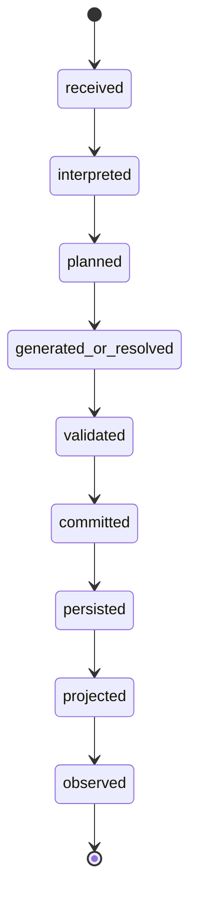
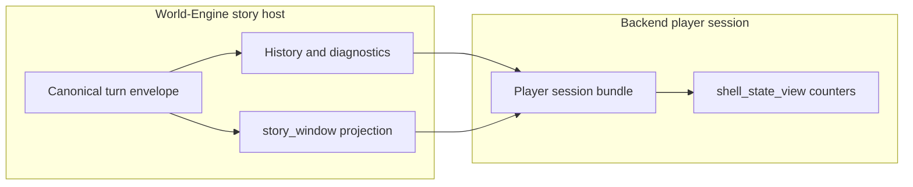

# ADR-0038: Canonical Turn Lifecycle and Single Commit / Persist / Project Path

Short title: one authoritative turn truth, explicit lifecycle states, and one pipeline for every player-visible outcome.

## Status

Proposed

## Date

2026-05-11

## Implementation status

| Phase | Status | Evidence |
|-------|--------|----------|
| **A — Counter and projection parity** | Implemented | World-Engine `get_state` includes `committed_canonical_turn_count`; backend `shell_state_view.turn_counter` uses `_shell_committed_turn_display_counter` in `game_routes.py`. Tests: `backend/tests/test_player_session_live_opening_contract.py`, `world-engine/tests/test_story_runtime_api.py` (`test_state_after_create_includes_committed_canonical_turn_count`). |
| **B — `lifecycle_state` and invariants** | Implemented | `world-engine/app/story_runtime/canonical_turn_lifecycle.py` (`TurnLifecycleChain`); wired in `StoryRuntimeManager._finalize_committed_turn` and `_persist_player_visible_turn_event`; canonical history rows and matching diagnostics carry `lifecycle_state: "observed"` at end of turn. Tests: `world-engine/tests/test_canonical_turn_lifecycle.py`, lifecycle assertions in `world-engine/tests/test_story_runtime_narrative_commit.py`. |
| **C — Converge short paths** | Implemented | **Converged:** validation-recoverable (`player_rejected_recoverable`) and graph-rescue playable (`player_graph_exception_playable`) share `_recoverable_narrator_visible_output_bundle`, `_recoverable_playable_turn_envelope`, and `_persist_player_visible_turn_event`; Langfuse path summary + evidence hooks unified via `_emit_observability_path_for_event` (also used by `_finalize_committed_turn`). **Main path unchanged:** validation-approved turns (incl. deterministic / in-graph blocked narrative outcomes) continue through a single `_finalize_committed_turn` — no duplicate recoverable narrator bundle. Tests: `world-engine/tests/test_story_runtime_short_path_persist_convergence.py`. |

**Note (Phase B):** Durable append occurs after the envelope’s visible bundle is finalised; code therefore advances **`projected` before `persisted`** while still forbidding **`projected` before `committed`**. ADR D2 lists `persisted` before `projected`; the semantic rule (no player-visible projection without commit) is what the implementation enforces.

## Intellectual property rights

Repository authorship and licensing: see project **LICENSE**; contact maintainers for clarification.

## Privacy and confidentiality

This ADR contains no personal data. Implementers must follow the repository privacy and confidentiality policies, avoid committing secrets, and document any sensitive data handling in implementation steps.

## Related ADRs

- [ADR-0001](adr-0001-runtime-authority-in-world-engine.md) — runtime authority in World-Engine (committed state lives in the story host).
- [ADR-0033](adr-0033-live-runtime-commit-semantics.md) — live vs mock/fallback, visible output vs trace-only paths, quality and commit semantics (**must not be weakened** by this ADR).
- [ADR-0034](adr-0034-player-facing-narrative-shell-contract.md) — player shell presentation and readiness; shell must consume **canonical** turn truth, not parallel guesses.
- [ADR-0035](adr-0035-story-opening-economy-and-warmup.md) — opening economy and warmup alignment (opening is Turn 0 in the same lifecycle model).

## Context

Work item **CANONICAL-TURN-ALGORITHM-OVERHAUL-01** and production-like runs show **split truth** between:

- **Committed narrative / diagnostics rows** in the World-Engine story session (history, `session.diagnostics`, `story_window` entries when populated from commits),
- **Transport and shell counters** (e.g. backend `shell_state_view.turn_counter` derived from `/state` without matching the last committed row),
- **Observability** (Langfuse spans/scores) that can exist for partial paths.

Symptom class: the UI can show **“committed turns 0”** while **player-visible blocks** already exist, because **visible projection** is taken from one surface (e.g. cumulative `story_window`, `opening_turn`, or `last_committed_turn` slices) and **counters** from another (`state.turn_counter` or stale session fields). That violates the product rule: **visible player output must not outrank canonical commit truth**, and **no counter may imply “no commits” when a committed opening or turn row exists**.

This ADR does **not** redefine ADR-0033 quality gates. It defines **where** lifecycle and counters are anchored so ADR-0033 fields remain meaningful on **one** serialised turn envelope per canonical turn.

## Decision

### D1 — Single canonical turn record

For every outcome that is allowed to become **player-visible** on the canonical ordinary-player path, the World-Engine **must** produce exactly **one** logical **canonical turn** identified by **`canonical_turn_id`** (stable within the session). That turn record is the **authoritative join key** for:

- persisted session history / diagnostics row,
- `story_window` entry (when used for player narrative),
- backend player-session bundle fields (`last_committed_turn`, committed summaries),
- Langfuse trace/span/score correlation metadata,
- replay and governance exports.

**Non-goals:** prompt tuning, LLM-as-judge, card copy polish, or phrase-based routing hacks.

### D2 — TurnLifecycle (normative state machine)

Each canonical turn progresses through the following **ordered** lifecycle states (stored as `lifecycle_state` on the turn envelope or an equivalent single field; intermediate states may be omitted in serialisation if a later state is persisted atomically, but **ordering invariants** must hold in code):

```text
received          — input accepted for this turn (player or internal opening driver).
interpreted       — affordance / intent frame and interpretation attached where applicable.
planned           — response plan / graph branch choice recorded where applicable.
generated_or_resolved — model output and/or deterministic resolver output present.
validated         — validation seam completed (pass, degraded, or hard fail recorded explicitly).
committed         — authoritative commit decision applied to runtime truth (ADR-0033 semantics).
persisted         — durable session store / history / diagnostics row written.
projected         — player-visible bundle and story_window projection derived **only** from committed payload.
observed          — delivered to downstream consumers (backend bundle, APIs, replay); not “rendered in browser”.
```

**Rules:**

- No `projected` or `observed` without **`committed`** for player-visible narrative on the canonical path.
- **Opening** (Turn 0) uses the **same** lifecycle; `turn_kind == "opening"` and internal drivers satisfy `received` without player text where applicable.
- Short paths (`blocked_action`, `needs_clarification`, `rejected_recoverable`, deterministic action resolution, graph exception mapped to playable outcome) **still** run through **`committed` → `persisted` → `projected` → `observed`**; they may skip or abbreviate `generated_or_resolved`, but must **not** skip **`validated`** as a distinct decision record (can be “approved by policy” with explicit codes).

### D3 — Mandatory fields on the canonical envelope

Every persisted canonical turn row (the shape already approached by `committed_record` / turn diagnostics in `StoryRuntimeManager`) **must** expose at minimum:

- `canonical_turn_id`, `turn_kind`, `turn_number` (and indices: `player_turn_index`, `total_canonical_turn_index` as defined in implementation),
- `lifecycle_state` (terminal for that HTTP/WS interaction: `observed` when response leaves WE),
- `player_input_attribution` when applicable; `player_action_frame` / `affordance_resolution` / `response_plan` when applicable,
- `turn_aspect_ledger`, validation outcome, commit decision (`committed_turn_authority` / ADR-0033 companions),
- `visible_output_bundle` (or strict equivalent) and path diagnostics (`path_summary` / observability summaries),
- Langfuse correlation ids at trace + observation scope per ADR-0033 where scores/spans apply.

**Actor-lane safety** and responder gating remain **hard** constraints: no lifecycle shortcut may bypass lane validation contracts.

### D4 — Counters and shell

Any **player-visible** `turn_counter` / “committed turns” shown in the shell **must** be derived from **canonical persisted turns** (same source as `story_window` / `last_committed_turn`), not from a divergent session field. If `story_window.entry_count > 0` and the latest entry is `committed`, shell counters **must** reflect that (including Turn 0 after opening commit).

### D5 — Phased implementation (normative rollout)

Implementation **must** follow these phases (order fixed):

| Phase | Scope | Exit criteria |
|-------|--------|----------------|
| **A — Counter and projection parity** | World-Engine `/state` and backend `shell_state_view` / `get_story_state` mapping; opening + first player turn. | Contract tests: committed opening with non-empty `story_window` ⇒ shell `turn_counter` ≠ misleading zero; resume path consistent. |
| **B — `lifecycle_state` and invariants** | Add `lifecycle_state` to canonical envelope; enforce ordering in `StoryRuntimeManager` commit/persist/project helpers. | Tests: no `projected` without `committed`; blocked/recoverable paths still persist one canonical row. |
| **C — Converge short paths** | Ensure all listed outcome types (deterministic action, blocked, clarify, recoverable, graph rescue) use the **same** persist/project functions; remove duplicate ad-hoc bundle writers. | Reduced branching in manager; single suite of turn-contract tests per outcome; Langfuse metadata present on all. |

Phases **must not** ship in reverse order: Phase A fixes user-visible lies before deeper refactors.

## Consequences

**Positive:**

- One join key (`canonical_turn_id`) for story, shell, observability, and governance.
- Eliminates false “zero commits” while text is visible.
- Clear seam for MVP gates and replay.

**Negative / risks:**

- Touches hot paths (`StoryRuntimeManager`, HTTP state mapping, shell bundle); requires disciplined tests.
- Requires careful merge with ongoing ADR-0034/0035 work — coordinate on `story_window` vs `opening_turn` precedence.

**Follow-ups:**

- After Phase A: link this ADR from operational runbooks and `live_runtime_empty_session_audit.md` follow-ups where relevant.
- Consider a thin `docs/technical/runtime/canonical-turn-lifecycle.md` consumer summary (optional; not required for ADR acceptance).

## Diagrams





## Testing

- **Phase A:** backend contract tests (existing patterns in `backend/tests/test_player_session_live_opening_contract.py`, `backend/tests/test_game_routes.py`) plus World-Engine state endpoint tests; assert `shell_state_view.turn_counter` aligns with last committed `turn_number` / story window entries.
- **Phase B:** World-Engine unit tests on lifecycle transitions; forbid illegal skips.
- **Phase C:** `world-engine/tests/test_story_runtime_short_path_persist_convergence.py` (recoverable vs graph-exception: identical narrator bundle contract, `observability_path_summary` on response); optional extension via `test_story_runtime_api.py` for HTTP-level short paths. No mock-only Langfuse “integration” tests (repository rule).

**Failure modes requiring ADR review:** reintroduction of dual bundle writers; shell readiness true without `lifecycle_state >= committed` on latest entry; ADR-0033 `live_success` contradictions.

## References

- `docs/technical/architecture/canonical-player-flow-contract.md`
- `docs/technical/runtime/world_engine_authoritative_narrative_commit.md`
- `live_runtime_empty_session_audit.md` (opening vs shell desync class)
- `world-engine/app/story_runtime/manager.py` (commit and persist helpers)
- `world-engine/app/story_runtime/canonical_turn_lifecycle.py` (Phase B ordering guard)
- `world-engine/tests/test_story_runtime_short_path_persist_convergence.py` (Phase C short-path bundle + observability parity)
