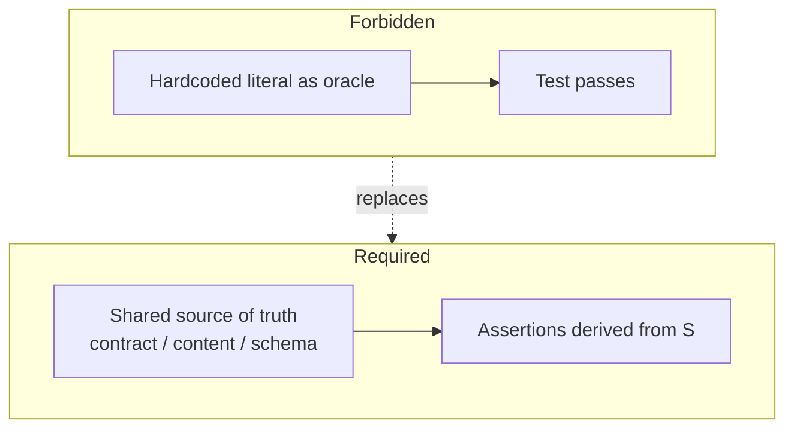

# ADR-0039: Gate Tests Must Not Use Hardcoded Oracles (No “Example-Shaped” Bypasses)

- **Status:** Accepted
- **Date:** 2026-05-13
- **Project:** World of Shadows
- **Decision owner:** Engineering / QA / Runtime governance
- **Related areas:** Operational gates, MVP gates, CI, contract tests, narrative/runtime validation, **`story_runtime_core`** shared runtime library (input interpretation, recovery, branching)
- **Related ADR:** [ADR-0008](adr-0008-validation-strategy-explicit-configurable.md) — validation strategy must remain explicit and meaningful
- **Related ADR:** [ADR-0009](adr-0009-evaluation-is-a-promotion-gate.md) — evaluation and gates are promotion mechanisms, not decoration
- **Related ADR:** [ADR-0025](adr-0025-canonical-authored-content-model.md) — canonical content is the right oracle surface for slice truth
- **Related ADR:** [ADR-0041](adr-0041-semantic-capability-selection-and-runtime-capability-budgeting.md) — future capability selection must use semantic names and must not treat selection as implementation or live proof
- **Related ADR:** [ADR-MVP2-016](MVP_Live_Runtime_Completion/adr-mvp2-016-operational-gates.md) — operational gates must prove real coverage, not checklist theatre
- **Supersedes:** None
- **Superseded by:** None

---

## 1. Context

We repeatedly observe an anti-pattern when fixing failing gates or tightening checks:

1. A gate or regression test fails for a **legitimate semantic reason** (contract drift, missing integration, wrong authority surface, incomplete pipeline).
2. Instead of fixing the **system under test** (or the **contract**), a contributor “fixes green” by **hardcoding the expected outcome** that makes the test pass: literal strings, magic IDs, fixed counts, brittle substrings, or one-off payloads copied from a single local run.
3. The test then encodes **the symptom description** (what the ticket said) rather than the **invariant** (what must always be true). Semantically equivalent correct behavior can still fail; slightly wrong behavior can pass if it matches the hardcoded needle.

This produces **false confidence**: CI is green while the product regresses, because the test is a mirror of a workaround, not a guardrail. It also **ossifies accidents**: the hardcoded value becomes undeclared product truth that diverges from canonical modules, OpenAPI, ADRs, or runtime authority.

Gates exist to prove that **promotion criteria** hold under change. If a gate test’s oracle is arbitrary hardcoded material, the gate becomes a **lint rule for the patch author’s memory**, not a proof of system behavior.

### Tight coupling to ADR-0008 and ADR-0009

- **[ADR-0008](adr-0008-validation-strategy-explicit-configurable.md)** defines *how strongly* runtime output is validated. Tests that claim to protect that behavior must not substitute hardcoded example text for real contract checks—otherwise the strategy toggle becomes theatre: CI can stay green while semantics drift.
- **[ADR-0009](adr-0009-evaluation-is-a-promotion-gate.md)** defines that promotion is not automatic from artifact existence; evaluation evidence matters. When evaluation gate tests land, they are especially vulnerable to “assert this exact score text” shortcuts; this ADR forbids that pattern so evaluation remains a **genuine promotion signal**.

---

## 2. Decision

**Normative rule — binding for gate tests and promotion-style regression tests:**

> **Gate tests MUST NOT treat hardcoded literals as the primary oracle of correctness.**  
> Assertions must be derived from a **declared, shared source of truth** (contract, schema, canonical authored content, public API response shape, documented invariants) or from **computed baselines** that are themselves justified by such a source.

**Hardcoded values are forbidden when they function as:**

- A **bypass** for a missing semantic fix (“just assert this exact `consequence_text` substring”).
- A **single-example oracle** that only matches one narrative phrasing, one model run, or one author’s wording.
- A **duplicate truth surface** that contradicts or silently diverges from canonical YAML, runtime projection, or published contracts.

**Allowed patterns (non-exhaustive):**

- **Load the oracle** from canonical content (e.g. `content/modules/…`, compiled projections, fixtures generated from the same pipeline that production uses).
- **Assert structure and invariants** (types, keys, bounds, monotonicity, presence of required fields, forbidden classes absent) without pinning prose.
- **Compare against a stable artifact** only when that artifact is **versioned and reviewable** (e.g. golden JSON under `tests/fixtures/` with a documented generator, or snapshot tests under explicit team review policy — not ad-hoc copy-paste).
- **Use regex or semantic checks** sparingly and only when tied to a **named invariant** documented in an ADR or contract (not “this one German clause”).

**Pull requests that add or extend gate tests must be rejected if:**

- The primary assertion is a **long literal** or **opaque magic constant** with no pointer to the contract or content that defines it.
- The test would **pass** if the implementation returned **wrong behavior** that still matched the hardcoded string.
- The test would **fail** if the implementation improved while preserving all **documented** semantics (e.g. rephrased narrator text that still satisfies the same content keys and policies).

### Capability Matrix and Pi / Π vocabulary

For Capability Matrix work, Pi / Π labels are historical cross-reference vocabulary only. They must not become runtime IDs, score names, schema keys, routing keys, or control-flow branches. Production code must use stable semantic names such as `silence_negative_space`, `environment_state`, `dramatic_irony`, `callback_web`, `subtext`, `information_disclosure`, `social_pressure`, `sensory_context`, and `improvisational_coherence`.

Semantic names are allowed in production when they are contract-backed. Tests must distinguish forbidden Pi-number usage from valid semantic runtime surfaces. When a new Capability Matrix row gains implementation code, update `tests/gates/test_table_b_anti_hardcoding_gate.py` with the legacy label and any reviewed semantic runtime-aspect surface, or document why the row is out of scope.

ADR-0041 adds the Runtime Capability Authority boundary. Selector manifests, selector outputs, activation modes, scoped co-authority decision payloads, RuntimeAspectLedger evidence, MCP payloads, and Langfuse score names must follow the same semantic-name rule. A selector decision can explain why `narrator_authority`, `scene_energy`, or `npc_agency` was selected or excluded for a turn, but it must not use Pi / Π labels as active keys and must not be treated as implementation, promotion, or live/staging proof by itself.

ADR-0039 applies to every test file that references a Pi / Π capability label, including tests that use Table-B metadata only as fixture data. Those tests must be covered by `tests/gates/test_adr_0039_pi_scope.py`, and any new Pi-labeled test must either join that coverage manifest or remove the legacy label. A Pi-labeled test is not evidence by name alone; it must assert contract fields, validators, policy-derived values, runtime wiring, ledger projection, MCP extraction, or Langfuse/staging evidence.

Capability promotion evidence belongs in:

- `docs/MVPs/capability_matrix_status_and_adr_relations.md` for current truth, ADR relation, semantic name, and maturity.
- `docs/MVPs/capability_matrix_verification_log.md` for dated verification runs.
- `docs/MVPs/capability_matrix_live_claim_gates.md` for live/staging/Langfuse/MCP promotion rules.

### MCP, Langfuse, portability, and evidence quality

MCP and Langfuse verification tools are ADR-0039 gate surfaces when their output is used for Capability Matrix claims. They must derive repository paths from `Config.repo_root`, `REPO_ROOT`, or another repository-root discovery mechanism; production verification code must not embed machine-local roots such as a developer's drive, home directory, or mount path. Dated verification logs may preserve historical absolute commands only when they are explicitly marked as local environment transcripts and not reusable proof instructions.

Local pytest, mocked provider checks, fixture traces, and degraded/fallback paths prove local implementation behavior only. They must not be described as staging/live/Langfuse/MCP success unless the evidence includes the actual provider or environment metadata, reproducible trace/query identifiers where applicable, semantic score names, and the command or query used to retrieve it.

False-green prevention for MCP/Langfuse gates requires structured result fields: return codes, command/cwd or query metadata, environment scope, evidence scope, score names, and normalized runtime metadata. A PASS label, test name, trace id string, comment, or documentation statement is not proof unless the structured output supports the claim.

### Runtime surface governance (expanded scope)

ADR-0039 governs **runtime behavior and decision surfaces**, not only tests and documentation. Any path that can distort **runtime truth, readiness, player/session/turn flow, beat progression, or decision-tree behavior** is in scope, including:

- **`ai_stack`** — LangGraph executor, `run_validation_seam`, `runtime_aspect_ledger` / `runtime_intelligence_projection`, ADR-0041 sidecar and flags (fail-closed defaults; projection must not impersonate seam or commit).
- **`world-engine`** — `StoryRuntimeManager`, commit/readiness models, narrative commit seam.
- **`backend`** — player-session bundle and readiness derivation (`evaluate_session_opening_readiness`, ADR-0041 veto-only consumer).
- **`frontend` Play Shell** — must **not manufacture** readiness, live, or healthy semantics; display only fields the backend/runtime bundle proves.
- **`story_runtime_core`** — first-class: `interpret_player_input` / locale rules (**preview** shaping only), **`recovery/no_dead_end`** (**diagnostic** evidence contract only), branching / callback / consequence helpers (**diagnostic** unless explicitly wired through world-engine commit). This package must **not** bypass canonical validation or commit authority.

**Normative inventory:** [`docs/MVPs/adr0039_runtime_surface_governance_inventory.md`](../MVPs/adr0039_runtime_surface_governance_inventory.md) (YAML front matter, gate-enforced). Code is authoritative over prose; update the inventory when surfaces change.

**Interaction with ADR-0041:** Scoped co-authority and readiness aggregation remain **bounded, explicit, and testable**; they must **not** silently mutate `validation_outcome`, commit, or seam-canonical readiness. `plan_enforced` without the LangGraph graph sidecar must remain **dry-run** on the ledger projection path.

---

## 3. Consequences

**Positive**

- Gates measure **whether the system honors contracts**, not whether it repeats yesterday’s wording.
- Canonical content and ADRs remain **single sources of truth**; tests stop inventing parallel truth.
- Refactors and localization (e.g. session output language) become **possible without whack-a-mole** string updates across gate tests.

**Negative / risks**

- Tests may require **more setup** (loaders, small harnesses) instead of a one-line `assert output == "..."`.
- Some genuinely brittle domains (timestamps, nonces) still need **controlled fixtures**; those fixtures must be **documented** and minimal, not full narrative oracles.

**Follow-ups**

- During code review, treat unexplained string literals in `tests/` and `**/test_*gate*` files as **blockers** unless referenced to contract or content.
- Prefer extending **canonical content** or **contract schemas** when a new invariant is needed, then binding tests to that extension.

---

## 4. Testing (how this ADR is enforced)

- **Review gate:** PR reviewers reject hardcoded-oracle gate tests per §2.
- **Runtime surface inventory gate:** `tests/gates/test_adr0039_runtime_surface_governance.py` — inventory file present, YAML parseable, required surfaces (including **`story_runtime_core_*`**) listed with valid `authority_level` and existing `primary_files`.
- **Optional automation (future):** lint or CI heuristic flagging large string literals in gate test paths (low precision; human decision remains authoritative).
- **Failure mode triggering ADR review:** Evidence that a gate test was changed only by adjusting expected literals while production behavior or contracts did not improve.

---

## 5. References

- [ADR-0008 — Validation strategy](adr-0008-validation-strategy-explicit-configurable.md)
- [ADR-0009 — Evaluation is a promotion gate](adr-0009-evaluation-is-a-promotion-gate.md)
- [ADR-0025 — Canonical authored content model](adr-0025-canonical-authored-content-model.md)
- [ADR-MVP2-016 — Operational gates](MVP_Live_Runtime_Completion/adr-mvp2-016-operational-gates.md)
- Repository test runner: `tests/run_tests.py` (canonical; gate suites must stay honest under this ADR)
- [Runtime surface governance inventory](../MVPs/adr0039_runtime_surface_governance_inventory.md)

---

## Diagrams

Hardcoded literals may still appear as **incidental** data (e.g. module ids, route paths) when they **are** the contract; they must not appear as **substitutes** for the contract.
