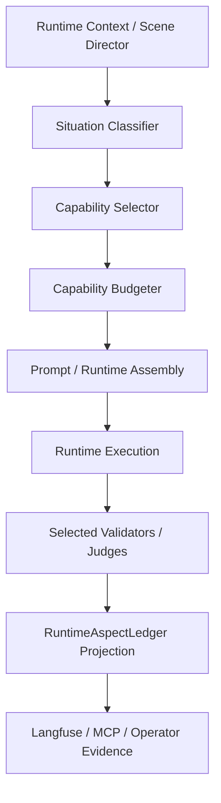

# ADR-0041: Semantic Capability Selection and Runtime Capability Budgeting

## Status

Proposed

## Date

2026-05-15

## Implementation status

| Surface | Status | Evidence |
|---------|--------|----------|
| Local deterministic selector core | Implemented | `ai_stack/capability_selector.py`; focused unit tests in `ai_stack/tests/test_capability_selector.py`. |
| RuntimeAspectLedger-compatible local projection helper | Implemented | `CapabilitySelectionResult.to_runtime_aspect_projection()` emits local-only `capability_selection` evidence. |
| Runtime intelligence projection hook | Implemented | `runtime_intelligence_projection.capability_selection` is derived locally from existing turn context; it does not mark the ledger capability aspect as passed and does not affect commit/readiness gates. |
| Local validator execution-plan projection | Implemented | `runtime_intelligence_projection.validator_execution_plan` maps selected capabilities to planned validator, diagnostic, skipped, and judge-disallowed IDs with `execution_changed=false`. |
| Dry-run validator dispatch projection | Implemented | `runtime_intelligence_projection.validator_dispatch_report` consumes the local execution plan in `dry_run` mode only; `actually_executed` remains empty and `execution_changed=false`. |
| Feature-flagged plan-enforced local dispatch adapter | Implemented | `ADR0041_VALIDATOR_DISPATCH_MODE` defaults to `dry_run`; explicit `plan_enforced` with a registered local validator registry can execute opening-scene local validators in tests only. Production projection remains dry-run unless the env flag is explicitly set. |
| Semantic validator registry inventory | Implemented | `docs/MVPs/capability_validator_registry_inventory.md` and `ai_stack/capability_validator_registry.py` map planned validator IDs to real local surfaces; default registry remains empty. Opening-scene enforced adapters exist for narrator authority and environment state via thin local evaluators. |
| World-engine prompt/runtime assembly integration | Not implemented | Future phase; no prompt authority or runtime behavior changes in the first implementation. |
| Actual selected validator execution/gating integration | Not implemented | Future phase; production validator orchestration is not wired to plan-enforced dispatch yet; commit/readiness integration remains pending. |
| LLM-as-a-Judge execution integration | Not implemented | Judge mode remains budget-gated metadata only; no judge execution is added. |
| Langfuse/MCP live or staging verification | Not implemented | No live/staging evidence is produced by the local selector core, capability projection, or validator-plan projection. |

## Intellectual property rights

Repository authorship and licensing: see project **LICENSE**; contact
maintainers for clarification.

## Privacy and confidentiality

This ADR contains no personal data. Future implementation must not emit raw
secrets, provider credentials, full prompts, or unnecessary player text in
selection evidence.

## Related ADRs

- [ADR-0004](adr-0004-runtime-model-output-proposal-only-until-validator-approval.md)
  - model output remains proposal-only until validation approves it.
- [ADR-0008](adr-0008-validation-strategy-explicit-configurable.md) -
  validation strategy remains explicit and configurable.
- [ADR-0009](adr-0009-evaluation-is-a-promotion-gate.md) - evaluation is
  promotion evidence, not decoration.
- [ADR-0033](adr-0033-live-runtime-commit-semantics.md) - live runtime commit
  semantics remain authoritative.
- [ADR-0038](adr-0038-canonical-turn-lifecycle-single-commit-path.md) -
  selected capability execution must still flow through the canonical turn path.
- [ADR-0039](adr-0039-gate-tests-no-hardcoded-oracle-bypass.md) - semantic
  names only; no hardcoded oracle bypasses; no active Pi / Π runtime keys.
- [ADR-0040](adr-0040-quality-lab-mcp-runtime-diagnostics.md) - Quality Lab may
  interpret evidence but must not promote Capability Matrix status by itself.

## Context

The Capability Matrix documents many available, partial, or planned runtime
capabilities. That map is intentionally broad: it connects semantic capability
names, historical Pi / Π cross-references, ADR ownership, maturity, tests,
RuntimeAspectLedger projection, and Langfuse/MCP evidence requirements.

The runtime must not process every Capability Matrix row or every runtime
aspect on every turn. A capability being present in the matrix means it is part
of the governed truth map. It does not mean the capability should be activated,
validated, judged, or added to prompt authority for the current situation.

Opening scenes make the problem concrete:

- Only the narrator acts.
- No player input exists.
- No NPC decision is required yet.
- No consequence cascade should run.
- No long-horizon forecast is needed.

An opening scene may need `narrator_authority`, `scene_energy`,
`environment_state`, `information_disclosure`, and `voice_consistency`. It may
observe `thematic_tracking`, `callback_web`, and `sensory_context`. It should
usually exclude `npc_agency`, `player_intent_inference`, `action_resolution`,
`consequence_cascade`, `long_horizon_forecast`, `silence_negative_space`, and
`dramatic_irony` unless the situation signals actually require them.

Without a governed selector, the runtime risks over-validating ordinary turns,
running expensive judges by default, hiding why a capability was used, and
creating false implementation or live/staging claims from mere selection.

## Decision

Introduce the design contract for a **Semantic Capability Selector**. The first
implementation is a local deterministic selector core plus a local runtime
intelligence projection hook only; it does not change prompt authority,
validator execution, judge execution, generated story content, or commit gates.
The validator execution plan is planning evidence only; it does not execute,
skip, or gate real validators.

The future selector must answer for each turn:

```text
Which capabilities are needed now?
Which capabilities are observed only?
Which capabilities are excluded?
Which expensive judges or validators are allowed?
Why was this decision made?
```

The architecture concept is:

```text
Runtime Context / Scene Director
        ->
Situation Classifier
        ->
Capability Selector
        ->
Capability Budgeter
        ->
Prompt / Runtime Assembly
        ->
Runtime Execution
        ->
Selected Validators / Judges
        ->
RuntimeAspectLedger Projection
        ->
Langfuse / MCP / Operator Evidence
```

Normative rules:

- The Capability Matrix remains the governed truth map for what exists, what
  maturity it has, what ADR governs it, and what evidence is required.
- The selector decides which semantic capability subset is activated for one
  runtime situation.
- The selector must use semantic capability names only, such as
  `narrator_authority`, `npc_agency`, `scene_energy`,
  `information_disclosure`, and `consequence_cascade`.
- Pi / Π labels must remain historical cross-reference vocabulary only. They
  must not be active selector keys, runtime branch keys, schema keys, score
  names, routing keys, or prompt-control identifiers.
- The selector must emit structured evidence explaining selected, observed,
  excluded, budgeted, and judged capabilities.
- A selected capability is not proof that the capability is implemented,
  correctly realized, or live/staging verified.
- Runtime execution, validation, ledger projection, MCP/Langfuse evidence, and
  Capability Matrix promotion rules still govern implementation and live
  claims.

## Non-goals

- Not implementing the selector in this task.
- Not introducing new runtime capabilities.
- Not adding selectors, validators, prompt assemblers, or tests in this task.
- Not promoting partial capabilities.
- Not creating live/staging proof.
- Not replacing the Capability Matrix.
- Not replacing RuntimeAspectLedger.
- Not making LLM-as-a-Judge mandatory for all turns.
- Not making Pi / Π labels active runtime identifiers.
- Not allowing local-only evidence to become live proof.

## Terminology

`Capability Matrix`: the governed truth map for capability existence, maturity,
ADR ownership, evidence, tests, and blockers.

`Semantic Capability Selector`: the future deterministic-first selector that
chooses which semantic capabilities are active for the current turn.

`Situation signals`: structured context values used by the selector, such as
`turn_kind`, `active_actor`, `player_input_present`, and
`npc_decision_required`.

`Activation mode`: the per-capability mode for a specific turn: `off`,
`observe`, `enforce`, or `judge`.

`Capability budget`: the per-situation limit on enforced capabilities, heavy
forecasting, and LLM-as-a-Judge usage.

`Selection evidence`: local per-turn diagnostic evidence explaining a selector
decision. It is not live/staging proof and not promotion evidence by itself.

## Activation Modes

`off`: the capability is intentionally excluded for this turn. It must not
shape prompt authority, runtime control flow, validators, judges, or commit
gates for that turn.

`observe`: cheap diagnostics or ledger observation may run. The capability must
not affect prompt authority, runtime control flow, or commit gates. Observed
evidence is useful for drift analysis, but it must not block commit unless a
later ADR explicitly promotes that behavior.

`enforce`: the capability actively influences prompt assembly, runtime behavior,
local validation, and/or commit-readiness rules. Enforced capabilities should be
bounded by the current capability budget.

`judge`: a heavier LLM-as-a-Judge or external evaluator may be used. Judge mode
is reserved for high-risk, ambiguous, live/staging, promotion-relevant, or
regression-investigation situations. It must not be the default for ordinary
turns.

## Cost-Budgeting Rules

Initial defaults, subject to tuning:

| Situation | Max enforced capabilities | LLM judges | Heavy forecast |
|-----------|---------------------------|------------|----------------|
| `opening_scene` | 5 | false | false |
| `normal_player_turn` | 6 | conditional | false |
| `npc_conflict_turn` | 7 | conditional | conditional |
| `high_stakes_turn` | 8 | true | conditional |
| `fallback_recovery` | 3 | false | false |

Rules:

- Cheap deterministic selection comes first.
- LLM-based selection should only run for ambiguity or high-stakes turns.
- Selected validators should be limited to selected `enforce` capabilities.
- Excluded capabilities should not run validators or judges.
- Observed-only capabilities should not block commit unless explicitly promoted
  by later governance.
- Heavy forecasts and long-horizon simulations should be separately budgeted
  and off for ordinary openings.

## Situation Signals

The initial design vocabulary for future implementation is:

| Signal | Values |
|--------|--------|
| `turn_kind` | `opening`, `player_input`, `npc_turn`, `narrator_bridge`, `recovery`, `system_transition` |
| `active_actor` | `narrator`, `player`, `npc`, `system` |
| `player_input_present` | boolean |
| `npc_decision_required` | boolean |
| `action_resolution_required` | boolean |
| `visible_projection_required` | boolean |
| `interpersonal_pressure` | `none`, `low`, `medium`, `high` |
| `scene_phase` | `opening`, `escalation`, `confrontation`, `aftermath`, `recovery` |
| `last_turn_quality` | `healthy`, `degraded`, `fallback` |
| `canonical_scene_seed` | boolean |
| `non_lexical_input_present` | boolean |
| `knowledge_gap_present` | boolean |
| `world_state_change_requested` | boolean |

This vocabulary is initial design intent and should be refined during
implementation.

## Opening Scene Example

Input situation:

```yaml
turn_kind: opening
active_actor: narrator
player_input_present: false
npc_decision_required: false
scene_visibility_required: true
canonical_scene_seed: true
```

Expected selection:

```yaml
enforce:
  - narrator_authority
  - scene_energy
  - environment_state
  - information_disclosure
  - voice_consistency
observe:
  - thematic_tracking
  - callback_web
  - sensory_context
off:
  - npc_agency
  - player_intent_inference
  - action_resolution
  - consequence_cascade
  - long_horizon_forecast
  - silence_negative_space
  - dramatic_irony
```

Opening-scene `sensory_context` must remain diagnostic/local-only unless or
until it has owning ADR coverage, focused tests, world-engine projection
evidence, and live/staging proof if promoted. Selecting or observing it for an
opening scene is not a status promotion and not live/staging evidence.

## Validation and Judge Selection

Future rules:

- Run validators only for `enforce` capabilities.
- Run cheap diagnostics for `observe` capabilities where useful.
- Do not run validators for `off` capabilities.
- Run LLM-as-a-Judge only when local validation is ambiguous, the turn is
  high-stakes, live/staging evaluation is explicitly requested, a capability
  promotion gate requires it, or a regression investigation requires it.
- Opening scenes should not use heavy judges by default.
- Judge results are qualitative evidence unless correlated with deterministic
  runtime gates and promotion rules.

## RuntimeAspectLedger Evidence

Future selector evidence should be projected into RuntimeAspectLedger under a
semantic `capability_selection` aspect or an equivalent governed projection.
If a local `capability_selection` aspect exists before the full selector lands,
that aspect is still only local runtime evidence unless the implementation and
live/staging proof satisfy the promotion rules.

Illustrative future shape:

```json
{
  "capability_selection": {
    "turn_kind": "opening",
    "active_actor": "narrator",
    "selected": [
      "narrator_authority",
      "scene_energy",
      "environment_state",
      "information_disclosure",
      "voice_consistency"
    ],
    "observed_only": [
      "thematic_tracking",
      "callback_web",
      "sensory_context"
    ],
    "excluded": [
      "npc_agency",
      "action_resolution",
      "consequence_cascade",
      "long_horizon_forecast"
    ],
    "budget": {
      "max_enforced": 5,
      "llm_judges_allowed": false
    },
    "reason": "Opening scene with narrator-only authority and no player action."
  }
}
```

Clarifications:

- This is future implementation shape unless already implemented by a later
  code change.
- Local ledger evidence is not live/staging proof.
- Selection evidence must support debugging and MCP/Langfuse analysis.
- Selection evidence should help identify over-selection, under-selection, and
  false-green capability claims.

## Capability Manifest Concept

Future implementation may use a declarative manifest:

```yaml
capabilities:
  narrator_authority:
    cost_tier: low
    default_mode: observe
    activate_when:
      - turn_kind: opening
      - active_actor: narrator
      - visible_projection_required: true
    excludes:
      - npc_agency
      - action_resolution
    evidence:
      ledger_aspect: narrator_authority
      langfuse_score: narrator_authority_contract_pass

  npc_agency:
    cost_tier: medium
    default_mode: off
    activate_when:
      - active_actor: npc
      - npc_decision_required: true
      - interpersonal_pressure: medium_or_high
    exclude_when:
      - turn_kind: opening
      - active_actor: narrator
    evidence:
      ledger_aspect: npc_agency
      langfuse_score: npc_agency_contract_pass

  consequence_cascade:
    cost_tier: high
    default_mode: off
    activate_when:
      - world_state_change_requested: true
      - action_resolution_required: true
    evidence:
      ledger_aspect: consequence_cascade
```

This manifest is design intent only. It is not implemented behavior unless code
is added in a later phase.

## Relationship to ADR-0039

The selector must comply with ADR-0039:

- Semantic capability names only.
- No Pi / Π labels as active selector keys.
- No Pi / Π labels as runtime branch keys.
- No Pi / Π labels as score names.
- No Capability Matrix row is treated as implementation proof.
- No local selection evidence is treated as live/staging proof.
- No degraded, fallback, mock, or local-only behavior is counted as live
  success.
- MCP/Langfuse evidence remains scoped and truthful.
- Tests must derive expectations from contracts, schemas, manifests, and ledger
  fields, not from example-shaped narrative strings.

## Relationship to the Capability Matrix

The Capability Matrix answers: what exists, what maturity it has, what ADR
governs it, and what evidence is required.

The Capability Selector answers: which semantic capability subset is activated
for the current turn.

Therefore:

- A capability can be implemented but not selected for a given turn.
- A capability can be selected but still fail validation.
- A capability can be observed but not enforced.
- A capability can be enforced locally without being live-verified.
- Selection is not promotion evidence by itself.

## Relationship to Langfuse and MCP Evidence

MCP and Langfuse may inspect selector output, selected validators, judge usage,
budget decisions, and RuntimeAspectLedger projection. They must not infer live
success from selection alone.

Required interpretation boundaries:

- `off` capabilities should not appear as successful runtime work for the turn.
- `observe` capabilities may appear as diagnostic evidence, not commit proof.
- `enforce` capabilities require validator/runtime evidence before they can
  support a capability claim.
- `judge` capabilities require explicit evaluator metadata and environment
  scope. Missing or negative judge output is a diagnostic or qualitative signal
  unless tied to a deterministic gate.

## Future Implementation Phases

1. Define the selector data contract: situation signals, activation modes,
   budget fields, reason codes, and evidence shape.
2. Add a declarative capability manifest using semantic names only.
3. Implement deterministic selection for opening, normal player, NPC conflict,
   high-stakes, and recovery turns.
4. Wire selected `enforce` capabilities into prompt/runtime assembly without
   changing matrix statuses.
5. Gate validators by selected `enforce` capabilities.
6. Gate LLM-as-a-Judge usage by budget and risk.
7. Project selection evidence into RuntimeAspectLedger.
8. Expose scoped MCP/Langfuse diagnostics.
9. Add ADR-0039-compliant tests that assert contracts and structured evidence,
   not generated prose.
10. Use verification logs and live-claim gates before any status promotion.

## Consequences

**Positive:**

- Runtime turns can activate the smallest useful capability set instead of
  processing the full matrix or runtime aspect tree every turn.
- Opening scenes remain narrator-focused, cheaper, and easier to audit.
- Validator and judge costs become explicit budget decisions.
- RuntimeAspectLedger, MCP, and Langfuse gain a clear reason trail for
  selected, observed, and excluded capabilities.
- Capability Matrix status remains separated from per-turn selection.

**Negative / risks:**

- A selector can under-select needed capabilities if situation signals are too
  weak.
- A selector can over-select capabilities if budgets are not enforced.
- Contributors may misread selection evidence as implementation or live proof.
- The manifest can drift from contracts unless guarded by ADR-0039-compliant
  tests in a later implementation phase.

**Follow-ups:**

- Build a semantic-name selector schema and manifest.
- Add deterministic opening-scene selection first.
- Gate validators and judges by activation mode.
- Project selection evidence into RuntimeAspectLedger and MCP/Langfuse with
  evidence scope.

## Acceptance Criteria

- The selector concept is clear enough to implement later.
- ADR-0039 compatibility is explicit.
- Pi / Π labels remain historical only.
- Semantic names are used throughout the runtime design.
- Opening-scene behavior is narrator-focused and cost-bounded.
- Activation modes and cost budgets are documented.
- RuntimeAspectLedger evidence expectations are documented.
- Capability Matrix responsibilities remain separate from selector
  responsibilities.
- No live/staging claims are added by this ADR.
- No Capability Matrix statuses are promoted by this ADR.
- Future implementers know what to build next.
- Future auditors know how to check it.

## Risks and Mitigations

| Risk | Mitigation |
|------|------------|
| Over-selection increases cost and prompt noise | Enforce per-situation budgets and require selector reasons. |
| Under-selection misses necessary capability protection | Use explicit situation signals, fallback recovery budgets, and audit over blocked/recovered turns. |
| Selection gets mistaken for implementation proof | Repeat the matrix/selector boundary in ADR, matrix, live-claim, and verification docs. |
| Judge mode becomes default | Require budget gating and explicit high-risk, ambiguous, promotion, or investigation reason codes. |
| Pi / Π labels re-enter production logic | ADR-0039 gates and selector manifest review must reject active legacy keys. |
| MCP/Langfuse overclaim local evidence | Require evidence scope, environment, score names, and live/staging metadata. |
| Opening scenes become overloaded | Keep narrator-only defaults and exclude player/NPC/action/cascade capabilities unless signals require them. |

## Future Audit Checklist

Auditors must verify:

- The selector uses semantic names only.
- No active Pi / Π keys are introduced.
- Selected capabilities are visible in ledger evidence.
- Selected validators match selected `enforce` capabilities.
- Excluded capabilities do not run unnecessary validators.
- Judge mode is not used by default.
- Opening scenes remain narrator-focused and cost-bounded.
- Local evidence is not treated as live/staging evidence.
- Capability Matrix statuses are not promoted from selection alone.
- MCP/Langfuse diagnostics preserve environment and evidence scope.

## Diagrams



## Testing

Not yet automated. This ADR is documentation-only.

Future tests must comply with ADR-0039 and should cover:

- Manifest semantic-name validation.
- No Pi / Π active selector keys.
- Opening-scene selection output.
- Budget limits by situation class.
- Validator gating by activation mode.
- Judge gating by ambiguity/high-stakes/promotion reasons.
- RuntimeAspectLedger projection shape.
- MCP/Langfuse evidence-scope fields.

## References

- [Capability Matrix and ADR relations](../MVPs/capability_matrix_status_and_adr_relations.md)
- [Capability Matrix live claim gates](../MVPs/capability_matrix_live_claim_gates.md)
- [Capability Matrix verification log](../MVPs/capability_matrix_verification_log.md)
- [Capability selection runtime design](../MVPs/capability_selection_runtime_design.md)
