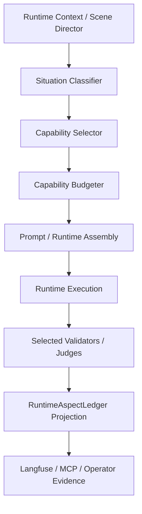

# ADR-0041: Controlled Runtime Capability Authority

Former working title: Semantic Capability Selection and Runtime Capability Budgeting.

## Status

Not Finished

## Date

2026-05-15

## Strategic direction (governance)

ADR-0041 should be treated as **Controlled Runtime Capability Authority**, not an observability-only sidecar. **Intended end state:** ADR-0041 becomes a central runtime mechanism that (1) classifies the current runtime situation, (2) selects relevant semantic capabilities, (3) routes only necessary validators/checks, (4) reduces unnecessary validation cost, (5) exposes drift against legacy seams, (6) decides which results are authoritative enough for bounded transfer, and (7) supports controlled runtime co-authority for bounded, well-proven concerns.

**Today:** projection, dry-run dispatch, opt-in plan-enforced sidecar, authority bridge, preview, and handoff-candidate policy are temporary safety phases; they are not the target end state. The current scoped step is `scoped_co_authority`: under `ADR0041_SCOPED_CO_AUTHORITY_ENABLED=true`, ADR-0041 may emit a non-mutating `validation_co_authority_decision` only when `partial_transfer_ready` is true for bounded concerns. Under `ADR0041_READINESS_CO_AUTHORITY_PREVIEW_ENABLED=true`, ADR-0041 may also emit a policy-grade `readiness_co_authority_preview` (`shadow_only` / `readiness_preview_candidate` / `readiness_preview_allow` / `readiness_preview_block` / `not_eligible`) without mutating readiness gates. Under `ADR0041_SCOPED_READINESS_ENFORCEMENT_ENABLED=true`, ADR-0041 may emit `readiness_co_authority_enforcement` (`allow` / `block` / `no_decision`) as a **pilot readiness policy input** while leaving final readiness gates unchanged. Under `ADR0041_SCOPED_READINESS_AGGREGATION_ENABLED=true` (with scoped co-authority, readiness preview, and enforcement all enabled), ADR-0041 may emit `runtime_intelligence_projection.readiness_aggregation_decision`: seam outcome is canonical for allow/reject; ADR-0041 may **veto** seam-allowed readiness only under bounded scoped policy (`aggregated_readiness`, `adr0041_veto_applied`); it must never upgrade a seam reject to allow (`adr0041_can_upgrade_seam_reject=false`). With **`ADR0041_RUNTIME_READINESS_CONSUMER_ENABLED=true`** (and the same prerequisite flags), the backend player-session bundle may apply that decision as a **veto-only** overlay on `runtime_session_ready` / `can_execute` via `ai_stack/story_runtime/runtime_readiness_consumer.py::resolve_runtime_readiness_with_adr0041`; without the consumer flag, final readiness fields stay **byte-compatible** with legacy `evaluate_session_opening_readiness`. **`run_validation_seam` remains canonical** for `validation_outcome`, commit, and seam/legacy readiness truth; the consumer does not overwrite `validation_outcome` or commit gates.

**Guardrails:** feature-flag and governance discipline; no commit or `validation_outcome` ownership from ADR-0041 alone; no live/staging claims from local-only evidence; no Capability Matrix promotion from local proof; semantic names only (ADR-0039); no Pi/Π active runtime keys; judges not default-on; unavailable validators do not pass.

## Implementation status

| Surface | Status | Evidence |
|---------|--------|----------|
| Local deterministic selector core | Implemented | `ai_stack/capabilities/capability_selector.py`; focused unit tests in `ai_stack/tests/test_capability_selector.py`. Explicit player-turn signals keep `player_input` / `active_actor=player` even when NPC-response evidence selects `npc_agency`. |
| RuntimeAspectLedger-compatible local projection helper | Implemented | `CapabilitySelectionResult.to_runtime_aspect_projection()` emits local-only `capability_selection` evidence. |
| Runtime intelligence projection hook | Implemented | `runtime_intelligence_projection.capability_selection` is derived locally from existing turn context; it does not mark the ledger capability aspect as passed and does not affect commit/readiness gates. |
| Local validator execution-plan projection | Implemented | `runtime_intelligence_projection.validator_execution_plan` maps selected capabilities to planned validator, diagnostic, skipped, and judge-disallowed IDs with `execution_changed=false`. |
| Dry-run validator dispatch projection | Implemented | `runtime_intelligence_projection.validator_dispatch_report` consumes the local execution plan in `dry_run` mode only; `actually_executed` remains empty and `execution_changed=false`. |
| Feature-flagged plan-enforced local dispatch adapter | Implemented | `ADR0041_VALIDATOR_DISPATCH_MODE` defaults to `dry_run`; `plan_enforced` runs **turn-class–scoped** local validators from the semantic registry when dispatch context is present (ledger path + LangGraph `validate_seam` sidecar). Default remains `dry_run`; no change to `validation_outcome` or commit/readiness. Evidence: per-validator `local_execution_evidence`; judges never run. |
| Validation authority preview (non-commit) | Implemented | When `plan_enforced` sidecar merges into `runtime_intelligence_projection`, top-level `validation_authority_preview` mirrors `validator_dispatch_report.adr0041_authority_preview`: `affects_commit=false`, `affects_readiness=false`, `proof_level=local_only`, `live_or_staging_evidence=false`, plus `drift_vs_validation_seam` classification vs `run_validation_seam` summary (`aligned`, `adr0041_stricter`, `seam_stricter`, `missing_context`, `unavailable_validator`, `conflicting_result`). Preview does **not** gate turns. |
| Validation authority bridge (seam ↔ ADR-0041 map) | Implemented | ``build_validation_authority_bridge`` in ``ai_stack/story_runtime/turn/validation_authority_bridge.py``; surfaced as ``runtime_intelligence_projection.validation_authority_bridge`` when plan-enforced graph sidecar merges. Includes per-concern ``seam_concern_coverage``, machine-readable ``seam_area_adr0041_relationship(_buckets)``, and ``authority_handoff_candidate`` (shadow governance signal; not commit authority). Bridge ``recommended_authority`` remains ``seam_canonical``; handoff may recommend ``adr0041_ready_for_shadow_authority`` when bounded partial-transfer scope is satisfied locally. Tests: ``ai_stack/tests/test_validation_authority_bridge.py``. |
| Scoped co-authority decision (flag-gated, non-mutating) | Implemented locally / Not commit authority | `ADR0041_SCOPED_CO_AUTHORITY_ENABLED=true` plus `plan_enforced` and `partial_transfer_ready=true` may emit `runtime_intelligence_projection.validation_co_authority_decision` with `authority_stage=scoped_co_authority`, `readiness_preview`, and `validation_preview`. It is limited to `actor_lane_forbidden_output`, `hard_forbidden_runtime`, `opening_event_coverage` (opening only), and `dramatic_effect_gate` with sufficient mirror fidelity. It never overwrites `validation_outcome`, never blocks commit, and never replaces `run_validation_seam`. Tests: `ai_stack/tests/test_validation_authority_bridge.py`. |
| Readiness co-authority preview (policy-grade, non-mutating) | Implemented locally / Not readiness gate authority | `ADR0041_READINESS_CO_AUTHORITY_PREVIEW_ENABLED=true` plus `plan_enforced` emits `runtime_intelligence_projection.readiness_co_authority_preview` with machine-readable policy stage (`shadow_only`, `readiness_preview_candidate`, `readiness_preview_allow`, `readiness_preview_block`, `not_eligible`), explicit blockers/evidence, and seam vs ADR-0041 drift status. Preview never mutates `validation_outcome`, commit, or readiness; `proof_level=local_only`; `run_validation_seam` remains canonical/fallback. Tests: `ai_stack/tests/test_validation_authority_bridge.py`, `ai_stack/tests/test_adr0041_runtime_graph_sidecar.py`, `world-engine/tests/test_adr0041_validator_dispatch_harness.py`. |
| Scoped readiness enforcement pilot (policy input, flag-gated) | Implemented locally / Pilot only | `ADR0041_SCOPED_READINESS_ENFORCEMENT_ENABLED=true` emits `runtime_intelligence_projection.readiness_co_authority_enforcement` and mirrors it to `runtime_intelligence_projection.readiness_policy_input`. Output is machine-readable (`readiness_input=allow|block|no_decision`, bounded scope, blockers/evidence, policy_stage) and may represent a real readiness policy input for downstream governance, but keeps `validation_outcome_changed=false`, `commit_gate_changed=false`, `readiness_gate_changed=false`, and does not mutate commit/readiness by default. Tests: `ai_stack/tests/test_validation_authority_bridge.py`, `ai_stack/tests/test_adr0041_runtime_graph_sidecar.py`. |
| Scoped readiness aggregation pilot (seam-canonical + ADR veto-only) | Implemented locally / projection policy | `ADR0041_SCOPED_READINESS_AGGREGATION_ENABLED=true` plus prerequisite flags (scoped co-authority, readiness preview, enforcement) may emit `runtime_intelligence_projection.readiness_aggregation_decision` with `seam_readiness`, `adr0041_readiness_input`, `aggregated_readiness` (`allow|block|unchanged`), `adr0041_veto_applied`, `adr0041_can_upgrade_seam_reject=false`. ADR-0041 may block seam-allowed readiness under bounded policy; it never upgrades seam reject. Does not mutate `validation_outcome` or commit; `proof_level=local_only`. Helpers: `aggregate_runtime_readiness_with_adr0041`, `build_readiness_aggregation_decision` in `ai_stack/story_runtime/turn/validation_authority_bridge.py`. Tests: `ai_stack/tests/test_validation_authority_bridge.py`. |
| Runtime readiness consumer contract (veto-only, flag-gated) | Implemented locally / backend bundle only | `ADR0041_RUNTIME_READINESS_CONSUMER_ENABLED=true` plus the same upstream ADR-0041 flags may influence **only** `runtime_session_ready` and `can_execute` on the player session bundle (`backend/app/api/v1/game_routes.py::_player_session_bundle`) by consuming `readiness_aggregation_decision` from the latest turn’s `turn_aspect_ledger.runtime_intelligence_projection`. Veto-only: legacy/seam allow may become block; reject is never upgraded to allow; unknown/mixed base does not become full allow. Diagnostics: `governance.adr0041_runtime_readiness_consumer` plus read-only `governance.adr0041_readiness_projection_echo` (ledger slices; no second mutator). Inspector `authority_projection` and operator turn-history rows echo the same read-only projection payload. Static guard: `backend/tests/test_adr0041_readiness_consumer_single_mutation_site.py`. `validation_outcome_changed=false`, `commit_gate_changed=false`, `proof_level=local_only`, `live_or_staging_evidence=false`. Tests: `ai_stack/tests/test_runtime_readiness_consumer.py`, `backend/tests/test_runtime_readiness_consumer_bundle.py`. |
| Administration Governance Console | Implemented locally / operator display only | `/manage/governance-console` is a read-only operator surface with stable JSON viewer mounts for Runtime Readiness, Capability Authority, Capability Matrix, Validator Registry, Langfuse/MCP Evidence, Runtime Aspect Ledger, Runtime Systems, and Feature Flag Ownership. It displays upstream governance projections and endpoint payloads; it must not mutate ADR-0041 flags, promote Capability Matrix rows, or claim live/staging proof. Tests assert mount IDs and labels instead of obsolete composed card titles: `administration-tool/tests/test_manage_governance_console_and_runtime_config_truth.py`. |
| Semantic validator registry inventory | Implemented | `docs/MVPs/capability_validator_registry_inventory.md` and `ai_stack/capabilities/capability_validator_registry.py` map planned validator IDs to real local surfaces; default registry remains empty. Opening-scene, normal player-turn, and NPC conflict-turn enforced adapters exist via thin local evaluators (`build_opening_enforced_semantic_validator_registry`, `build_player_turn_enforced_semantic_validator_registry`, `build_npc_conflict_enforced_semantic_validator_registry`). Plan-enforced remains opt-in; production orchestration and live/staging proof remain pending. |
| Voice consistency semantic profile derivation | Implemented | `ai_stack/story_runtime/npc_agency/character/god_of_carnage_character_voice.py` compiles runtime `semantic_profile` dimensions from the split GoC character voice YAML. Current content uses `speech_patterns`, `dialogue_tendencies`, and `phase_arc` to derive worldview/register/syntax-rhythm/rhetorical-strategy/phase-alignment evidence; runtime profiles still omit `dialogue_examples` and stay content-derived. Tests: `ai_stack/tests/test_character_voice_runtime_enforcement.py`. |
| Turn-class enforced registry coverage (local-only drift guard) | Implemented | `TURN_CLASS_ENFORCED_VALIDATORS`, `get_registry_coverage_for_turn_class`, tests in `ai_stack/tests/test_capability_validator_turn_class_coverage.py`. Observer diagnostics remain non-blocking and are not production-gated. |
| World-engine ADR-0041 validator dispatch harness (tests only) | Implemented | `build_adr0041_validator_dispatch_harness_report()` in `ai_stack/story_runtime/runtime_aspect_ledger/__init__.py`; `world-engine/tests/test_adr0041_validator_dispatch_harness.py`. Requires explicit `harness_allow_plan_enforced_local_dispatch=True` and an explicit validator registry for plan-enforced execution; default `normalize_runtime_aspect_ledger` / ledger projection remains `dry_run` with `actually_executed=[]`. |
| LangGraph validate_seam ADR-0041 sidecar (opt-in) | Implemented | When `ADR0041_VALIDATOR_DISPATCH_MODE=plan_enforced`, `_validate_seam` attaches `ADR0041_RUNTIME_GRAPH_DISPATCH_CONTEXT_KEY` (`_adr0041_runtime_graph_dispatch_context`) on the aspect ledger: local-only dispatch context + `validation_seam_summary` echo. **Not** commit truth or player-facing state; consumed during `normalize_runtime_aspect_ledger` to merge plan-enforced `validator_dispatch_report`. `run_validation_seam` remains canonical for `validation_outcome`. Tests: `ai_stack/tests/test_adr0041_runtime_graph_sidecar.py`. |
| Production orchestration readiness (ADR-0041 dispatch → live runtime) | Partially implemented / still governed | Opt-in LangGraph sidecar + preview/drift + scoped co-authority decision preview + optional **readiness consumer** on the HTTP player-session bundle are implemented under explicit env flags; **Capability Matrix promotion, live/staging proof, and `validation_outcome` override** remain explicitly **not** implemented; **commit** and seam canonical `validation_outcome` are unchanged. Options map in `docs/MVPs/capability_selection_runtime_design.md` updated for current behavior. |
| Bounded prompt/runtime assembly envelope | Implemented locally / observer-only | LangGraph now carries the Π34 active-listening envelope into model-visible assembly: `broad_nlu_listening.v1`, `conversational_memory.v1`, and `prompt_authority.v1` are derived from structured input, semantic move, hierarchical-memory, and capability-selection evidence, inserted into the dramatic generation packet / prompt, and recorded as ledger aspects. This does not mutate commit gates, readiness gates, `validation_outcome`, or production validator gating. |
| Actual selected validator execution/gating integration | Not implemented | Future phase; production validator orchestration is not wired to plan-enforced dispatch yet; commit/readiness integration remains pending. |
| LLM-as-a-Judge execution integration | Not implemented | Judge mode remains budget-gated metadata only; no judge execution is added. |
| Langfuse/MCP live or staging verification | Not implemented | No live/staging evidence is produced by the local selector core, capability projection, or validator-plan projection. |

#### Seam mirror ↔ authority bridge (`validation_authority_bridge.v5`, local-only)

- **`validation_authority_bridge.v5`** records deterministic ADR-0041 **seam-mirror** validators for core seam concerns and exposes bounded transfer readiness. It is still not a commitment seam.
- **`seam_concern_coverage`:** each catalog concern has `coverage_status`, `validator_ids`, `turn_class_scope`, `seam_area_adr0041_relationship` (`mirrored_by_adr0041` | `partially_mirrored_by_adr0041` | `seam_owned` | `migration_candidate` | `not_safe_to_migrate`), `authority_transfer_status`, and `blockers`.
- **`authority_handoff_candidate`:** also copied to `runtime_intelligence_projection.authority_handoff_candidate` for observability; `candidate=true` only when bounded `partial_transfer_ready`, drift `aligned`, no unavailable validators, and `migration_readiness=observation_ready`; always `affects_commit=false`, `proof_level=local_only`.
- **`validation_co_authority_decision`:** with `ADR0041_SCOPED_CO_AUTHORITY_ENABLED=true`, ADR-0041 may emit `authority_stage=scoped_co_authority` and nested `readiness_preview` / `validation_preview` when all bounded transfer checks pass. It is a runtime authority decision payload, not a commit blocker.
- **Partial-transfer scope (bounded):** critical concerns **`actor_lane_forbidden_output`**, **`hard_forbidden_runtime`**, **`opening_event_coverage`** (opening only), and **`dramatic_effect_gate`** use turn-class–specific **required** validator subsets (`partial_transfer_required_validators_by_turn_class` + `partial_transfer_critical_scope` in bridge snapshots). Broad `related_adr0041_validators` lists remain documentation-oriented.
- **`partial_transfer_scope_registry_satisfied`** / **`complete_enough_for_future_seam_partial_transfer`** mean: enforced registry covers those scoped requirements (nominal plan-enforced readiness), not full seam equivalence.
- **`partial_transfer_ready`:** additionally requires **this** turn class to match **`bridge_selected_turn_class`**, `plan_enforced` execution, all scoped validators **executed**, **`local_evidence=all_pass`**, and **no** `dramatic_effect_mirror_fidelity=partial_defaults` on mirror evidence (honest bounded gate; waiver/defaults block readiness).
- **Normal player turn readiness:** a positive local-only readiness preview requires
  resolved action evidence (`player_action_frame` plus
  `affordance_resolution`) or equivalent committable action-resolution context.
  Raw free-form player text by itself is not enough to emit
  `readiness_preview_allow`; unresolved action resolution must remain
  `readiness_preview_block` / no scoped decision.
- **`partial_transfer_blocked`:** machine-readable reasons when readiness is false (registry gaps, execution gaps, local failures, dramatic fidelity flag).
- **`actor_lane_forbidden_output`** is **not** uncovered for **opening_scene**, **normal_player_turn**, or **npc_conflict_turn** in bridge per-turn-class snapshots (mirror validators sit in those enforced sets).
- **`opening_event_coverage_contract`**: missing opening coverage context (e.g. absent **`turn_input_class`**) → **`unavailable`**, not a silent “not applicable” pass.
- **`authoritative_action_resolution_surface`** remains **`seam_owned`** in the bridge catalog for legacy compatibility; the player-turn graph no longer routes through `authoritative_action_resolution` (superseded by ADR-0062 thin-path capabilities such as `narrator.location_transition.describe`).
- **`npc_conflict_turn`**: fixture dispatch must include non-empty **`proposed_state_effects`** (legacy alignment minimum), valid scene-energy contract inputs, and (for tests) **`voice_validation_mode=schema_only`** with **`voice_profiles=[]`** so voice consistency runs deterministically without missing-profile noise; end-to-end **`partial_transfer_ready`** is asserted in `ai_stack/tests/test_validation_authority_bridge.py`.
- **`recommended_authority`** on the bridge remains **`seam_canonical`**; the scoped co-authority decision is copied separately and keeps `validation_outcome_changed=false`, `commit_gate_changed=false`, and `readiness_gate_changed=false`.

### Local verification log (ADR-0041 governance)

| Check | Scope | Evidence |
|-------|-------|----------|
| Turn-class vs registry coverage | `opening_scene`, `normal_player_turn`, `npc_conflict_turn` enforced validator IDs vs opt-in builders; enforced sets disjoint from canonical observer diagnostic IDs | `ai_stack/tests/test_capability_validator_turn_class_coverage.py` |
| World-engine harness (local-only; default projection unchanged) | Explicit harness enables plan-enforced only with registry + harness flag; `live_or_staging_evidence=false`; ledger normalization stays dry-run | `world-engine/tests/test_adr0041_validator_dispatch_harness.py` |
| LangGraph plan_enforced sidecar + authority preview | Default path dry-run; with env + graph bundle, turn-class validators execute locally only; preview/drift + **validation_authority_bridge** + **authority_handoff_candidate** visible; seam outcome unchanged | `ai_stack/tests/test_adr0041_runtime_graph_sidecar.py`, `ai_stack/tests/test_validation_authority_bridge.py` |
| Scoped co-authority decision preview | Requires `ADR0041_VALIDATOR_DISPATCH_MODE=plan_enforced`, graph sidecar, `ADR0041_SCOPED_CO_AUTHORITY_ENABLED=true`, `partial_transfer_ready=true`, aligned seam drift, and all scoped deterministic validators passing; emits `validation_co_authority_decision` only, with no commit/readiness mutation | `ai_stack/tests/test_validation_authority_bridge.py` |

## Intellectual property rights

Repository authorship and licensing: see project **LICENSE**; contact
maintainers for clarification.

## Privacy and confidentiality

This ADR contains no personal data. Future implementation must not emit raw
secrets, provider credentials, full prompts, or unnecessary player text in
selection evidence.

## Related ADRs

- [ADR-0004](adr-0004-runtime-model-output-proposal-only-until-validator-approval.md)
  - model output remains proposal-only until validation approves it.
- [ADR-0008](adr-0008-validation-strategy-explicit-configurable.md) -
  validation strategy remains explicit and configurable.
- [ADR-0009](adr-0009-evaluation-is-a-promotion-gate.md) - evaluation is
  promotion evidence, not decoration.
- [ADR-0033](adr-0033-live-runtime-commit-semantics.md) - live runtime commit
  semantics remain authoritative.
- [ADR-0038](adr-0038-canonical-turn-lifecycle-single-commit-path.md) -
  selected capability execution must still flow through the canonical turn path.
- [ADR-0039](adr-0039-gate-tests-no-hardcoded-oracle-bypass.md) - semantic
  names only; no hardcoded oracle bypasses; no active Pi / Π runtime keys.
- [ADR-0040](adr-0040-quality-lab-mcp-runtime-diagnostics.md) - Quality Lab may
  interpret evidence but must not promote Capability Matrix status by itself.
- [ADR-0044](adr-0044-runtime-rag-context-fabric-routing-and-authority-boundaries.md) -
  runtime RAG routing, authority metadata on context packs, ADR-0041 safe
  consumption of retrieval as observation only, readiness/frontend boundaries.
- [ADR-0045](adr-0045-runtime-memory-indexes-and-retrieval-write-contracts.md) -
  session memory indexes and post-commit write contracts for retrieval-aligned
  stores.

## Context

The Capability Matrix documents many available, partial, or planned runtime
capabilities. That map is intentionally broad: it connects semantic capability
names, historical Pi / Π cross-references, ADR ownership, maturity, tests,
RuntimeAspectLedger projection, and Langfuse/MCP evidence requirements.

The runtime must not process every Capability Matrix row or every runtime
aspect on every turn. A capability being present in the matrix means it is part
of the governed truth map. It does not mean the capability should be activated,
validated, judged, or added to prompt authority for the current situation,
except where a later bounded prompt-envelope contract explicitly documents a
non-gating model-visible surface.

Opening scenes make the problem concrete:

- Only the narrator acts.
- No player input exists.
- No NPC decision is required yet.
- No consequence cascade should run.
- No long-horizon forecast is needed.

An opening scene may need `narrator_authority`, `scene_energy`,
`environment_state`, `information_disclosure`, and `voice_consistency`. It may
observe `thematic_tracking`, `callback_web`, `sensory_context`, and
`genre_awareness`. It should usually exclude `npc_agency`,
`player_intent_inference`, `action_resolution`, `broad_nlu_listening`,
`conversational_memory`, `prompt_authority`, `consequence_cascade`,
`long_horizon_forecast`, `silence_negative_space`, and `dramatic_irony` unless
the situation signals actually require them.

Without a governed selector, the runtime risks over-validating ordinary turns,
running expensive judges by default, hiding why a capability was used, and
creating false implementation or live/staging claims from mere selection.

## Decision

Introduce the design contract for a **Runtime Capability Authority Layer**. The
selector is one internal stage of that layer, not the final capability by itself.
ADR-0041 must decide per turn:

```text
What situation is this?
Which capabilities are needed now?
Which capabilities are observed only?
Which capabilities are excluded?
Which local validators should run?
Which checks are irrelevant and must be skipped?
Which local results are ready for bounded authority transfer?
Which concerns remain owned by run_validation_seam?
What may influence readiness/validation preview without mutating commit?
```

The architecture concept is:

```text
Runtime / LangGraph Turn State
        ->
Situation Classifier
        ->
Semantic Capability Selector
        ->
Turn-Class Capability Plan
        ->
Validator Router
        ->
Deterministic Local Validators
        ->
Authority Bridge vs. run_validation_seam
        ->
Scoped Runtime Authority Decision
        ->
Readiness / Commit Policy (later and bounded)
```

Normative rules:

- The Capability Matrix remains the governed truth map for what exists, what
  maturity it has, what ADR governs it, and what evidence is required.
- The selector decides which semantic capability subset is activated for one
  runtime situation.
- The selector must use semantic capability names only, such as
  `narrator_authority`, `npc_agency`, `scene_energy`,
  `information_disclosure`, and `consequence_cascade`.
- Pi / Π labels must remain historical cross-reference vocabulary only. They
  must not be active selector keys, runtime branch keys, schema keys, score
  names, routing keys, or prompt-control identifiers.
- The selector must emit structured evidence explaining selected, observed,
  excluded, budgeted, and judged capabilities.
- A selected capability is not proof that the capability is implemented,
  correctly realized, or live/staging verified.
- Runtime execution, validation, ledger projection, MCP/Langfuse evidence, and
  Capability Matrix promotion rules still govern implementation and live
  claims.
- `run_validation_seam` remains legacy canonical authority, fallback authority,
  and comparison baseline until a later explicit handoff decision changes a
  specific concern.
- Scoped co-authority may be previewed only for named concern slices with
  `partial_transfer_ready=true`; this does not overwrite `validation_outcome`,
  does not block commit, and does not replace the seam.

## Non-goals

- Not replacing `run_validation_seam` globally.
- Not blocking commit from ADR-0041 local evidence.
- Not overwriting `validation_outcome`.
- Not making prompt assembly or generated story content depend on ADR-0041
  selection except through explicitly documented bounded prompt envelopes that
  preserve commit/readiness/validation authority.
- Not making LLM-as-a-Judge mandatory for all turns.
- Not creating live/staging proof or Capability Matrix promotion evidence.
- Not making Pi / Π labels active runtime identifiers.
- Not allowing local-only evidence to become live proof.

## Terminology

`Capability Matrix`: the governed truth map for capability existence, maturity,
ADR ownership, evidence, tests, and blockers.

`Semantic Capability Selector`: the deterministic-first selector that chooses
which semantic capabilities are active for the current turn. The current local
core is side-effect free and emits local-only evidence; broader runtime
authority remains governed separately.

`Situation signals`: structured context values used by the selector, such as
`turn_kind`, `active_actor`, `player_input_present`, and
`npc_decision_required`.

`Activation mode`: the per-capability mode for a specific turn: `off`,
`observe`, `enforce`, or `judge`.

`Capability budget`: the per-situation limit on enforced capabilities, heavy
forecasting, and LLM-as-a-Judge usage.

`Selection evidence`: local per-turn diagnostic evidence explaining a selector
decision. It is not live/staging proof and not promotion evidence by itself.

## Activation Modes

`off`: the capability is intentionally excluded for this turn. It must not
shape prompt authority, runtime control flow, validators, judges, or commit
gates for that turn.

`observe`: cheap diagnostics or ledger observation may run. The capability must
not affect runtime control flow or commit gates. Observed evidence is useful for
drift analysis, but it must not block commit unless a later ADR explicitly
promotes that behavior. A documented prompt-envelope contract may expose
observed evidence to model-visible assembly only when it also records source
refs, forbids raw prompt/input storage where applicable, and proves
`commit_gate_changed=false`, `readiness_gate_changed=false`, and
`validation_outcome_changed=false`.

`enforce`: the capability actively influences prompt assembly, runtime behavior,
local validation, and/or commit-readiness rules. Enforced capabilities should be
bounded by the current capability budget.

`judge`: a heavier LLM-as-a-Judge or external evaluator may be used. Judge mode
is reserved for high-risk, ambiguous, live/staging, promotion-relevant, or
regression-investigation situations. It must not be the default for ordinary
turns.

## Cost-Budgeting Rules

Initial defaults, subject to tuning:

| Situation | Max enforced capabilities | LLM judges | Heavy forecast |
|-----------|---------------------------|------------|----------------|
| `opening_scene` | 5 | false | false |
| `normal_player_turn` | 6 | conditional | false |
| `npc_conflict_turn` | 7 | conditional | conditional |
| `high_stakes_turn` | 8 | true | conditional |
| `fallback_recovery` | 3 | false | false |

Rules:

- Cheap deterministic selection comes first.
- LLM-based selection should only run for ambiguity or high-stakes turns.
- Selected validators should be limited to selected `enforce` capabilities.
- Excluded capabilities should not run validators or judges.
- Observed-only capabilities should not block commit unless explicitly promoted
  by later governance.
- Heavy forecasts and long-horizon simulations should be separately budgeted
  and off for ordinary openings.

## Situation Signals

The current local selector vocabulary is:

| Signal | Values |
|--------|--------|
| `turn_kind` | `opening`, `player_input`, `npc_turn`, `narrator_bridge`, `recovery`, `system_transition` |
| `active_actor` | `narrator`, `player`, `npc`, `system` |
| `player_input_present` | boolean |
| `npc_decision_required` | boolean |
| `action_resolution_required` | boolean |
| `visible_projection_required` | boolean |
| `interpersonal_pressure` | `none`, `low`, `medium`, `high` |
| `scene_phase` | `opening`, `escalation`, `confrontation`, `aftermath`, `recovery` |
| `last_turn_quality` | `healthy`, `degraded`, `fallback` |
| `canonical_scene_seed` | boolean |
| `non_lexical_input_present` | boolean |
| `knowledge_gap_present` | boolean |
| `world_state_change_requested` | boolean |

This vocabulary is implemented for local selection and may be refined by later
governed runtime integration.

## Opening Scene Example

Input situation:

```yaml
turn_kind: opening
active_actor: narrator
player_input_present: false
npc_decision_required: false
scene_visibility_required: true
canonical_scene_seed: true
```

Expected selection:

```yaml
enforce:
  - narrator_authority
  - scene_energy
  - environment_state
  - information_disclosure
  - voice_consistency
observe:
  - thematic_tracking
  - callback_web
  - sensory_context
  - genre_awareness
off:
  - npc_agency
  - player_intent_inference
  - action_resolution
  - broad_nlu_listening
  - conversational_memory
  - prompt_authority
  - consequence_cascade
  - long_horizon_forecast
  - silence_negative_space
  - dramatic_irony
```

Opening-scene observer diagnostics must remain diagnostic/local-only unless or
until each observed capability has owning ADR coverage, focused tests,
world-engine projection evidence, and live/staging proof if promoted. Selecting
or observing a capability for an opening scene is not a status promotion and not
live/staging evidence.

## Validation and Judge Selection

Current local planning rules and future production rules:

- Run validators only for `enforce` capabilities.
- Run cheap diagnostics for `observe` capabilities where useful.
- Do not run validators for `off` capabilities.
- Run LLM-as-a-Judge only when local validation is ambiguous, the turn is
  high-stakes, live/staging evaluation is explicitly requested, a capability
  promotion gate requires it, or a regression investigation requires it.
- Opening scenes should not use heavy judges by default.
- Judge results are qualitative evidence unless correlated with deterministic
  runtime gates and promotion rules.

## RuntimeAspectLedger Evidence

Current local selector evidence is projected under
`runtime_intelligence_projection.capability_selection`. It is a governed local
projection, not a passed `turn_aspect_ledger.capability_selection` aspect and
not live/staging proof. The projection is semantic-name-only and records
selected, observed-only, judged, excluded, activation modes, budget, reason,
warnings, proof level, and promotion guard fields.

Current opening-scene projection shape (abbreviated):

```json
{
  "capability_selection": {
    "schema_version": "capability_selection.v1",
    "turn_kind": "opening",
    "active_actor": "narrator",
    "selected": [
      "narrator_authority",
      "scene_energy",
      "environment_state",
      "information_disclosure",
      "voice_consistency"
    ],
    "observed_only": [
      "thematic_tracking",
      "callback_web",
      "sensory_context",
      "genre_awareness"
    ],
    "judged": [],
    "excluded": [
      "npc_agency",
      "player_intent_inference",
      "action_resolution",
      "broad_nlu_listening",
      "conversational_memory",
      "prompt_authority",
      "consequence_cascade",
      "long_horizon_forecast",
      "silence_negative_space",
      "dramatic_irony"
    ],
    "budget": {
      "max_enforced": 5,
      "llm_judges_allowed": false,
      "heavy_forecast_allowed": false
    },
    "reason": "Opening scene with narrator-only authority and no player action.",
    "warnings": [
      "llm_judges_disabled_by_budget",
      "heavy_forecast_disabled_by_budget"
    ],
    "evidence_scope": "local_runtime_selection",
    "proof_level": "local_only",
    "live_or_staging_evidence": false,
    "capability_promoted": false
  }
}
```

Clarifications:

- This is local projection evidence only.
- Local ledger evidence is not live/staging proof.
- Selection evidence must support debugging and MCP/Langfuse analysis.
- Selection evidence should help identify over-selection, under-selection, and
  false-green capability claims.
- Explicit player turns keep player authority even when `npc_decision_required`
  or existing NPC-agency evidence is present: the selector keeps
  `turn_kind=player_input`, keeps `active_actor=player`, and may additionally
  select `npc_agency` as a conditional enforced capability.

## Capability Manifest Concept

Future implementation may use a declarative manifest:

```yaml
capabilities:
  narrator_authority:
    cost_tier: low
    default_mode: observe
    activate_when:
      - turn_kind: opening
      - active_actor: narrator
      - visible_projection_required: true
    excludes:
      - npc_agency
      - action_resolution
    evidence:
      ledger_aspect: narrator_authority
      langfuse_score: narrator_authority_contract_pass

  npc_agency:
    cost_tier: medium
    default_mode: off
    activate_when:
      - active_actor: npc
      - npc_decision_required: true
      - interpersonal_pressure: medium_or_high
    exclude_when:
      - turn_kind: opening
      - active_actor: narrator
    evidence:
      ledger_aspect: npc_agency
      langfuse_score: npc_agency_contract_pass

  consequence_cascade:
    cost_tier: high
    default_mode: off
    activate_when:
      - world_state_change_requested: true
      - action_resolution_required: true
    evidence:
      ledger_aspect: consequence_cascade
```

This manifest is design intent only. It is not implemented behavior unless code
is added in a later phase.

## Relationship to ADR-0039

The selector must comply with ADR-0039:

- Semantic capability names only.
- No Pi / Π labels as active selector keys.
- No Pi / Π labels as runtime branch keys.
- No Pi / Π labels as score names.
- No Capability Matrix row is treated as implementation proof.
- No local selection evidence is treated as live/staging proof.
- No degraded, fallback, mock, or local-only behavior is counted as live
  success.
- MCP/Langfuse evidence remains scoped and truthful.
- Tests must derive expectations from contracts, schemas, manifests, and ledger
  fields, not from example-shaped narrative strings.

## Relationship to the Capability Matrix

The Capability Matrix answers: what exists, what maturity it has, what ADR
governs it, and what evidence is required.

The Capability Selector answers: which semantic capability subset is activated
for the current turn.

Therefore:

- A capability can be implemented but not selected for a given turn.
- A capability can be selected but still fail validation.
- A capability can be observed but not enforced.
- A capability can be enforced locally without being live-verified.
- Selection is not promotion evidence by itself.

## Relationship to Langfuse and MCP Evidence

MCP and Langfuse may inspect selector output, selected validators, judge usage,
budget decisions, and RuntimeAspectLedger projection. They must not infer live
success from selection alone.

Required interpretation boundaries:

- `off` capabilities should not appear as successful runtime work for the turn.
- `observe` capabilities may appear as diagnostic evidence, not commit proof.
- `enforce` capabilities require validator/runtime evidence before they can
  support a capability claim.
- `judge` capabilities require explicit evaluator metadata and environment
  scope. Missing or negative judge output is a diagnostic or qualitative signal
  unless tied to a deterministic gate.

## Implementation Phases

Implemented locally:

1. Define the selector data contract: situation signals, activation modes,
   budget fields, reason strings, warnings, and evidence shape.
2. Implement deterministic selection for opening, normal player, NPC conflict,
   high-stakes-style budgeted turns, system transitions, and recovery turns.
3. Project selection evidence into
   `runtime_intelligence_projection.capability_selection`.
4. Add ADR-0039-compliant tests that assert contracts and structured evidence,
   not generated prose, including the player-turn/NPC-agency authority
   boundary.
5. Add the bounded Π34 active-listening prompt envelope:
   `broad_nlu_listening.v1`, `conversational_memory.v1`, and
   `prompt_authority.v1` reach LangGraph prompt/packet assembly and ledger
   projection as local observer evidence only.

Still future / governed:

1. Add a declarative capability manifest using semantic names only, if the
   Python constants stop being sufficient.
2. Wire additional selected `enforce` capabilities into prompt/runtime assembly
   beyond the bounded Π34 envelope without changing matrix statuses.
3. Gate production validators by selected `enforce` capabilities.
4. Gate LLM-as-a-Judge usage by budget and risk.
5. Expose live/staging MCP/Langfuse diagnostics.
6. Use verification logs and live-claim gates before any status promotion.

## Consequences

**Positive:**

- Runtime turns can activate the smallest useful capability set instead of
  processing the full matrix or runtime aspect tree every turn.
- Opening scenes remain narrator-focused, cheaper, and easier to audit.
- Validator and judge costs become explicit budget decisions.
- RuntimeAspectLedger, MCP, and Langfuse gain a clear reason trail for
  selected, observed, and excluded capabilities.
- Capability Matrix status remains separated from per-turn selection.

**Negative / risks:**

- A selector can under-select needed capabilities if situation signals are too
  weak.
- A selector can over-select capabilities if budgets are not enforced.
- Contributors may misread selection evidence as implementation or live proof.
- The manifest can drift from contracts unless guarded by ADR-0039-compliant
  tests in a later implementation phase.

**Follow-ups:**

- Decide whether the selector should move from Python constants to a
  declarative semantic manifest.
- Wire additional selected `enforce` capabilities into prompt/runtime assembly
  under explicit governance.
- Gate production validators and judges by activation mode.
- Expose selector evidence to MCP/Langfuse with truthful local/live/staging
  scope.

## Acceptance Criteria

- The local selector concept is implemented enough for local projection and
  audit.
- ADR-0039 compatibility is explicit.
- Pi / Π labels remain historical only.
- Semantic names are used throughout the runtime design.
- Opening-scene behavior is narrator-focused and cost-bounded.
- Activation modes and cost budgets are documented.
- RuntimeAspectLedger evidence expectations are documented.
- Capability Matrix responsibilities remain separate from selector
  responsibilities.
- No live/staging claims are added by this ADR.
- No Capability Matrix statuses are promoted by this ADR.
- Future implementers know which runtime-authority steps remain governed.
- Future auditors know how to check it.

## Risks and Mitigations

| Risk | Mitigation |
|------|------------|
| Over-selection increases cost and prompt noise | Enforce per-situation budgets and require selector reasons. |
| Under-selection misses necessary capability protection | Use explicit situation signals, fallback recovery budgets, and audit over blocked/recovered turns. |
| Selection gets mistaken for implementation proof | Repeat the matrix/selector boundary in ADR, matrix, live-claim, and verification docs. |
| Judge mode becomes default | Require budget gating and explicit high-risk, ambiguous, promotion, or investigation reason codes. |
| Pi / Π labels re-enter production logic | ADR-0039 gates and selector manifest review must reject active legacy keys. |
| MCP/Langfuse overclaim local evidence | Require evidence scope, environment, score names, and live/staging metadata. |
| Opening scenes become overloaded | Keep narrator-only defaults and exclude player/NPC/action/cascade capabilities unless signals require them. |

## Future Audit Checklist

Auditors must verify:

- The selector uses semantic names only.
- No active Pi / Π keys are introduced.
- Selected capabilities are visible in ledger evidence.
- Selected validators match selected `enforce` capabilities.
- Excluded capabilities do not run unnecessary validators.
- Judge mode is not used by default.
- Opening scenes remain narrator-focused and cost-bounded.
- Local evidence is not treated as live/staging evidence.
- Capability Matrix statuses are not promoted from selection alone.
- MCP/Langfuse diagnostics preserve environment and evidence scope.

## Diagrams



## Testing

Automated local coverage exists for the implemented local selector, projection,
validator planning, dry-run dispatch, opt-in plan-enforced sidecar, registry
coverage, authority preview, authority bridge, and world-engine harness paths.
Key tests include:

- `ai_stack/tests/test_capability_selector.py`
- `ai_stack/tests/test_capability_selector_runtime_projection.py`
- `ai_stack/tests/test_capability_validator_plan.py`
- `ai_stack/tests/test_capability_validator_runtime_projection.py`
- `ai_stack/tests/test_capability_validator_dispatch_feature_flag.py`
- `ai_stack/tests/test_capability_validator_dispatch_plan_enforced.py`
- `ai_stack/tests/test_capability_validator_turn_class_coverage.py`
- `ai_stack/tests/test_adr0041_runtime_graph_sidecar.py`
- `ai_stack/tests/test_adr0041_plan_projection_evidence.py`
- `ai_stack/tests/test_validation_authority_bridge.py`
- `world-engine/tests/test_adr0041_validator_dispatch_harness.py`
- `world-engine/tests/test_story_runtime_aspect_ledger.py`

These tests must comply with ADR-0039: semantic capability names only, no active
Pi / Π selector or runtime keys, structured contract/projection fields as
oracles, and no generated prose, PASS label, or local-only evidence used as
Capability Matrix promotion or live/staging proof.

Remaining future coverage should be added only when the corresponding governed
implementation exists:

- Additional world-engine prompt/runtime assembly integration beyond the
  bounded Π34 active-listening envelope.
- Production selected-validator orchestration and gating.
- Judge execution integration.
- MCP/Langfuse live or staging verification with environment metadata.

## References

- [Capability Matrix and ADR relations](../MVPs/capability_matrix_status_and_adr_relations.md)
- [Capability Matrix live claim gates](../MVPs/capability_matrix_live_claim_gates.md)
- [Capability Matrix verification log](../MVPs/capability_matrix_verification_log.md)
- [Capability selection runtime design](../MVPs/capability_selection_runtime_design.md)
