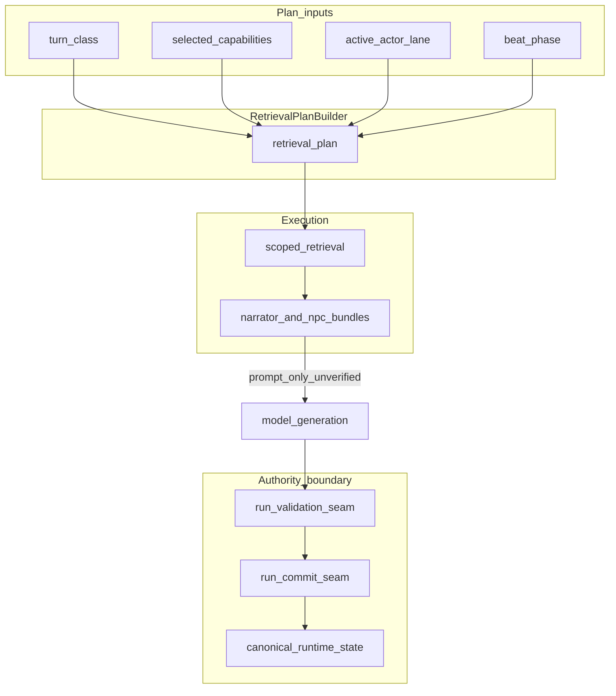

# ADR-0044: Runtime RAG Context Fabric — Routing and Authority Boundaries

## Status

Accepted

## Date

2026-05-16

## Intellectual property rights

Repository authorship and licensing: see project **LICENSE**; contact maintainers for clarification.

## Privacy and confidentiality

This ADR contains no personal data. Implementers must not log raw player text or secrets into retrieval corpora beyond existing governance; operator diagnostic bundles must remain access-controlled.

## Related ADRs

- [ADR-0001](adr-0001-runtime-authority-in-world-engine.md) — world-engine owns authoritative session truth.
- [ADR-0004](adr-0004-runtime-model-output-proposal-only-until-validator-approval.md) — model output is proposal until validation.
- [ADR-0033](adr-0033-live-runtime-commit-semantics.md) — commit semantics.
- [ADR-0039](adr-0039-gate-tests-no-hardcoded-oracle-bypass.md) — gate tests and runtime surface governance.
- [ADR-0040](adr-0040-quality-lab-mcp-runtime-diagnostics.md) — diagnostics must not promote matrix status alone.
- [ADR-0041](adr-0041-semantic-capability-selection-and-runtime-capability-budgeting.md) — capability selection, validator routing, readiness co-authority (flag-gated); seam remains canonical for `validation_outcome` and commit.
- [ADR-0045](adr-0045-runtime-memory-indexes-and-retrieval-write-contracts.md) — memory indexes and write contracts for retrieval-aligned stores.

## Context

Retrieval-augmented generation (RAG) is wired into runtime turns via `RetrievalDomain.RUNTIME`, context packs, and LangGraph `retrieve_context` / synthesis paths. Without explicit **routing**, **audience scoping**, and **authority metadata**, teams risk:

1. Treating ranked chunks or compact `context_text` as **engine truth** (false-green readiness or narrative state).
2. **Global retrieval** every turn (cost, noise, draft leakage despite governance gates).
3. **ADR-0041** surfaces (selector, validator plan, bridge, readiness aggregation) accidentally consuming **unverified** retrieved prose as if it were seam evidence.
4. **Frontend** inferring readiness or canon from diagnostic or retrieved strings.

The codebase already separates **authored canon**, **committed runtime state**, and **retrieved hints** at a high level (`docs/technical/ai/RAG.md`, `run_validation_seam` / `run_commit_seam` in `ai_stack/langgraph/langgraph_runtime_executor.py`). This ADR **normatively** completes that separation for **product-scale** Narrator, NPC/multi-agent, and ADR-0041 synergy.

## Decision

1. **RAG role:** RAG is a **runtime context fabric** — bounded, provenance-labeled **prompt and diagnostic support**. It **must not** become canonical narrative state, `validation_outcome`, commit payloads, or player-session **readiness** unless the same fact is already committed or carried in **canonical runtime structures** (world-engine session, commit records, structured ledger fields), not merely because a chunk matched a query.

2. **Retrieval routing:** Runtime retrieval **must** be driven by a deterministic **retrieval plan** derived from:
   - turn class / situation class,
   - selected semantic capabilities (from ADR-0041 selector output when present),
   - active actor / actor lane,
   - beat phase (or equivalent bounded phase signal),
   - authority scope (`runtime_generation` vs `operator_diagnostic` vs `writers_room` / `improvement`).

   Default behavior **must not** be “retrieve on raw player text + scene id only” without a plan; the plan defines **budgets**, **allowed index lanes**, and **exclusions** (e.g. no NPC-private lane for Narrator unless policy explicitly allows a bounded dramatic-irony surface).

3. **Authority metadata on packs:** Every context pack or bundle exposed to runtime consumers **must** carry machine-readable fields including at minimum: `authority_level` (e.g. `canonical_snapshot` | `content_module` | `retrieved_unverified` | `operator_diagnostic_only`), `retrieval_policy_version`, `corpus_fingerprint` / index identity where applicable, and per-hit or per-section provenance (`source_path`, evidence lane, visibility class). **Authority-critical code paths** must reject or downgrade packs that lack required provenance when the consumer is not a model prompt.

4. **ADR-0041 consumption:** ADR-0041 components (`capability_selector`, validator plan, `validation_authority_bridge`, readiness preview/enforcement/aggregation) **may** use retrieval-derived material **only** as **observation** for diagnostics, drift narration, or human review — **never** as the sole proof that a seam concern passed. `run_validation_seam` remains canonical for `validation_outcome`; commit gates unchanged unless explicitly superseded by a future ADR.

5. **Readiness and frontend:** `runtime_session_ready` / `can_execute` and any player-visible “can play” semantics **must** come from backend canonical readiness resolution (including flag-gated ADR-0041 **veto-only** overlay per ADR-0041). The frontend **must not** infer readiness from RAG text, Langfuse labels, or MCP narrative.

6. **Fail-closed:** If a retrieval plan requires canonical context that is missing or stale, runtime generation **must** degrade to deterministic safe surfaces (existing validation feedback / bounded synthesis contracts) rather than inventing facts from retrieval.

## Consequences

**Positive:**

- Clear promotion path for capability-routed retrieval without authority drift.
- Safer multi-agent and Narrator prompts (lane and disclosure aligned with policy).
- ADR-0041 and RAG evolve together without conflating observation with seam truth.

**Negative / risks:**

- More contract surface area (plans, bundles, tests) to maintain.
- Misconfigured plans could starve prompts; requires monitoring and budgets.

**Follow-ups:**

- Implement retrieval plan builder and wire into `RuntimeTurnGraphExecutor` retrieval node ([ADR-0045](adr-0045-runtime-memory-indexes-and-retrieval-write-contracts.md) for indexes).
- Add CI gates: RAG scope by turn class; no readiness from RAG; ADR-0041 rejects unverified retrieval as authority input.

## Diagrams

## Testing

- Contract tests: retrieval plan inputs include turn class and capability set when ADR-0041 projection is present; plan restricts `max_chunks` and index lanes per profile.
- Authority tests: no code path sets `validation_outcome` or commit payload from raw `context_text` alone.
- Readiness tests: frontend bundle fields unchanged when RAG disabled vs enabled (readiness may only tighten with ADR-0041 veto rules, never from chunk text).
- Comply with [ADR-0039](adr-0039-gate-tests-no-hardcoded-oracle-bypass.md): assert on schema, enums, and policy constants — not generated prose.

## References

- [docs/technical/ai/RAG.md](../technical/ai/RAG.md)
- [docs/technical/ai/rag_runtime_integration.md](../technical/ai/rag_runtime_integration.md)
- `ai_stack/langgraph/langgraph_runtime_executor.py` — validation/commit seams, retrieval.
- `ai_stack/capabilities/capability_selector.py`, `ai_stack/capabilities/capability_validator_registry.py` — selection and validator plans.
- `ai_stack/validation_authority_bridge.py`, `ai_stack/runtime_readiness_consumer.py` — ADR-0041 bridge and veto-only readiness overlay.
- `backend/app/api/v1/game_routes.py` — player session bundle readiness source.
