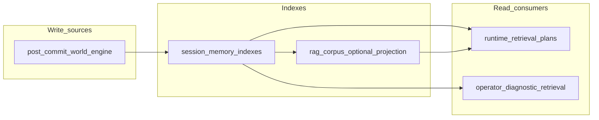

# ADR-0045: Runtime Memory Indexes and Retrieval Write Contracts

## Status

Accepted

## Date

2026-05-16

## Intellectual property rights

Repository authorship and licensing: see project **LICENSE**; contact maintainers for clarification.

## Privacy and confidentiality

Agent-private and relationship memory indexes may contain dramatic content derived from play. Persist only what policy allows; do not duplicate full prompts or secrets; align retention with session and operator data policies.

## Related ADRs

- [ADR-0044](adr-0044-runtime-rag-context-fabric-routing-and-authority-boundaries.md) — routing, authority metadata, ADR-0041 and frontend boundaries.
- [ADR-0033](adr-0033-live-runtime-commit-semantics.md) — commit semantics for what counts as committed truth.
- [ADR-0039](adr-0039-gate-tests-no-hardcoded-oracle-bypass.md) — test oracle discipline for new indexes.

## Context

Several runtime surfaces already persist **committed-truth-derived** structures (for example callback web and consequence cascade records, hierarchical memory aspects, relationship state in ledger and planner truth). The **corpus RAG** store (`.wos/rag/`) ingests repository paths and selected transcripts; that is a **different** write contract from **session-scoped memory indexes** optimized for per-turn retrieval.

Without explicit **write contracts**, a memory index could be populated from **pre-commit proposals** or model output, reintroducing RAG-as-truth and stale-state bugs.

## Decision

1. **Index classes:** Distinguish these categories (names are logical; physical storage may combine tables/files under versioned keys):

   - **Content module index** — authored canon and policy; source of truth is repository content; read-heavy; same governance as existing `ContentClass` / domain gates.
   - **Scene / session memory indexes** — bounded projections of **committed** turns: scene event summaries, beat history, relationship memory threads, agent-private memory (NPC-only), knowledge-boundary metadata (who may know what), callback and cascade **read models** where not already served by existing stores.

2. **Write rule (normative):** Memory indexes that feed **runtime** `RetrievalDomain.RUNTIME` **must** be written only from:

   - successful **commit** outcomes (or explicitly persisted post-commit snapshots from world-engine), or
   - **immutable** structured records already defined as committed feedback (e.g. existing callback web / consequence cascade rebuild rules).

   They **must not** be written from unvalidated model proposals, intermediate graph state, or retrieval hits.

3. **Read rule:** Retrieval consumers declare **audience** (`narrator`, `npc_self`, `npc_other`, `player_visible`, `operator_diagnostic`). Filters apply **before** prompt assembly. Default: Narrator lanes exclude agent-private memory; NPC lanes exclude other agents’ private memory unless a governed sharing contract exists.

4. **Freshness:** Each indexed document carries `source_turn_id` / `commit_sequence` / `corpus_or_snapshot_fingerprint` as applicable. Stale documents must not outrank or override canonical snapshot fields in structured prompt sections.

5. **Operator and governance indexes:** ADR text, Capability Matrix markdown, validator evidence exports, and Langfuse/MCP trace excerpts may form **operator_diagnostic** or **research** retrieval lanes only — same prohibition as ADR-0044 on using them as live readiness or commit truth.

6. **Coexistence with corpus RAG:** Session memory indexes are **not** a substitute for `run_validation_seam` or world-engine state. They may be **ingested** into a restricted content class (e.g. `RUNTIME_PROJECTION`) only when the ingestion pipeline tags them with correct provenance and domain policy allows.

## Consequences

**Positive:**

- Safe evolution toward richer Narrator/NPC context without authority pollution.
- Clear test surface: “write after commit” invariants.

**Negative / risks:**

- Dual maintenance: world-engine state vs index projections until unified tooling exists.
- Migration work for any existing transcripts or logs that should not enter runtime domain.

**Follow-ups:**

- Implement index modules and writers hooked from `StoryRuntimeManager` / commit path (see plan file in repo history; do not treat this ADR as the implementation checklist alone).
- Add compaction and retention policies per module.

## Diagrams

## Testing

- Invariant tests: no index row without `commit_sequence` or equivalent commit anchor when `authority_level` claims runtime use.
- Leak tests: `npc_self` lane never returns other NPC private fields; `player_visible` never returns withheld disclosure units.
- ADR-0039 compliant oracles for schema and policy constants.

## References

- [docs/technical/ai/rag_runtime_integration.md](../technical/ai/rag_runtime_integration.md)
- `world-engine/app/story_runtime/manager.py`, `world-engine/app/story_runtime/commit_models.py`
- `ai_stack/story_runtime/runtime_aspect_ledger.py`
- Existing contracts: `docs/technical/runtime/callback_web_contract.md`, `docs/technical/runtime/consequence_cascade_contract.md`
