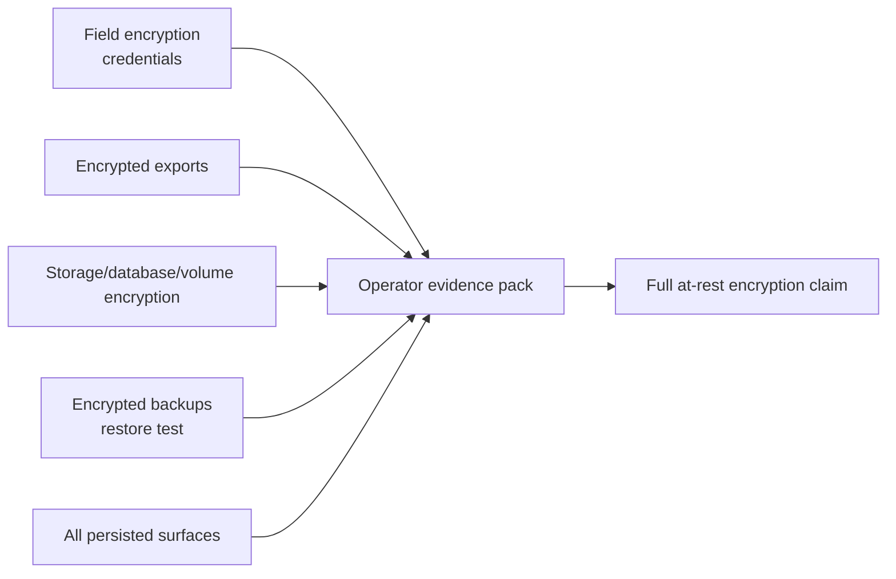

# ADR-0047: At-rest encryption evidence boundary

## Status

Not Finished

## Date

2026-05-17

## Intellectual property rights

Repository authorship and licensing: see project **LICENSE**; contact maintainers for clarification.

## Privacy and confidentiality

This ADR contains no personal data and no secret values. Implementers must not commit storage keys, KMS plaintext material, Redis passwords, database passwords, backup keys, Langfuse project secrets, or generated `.env` values. Deployment evidence may include key identifiers and provider settings, but not raw keys.

## Related ADRs

- [ADR-0028](adr-0028-mcp-security-baseline-phase-a.md) — MCP security baseline and operator/tooling boundaries.
- [ADR-0030](adr-0030-docker-up-complete-bootstrap.md) — local Docker bootstrap and generated local secrets.
- [ADR-0031](adr-0031-env-configuration-governance.md) — environment configuration governance.
- [ADR-0039](adr-0039-gate-tests-no-hardcoded-oracle-bypass.md) — evidence tests must not use hardcoded oracles.
- [ADR-0051](adr-0051-storage-layer-encryption-governance.md) — storage-layer evidence governance implementation.

## Context

The repository has durable local persistence:

- backend SQLite at `backend/instance/wos.db`, mounted by Compose as `./backend/instance:/app/instance`
- app Redis append-only persistence in `redis-data:/data`
- world-engine runtime persistence via JSON files or SQLAlchemy `payload_json`
- local Langfuse named volumes for Postgres, ClickHouse, MinIO, and Redis: `langfuse-postgres-data`, `langfuse-clickhouse-data`, `langfuse-clickhouse-logs`, `langfuse-minio-data`, and `langfuse-redis-data`
- backup/export procedures documented in operations and database guides

The codebase also has real but narrower data-protection controls:

- governed provider credentials are field-encrypted through envelope encryption using `SECRETS_KEK`, per-secret DEKs, and AES-256-GCM
- exported database payloads can be encrypted on request
- Langfuse application `ENCRYPTION_KEY` and service passwords are generated for local Compose

These controls are useful, but they do not prove full database, volume, runtime-store, object-store, or backup encryption at rest. A previous security statement that simply said "database encryption at rest is a deployment responsibility" was too vague for an operator trying to decide whether the platform can claim full at-rest encryption.

## Decision

1. The platform must not claim "full at-rest encryption" unless every persisted surface is covered by documented storage-layer, database-layer, application-layer, or backup-layer encryption evidence.

2. Field-level credential encryption and encrypted exports are valid controls, but they are not substitutes for encrypting the live database file, Docker volumes, runtime stores, object storage, Redis persistence, or backups.

3. The canonical evidence document is [docs/security/AT_REST_ENCRYPTION.md](../security/AT_REST_ENCRYPTION.md). It must list:

   - implemented controls
   - persisted surfaces not fully covered
   - verification commands for repository evidence
   - the completion plan and operator evidence pack

4. Production deployments must choose and document one supported encryption boundary per persisted surface:

   - managed encrypted services with KMS/server-side encryption evidence
   - self-hosted encrypted host/storage/volume layers with key custody evidence
   - app-managed encryption such as SQLCipher or AEAD-encrypted runtime files where a local single-node path remains supported

5. Backups and snapshots are part of the at-rest boundary. A production-ready claim requires encrypted backup output, separate key custody, and a restore-test record.

6. Local `docker-up.py` remains a developer bootstrap path. Production secret-store, KMS, and managed-service controls must integrate by providing the same runtime environment contract or a documented deployment override; they must not make local Compose dependent on cloud login or production secret-store access.

7. The `/backend/security-features` read-only view must expose the same boundary: partial controls are visible, missing full at-rest evidence is explicit, and the evidence document is linked by path.

8. Storage-layer evidence governance is implemented through `security_governance.v1`; see ADR-0051 for the admin API, diagnosis check, and evidence-field contract.

## Consequences

**Positive:**

- Operators get an honest security posture instead of a vague or over-broad encryption claim.
- The repo now distinguishes credential/export encryption from full live-data encryption.
- Production readiness has concrete evidence artifacts to collect.
- Local development remains ergonomic.

**Negative / risks:**

- Full at-rest encryption remains incomplete until deployment/storage choices are implemented and evidenced.
- Operators must maintain an evidence pack outside the repository for host, KMS, managed database, object storage, and backup settings.
- SQLite and JSON persistence require either local/dev-only scoping, storage-layer evidence, or app-managed encryption before production use.

**Follow-ups:**

- Decide whether SQLite is permanently local/dev-only or gains a SQLCipher-backed production path.
- Move production runtime persistence away from plain JSON, or add authenticated file encryption and key rotation.
- Add backup jobs or runbooks that produce encrypted backup artifacts and record restore tests.
- Upgrade export encryption to an authenticated payload format.

## Diagrams

## Testing

- `tests/test_at_rest_encryption_documentation.py` verifies the evidence document states the current boundary, references the code evidence, and is linked from operator/security documentation.
- `backend/tests/test_backend_info_routes.py::test_security_features_page_explains_local_evidence_boundary` verifies `/backend/security-features` renders the at-rest boundary and relevant persisted surfaces.
- Future implementation tests must be ADR-0039 compliant and prove configuration/state, not just string presence. Examples:
  - production Redis/storage validation reports `rediss://`, ACL users, TLS, and separate instances
  - backup smoke tests produce encrypted artifacts and perform a restore
  - SQLCipher or AEAD runtime-store tests prove plaintext is not written to the configured data file

Review this ADR if a persisted surface is added, a local-only store becomes production-supported, or an operator-facing page claims full at-rest encryption without a matching evidence pack.

## References

- [docs/security/AT_REST_ENCRYPTION.md](../security/AT_REST_ENCRYPTION.md)
- [ADR-0051: Storage-layer encryption governance](adr-0051-storage-layer-encryption-governance.md)
- [docs/admin/security-and-compliance-overview.md](../admin/security-and-compliance-overview.md)
- [docs/database/README.md](../database/README.md)
- [backend/docs/ENCRYPTION.md](../../backend/docs/ENCRYPTION.md)
- `backend/app/services/governance_secret_crypto_service.py`
- `backend/app/services/encryption_service.py`
- `docker-compose.yml`
- `docker-compose.langfuse.yml`
- `world-engine/app/runtime/store.py`
