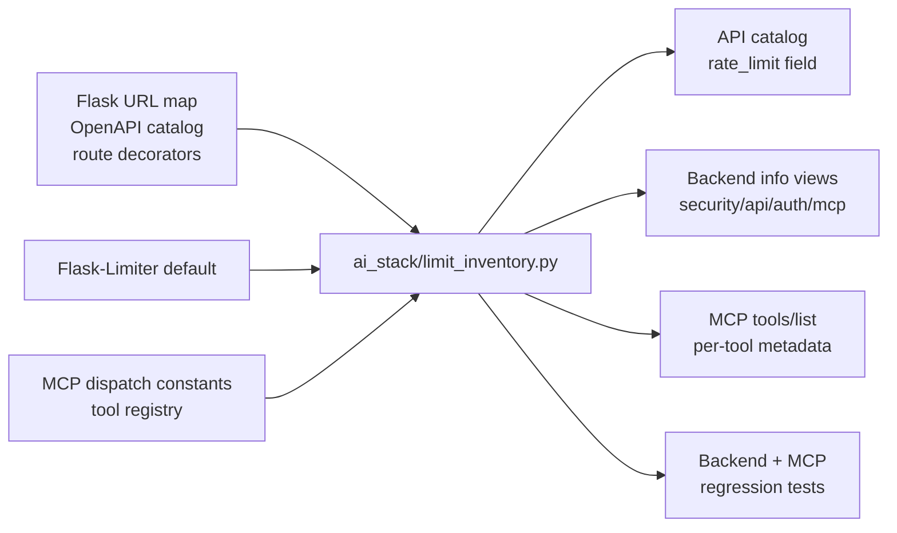

# ADR-0048: Central route and MCP rate-limit inventory

## Status

Accepted

## Date

2026-05-17

## Intellectual property rights

Repository authorship and licensing: see project **LICENSE**; contact maintainers for clarification.

## Privacy and confidentiality

This ADR contains no personal data and no secret values. Implementers must not document live tokens, user identifiers, IP addresses, API keys, or production limiter key material when extending the inventory or collecting deployment evidence.

## Related ADRs

- [ADR-0028](adr-0028-mcp-security-baseline-phase-a.md) - MCP security baseline and conservative local tool limits.
- [ADR-0039](adr-0039-gate-tests-no-hardcoded-oracle-bypass.md) - inventory tests must not rely on hardcoded primary oracles.

## Context

The backend API, authentication routes, and MCP server already have rate-limit controls, but the evidence lived in different places:

- Flask route decorators and Flask-Limiter defaults for HTTP/API routes.
- `admin_security` policy wrappers for admin-sensitive routes.
- MCP dispatch constants and the MCP `RateLimiter`.
- Human-facing info pages and API reference prose.

That split made it easy for operator-facing views or tests to drift from runtime behavior. The MCP security ADR already described conservative local limits, while API/Auth pages needed a route-level inventory that could show which routes use explicit decorators, which fall back to defaults, and how MCP tool metadata maps back to the dispatch limiter.

## Decision

1. `ai_stack/limit_inventory.py` is the central helper for route and MCP rate-limit metadata.

2. HTTP/API inventory entries must be derived from runtime route evidence where possible: Flask URL map, OpenAPI/catalog metadata, handler decorators, `admin_security` rate-limit wrappers, and the configured default limiter value.

3. The API catalog must expose a structured `rate_limit` object per endpoint. The API Explorer and backend info pages must read that structured field instead of maintaining independent prose-only tables.

4. MCP dispatch limits must use the same constants exported by `ai_stack/limit_inventory.py`. MCP `tools/list` metadata must mirror that inventory for every registered tool.

5. The following operator-facing surfaces must include the inventory or link directly to it:

   - `/backend/security-features`
   - `/backend/api`
   - `/backend/auth`
   - `/backend/mcp`
   - `/backend/api-explorer`

6. Tests must verify structured inventory fields and rendered info surfaces. A prose-only mention of rate limiting is not sufficient evidence.

7. The inventory is an evidence and drift-prevention layer. Enforcement remains owned by Flask-Limiter route/default configuration for HTTP and by the MCP `RateLimiter` for JSON-RPC dispatch.

8. Production limit changes must not be justified from inventory coverage alone. Tuning requires live or staging telemetry for request volume, 429/MCP blocked calls, quota utilization, retry/backoff behavior, and edge/gateway throttling.

9. Rate-limit telemetry must be privacy-preserving: hashed limiter keys only, no raw bearer tokens, cookies, IP addresses, email addresses, request bodies, prompts, reset tokens, or provider credentials.

## Consequences

**Positive:**

- Operators can inspect API/Auth/MCP rate-limit coverage from one consistent model.
- Info pages and API Explorer no longer need to duplicate limit tables by hand.
- MCP rate-limit documentation, runtime constants, `tools/list`, and tests now share the same source.
- Regression tests can detect missing route metadata or MCP constant drift.

**Negative / risks:**

- Decorator extraction depends on known wrapper patterns. New non-standard wrappers must be added to the inventory helper and tests.
- The inventory proves local code/configuration evidence, not production-edge WAF/CDN throttling or traffic telemetry.
- Default route limits are visible as fallback policy, but they are less specific than explicit route decorators.
- Production telemetry adds another operational surface that must be kept separate from local/dev diagnostic evidence.

**Follow-ups:**

- Instrument production/staging telemetry for `rate_limit_requests_total`, `rate_limit_hits_total`, quota utilization, retry-after behavior, and edge throttle events.
- Add optional production telemetry summaries once limiter metrics are available.
- Consider extending the inventory shape with auth role, CSRF, and service-token policy fields if the info surfaces need a broader security matrix.
- Review this ADR when a new MCP transport, API gateway, or external rate-limit layer becomes canonical.

## Diagrams

## Testing

Current verification:

- `PYTHONPATH=backend python -m pytest backend/tests/test_backend_info_routes.py -q --tb=short --no-cov`
- `PYTHONPATH=backend python -m pytest backend/tests/test_backend_info_routes.py tools/mcp_server/tests/test_rate_limit.py tools/mcp_server/tests/test_registry.py -q --tb=short --no-cov`
- `python -m pytest tools/mcp_server/tests/test_mcp_operational_parity_and_registry.py -q --tb=short --no-cov`

Review this ADR if:

- any API catalog endpoint loses its structured `rate_limit` field
- MCP dispatch constants no longer match `tools/list` metadata
- an info page hardcodes a limit that does not come from the inventory
- a route wrapper adds enforcement that the inventory cannot see
- production docs claim tuned limits without telemetry baseline, shadow run, canary result, and rollback threshold

## References

- [docs/security/rate-limit-inventory.md](../security/rate-limit-inventory.md)
- [docs/security/README.md](../security/README.md)
- [ADR-0028](adr-0028-mcp-security-baseline-phase-a.md)
- `ai_stack/limit_inventory.py`
- `backend/app/info/api_catalog.py`
- `backend/app/info/routes.py`
- `backend/app/info/templates/security_features.html`
- `tools/mcp_server/server.py`
- `tools/mcp_server/tools_registry.py`
