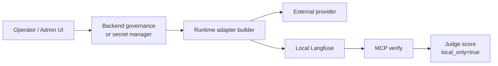

# ADR-0049: Provider credential governance and local evaluator evidence

## Status

Accepted

## Date

2026-05-17

## Intellectual property rights

Repository authorship and licensing: see project **LICENSE**; contact maintainers for clarification.

## Privacy and confidentiality

This ADR contains no personal data and no secret values. Implementers must not commit provider API keys, Langfuse secret keys, Hugging Face tokens, KMS material, generated `.env` values, or screenshots that reveal credentials. Evidence may name secret stores, provider ids, config ids, and key fingerprints, but not raw secrets.

## Related ADRs

- [ADR-0028](adr-0028-mcp-security-baseline-phase-a.md) - MCP security baseline and operator/tooling boundaries.
- [ADR-0030](adr-0030-docker-up-complete-bootstrap.md) - local Docker bootstrap.
- [ADR-0031](adr-0031-env-configuration-governance.md) - environment configuration governance.
- [ADR-0039](adr-0039-gate-tests-no-hardcoded-oracle-bypass.md) - evidence tests must not use hardcoded oracles.
- [ADR-0040](adr-0040-quality-lab-mcp-runtime-diagnostics.md) - Quality Lab MCP diagnostics and judge-guided improvement.
- [ADR-0041](adr-0041-semantic-capability-selection-and-runtime-capability-budgeting.md) - controlled runtime capability authority.
- [ADR-0047](adr-0047-at-rest-encryption-evidence-boundary.md) - at-rest encryption evidence boundary.

## Context

Local evaluators and judge workflows can run against local Langfuse. That is useful for development diagnostics, but it created two security and governance risks:

1. Provider API keys could be accidentally treated as ordinary Compose configuration because backend and play-service both use `env_file: .env`.
2. Local judge scores could be mistaken for staging or production evidence if they were not visibly marked as local-only diagnostic evidence.

The runtime already has backend-governed provider configuration and encrypted credential storage. Provider access should therefore flow through that governance path, or through a production secret manager that materializes the same governed runtime contract. Direct provider credentials in Compose should not be the default runtime authority.

The same boundary applies to evaluator evidence: local Langfuse traces, MCP evidence reads, and local judge scores may explain diagnostics, but they must not mutate commit state, readiness truth, `validation_outcome`, or promotion status.

## Decision

1. Direct provider credentials are not a Compose-owned runtime control. Compose may carry non-secret provider base URLs and service wiring, but direct provider key slots for backend and play-service must be empty in the local Compose path.

2. `docker-up.py` may generate and preserve platform bootstrap secrets, but it must not generate, request, or persist provider API keys such as `OPENAI_API_KEY`, `OPENROUTER_API_KEY`, `ANTHROPIC_API_KEY`, or `HF_TOKEN`.

3. Provider credentials are governed runtime credentials. The accepted local and production access paths are:

   - backend AI Runtime Governance with encrypted provider credentials
   - a deployment secret manager that feeds the same governed runtime contract
   - mock/local providers that do not need external credentials

4. Runtime adapters must not silently fall back to direct environment API keys. OpenAI-compatible adapters may use explicit runtime credentials, and any environment-key fallback must be an explicit opt-in for narrowly scoped tooling, not the default application path.

5. Backend and writer/improvement workflows must build provider adapters from enabled provider configuration plus runtime credential lookup. If a provider is configured but no runtime credential is available, that adapter is unavailable; routing must filter to available adapters instead of leaking to an env-backed provider path.

6. Operator readiness must report provider credential source as `backend_governance_or_secret_manager`. Live provider readiness must be derived from governed provider credentials, not from direct `OPENAI_API_KEY` presence.

7. Local Langfuse traces and judge scores must be visibly marked with local-only evidence metadata:

   - `evidence_scope=local_langfuse`
   - `proof_level=local_only`
   - `local_only: true`
   - `live_or_staging_evidence=false`

8. MCP verification tools must surface `local_only` for judge scores and may infer it from trace metadata, score metadata, `proof_level=local_only`, or `evidence_scope=local_langfuse`.

9. `/backend/security-features` and operator documentation must explain the boundary: local evaluator evidence is diagnostic; provider access is governed; direct provider keys in Compose are not the accepted control plane.

## Consequences

**Positive:**

- Provider API keys are less likely to leak through local Compose or `.env` inheritance.
- Backend governance becomes the single application-level source for external provider access.
- Local judge scores remain useful while being clearly excluded from production and staging evidence.
- Readiness and documentation align with the real security boundary.

**Negative / risks:**

- Developers cannot make OpenAI/OpenRouter work by only adding direct provider keys to `.env` in the Compose path; they must use the governed configuration path or an explicit secret-manager integration.
- Operators need a documented production secret-store integration before claiming provider credential governance is complete in their deployment.
- Some historical docs may still describe provider keys as Layer 2 `.env` credentials; they must be read as superseded by this ADR for backend/play-service runtime access.

**Follow-ups:**

- Add an operator UI/workflow for every supported provider credential type if one is not already covered.
- Version judge prompts, score names, provider ids, and evidence scopes in a central evaluator registry.
- Record production secret-store evidence without exposing raw key material.

## Diagrams

## Testing

- `tests/test_local_langfuse_docker_config.py` verifies that local Compose does not inject direct provider key values and carries empty overrides for provider key slots.
- `backend/tests/test_backend_info_routes.py::test_security_features_page_explains_local_evidence_boundary` verifies `/backend/security-features` exposes provider governance, local-only evidence metadata, and documentation links.
- `tools/mcp_server/tests/test_langfuse_verify_tools.py::test_judge_scores_inherit_local_only_trace_metadata` verifies judge scores inherit or expose `local_only`.
- `world-engine/tests/test_api_security.py::test_api_requires_play_service_ticket_for_access` covers the readiness surface that reports governed provider credential source.
- `tests/test_provider_credential_governance_documentation.py` verifies the ADR, security documentation, and operator links remain connected.

Review this ADR if a service reintroduces direct provider-key environment fallback, a new provider bypasses backend governance, local judge evidence changes promotion/readiness state, or production docs claim provider-governance compliance without a secret-store or backend-governance evidence path.

## References

- [docs/security/PROVIDER_CREDENTIAL_GOVERNANCE.md](../security/PROVIDER_CREDENTIAL_GOVERNANCE.md)
- [docs/security/AT_REST_ENCRYPTION.md](../security/AT_REST_ENCRYPTION.md)
- `docker-compose.yml`
- `.env.example`
- `docker-up.py`
- `backend/app/services/governance/governed_provider_adapter_service.py`
- `backend/app/services/governance/governance_runtime_service.py`
- `story_runtime_core/adapters.py`
- `story_runtime_core/langfuse_tracing_environment.py`
- `tools/mcp_server/handlers/tools_registry_handlers_langfuse_verify.py`
- `world-engine/app/api/http.py`
