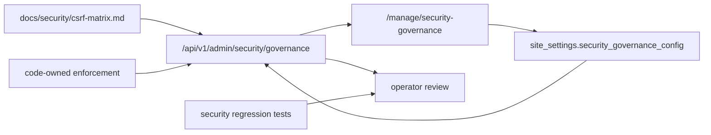

# ADR-0050: Security governance for browser mutation boundaries

## Status

Accepted

## Date

2026-05-17

## Intellectual property rights

Repository authorship and licensing: see project **LICENSE**; contact maintainers for clarification.

## Privacy and confidentiality

This ADR contains no personal data and no secret values. Operators may record short audit notes through the security governance settings, but those notes must not contain passwords, bearer tokens, cookie values, KMS material, Redis passwords, Vault paths that reveal secrets, or user personal data.

## Related ADRs

- [ADR-0002](adr-0002-backend-session-surface-quarantine.md) - backend session and transitional runtime quarantine.
- [ADR-0028](adr-0028-mcp-security-baseline-phase-a.md) - security baseline and operator/tooling boundaries.
- [ADR-0030](adr-0030-docker-up-complete-bootstrap.md) - local Docker bootstrap and production Redis validation commands.
- [ADR-0031](adr-0031-env-configuration-governance.md) - environment contract and production secret-store boundary.
- [ADR-0039](adr-0039-gate-tests-no-hardcoded-oracle-bypass.md) - security evidence tests must assert behavior, not only strings.
- [ADR-0047](adr-0047-at-rest-encryption-evidence-boundary.md) - storage and backup evidence boundary.

## Context

The platform has more than one browser-facing security surface:

- backend compatibility web routes can receive a backend Flask `session` cookie and rely on Flask-WTF CSRF when `WTF_CSRF_ENABLED=True`
- backend JSON APIs under `/api/v1/*` are designed for `Authorization: Bearer ...` and are intentionally exempt from Flask-WTF CSRF
- the player frontend and administration tool use same-origin browser sessions to look up server-side tokens, then call backend APIs through controlled proxy/client code
- administration-tool and frontend session cookies use SameSite policy; JSON API mutations use Bearer tokens; same-origin proxies must not forward inbound browser cookies upstream
- the mutating cookie flows are documented in `docs/security/csrf-matrix.md` and pinned by backend, frontend, frontend API-client, and administration proxy regression tests
- production secrets require a dedicated store with rotation, audit, and access separation, while local `.env` remains the correct bootstrap path for `docker-up.py`
- production readiness also depends on operator-controlled policy for secret stores, Redis hardening, and regression evidence

A single "CSRF on/off" statement is too blunt for this topology. Operators need to see the matrix of mutating cookie-relevant flows, record the desired policy, and compare that policy with effective runtime values. At the same time, the administration UI must not become a switch that silently changes code-owned security boundaries such as the `/api/v1` CSRF exemption or proxy cookie stripping.

## Decision

1. The canonical CSRF contract is [docs/security/csrf-matrix.md](../security/csrf-matrix.md). It names every mutating browser/cookie-relevant flow family, its credential model, expected CSRF stance, and regression coverage.

   The accepted flow families are:

   - backend legacy web routes: backend `session` cookie, Flask-WTF CSRF when enabled
   - backend JSON API `/api/v1/*`: `Authorization: Bearer`, CSRF-exempt by design
   - frontend player forms: frontend `session` cookie with SameSite policy; backend calls use Bearer
   - frontend same-origin API proxy: frontend cookie only unlocks server-side token lookup; upstream calls omit inbound cookies
   - administration-tool proxy: admin cookie stays at the admin origin; upstream calls forward approved headers and strip `Cookie` / `Set-Cookie`

2. The backend exposes an admin-only security governance API:

   - `GET /api/v1/admin/security/governance`
   - `PATCH /api/v1/admin/security/governance`

   The endpoint requires an admin JWT and the `manage.ai_runtime_governance` feature.

3. Operator policy is persisted in `site_settings.security_governance_config` with schema `security_governance.v1`. It records review state, target `SameSite`, CSRF/Bearer/proxy regression requirements, secret-store policy, local Docker-Up preservation, and Redis hardening policy.

   Secret-store policy is metadata only. The governance record must not contain raw secret values, provider tokens, KMS plaintext material, Redis passwords, or Vault paths that reveal secrets.

4. The administration tool exposes `/manage/security-governance` as the operator truth surface. It must show:

   - target and effective cookie posture
   - editable operator policy for review state, target `SameSite`, CSRF/Bearer/proxy requirements, regression requirements, secret-store mode/provider/rotation/audit/access separation, and local Docker-Up preservation
   - the CSRF matrix returned by the backend
   - non-editable enforcement boundaries
   - full JSON evidence for audit and automation review, including Redis governance posture

5. The governance settings are policy and evidence, not hidden runtime toggles. These boundaries remain code/deployment-owned:

   - the `/api/v1` CSRF exemption in backend app setup
   - backend route authentication and role checks
   - frontend and admin proxy cookie stripping
   - actual Flask cookie configuration loaded at process start
   - secret materialization through deployment secret stores or `docker-up.py`
   - Redis ACL/TLS/certificate files generated on the host

6. Release readiness requires the policy, documentation, UI, and tests to move together. A change to a mutating cookie flow, JSON API auth expectation, same-origin proxy behavior, production secret-store boundary, or Redis hardening requirement must update the security governance documentation and relevant regression tests in the same change set.

7. The read-only backend info surface `/backend/security-features` must mirror the current CSRF/browser-mutation boundary: SameSite cookies for admin/frontend sessions, Bearer-token JSON APIs, same-origin proxy cookie stripping, links to `docs/security/csrf-matrix.md`, and concrete backend/frontend/proxy test evidence.

## Consequences

**Positive:**

- Operators get one visible administration page for CSRF/cookie/security-governance posture.
- Security posture is explicit about which settings are editable policy and which values are enforced by code or deployment.
- The CSRF matrix becomes test-backed release evidence instead of a prose-only security note.
- `/backend/security-features` exposes the same matrix as a read-only backend evidence surface.
- Local `docker-up.py` remains the developer bootstrap path while production secret-store and Redis hardening are visible governance requirements.

**Negative / risks:**

- The admin page can create a false sense of enforcement if operators treat target policy as proof. The UI and docs must keep "effective posture" and "non-editable boundaries" visible.
- Some production evidence still lives outside the repository, especially secret-store audit records, KMS/provider settings, and Redis host-level material.
- If future teams add browser cookie-authenticated JSON mutations, the current bearer-token API exemption becomes insufficient and this ADR must be reviewed.

**Follow-ups:**

- Keep Redis hardening controls aligned with `docker-up.py`, `docker-compose.redis-production.yml`, and managed-service production runbooks.
- Add machine-readable route inventory if the CSRF matrix grows beyond the current curated route families.
- Consider release-report export of the full `security_governance.v1` payload.

## Diagrams

## Testing

- `backend/tests/test_csrf_protection.py` verifies the backend split between CSRF-protected web routes and CSRF-exempt Bearer-token JSON APIs.
- `frontend/tests/test_csrf_matrix.py` and `frontend/tests/test_api_client.py` verify frontend cookie flags and Bearer-only backend calls.
- `administration-tool/tests/test_proxy_contract.py` verifies admin proxy cookie/header stripping.
- `backend/tests/test_security_governance_routes.py` verifies the admin API contract, persistence, validation, matrix rows, and non-editable boundaries.
- `administration-tool/tests/test_manage_security_governance.py` verifies the administration page, navigation, secret-store controls, and PATCH wiring.
- `backend/tests/test_backend_info_routes.py::test_security_features_page_explains_csrf_matrix_regression_gate` verifies `/backend/security-features` renders the current CSRF/browser-mutation boundary and regression evidence.
- `tests/test_security_governance_documentation.py` verifies this ADR, the admin documentation, and the main documentation indexes stay linked.

Review this ADR if `/api/v1` begins accepting browser cookie authentication, if same-origin proxies forward cookies upstream, if admin governance settings become direct runtime enforcement switches, or if production security claims move from policy targets to automated evidence gates.

## References

- [docs/admin/security-governance.md](../admin/security-governance.md)
- [docs/security/csrf-matrix.md](../security/csrf-matrix.md)
- [docs/admin/security-and-compliance-overview.md](../admin/security-and-compliance-overview.md)
- `backend/app/services/governance/security_governance_service.py`
- `backend/app/api/v1/security_governance_routes.py`
- `administration-tool/templates/manage/security_governance.html`
- `administration-tool/static/manage_security_governance.js`
- `administration-tool/route_registration_proxy.py`
- `backend/app/factory_app.py`
