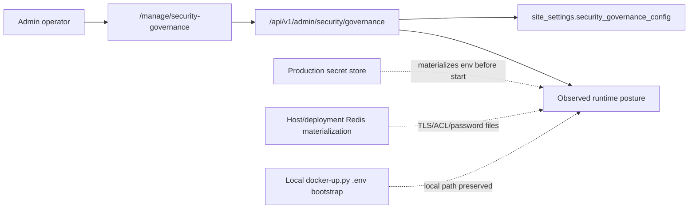

# ADR-0052: Security Governance Admin Control Plane

## Status

Accepted

## Implementation Status

Implemented and tested.

- `/manage/security-governance` is the Administration Tool surface.
- `GET/PATCH /api/v1/admin/security/governance` is the backend governance contract.
- `site_settings.security_governance_config` persists the editable policy.
- The UI exposes review status, CSRF/cookie policy, secret-store policy, Docker-Up preservation, production Redis hardening gates, and storage-layer encryption evidence.
- Redis password/TLS/ACL materialization remains host/deployment-owned through `docker-up.py` or production infrastructure.
- Storage-layer encryption materialization remains host/deployment-owned; the admin page records the evidence pack.

## Date

2026-05-17

## Intellectual property rights

Repository authorship and licensing: see project **LICENSE**; contact maintainers for clarification.

## Privacy and confidentiality

This ADR contains no personal data and no secret values. Implementers must not store production secret material, KMS plaintext keys, Redis passwords, database passwords, JWT secrets, play-service shared secrets, or generated `.env` values in the administration tool governance record. Operator notes must not contain bearer tokens, cookie values, Vault paths that reveal secrets, or user personal data.

## Related ADRs

- [ADR-0028](adr-0028-mcp-security-baseline-phase-a.md) - security baseline and operator/tooling boundaries.
- [ADR-0030](adr-0030-docker-up-complete-bootstrap.md) - `docker-up.py` as complete local bootstrap and production Redis setup entry point.
- [ADR-0031](adr-0031-env-configuration-governance.md) - environment configuration governance and production secret-store boundary.
- [ADR-0039](adr-0039-gate-tests-no-hardcoded-oracle-bypass.md) - governance tests must not use hardcoded primary oracles.
- [ADR-0047](adr-0047-at-rest-encryption-evidence-boundary.md) - at-rest evidence and local-vs-production security boundary.
- [ADR-0050](adr-0050-security-governance-browser-mutation-boundaries.md) - CSRF/browser mutation matrix and code-owned enforcement boundaries.
- [ADR-0051](adr-0051-storage-layer-encryption-governance.md) - storage-layer encryption evidence governance.

## Context

Security posture was split across code, environment variables, docs, tests, and Compose helpers:

- CSRF behavior is partly code-owned: backend web routes use Flask-WTF CSRF when enabled, while `/api/v1` JSON APIs are Bearer-token APIs and are CSRF-exempt by design.
- The administration tool proxies backend API calls but must not forward browser cookies upstream.
- Local `.env` files are practical and correct for local development and `docker-up.py`.
- Production deployments need a dedicated secret-store boundary with rotation, audit trails, and access separation.
- Production Redis posture requires passworded TLS connections, named ACL users, instance separation, no host-published ports, and validation.
- Full at-rest encryption claims require storage-layer evidence for databases, Redis persistence, runtime stores, object storage, Docker volumes, and backups.

Operators need one visible place to inspect and record these policies. At the same time, the administration UI must not become a browser-executed secret manager or a switch that rewires code-owned security controls.

## Decision

1. The Administration Tool exposes a Security Governance page at `/manage/security-governance`.

2. The backend exposes the governance contract at `GET/PATCH /api/v1/admin/security/governance`. The route requires JWT auth and the `manage.ai_runtime_governance` feature permission.

3. Operator policy is persisted as JSON in `site_settings.security_governance_config` with schema `security_governance.v1`.

4. The governance record stores policy and review state, including:

   - review status and target session `SameSite` posture
   - CSRF, Bearer-token API, proxy cookie-stripping, and regression-test policy
   - production secret-store requirement, provider/mode, rotation interval, audit requirement, and access-separation requirement
   - the invariant that local `docker-up.py` `.env` bootstrap stays available
   - production Redis hardening gates for TLS, named ACL users, instance separation, no host-published ports, and validation
   - storage-layer encryption profile, surface evidence, key-custody evidence, backup evidence, and restore-test evidence
   - short operator notes for audit context

5. The governance record is policy and evidence, not executable secret management or storage materialization. It must not store raw secrets, trigger provider-side rotation, encrypt host disks, or materialize Redis certificates/passwords from the browser.

6. Production secret-store integration remains deployment-owned. The provider or orchestrator must materialize the existing runtime environment contract before services start.

7. Local `docker-up.py` remains independent from production secret stores. Local Compose must not require Vault, KMS, cloud login, or production secret-store access.

8. Runtime/code-owned boundaries are returned as observed posture and non-editable boundaries, not as admin-toggleable behavior. This includes `/api/v1` CSRF exemption, proxy cookie stripping, Bearer-token API auth, local Docker bootstrap, and host-side Redis secret/TLS materialization.

## Consequences

**Positive:**

- Operators get a visible administration control plane for security governance without mixing policy metadata with secret material.
- Production secret-store requirements become explicit and configurable while local `.env` workflows remain usable.
- CSRF, cookie, proxy, secret-store, Redis, and storage-layer evidence policies are testable through one backend contract.
- The page can show drift warnings when desired policy differs from observed runtime posture.

**Negative / risks:**

- The admin page is not a substitute for implementing a real production secret store, storage-layer encryption, KMS policy, or cloud/IaC access model.
- Provider-side rotation, audit evidence, and access separation still require deployment evidence outside the repository.
- Operators may misunderstand the page as enforcement unless docs and UI continue to label code-owned boundaries clearly.

**Follow-ups:**

- Add deployment-specific secret-store evidence packs once the production provider is selected.
- Expand release checks if a new security setting becomes executable behavior rather than governance metadata.
- Keep `/backend/security-features`, ADR-0050, this ADR, and the admin Security Governance page aligned when security claims change.

## Diagrams

## Testing

- `backend/tests/test_security_governance_routes.py` verifies the backend governance contract, persisted settings, validation, secret-store policy fields, Redis hardening fields, storage-layer evidence fields, and non-editable boundaries.
- `administration-tool/tests/test_manage_security_governance.py` verifies the management route, navigation entry, secret-store controls, Redis controls, storage-layer controls, and backend endpoint usage.
- `tests/test_security_governance_documentation.py` verifies this ADR, ADR-0050, the admin documentation, the CSRF matrix, and primary documentation indexes stay linked.
- Future tests must comply with [ADR-0039](adr-0039-gate-tests-no-hardcoded-oracle-bypass.md). They should prove state transitions, persisted policy, observed runtime posture, or generated deployment assets rather than only matching strings.

Review this ADR if the admin page begins storing raw secrets, triggering secret-provider mutations, changing Flask/route security behavior directly, or making local `docker-up.py` depend on production secret-store access.

## References

- [docs/admin/security-governance.md](../admin/security-governance.md)
- [ADR-0050: Security governance for browser mutation boundaries](adr-0050-security-governance-browser-mutation-boundaries.md)
- [ADR-0051: Storage-layer encryption governance](adr-0051-storage-layer-encryption-governance.md)
- [docs/admin/security-and-compliance-overview.md](../admin/security-and-compliance-overview.md)
- [docs/security/csrf-matrix.md](../security/csrf-matrix.md)
- [docs/security/AT_REST_ENCRYPTION.md](../security/AT_REST_ENCRYPTION.md)
- `administration-tool/templates/manage/security_governance.html`
- `administration-tool/static/manage_security_governance.js`
- `backend/app/api/v1/security_governance_routes.py`
- `backend/app/services/governance/security_governance_service.py`
- `docker-up.py`
