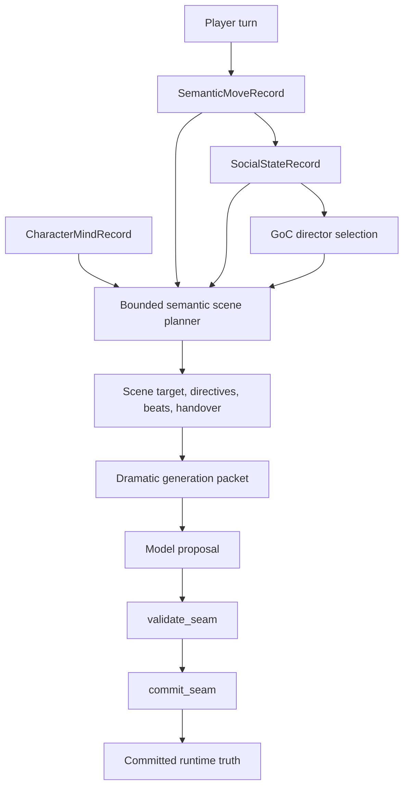

# ADR-0053: Bounded Semantic Scene Planner

## Status

Accepted

## Implementation Status

Implemented and tested for the God of Carnage runtime path.

- `ai_stack/semantic_scene_planner.py` builds bounded short-horizon scene-plan enrichment.
- `ScenePlanRecord` now carries `narrative_scene_function`, `scene_target`, `target_obligations`, `actor_directives`, `dramatic_beats`, `handover_policy`, `continuity_obligation`, `expected_transition_pattern`, and `semantic_scene_planner_version`.
- `pressure_target` remains as a compatibility alias for pressure-specific target data; the broader concept is now `scene_target`.
- `RuntimeTurnGraphExecutor._director_select_dramatic_parameters` calls the planner after semantic move, social state, responder, character-mind, and pacing decisions are available.
- The dramatic generation packet exposes the enriched `scene_plan` as model-visible bounded direction.
- Validation and commit seams remain authoritative; planner output is advisory until validation/commit.

## Date

2026-05-17

## Intellectual property rights

Repository authorship and licensing: see project **LICENSE**; contact maintainers for clarification.

## Privacy and confidentiality

This ADR contains no personal data. Implementers must not store raw player text beyond existing runtime/audit policies and must not expose hidden prompts, secrets, provider credentials, or private player data through planner diagnostics.

## Related ADRs

- [ADR-0001](adr-0001-runtime-authority-in-world-engine.md) - world-engine remains the authoritative live runtime.
- [ADR-0004](adr-0004-runtime-model-output-proposal-only-until-validator-approval.md) - model output remains proposal-only until validator approval.
- [ADR-0025](adr-0025-canonical-authored-content-model.md) - authored content remains canonical source material.
- [ADR-0033](adr-0033-live-runtime-commit-semantics.md) - commit semantics remain authoritative for live turns.
- [ADR-0038](adr-0038-canonical-turn-lifecycle-single-commit-path.md) - planner output must stay inside the single turn lifecycle.
- [ADR-0039](adr-0039-gate-tests-no-hardcoded-oracle-bypass.md) - tests must assert contracts and policy-derived labels, not generated prose.
- [ADR-0041](adr-0041-semantic-capability-selection-and-runtime-capability-budgeting.md) - capability authority and validator routing remain separate from scene planning.
- [ADR-0044](adr-0044-runtime-rag-context-fabric-routing-and-authority-boundaries.md) - retrieved context may inform planning but does not become truth.

## Context

The God of Carnage runtime already had director nodes in the single LangGraph turn path:

```text
goc_resolve_canonical_content -> director_assess_scene -> director_select_dramatic_parameters -> ...
```

Before this ADR, `ai_stack/scene_director_goc.py` selected scene function, responder set, pacing, and silence/brevity through deterministic helper logic. That was useful and safe, but it left the director mostly as a heuristic router. The first implementation added pressure target and beat intent enrichment. That vocabulary was still too narrow for actual scene direction, because many usable scene functions are not pressure moves: arranging a setup, staging NPC presence, narrating consequence, containing an out-of-scope move, preserving silence, surfacing information, or handing control back to the player.

The semantic dramatic planner roadmap requires the director to become a bounded short-horizon planner that can combine:

- semantic move interpretation,
- social state,
- character tactical identity,
- authored scene constraints,
- prior continuity pressure,
- and the existing deterministic scene-function/responder selection.

The design problem is authority. A smarter director must not become a second storyteller, a second runtime truth surface, or an LLM-owned planner. It must enrich the shape of the next proposal while preserving the existing truth pipeline:

```text
planner selects direction -> model realizes proposal -> validation checks -> commit authorizes truth
```

## Decision

1. The God of Carnage runtime will use a bounded semantic scene planner as part of the existing `director_select_dramatic_parameters` graph node.

2. The planner output is stored inside `ScenePlanRecord`, not in a separate truth store. It is advisory until the validation and commit seams approve runtime consequences.

3. The planner enriches, but does not replace, existing deterministic director selection. The first-pass scene function and responder set continue to come from the established director logic; the semantic planner derives short-horizon target, beat, directive, and handover fields from those selections and structured planner records.

4. `ScenePlanRecord` must include these bounded planner outputs:

   - `narrative_scene_function`
   - `realization_mode`
   - `pressure_function`
   - `scene_target`
   - `pressure_target` as a compatibility alias for pressure-oriented target data
   - `target_obligations`
   - `actor_directives`
   - `dramatic_beats`
   - `handover_policy`
   - `continuity_obligation`
   - `expected_transition_pattern`
   - `semantic_scene_planner_version`
   - bounded `planner_rationale_codes`

5. `scene_target` is the canonical broad target concept. It can target an actor, relationship axis, room, setup, information surface, scene boundary, player affordance, or transition. `pressure_target` must not be treated as the only target type.

6. `actor_directives` may instruct the next proposal to stage NPC presence, force a visible NPC reaction, hold silence, stage interruption, or narrate without forcing an NPC. These are realization directives only. They do not override actor-lane authority, player control, validator policy, or commit semantics.

7. `dramatic_beats` are structured beat objects, not only intent labels. They must carry at least order, kind, function, intent, owner, visibility, required flag, success condition, and constraints where available.

8. Planner fields must use machine-readable, inspectable labels. They must not contain free-form psychological claims, long prose plans, hidden-truth assertions, or generated narrative text as authority.

9. The dramatic generation packet may expose the enriched `scene_plan` to guide model realization. That exposure is prompt/proposal guidance only. The model must not treat planner fields as permission to commit facts, mutate scene truth, bypass actor-lane rules, or resolve continuity outside validation/commit.

10. The planner must fail safe. Missing or malformed semantic/social/character inputs should degrade to conservative defaults rather than inventing new story truth.

11. This ADR covers the GoC short-horizon scene planner only. It does not implement cross-module generalization, long-horizon plot planning, procedural subplots, or a second planning service.

## Consequences

**Positive:**

- The director can now express what the scene is for, who or what is targeted, which immediate beats should be realized, which NPC/director actions are required, how setup should be arranged, and how control should be returned to the player.
- The model receives more concrete dramatic direction without gaining truth authority.
- Operator/debug surfaces can inspect why a turn was shaped a certain way through structured planner fields.
- The implementation advances the semantic dramatic planner roadmap while preserving the existing LangGraph topology and commit seams.

**Negative / risks:**

- `ScenePlanRecord` is larger and downstream consumers must continue treating it as advisory.
- Overly broad planner labels could become pseudo-truth if future code reads them as committed facts.
- The current implementation is still short-horizon and GoC-specific; it should not be marketed as full dramatic intelligence or long-horizon story planning.

**Follow-ups:**

- Keep `ai_stack/semantic_scene_planner.py` deterministic and contract-first.
- Add policy/YAML-backed mappings if target functions, actor directives, pressure functions, or beat templates need authoring control.
- Expand dramatic-effect validation to inspect `scene_target`, `actor_directives`, `handover_policy`, `dramatic_beats`, and `continuity_obligation` more deeply.
- Only generalize beyond GoC after the GoC planner remains stable under regression and live/staging evidence.

## Diagrams



## Testing

Current verification:

- `PYTHONPATH=/mnt/d/WorldOfShadows:/mnt/d/WorldOfShadows/world-engine python -m py_compile ai_stack/scene_plan_contract.py ai_stack/semantic_scene_planner.py ai_stack/langgraph_runtime_executor.py`
- `PYTHONPATH=/mnt/d/WorldOfShadows:/mnt/d/WorldOfShadows/world-engine python -m pytest ai_stack/tests/test_semantic_scene_planner.py ai_stack/tests/test_semantic_planner_contracts.py ai_stack/tests/test_semantic_planner_golden_cases.py -q --tb=short` - 19 passed
- `PYTHONPATH=/mnt/d/WorldOfShadows:/mnt/d/WorldOfShadows/world-engine python -m pytest ai_stack/tests/test_semantic_scene_planner.py ai_stack/tests/test_semantic_planner_contracts.py ai_stack/tests/test_semantic_planner_golden_cases.py ai_stack/tests/test_semantic_planner_graph_authority.py ai_stack/tests/test_scene_director_goc_extended.py ai_stack/tests/test_scene_direction_subdecision_matrix.py ai_stack/tests/test_langgraph_runtime.py -q --tb=short` - 223 passed
- `PYTHONPATH=/mnt/d/WorldOfShadows:/mnt/d/WorldOfShadows/world-engine python -m pytest tests/smoke/test_repository_documented_paths_resolve.py tests/smoke/test_docs_truth.py -q --tb=short` - 48 passed

Failure modes that require ADR review:

- Planner output directly mutates committed runtime truth.
- A model proposal can overwrite planner-owned director fields.
- `ScenePlanRecord` becomes a second canonical session state store.
- Generated prose becomes the primary oracle for planner tests.
- Cross-module planner reuse starts without an explicit generalization ADR or amendment.

All tests must comply with [ADR-0039](adr-0039-gate-tests-no-hardcoded-oracle-bypass.md): assert structured fields, contract constants, and deterministic policy behavior rather than copied example prose.

## References

- [MVP Semantic Dramatic Planner roadmap](../MVPs/MVP_Semantic_Dramatic_Planner/ROADMAP_MVP_SEMANTIC_DRAMATIC_PLANNER.md)
- [Canonical GoC turn contract](../MVPs/MVP_VSL_And_GoC_Contracts/CANONICAL_TURN_CONTRACT_GOC.md)
- `ai_stack/semantic_scene_planner.py`
- `ai_stack/scene_plan_contract.py`
- `ai_stack/scene_director_goc.py`
- `ai_stack/langgraph_runtime_executor.py`
- `ai_stack/tests/test_semantic_scene_planner.py`
- `ai_stack/tests/test_semantic_planner_golden_cases.py`
