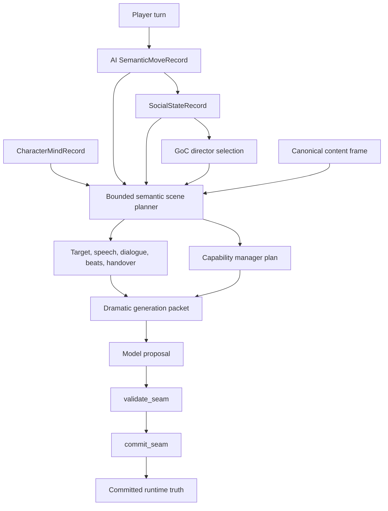

# ADR-0053: Bounded Semantic Scene Planner

## Status

Accepted

## Implementation Status

Implemented and tested for the God of Carnage runtime path.

- `ai_stack/semantic_scene_planner.py` builds bounded short-horizon scene-plan enrichment.
- `ScenePlanRecord` now carries `narrative_scene_function`, `scene_target`, `target_obligations`, `actor_directives`, `dramatic_beats`, `handover_policy`, `content_frame`, `speech_policy`, `quote_moment_policy`, `dialogue_plan`, `capability_manager_plan`, `continuity_obligation`, `expected_transition_pattern`, and `semantic_scene_planner_version`.
- `pressure_target` remains as a compatibility alias for pressure-specific target data; the broader concept is now `scene_target`.
- `RuntimeTurnGraphExecutor._director_select_dramatic_parameters` calls the planner after AI semantic move, social state, responder, character-mind, and pacing decisions are available.
- The planner consumes the expanded GoC content surfaces: `canonical_path`, `scene_graph`, `locations`, `objects`, `content_access_policy`, `opening_quote_anchors`, and `direction/beat_library`.
- The dramatic generation packet exposes the enriched `scene_plan` as model-visible bounded direction, including speech and capability-manager decisions.
- The runtime capability aspect records the director-selected capability-manager plan so validation can see what the director intended to execute.
- `ai_stack/director_capability_manager.py` audits the selected dramatic capabilities as individual bounded dispatch paths. Each selected capability must have one terminal path, pass cycle detection, stay within the path-depth limit, and enter the runtime as an audited dispatch queue rather than a recursive tree walk.
- Validation and commit seams remain authoritative; planner output is advisory until validation/commit.
- Scene-function and responder selection no longer use legacy keyword scene candidates or raw actor-name matching. Missing semantic move input degrades through `semantic_move_required`.

## Date

2026-05-17

## Intellectual property rights

Repository authorship and licensing: see project **LICENSE**; contact maintainers for clarification.

## Privacy and confidentiality

This ADR contains no personal data. Implementers must not store raw player text beyond existing runtime/audit policies and must not expose hidden prompts, secrets, provider credentials, or private player data through planner diagnostics.

## Related ADRs

- [ADR-0001](adr-0001-runtime-authority-in-world-engine.md) - world-engine remains the authoritative live runtime.
- [ADR-0004](adr-0004-runtime-model-output-proposal-only-until-validator-approval.md) - model output remains proposal-only until validator approval.
- [ADR-0025](adr-0025-canonical-authored-content-model.md) - authored content remains canonical source material.
- [ADR-0033](adr-0033-live-runtime-commit-semantics.md) - commit semantics remain authoritative for live turns.
- [ADR-0038](adr-0038-canonical-turn-lifecycle-single-commit-path.md) - planner output must stay inside the single turn lifecycle.
- [ADR-0039](adr-0039-gate-tests-no-hardcoded-oracle-bypass.md) - tests must assert contracts and policy-derived labels, not generated prose.
- [ADR-0041](adr-0041-semantic-capability-selection-and-runtime-capability-budgeting.md) - capability authority and validator routing remain separate from scene planning.
- [ADR-0044](adr-0044-runtime-rag-context-fabric-routing-and-authority-boundaries.md) - retrieved context may inform planning but does not become truth.

## Context

The God of Carnage runtime already had director nodes in the single LangGraph turn path:

```text
goc_resolve_canonical_content -> director_assess_scene -> director_select_dramatic_parameters -> ...
```

Before this ADR, `ai_stack/scene_director_goc.py` selected scene function,
responder set, pacing, and silence/brevity through deterministic helper logic.
Some of that logic was phrase-driven. That was useful during early slicing, but
it made the director behave like a hidden keyword router. The current contract
requires semantic move payloads and content IDs instead: the director may map a
bounded `move_type` to a scene function, but it must not infer that move from
raw player wording.

The GoC content module now exposes richer canonical path, object, location,
access-policy, quote-anchor, and beat-library authority. That creates a new
director responsibility: it must recognize when a turn should speak, when it
should narrate, when a source quote is moment-locked and allowed, and which
runtime dramatic capabilities should execute. Running every possible branch
for every turn would defeat the purpose of the director; it must use the
capability manager like a selective state machine and choose only the
capabilities needed for the current scene plan.

The semantic dramatic planner roadmap requires the director to become a bounded short-horizon planner that can combine:

- semantic move interpretation,
- social state,
- character tactical identity,
- authored scene constraints and canonical content path,
- prior continuity pressure,
- actor-lane authority,
- quote-anchor policy,
- capability availability,
- and the existing deterministic scene-function/responder selection.

The design problem is authority. A smarter director must not become a second storyteller, a second runtime truth surface, or an LLM-owned planner. It must enrich the shape of the next proposal while preserving the existing truth pipeline:

```text
planner selects direction -> model realizes proposal -> validation checks -> commit authorizes truth
```

## Decision

1. The God of Carnage runtime will use a bounded semantic scene planner as part of the existing `director_select_dramatic_parameters` graph node.

2. The planner output is stored inside `ScenePlanRecord`, not in a separate truth store. It is advisory until the validation and commit seams approve runtime consequences.

3. The planner enriches, but does not replace, bounded director selection. The
   first-pass scene function and responder set continue to come from the
   established director contract; that contract consumes semantic move records,
   social state, continuity, and authored content, not raw-text keyword scans.
   The semantic planner derives short-horizon target, beat, directive, and
   handover fields from those selections and structured planner records.

4. `ScenePlanRecord` must include these bounded planner outputs:

   - `narrative_scene_function`
   - `realization_mode`
   - `pressure_function`
   - `scene_target`
   - `pressure_target` as a compatibility alias for pressure-oriented target data
   - `target_obligations`
   - `actor_directives`
   - `dramatic_beats`
   - `handover_policy`
   - `content_frame`
   - `speech_policy`
   - `quote_moment_policy`
   - `dialogue_plan`
   - `capability_manager_plan`
   - `continuity_obligation`
   - `expected_transition_pattern`
   - `semantic_scene_planner_version`
   - bounded `planner_rationale_codes`

5. `scene_target` is the canonical broad target concept. It can target an actor, relationship axis, room, setup, information surface, scene boundary, player affordance, or transition. `pressure_target` must not be treated as the only target type.

6. `actor_directives` may instruct the next proposal to stage NPC presence, force a visible NPC reaction, hold silence, stage interruption, or narrate without forcing an NPC. These are realization directives only. They do not override actor-lane authority, player control, validator policy, or commit semantics.

7. `dramatic_beats` are structured beat objects, not only intent labels. They must carry at least order, kind, function, intent, owner, visibility, required flag, success condition, and constraints where available.

8. `content_frame` is the selected canonical content slice for the turn. It may include canonical path step id, scene node id, location id, object focus ids, quote-anchor refs, action beats, player windows, narrator tasks, and content-access decisions. It is evidence for planning, not committed truth.

9. `speech_policy` decides whether NPC speech is required, recommended, or suppressed for the selected content frame. It must preserve player control: player speech may be afforded, but never forced.

10. `dialogue_plan` is an ordered set of bounded NPC-speech beats. It can reference authored beat-library patterns, required facts, quote anchors, actor ids, and forced-response chains. It must respect actor-lane authority; if the intended speaker is player-controlled, that beat is skipped or degraded, not reassigned to a different NPC.

11. `quote_moment_policy` allows exact quote anchors only as rare, moment-locked short anchors. The default remains paraphrase or transformation. Exact quote use requires a matching canonical path step, a beat that needs source pressure, speaker/context match, and a not-recently-used check.

12. `capability_manager_plan` is the director's dynamic execution gate. It records decision inputs, selected capabilities, required capabilities, optional capabilities, suppressed capabilities, and per-capability steps. The runtime should use it to activate only the chosen dramatic capability branches for the turn instead of running every possible branch. Every selected capability must also pass a bounded dispatch-path audit: one path per capability, no recursive dispatch, no queue expansion during execution, terminal node required, and per-path cycle/depth checks before the capability enters the executable dispatch queue.

13. Planner fields must use machine-readable, inspectable labels. They must not contain free-form psychological claims, long prose plans, hidden-truth assertions, or generated narrative text as authority.

14. The dramatic generation packet may expose the enriched `scene_plan` to guide model realization. That exposure is prompt/proposal guidance only. The model must not treat planner fields as permission to commit facts, mutate scene truth, bypass actor-lane rules, or resolve continuity outside validation/commit.

15. The planner must fail safe. Missing or malformed semantic/social/character/content inputs should degrade to conservative defaults rather than inventing new story truth.

16. This ADR covers the GoC short-horizon scene planner only. It does not implement cross-module generalization, long-horizon plot planning, procedural subplots, or a second planning service.

17. Legacy keyword routing is removed. Compatibility diagnostics may preserve
    historical field names, but `legacy_keyword_scene_candidates_used` must not
    become a behavior path.

## Consequences

**Positive:**

- The director can now express what the scene is for, who or what is targeted, which immediate beats should be realized, which NPC/director actions are required, how setup should be arranged, and how control should be returned to the player.
- The director can now recognize content-authored speech moments and produce a bounded dialogue plan rather than leaving speech to generic responder heuristics.
- Exact source quotes are available only as short moment-locked anchors, which supports precision without continuous verbatim use.
- Runtime capability selection becomes inspectable and selective: the director can choose the minimal dramatic capability set for the turn.
- Capability dispatch is finite by contract: attached capabilities are checked path-by-path, and invalid, unknown, suppressed, over-deep, or cyclic paths are rejected before execution hints are exposed.
- The model receives more concrete dramatic direction without gaining truth authority.
- Operator/debug surfaces can inspect why a turn was shaped a certain way through structured planner fields.
- The implementation advances the semantic dramatic planner roadmap while preserving the existing LangGraph topology and commit seams.

**Negative / risks:**

- `ScenePlanRecord` is larger and downstream consumers must continue treating it as advisory.
- Overly broad planner labels could become pseudo-truth if future code reads them as committed facts.
- Capability-manager output can become misleading if future capabilities are added without updating the director's selection rules and dispatch path registry.
- Dialogue-plan beats can become too mechanical if the beat library is treated as prose template authority rather than structured direction.
- The current implementation is still short-horizon and GoC-specific; it should not be marketed as full dramatic intelligence or long-horizon story planning.
- Missing semantic move payloads now produce a neutral fallback; upstream AI
  semantic resolution is therefore required for nuanced social direction.

**Follow-ups:**

- Keep `ai_stack/semantic_scene_planner.py` deterministic and contract-first.
- Add policy/YAML-backed mappings if target functions, actor directives, pressure functions, or beat templates need authoring control.
- Expand dramatic-effect validation to inspect `scene_target`, `actor_directives`, `handover_policy`, `dramatic_beats`, and `continuity_obligation` more deeply.
- Expand validator coverage for `speech_policy`, `dialogue_plan`, `quote_moment_policy`, and `capability_manager_plan`.
- Keep the capability dispatch-path registry in lockstep with any newly introduced dramatic capability; unknown capabilities should fail closed.
- Move more dialogue-step profiles from code into authored content once the shape stabilizes.
- Only generalize beyond GoC after the GoC planner remains stable under regression and live/staging evidence.
- If future modules need different scene-function mappings, author those as
  module policy or AI semantic output contracts, not runtime keyword maps.

## Diagrams



## Testing

Current verification:

- `PYTHONPATH=/mnt/d/WorldOfShadows:/mnt/d/WorldOfShadows/world-engine python -m py_compile ai_stack/goc_yaml_authority.py ai_stack/scene_plan_contract.py ai_stack/semantic_scene_planner.py ai_stack/langgraph_runtime_executor.py`
- `PYTHONPATH=/mnt/d/WorldOfShadows:/mnt/d/WorldOfShadows/world-engine python -m pytest ai_stack/tests/test_director_capability_manager.py -q --tb=short`
- `PYTHONPATH=/mnt/d/WorldOfShadows:/mnt/d/WorldOfShadows/world-engine python -m pytest ai_stack/tests/test_semantic_scene_planner.py ai_stack/tests/test_semantic_planner_contracts.py ai_stack/tests/test_goc_structured_setting_knowledge.py -q --tb=short` - 23 passed
- `PYTHONPATH=/mnt/d/WorldOfShadows:/mnt/d/WorldOfShadows/world-engine python -m pytest ai_stack/tests/test_semantic_planner_graph_authority.py -q --tb=short` - 7 passed
- `PYTHONPATH=/mnt/d/WorldOfShadows:/mnt/d/WorldOfShadows/world-engine python -m pytest ai_stack/tests/test_scene_director_goc_extended.py ai_stack/tests/test_scene_direction_subdecision_matrix.py -q --tb=short` - 159 passed
- `PYTHONPATH=/mnt/d/WorldOfShadows:/mnt/d/WorldOfShadows/world-engine python -m pytest tests/smoke/test_repository_documented_paths_resolve.py tests/smoke/test_docs_truth.py -q --tb=short` - 48 passed

Failure modes that require ADR review:

- Planner output directly mutates committed runtime truth.
- A model proposal can overwrite planner-owned director fields.
- `ScenePlanRecord` becomes a second canonical session state store.
- Generated prose becomes the primary oracle for planner tests.
- The capability manager plan is ignored and every dramatic branch runs regardless of director selection.
- A selected capability can recurse, expand the dispatch queue, or execute without an individual terminal path audit.
- Exact quote anchors are used continuously rather than only at moment-locked beats.
- Raw player text, actor names, or off-scope topic words route scene candidates
  without an AI semantic move payload.
- Cross-module planner reuse starts without an explicit generalization ADR or amendment.

All tests must comply with [ADR-0039](adr-0039-gate-tests-no-hardcoded-oracle-bypass.md): assert structured fields, contract constants, and deterministic policy behavior rather than copied example prose.

## References

- [MVP Semantic Dramatic Planner roadmap](../MVPs/MVP_Semantic_Dramatic_Planner/ROADMAP_MVP_SEMANTIC_DRAMATIC_PLANNER.md)
- [Canonical GoC turn contract](../MVPs/MVP_VSL_And_GoC_Contracts/CANONICAL_TURN_CONTRACT_GOC.md)
- `ai_stack/semantic_scene_planner.py`
- `ai_stack/director_capability_manager.py`
- `ai_stack/scene_plan_contract.py`
- `ai_stack/goc_yaml_authority.py`
- `ai_stack/scene_director_goc.py`
- `ai_stack/langgraph_runtime_executor.py`
- `ai_stack/tests/test_semantic_scene_planner.py`
- `ai_stack/tests/test_goc_structured_setting_knowledge.py`
- `ai_stack/tests/test_semantic_planner_golden_cases.py`
