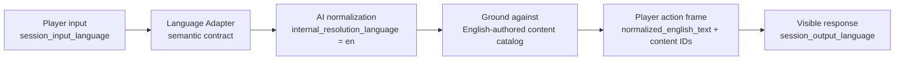

# ADR-0054: Session Input Language and English Internal Resolution

## Status

Accepted

## Date

2026-05-17

## Context

The canonical story content is authored in English. Locations, objects,
characters, action affordances, and semantic IDs are therefore most reliable
when the runtime grounds player intent against English-authored content.

Player-visible play, however, happens in the selected session language. A German
session receives German narration, and the player naturally enters German text.
Using only `session_output_language` made the output contract clear, but left the
input side implicit. That creates a brittle seam: German player input can be
passed directly into an English semantic catalog, causing missed object,
location, or action grounding.

The language adapter must remain thin. It must not become a phrase table,
translation dictionary, verb ontology, or per-module language lookup system.

## Decision

### D1 - Introduce `session_input_language`

Introduce a session-scoped field named `session_input_language`.

- If omitted, it defaults to `session_output_language`.
- In v1, supported values follow the same closed set as output language: `de`
  and `en`.
- It represents the natural language in which the player is expected to type
  input for the session.

This allows future sessions where input and output differ without changing the
core runtime contract.

### D2 - Normalize player input to English before semantic grounding

Before action resolution grounds player intent against authored content, the AI
semantic resolution step SHALL translate or normalize the raw player input into
English.

The language adapter contract SHALL expose:

- `raw_player_text`
- `session_input_language`
- `session_output_language`
- `internal_resolution_language = "en"`
- `translate_input_to_internal_english_before_grounding = true`
- `ground_against_english_authored_content = true`

The expected AI semantic output includes `normalized_english_text`, English
semantic labels such as `action_kind` and `verb`, and English `target_query` /
`source_query` spans where IDs are not already resolved.

### D3 - Keep player-visible output in `session_output_language`

The English normalization is an internal grounding step only. Player-visible
narration, narrator responses, NPC lines, clarification requests, and recoverable
turn messages remain governed by `session_output_language`.

The runtime must preserve the original player input for echo, attribution, and
diagnostics, while separately carrying `normalized_english_text` for internal
resolution evidence.

### D4 - Propagate both languages through the canonical session path

The canonical player session path SHALL carry both language values:

1. Backend `POST /api/v1/game/player-sessions` accepts and validates
   `session_input_language`.
2. Backend persists `session_input_language` in the canonical player session
   save-slot metadata.
3. Backend forwards `session_input_language` to World-Engine
   `create_story_session`.
4. World-Engine stores it on `StorySession.session_input_language`.
5. Opening and player turns pass it into the LangGraph runtime state.
6. LangGraph passes it into the language adapter contract.
7. Player action resolution preserves `session_input_language`,
   `session_output_language`, `internal_resolution_language`, and
   `normalized_english_text` on the player action frame.

### D5 - No hardcoded language maps

The language adapter SHALL NOT contain hardcoded German-to-English action maps,
locale phrase rules, verb tables, or per-module lookup files.

Meaning is inferred by the AI from the player utterance and the content-derived
semantic catalog. Unknown or underspecified input remains a clarification path,
not a code-level guess.

## Consequences

### Positive

- German input can be resolved against English-authored objects, locations, and
  affordances without duplicating content.
- `session_output_language` remains a pure player-visible output contract.
- The adapter stays thin and content-derived.
- Tests and diagnostics can distinguish raw player text from internal English
  grounding evidence.

### Risks

- The model can still mistranslate or over-normalize player intent. The
  mitigation is to require resolved content IDs and confidence/reason fields in
  the semantic output.
- If a module contains non-English authored content in the future, it must either
  declare that explicitly or introduce a new ADR for module-authored content
  language.

## Implementation Evidence

Implemented as of 2026-05-17:

- `story_runtime_core/language_adapter.py` exposes the input/output/internal
  language contract and instructs English normalization before grounding.
- `ai_stack/langgraph_runtime_executor.py` carries `session_input_language`
  through runtime state and semantic interpretation.
- `ai_stack/action_resolution_contracts.py` and
  `ai_stack/player_action_resolution.py` preserve normalized English resolution
  evidence on the player action frame.
- `backend/app/api/v1/game_routes.py` accepts, validates, defaults, persists,
  and forwards `session_input_language`.
- `backend/app/services/game_service.py` forwards the field to World-Engine.
- `world-engine/app/api/http.py` accepts the field on story session creation.
- `world-engine/app/story_runtime/manager.py` stores the field on
  `StorySession` and forwards it into opening and player turns.

## Acceptance Evidence

Targeted verification completed on 2026-05-17:

- `python -m py_compile` for the touched runtime, backend, and World-Engine
  modules.
- `story_runtime_core` language adapter and player input semantic tests.
- Backend canonical player session language tests.
- World-Engine session language tests.
- Player action resolution regression tests for normalized English evidence.

## Related ADRs

- [ADR-0025](adr-0025-canonical-authored-content-model.md) - canonical authored
  content model.
- [ADR-0033](adr-0033-live-runtime-commit-semantics.md) - committed turn truth
  and runtime evidence.
- [ADR-0036](adr-0036-player-session-output-language.md) - player-visible output
  language.
- [ADR-0037](adr-0037-content-locale-story-runtime.md) - semantic language
  adapter and removal of locale lookup content.

## Flow

