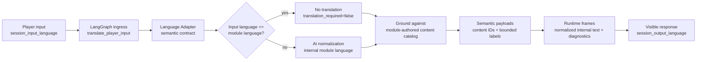

# ADR-0054: Session Input Language and Module-Language Internal Resolution

## Status

Accepted

## Date

2026-05-18

## Context

The current GoC canonical story content is authored in English. Locations,
objects, characters, action affordances, and semantic IDs are therefore most
reliable when the runtime grounds player intent against that module's authored
language. Future modules may declare a different authoring language; the
contract is module-language-first, not English-special by product law.

Player-visible play, however, happens in the selected session language. A German
session receives German narration, and the player naturally enters German text.
Using only `session_output_language` made the output contract clear, but left the
input side implicit. That creates a brittle seam: German player input can be
passed directly into an English semantic catalog, causing missed object,
location, or action grounding.

The language adapter is a focused semantic boundary: it publishes the
content-derived catalog and the AI resolution contract. It must not become a
phrase table, translation dictionary, verb ontology, actor alias matcher,
scene-keyword router, or per-module language lookup system.

## Decision

### D1 - Introduce `session_input_language`

Introduce a session-scoped field named `session_input_language`.

- If omitted, it defaults to `session_output_language`.
- In v1, supported values follow the same closed set as output language: `de`
  and `en`.
- It represents the natural language in which the player is expected to type
  input for the session.

This allows future sessions where input and output differ without changing the
core runtime contract.

### D2 - Normalize player input to English before semantic grounding

Before action resolution grounds player intent against authored content, the AI
semantic resolution step SHALL translate or normalize the raw player input into
the module's internal resolution language.

If `session_input_language` already equals the module/internal resolution
language, the runtime SHALL NOT force a language translation pipeline. It may
still create the structural `input_translation` diagnostic record, but it must
record the no-op state (`translation_required=false`) and preserve raw player
text as the grounding text unless another semantic adapter is explicitly needed
for non-language classification.

The language adapter contract SHALL expose:

- `raw_player_text`
- `session_input_language`
- `session_output_language`
- `module_authoring_language`
- `internal_resolution_language` (the declared module language; `en` for GoC v1)
- `translation_required = session_input_language != internal_resolution_language`
- `translate_input_to_internal_language_before_grounding = translation_required`
- `ground_against_module_authored_content = true`

When translation is required, the expected AI semantic output includes
`normalized_internal_text` (legacy field name `normalized_english_text` may
remain for GoC/English compatibility), semantic labels such as `action_kind` and
`verb`, and target/source query spans in the module language where IDs are not
already resolved.

### D3 - Keep player-visible output in `session_output_language`

The module-language normalization is an internal grounding step only. Player-visible
narration, narrator responses, NPC lines, clarification requests, and recoverable
turn messages remain governed by `session_output_language`.

The runtime must preserve the original player input for echo, attribution, and
diagnostics, while separately carrying normalized internal-language text when a
translation/normalization step actually ran.

This does not authorize localized content duplicates. If a source block is
canonical or deterministic English, the output module realizes it into
`session_output_language`; runtime code, canonical path YAML, and prompt-store
source templates must not carry German replacement prose as a shortcut.

### D4 - Propagate both languages through the canonical session path

The canonical player session path SHALL carry both language values:

1. Backend `POST /api/v1/game/player-sessions` accepts and validates
   `session_input_language`.
2. Backend persists `session_input_language` in the canonical player session
   save-slot metadata.
3. Backend forwards `session_input_language` to World-Engine
   `create_story_session`.
4. World-Engine stores it on `StorySession.session_input_language`.
5. Opening and player turns pass it into the LangGraph runtime state, together
   with the module/internal resolution language.
6. LangGraph starts player-turn processing at `translate_player_input`, which
   creates the language adapter contract before `interpret_input` or retrieval
   can process the request. When player and module language match, this node is a
   no-op language boundary plus diagnostics, not a translation call. The ordering
   invariant is normative in [ADR-0055](adr-0055-semantic-player-input-translation-ingress.md).
7. `interpret_input`, retrieval, semantic move interpretation, and player action
   resolution consume the resulting `input_translation` / semantic payloads.
8. Player action resolution preserves `session_input_language`,
   `session_output_language`, `internal_resolution_language`, and normalized
   internal-language evidence on the player action frame.

### D5 - No hardcoded language maps

The language adapter SHALL NOT contain hardcoded German-to-English action maps,
locale phrase rules, verb tables, or per-module lookup files.

Meaning is inferred by the AI from the player utterance and the content-derived
semantic catalog. Unknown or underspecified input remains a clarification path,
not a code-level guess.

### D6 - No deterministic phrase routing for semantic moves or scene candidates

Semantic move interpretation and scene-direction routing SHALL NOT infer social
moves, target actors, responder focus, pacing, or scene candidates from raw
player-text keyword lists.

The God of Carnage runtime may use bounded runtime signals such as empty input,
punctuation-only input, explicit semantic payload fields, prior committed
continuity, and validated content IDs. It must not classify `why`, `watch`,
`silent`, actor names, or off-scope topics through hardcoded phrase lists.

If no `semantic_move` payload is present, the director uses a neutral
`semantic_move_required` diagnostic fallback. It does not resurrect a
keyword-based legacy path.

### D7 - Thin structural input previews only

Pre-AI input preview code may identify:

- empty or punctuation-only input,
- slash or bang commands,
- out-of-character/meta prefixes,
- quoted speech spans.

It SHALL NOT classify unquoted natural language as action, reaction, movement,
perception, target selection, or social intent through language-specific
wordlists. Such input is marked for AI semantic resolution.

## Consequences

### Positive

- Player input can be resolved against module-authored objects, locations, and
  affordances without duplicating content or forcing translation when the
  languages already match.
- `session_output_language` remains a pure player-visible output contract.
- The adapter has a clear responsibility boundary: expose the content-derived
  semantic surface and resolution contract without owning language lookup data.
- Tests and diagnostics can distinguish raw player text from internal-language
  grounding evidence.
- GoC scene direction no longer changes behavior because a raw phrase happens
  to match an English keyword fixture.

### Risks

- The model can still mistranslate or over-normalize player intent. The
  mitigation is to require resolved content IDs and confidence/reason fields in
  the semantic output.
- If a module contains non-English authored content, it must declare that
  authoring language explicitly so the no-translation and translation-required
  branches remain auditable.

## Implementation Evidence

Implemented as of 2026-05-17:

- `ai_stack/language_io/language_adapter.py` exposes the input/output/internal
  language contract. `story_runtime_core/language_adapter.py` is a compatibility
  import while downstream callers migrate.
- `ai_stack/langgraph/langgraph_runtime_executor.py` carries `session_input_language`
  through runtime state and semantic interpretation.
- `ai_stack/contracts/action_resolution_contracts.py` and
  `ai_stack/player_action_resolution.py` preserve normalized English resolution
  evidence on the player action frame.
- `backend/app/api/v1/game_routes.py` accepts, validates, defaults, persists,
  and forwards `session_input_language`.
- `backend/app/services/game_service.py` forwards the field to World-Engine.
- `world-engine/app/api/http.py` accepts the field on story session creation.
- `world-engine/app/story_runtime/manager.py` stores the field on
  `StorySession` and forwards it into opening and player turns.

Updated on 2026-05-18:

- `ai_stack/langgraph/langgraph_runtime_executor.py` now enters player turns through
  `translate_player_input` before `interpret_input`; successful semantic model
  output is attached as `semantic_action` / `semantic_move`, and retrieval
  prefers normalized internal-language evidence (`normalized_english_text` for
  English-authored compatibility paths).
- `ai_stack/story_runtime/semantic_planner/god_of_carnage_semantic_move_interpretation.py` reads bounded AI semantic move
  payloads and runtime silence signals only; phrase synsets and priority-rule
  stacks were removed.
- `ai_stack/story_runtime/director/god_of_carnage_scene_director.py` no longer imports legacy keyword scene
  candidates or actor alias matching from raw text. Missing semantic moves use
  `selection_source=semantic_move_required`.
- `story_runtime_core/input_interpreter.py` and
  `backend/app/runtime/input_interpreter.py` are thin structural previews, not
  verb/reaction/question classifiers.
- `backend/app/api/v1/session_routes.py` exposes a non-authoritative
  `backend_semantic_translation_preview` before its legacy structural preview
  and forwards session input/output language when it has to create a
  World-Engine story session.
- Deleted obsolete runtime helpers:
  `ai_stack/goc_semantic_priority_rules.py`,
  `ai_stack/scene_director_goc_legacy_keyword_candidates.py`,
  `ai_stack/scene_director_goc_legacy_keyword_constants.py`, and
  `ai_stack/goc_actor_aliases.py`.

Updated on 2026-05-18 for the output boundary:

- GoC narrator-path and Souffleuse opening source blocks are English internally.
- German player-visible text for those paths is produced by the story output
  module, with output-realization diagnostics.
- Souffleuse source guidance carries the current human actor and
  character-specific source facts so Annette, Alain, and other playable roles do
  not collapse into a generic translated hint.

Updated on 2026-05-20 for the module-language no-op boundary:

- Player/module language match is a no-translation path. The runtime may still
  record a structured ingress/output-realization diagnostic, but it must not run a
  language input-output pipeline merely because the node exists in the graph.
- German remains an example of a non-module-language target for GoC v1, not a
  hardcoded special case.

## Acceptance Evidence

Targeted verification completed on 2026-05-17 and refreshed on 2026-05-18:

- `python -m py_compile` for the touched runtime, backend, and World-Engine
  modules.
- `story_runtime_core` language adapter and player input semantic tests.
- Backend canonical player session language tests.
- World-Engine session language tests.
- Player action resolution regression tests for normalized English evidence.
- Semantic move, scene director, input preview, and GoC structured-content
  regression tests after removal of keyword routing.

## Related ADRs

- [ADR-0025](adr-0025-canonical-authored-content-model.md) - canonical authored
  content model.
- [ADR-0033](adr-0033-live-runtime-commit-semantics.md) - committed turn truth
  and runtime evidence.
- [ADR-0036](adr-0036-player-session-output-language.md) - player-visible output
  language.
- [ADR-0037](adr-0037-content-locale-story-runtime.md) - semantic language
  adapter and removal of locale lookup content.
- [ADR-0055](adr-0055-semantic-player-input-translation-ingress.md) - semantic
  translation ingress before input interpretation, retrieval, and action
  resolution.

## Flow

