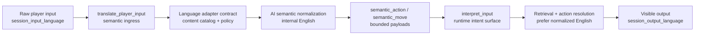

# ADR-0055: Semantic Player Input Translation Ingress

## Status

Accepted

## Date

2026-05-18

## Context

ADR-0054 defines `session_input_language`, internal English normalization, and
the rule that player-visible output remains governed by
`session_output_language`.

That language contract is not sufficient by itself if the runtime still lets raw
player text flow into interpretation, retrieval, action resolution, scene
direction, or model prompt construction before semantic translation has run.
For example, German input such as `Gehe ins Bad` cannot reliably ground against
English-authored locations if retrieval and action resolution see only the raw
German text first.

The runtime also must avoid the tempting shortcut: a hardcoded map from German
verbs or phrases to English runtime actions. That shortcut would make every new
language, module, and authoring style a special case, and would recreate the
locale/phrase-table architecture ADR-0054 explicitly rejects.

## Decision

### D1 - Semantic translation is the graph ingress for player turns

The canonical LangGraph player-turn path SHALL enter through
`translate_player_input` before `interpret_input`, retrieval, action resolution,
scene direction, model invocation, validation, or commit.

Opening/system turns may mark translation as skipped because they are not real
player-input evidence lanes. Player turns may not bypass the translation ingress
just because the raw text appears simple.

### D2 - The translation ingress produces bounded semantic evidence

`translate_player_input` SHALL create an `input_translation` record containing:

- the language adapter contract,
- `session_input_language`,
- `session_output_language`,
- `internal_resolution_language = "en"`,
- the hash of raw player text,
- adapter status and parser diagnostics,
- optional `normalized_english_text`,
- optional bounded `semantic_action`,
- optional bounded `semantic_move`.

When model output is missing, unavailable, or unparsable, the node keeps the
semantic contract and records a contract-only status. Downstream code must then
clarify or continue conservatively. It must not fill the gap with phrase maps.

### D3 - Raw control guards remain structural, not semantic maps

After translation ingress, the runtime may still inspect raw input for structural
control modes such as explicit commands or out-of-character/meta prefixes. This
guard exists to keep non-story control input out of the fiction.

That guard must not become action meaning extraction. It may not classify
unquoted natural language as movement, perception, reaction, social pressure,
target selection, or scene routing from raw-language keywords.

### D4 - Downstream runtime consumes semantic payloads first

`interpret_input` SHALL merge successful `input_translation` payloads into
`interpreted_input` before action resolution or semantic move interpretation.

When `semantic_action` is present, player input kind, action kind, verb,
target/source queries, resolved content IDs, commit policy, confidence, and
reason fields come from the semantic payload. When `semantic_move` is present,
scene-director semantic move interpretation reads that bounded payload rather
than raw phrases.

### D5 - Retrieval and prompts prefer normalized English evidence

Runtime retrieval SHALL prefer `normalized_english_text` when building a query
against English-authored content. Raw player text remains attached for audit,
visible echo, and continuity context, but it is not the primary grounding string
when normalized English evidence exists.

Model prompts may include both the original input and the normalized English
input, clearly separated, so generation can preserve player-facing language
while content grounding remains stable.

### D6 - Backend previews are non-authoritative

Backend session routes may expose `backend_semantic_translation_preview` and
`backend_interpretation_preview` for diagnostics. These previews are not runtime
truth and must not be used to authorize story facts, player action commits, or
scene progression.

The authoritative result remains the World-Engine turn graph output.

## Consequences

### Positive

- German and English player input follow the same architecture without
  language-specific action maps.
- Action resolution can ground against English-authored locations, objects, and
  affordances through AI semantic payloads.
- Retrieval no longer accidentally searches English content using only German
  raw input.
- Diagnostics can show whether semantic translation resolved, failed, or fell
  back to contract-only handling.
- The old deterministic preview stays thin and structural.

### Risks

- A configured model may return invalid JSON or incomplete semantic payloads.
  The runtime mitigates this by preserving the contract, parser status, and a
  clarification path.
- Translation may over-normalize or mistranslate player intent. The mitigation
  is to require confidence/reason fields and prefer resolved content IDs over
  loose target text.
- The translation ingress adds an early model call. Runtime configuration and
  observability must make this cost visible rather than hiding it in later
  generation work.

## Implementation Evidence

Implemented on 2026-05-18:

- `ai_stack/langgraph_runtime_executor.py` defines `translate_player_input` as
  the LangGraph entry point before `interpret_input`.
- `translate_player_input` builds the semantic resolution contract, calls the
  configured adapter, parses bounded JSON payloads, and writes
  `input_translation`.
- `interpret_input` consumes `input_translation`, `semantic_action`,
  `semantic_move`, and `normalized_english_text` before action resolution.
- Runtime retrieval prefers `normalized_english_text` and keeps raw player input
  as audit/context evidence.
- `ai_stack/langgraph_runtime_state.py` carries `input_translation` and
  `semantic_resolution_contract`.
- `backend/app/api/v1/session_routes.py` exposes a non-authoritative
  `backend_semantic_translation_preview` and forwards session input/output
  languages when it creates a World-Engine story session.
- `ai_stack/tests/test_langgraph_runtime.py` includes a semantic translation
  adapter test double and asserts that `translate_player_input` executes before
  `interpret_input` and action resolution.

## Acceptance Evidence

Targeted verification on 2026-05-18:

- `python -m py_compile ai_stack/langgraph_runtime_executor.py ai_stack/langgraph_runtime_state.py`
- `python -m py_compile backend/app/api/v1/session_routes.py`
- `PYTHONPATH=/mnt/d/WorldOfShadows:/mnt/d/WorldOfShadows/world-engine pytest ai_stack/tests/test_langgraph_runtime.py -q --tb=short`
- `PYTHONPATH=/mnt/d/WorldOfShadows:/mnt/d/WorldOfShadows/world-engine pytest ai_stack/tests/test_player_action_resolution.py ai_stack/tests/test_p0_action_resolution_regression.py story_runtime_core/tests/test_player_input_semantics_de.py story_runtime_core/tests/test_player_input_semantics_en.py story_runtime_core/tests/test_german_semantic_resolution_contracts.py story_runtime_core/tests/test_language_adapter.py story_runtime_core/tests/test_input_interpreter.py -q --tb=short`
- `PYTHONPATH=/mnt/d/WorldOfShadows:/mnt/d/WorldOfShadows/backend pytest backend/tests/test_session_routes.py::TestExecuteTurnEndpoint -q --tb=short`

The broader anti-hardcoding gate was also run and exposed unrelated existing
literal-debt findings outside this ADR's translation ingress path. Those findings
are not accepted as a bypass for this decision.

## Related ADRs

- [ADR-0025](adr-0025-canonical-authored-content-model.md) - canonical authored
  content model.
- [ADR-0033](adr-0033-live-runtime-commit-semantics.md) - committed turn truth
  and runtime evidence.
- [ADR-0039](adr-0039-gate-tests-no-hardcoded-oracle-bypass.md) - no
  hardcoded oracle bypasses.
- [ADR-0054](adr-0054-session-input-language-english-internal-resolution.md) -
  session input language and English internal resolution.

## Flow

