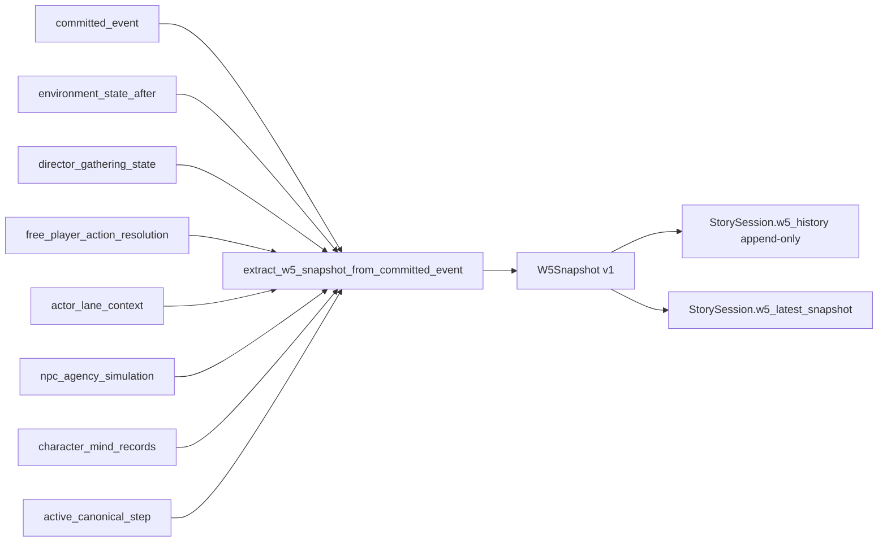

# ADR-0063: W5 Actor Situation Tracker

Short title: a single source-tagged, truth-leveled, append-only actor-situation authority covering Who / Where / What / How / Why.

## Status

Proposed

## Date

2026-05-20

## Intellectual property rights

Repository authorship and licensing: see project **LICENSE**; contact maintainers for clarification.

## Privacy and confidentiality

This ADR contains no personal data. Implementers must follow the repository privacy and confidentiality policies, avoid committing secrets, and document any sensitive data handling in implementation steps.

## Related ADRs

- [ADR-0033](adr-0033-live-runtime-commit-semantics.md) — Live runtime commit semantics. W5 OBSERVED facts derive **only** from committed runtime substrate; W5 does not weaken or replace the live-commit gate.
- [ADR-0038](adr-0038-canonical-turn-lifecycle-single-commit-path.md) — Canonical turn lifecycle. W5 snapshots are produced **after** a turn reaches `committed`/`persisted` and are themselves an append-only projection of that committed substrate.
- [ADR-0034](adr-0034-player-facing-narrative-shell-contract.md) — Player-facing shell. Later phases route narrator/shell composition through W5 projections; this ADR does not change shell semantics in Phase 1.
- [ADR-0057](adr-0057-canon-safe-player-freedom-and-affordance-inference.md) — Player freedom / declared-then-committed lane. `declared` truth in W5 corresponds to free-player resolution that is not yet committed substrate.
- [ADR-0060](adr-0060-souffleuse-inner-voice-composition.md) — Souffleuse / projection lanes. Souffleuse and narrator compositions are projection-only sources in W5 and never produce OBSERVED facts.

## Context

The runtime today carries actor-situation information across multiple disjoint surfaces: `environment_state.actor_locations`, narrator composition prose, NPC agency planning, Director gathering state, validation context, frontend cards, and admin/diagnostics views. Each surface has its own implicit notion of "who knows what about whom, when, and from where," and many of them collapse **How** (manner, tone, intensity) into **What** or lose it entirely. There is no single object answering "what is the current situation for actor X, what is its source, how confident is it, and is it OBSERVED, INFERRED, or only DECLARED?"

This has concrete failure modes:

- LLM proposals can leak into surfaces that downstream code treats as committed truth.
- Inferred Why (motive, dramatic function) is sometimes serialized next to OBSERVED Where without source/truth attribution.
- How signals (tone, manner, intensity, pace, physicality, method, style) are dropped or coerced into What.
- Validation, narrator composition, and NPC planning each re-derive situation from different bases, with no append-only audit trail of what was true at turn N.

The W5 Actor Situation Tracker introduces a single, **purely derived, append-only, source-tagged, truth-leveled** actor-situation authority. It is shadow-only in Phase 1 — it changes no consumer behavior — but it is the target authority for narrator/NPC/Director/validation/frontend/admin/observability after migration.

## Decision

We will introduce the **W5 Actor Situation Tracker** with the following normative properties:

1. **Five closed dimensions.** `W5Dimension ∈ { who, where, what, how, why }`. `how` is a first-class dimension and must not be collapsed into `what`.

2. **Six closed truth levels.** `W5TruthLevel ∈ { canonical, observed, declared, director_assigned, inferred, projected }` with these rules:
   - `canonical` = authored content.
   - `observed` = derived from committed runtime substrate / committed event.
   - `declared` = stated/claimed by actor, resolver, or player input, not yet substrate truth.
   - `director_assigned` = assigned by Director / runtime planning authority.
   - `inferred` = soft actor-situation inference (especially Why and How).
   - `projected` = consumer-facing projection only, never committed fact truth.
   - INFERRED `why.*` may exist; it must **never** become OBSERVED unless a future explicit engine-owned commit path / ADR defines that promotion.
   - PROJECTED is **not** a committed fact truth level.
   - LLM structured output must **never** create OBSERVED facts directly.

3. **Closed source set.** `W5Source ∈ { canonical_content, committed_action, participant_state_move, free_player_action_resolution, director_gathering_state, director_composition, npc_agency_simulation, character_mind_record, sensory_context_engine, souffleuse, narrator_composition, admin_override }`. `committed_action` / `participant_state_move` may produce OBSERVED Where/What only after substrate commit. `free_player_action_resolution` typically produces DECLARED until committed. `character_mind_record` / `npc_agency_simulation` may produce INFERRED How/Why. `souffleuse` / `narrator_composition` are projection-lane only. `admin_override` is audited and must never produce OBSERVED.

4. **Visibility, status, freshness, action state, conflict resolution, validation failure codes** are closed enums (see `ai_stack/actor_situation/models.py`).

5. **W5Fact, W5ActorSituation, W5Snapshot, W5Conflict, W5Projection** schemas with stable `schema_version` strings (`w5_fact.v1`, `w5_snapshot.v1`, `w5_projection.v1`). Required invariants:
   - `fact_id` stable and unique; `confidence ∈ [0.0, 1.0]`.
   - `source_event_id` required for OBSERVED facts (except bootstrap / canonical cases handled by the extractor).
   - `how.*` facts use `dimension="how"`, never `dimension="what"`.
   - INFERRED `why.*` use `truth_level="inferred"`, never `"observed"`.
   - Projected values belong in `W5Projection`, not `W5Fact`.

6. **Pure extractor.** A single function — `extract_w5_snapshot_from_committed_event(...)` — is the only legal producer of W5 facts. It is:
   - Pure (no I/O, no LLM calls, no mutation of inputs).
   - Deterministic for identical inputs.
   - Reads substrate / `environment_state` only.
   - Does not advance canonical path, consume mandatory beats, authorize actor-lane behavior, or rewrite committed events.
   - Emits `how.*` whenever How signals exist.
   - Emits `why.*` only with `truth_level="inferred"`.
   - Supersedes lower/equal active facts via `status` and `superseded_by_fact_id` in the new snapshot — it never mutates prior snapshots.
   - DECLARED / INFERRED never silently overwrite OBSERVED / CANONICAL.

7. **Append-only storage.** `StorySession.w5_history: list[W5Snapshot]` is append-only and `StorySession.w5_latest_snapshot: W5Snapshot | None` holds the most recent snapshot. Existing payloads without these fields load as `[]` / `None`.

8. **Phase 1 is shadow-only.** Extraction is wired in after committed runtime events and persisted, but **no consumer is migrated yet**. Narrator, NPC, Director, frontend, admin, and validation continue to read their current sources. `environment_state` remains the low-level committed substrate.

9. **Target architecture (later phases).** W5 becomes the actor-situation authority for higher-level consumers. After final migration, narrator composition, NPC planning, Director gathering, validation, frontend, admin, and observability read W5 projections rather than `environment_state.actor_locations` / `current_room` / `current_area` / `previous_room_id` directly. `environment_state` remains as low-level committed substrate only.

10. **Non-weakening guarantees.** This ADR does not weaken ADR-0033 (live-commit gate), the Actor Lane / Commit / Readiness contract, `validation_outcome` semantics, or Canonical Path semantics. W5 is downstream of commit, not parallel to it.

## Consequences

**Positive:**
- Single source-tagged, truth-leveled actor-situation surface for higher-level consumers.
- How becomes a first-class projected dimension; tone/manner/intensity are no longer dropped.
- INFERRED Why is explicitly soft-truth and cannot be promoted by accident.
- Append-only snapshots provide a per-turn audit trail of what was OBSERVED vs DECLARED vs INFERRED.

**Negative / risks:**
- Risk of duplicate truth between `environment_state` and W5 during migration — mitigated by Phase 1 being shadow-only and `environment_state` remaining the committed substrate.
- Storage growth: append-only history per session. Phase 1 keeps full history; later phases may add bounded retention.
- Extractor must remain pure and side-effect-free; any future Director / planning logic must stay outside it.

**Follow-ups:**
- Phase 2: bounded projections for narrator and NPC consumers (read-only).
- Phase 3: Director / gathering / validation consumers switched to W5 projections.
- Phase 4: frontend / admin / observability projections.
- Phase 5: legacy localization / actor-location helpers replaced by W5 projections.
- Phase 6: retention / compaction policy and bounded `w5_history`.

## Diagrams

## Testing

- Closed-enum tests for `W5Dimension`, `W5TruthLevel`, `W5Source`, `W5VisibilityScope`, `W5FactStatus`, `W5FreshnessStatus`, `W5ActorType`, `W5ProjectionConsumer`, `W5ActionState`, `W5ConflictResolutionStatus`, `W5ValidationFailureCode`.
- Extractor purity tests: no I/O, no mutation of inputs, deterministic for identical inputs.
- Committed-only OBSERVED tests: OBSERVED facts are never produced from uncommitted LLM output.
- How-first-class tests: `how.*` is emitted as `dimension="how"`, never folded into `what`.
- INFERRED Why soft-truth tests: `why.*` from `character_mind_record` / `npc_agency_simulation` carry `truth_level="inferred"`.
- `StorySession` W5 round-trip tests: snapshot survives `story_session_to_payload` / `story_session_from_payload`.
- Legacy-default tests: a payload without `w5_history` / `w5_latest_snapshot` loads as `[]` / `None`.
- Localization regression tests: existing locale tests (ADR-0037 / ADR-0054) remain green.

Gate-style tests follow **[ADR-0039](adr-0039-gate-tests-no-hardcoded-oracle-bypass.md)**: assertions are derived from the W5 contracts above, not hardcoded oracle bypasses.

## References

- `ai_stack/actor_situation/models.py` — closed enums and record models.
- `ai_stack/actor_situation/extractor.py` — pure extractor.
- `world-engine/app/story_runtime/manager.py` — `StorySession`, `story_session_to_payload`, `story_session_from_payload`, `_finalize_committed_turn` (shadow extraction wire-in).
- `docs/MVPs/w5_actor_situation_migration.md` — phase plan (Phase 0..6) and migration notes.
