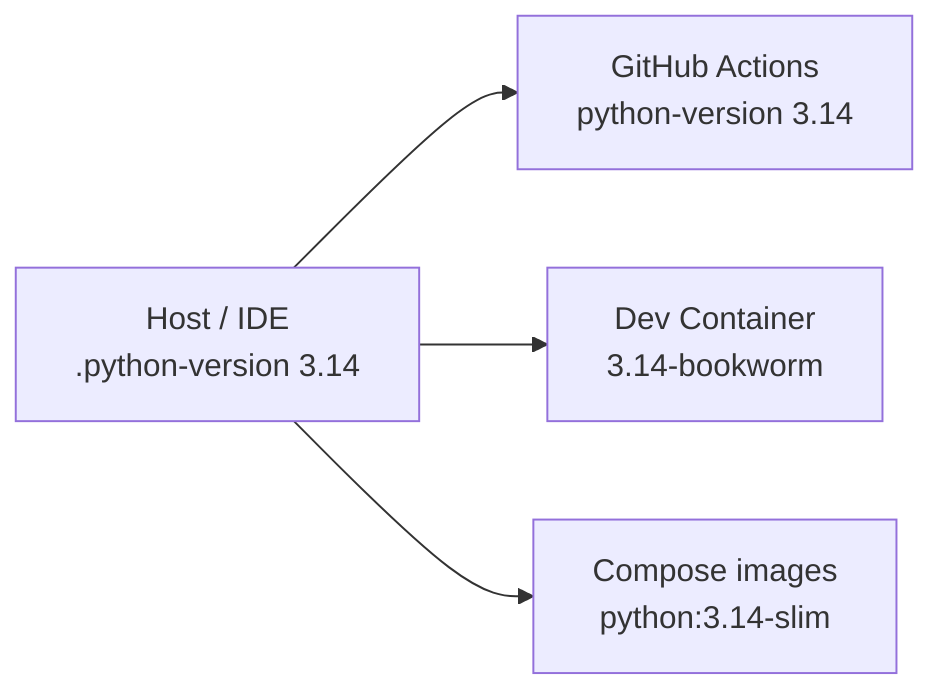

# ADR-0064: Unified Python 3.14 interpreter standard

## Status

Accepted

## Date

2026-05-20

## Intellectual property rights

Repository authorship and licensing: see project **LICENSE**; contact maintainers for clarification.

## Privacy and confidentiality

This ADR contains no personal data. Implementers must follow the repository privacy and confidentiality policies, avoid committing secrets, and document any sensitive data handling in implementation steps.

## Related ADRs

- [ADR-0030](adr-0030-docker-up-complete-bootstrap.md) — local Compose bootstrap (`docker-up.py`); container images must match this interpreter pin.
- [ADR-0037](adr-0037-backend-test-suite-split-runner.md) — canonical `tests/run_tests.py` gates; CI runs on the same Python minor as local/Docker.

## Context

The monorepo previously mixed **Python 3.10** (CI merge bar), **3.11–3.13** (per-service Dockerfiles), and ad hoc host interpreters (including **3.14** on developer machines). That drift caused:

- Different `pip`/wheel resolution and editable-install behaviour between laptop, Actions, and Compose.
- Tooling failures on newer interpreters (for example `argparse` help strings containing `%` under 3.14 before `hub_cli` was escaped).
- False confidence when “tests pass locally” on an interpreter version CI and containers never used.

The team chose **one** minor version for host, CI, Dev Container, and all first-party service images.

## Decision

1. **Canonical interpreter:** **Python 3.14.x** everywhere for World of Shadows development and delivery.
2. **Packaging constraint:** every in-repo `pyproject.toml` declares `requires-python = ">=3.14,<3.15"`.
3. **Repo pin:** root **`.python-version`** contains `3.14` (pyenv / IDE discovery).
4. **Docker:** all service Dockerfiles and `docker/Dockerfile.ai-stack-test` use official **`python:3.14-slim`** or **`python:3.14-bookworm`** base images; backend multi-stage builds copy **`python3.14/site-packages`**.
5. **CI:** GitHub Actions workflows under `.github/workflows/` and `'fy'-suites/.github/workflows/` set **`python-version: '3.14'`** (or `['3.14']` matrix).
6. **Dev Container:** `.devcontainer/devcontainer.json` uses **`mcr.microsoft.com/devcontainers/python:1-3.14-bookworm`**.
7. **Documentation:** [README.md](../../README.md), [docs/testing-setup.md](../testing-setup.md), and [docs/dev/contributing.md](../dev/contributing.md) are the human-facing summaries; this ADR is the architectural record.

**Out of scope:** forcing Python 3.14 inside third-party base images (Langfuse, ClickHouse, etc.) bundled only as non-Python services in Compose overrides.

## Consequences

**Positive:** One merge bar; host matches CI matches containers; fewer “works on my machine” disputes; aligns with the interpreter already used on primary dev workstations.

**Negative / risks:** Some PyPI wheels may lag 3.14; a dependency pin failure blocks the whole tree until upgraded or replaced. Upgrading the minor version requires a deliberate ADR amendment and synchronized Dockerfile/CI/`requires-python` edits.

**Follow-ups:** Rebuild Compose images after pulling (`python docker-up.py build`). Recreate local venvs with `py -3.14 -m venv .venv`.

## Diagrams

## Testing

- **Verify interpreter pin:** `python --version` → `3.14.x` on host; `docker compose exec backend python --version` and `docker compose exec play-service python --version` after rebuild.
- **Verify packaging:** `pip install -e .` at repo root succeeds under 3.14; no `requires-python` resolver errors on in-repo packages.
- **Verify gates:** `python tests/run_tests.py --suite backend_runtime --quick` (or broader suites per change scope).
- **Verify tooling:** `python -m despaghettify.tools check` (or `python "./'fy'-suites/despaghettify/tools/hub_cli.py" check`) exits 0 when `fy_platform` is on `PYTHONPATH`.

Gate tests remain subject to [ADR-0039](adr-0039-gate-tests-no-hardcoded-oracle-bypass.md).

## References

- Root [`.python-version`](../../.python-version)
- [`backend/Dockerfile`](../../backend/Dockerfile), [`world-engine/Dockerfile`](../../world-engine/Dockerfile), [`frontend/Dockerfile`](../../frontend/Dockerfile), [`administration-tool/Dockerfile`](../../administration-tool/Dockerfile)
- [`.github/workflows/backend-tests.yml`](../../.github/workflows/backend-tests.yml), [`.github/workflows/ai-stack-tests.yml`](../../.github/workflows/ai-stack-tests.yml)
- [`.devcontainer/devcontainer.json`](../../.devcontainer/devcontainer.json)
- [docs/testing-setup.md](../testing-setup.md)
