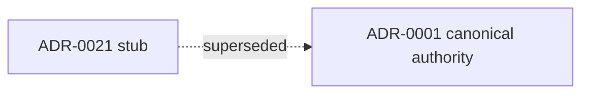

# ADR-0021: Runtime Authority — World-Engine as authoritative runtime host

## Status

Legacy — superseded by [ADR-0001](../adr-0001-runtime-authority-in-world-engine.md)

## Implementation Status

**This ADR is a superseded stub. All normative content lives in ADR-0001.**

- This file was an automated consolidation stub created during the 2026-04-17 migration.
- Its decision content duplicated ADR-0001 which has the richer, authoritative treatment.
- Moved to `docs/ADR/legacy/` — do not extend or amend this file.
- Read [ADR-0001](../adr-0001-runtime-authority-in-world-engine.md) instead.

## Date

2026-03-30 (stub); supersession recorded 2026-04-17

## Intellectual property rights

Repository authorship and licensing: see project LICENSE; contact maintainers for clarification.

## Privacy and confidentiality

This ADR contains no personal data. Implementers must follow the repository privacy and confidentiality policies, avoid committing secrets, and document any sensitive data handling in implementation steps.

## Related ADRs

- [ADR-0001](adr-0001-runtime-authority-in-world-engine.md) — **canonical** runtime authority decision (read this instead of this file).

## Context

This file was an **automated consolidation stub** created while migrating narrative. Its bullets duplicated the later, richer **ADR-0001** record and linked technical docs. **Do not extend this file** — amend ADR-0001 or add a new ADR if authority shifts.

## Decision

_(Void — see ADR-0001.)_

## Consequences

_(Void — see ADR-0001.)_

## Diagrams

This record is a **superseded stub**; authority topology lives in **ADR-0001**.

## Testing

_(N/A — superseded.)_

## References

- [ADR-0001: Runtime authority in world-engine](adr-0001-runtime-authority-in-world-engine.md)
- [`docs/technical/runtime/runtime-authority-and-state-flow.md`](../technical/runtime/runtime-authority-and-state-flow.md)
- [`migration_from_archive_2026-04-17.md`](migration_from_archive_2026-04-17.md)
