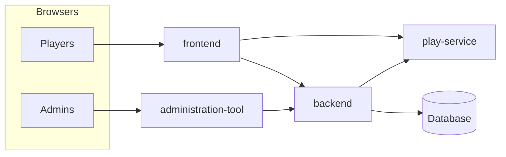

# Deployment guide

Operator-focused guide to running the **four-application stack**: backend, frontend, administration tool, and **play service** (world-engine). For day-2 procedures after boot, see [Operations runbook](operations-runbook.md).

## Topology



## Docker Compose (reference layout)

Root `docker-compose.yml` defines:

| Compose service | Image build context | Published ports (default) |
|-----------------|---------------------|---------------------------|
| `backend` | `backend/Dockerfile` | Host `8000` → container `8000` |
| `frontend` | `frontend/Dockerfile` | Host `5002` → `5002` |
| `administration-tool` | `administration-tool/Dockerfile` | Host `5001` → `5001` |
| `play-service` | `world-engine/Dockerfile` | Host `8001` → container `8000` |

**Bare-metal local development** often uses **different host ports** (e.g. backend on `5000`); see [Local development and test workflow](../dev/local-development-and-test-workflow.md). **Always align** `BACKEND_API_URL`, `PLAY_SERVICE_PUBLIC_URL`, `PLAY_SERVICE_INTERNAL_URL`, and CORS settings with the URLs clients actually use.

## Required environment themes (minimum)

### Backend

- **Secrets:** `SECRET_KEY`, `JWT_SECRET_KEY` (use strong random values in production).
- **CORS / frontend:** `CORS_ORIGINS`, `FRONTEND_URL`.
- **Play service integration:** `PLAY_SERVICE_INTERNAL_URL`, `PLAY_SERVICE_PUBLIC_URL`, `PLAY_SERVICE_SHARED_SECRET`, `PLAY_SERVICE_INTERNAL_API_KEY` — must match play service configuration.
- **Runtime governance Redis:** production must use a passworded `rediss://` `REDIS_URL` backed by a named ACL user, not the unauthenticated local Compose URL.

### Play service (`play-service`)

- `PLAY_SERVICE_SECRET` — must match backend `PLAY_SERVICE_SHARED_SECRET`.
- `PLAY_SERVICE_INTERNAL_API_KEY` — must match backend internal key.
- `RUN_STORE_BACKEND` — local stacks may use `json`; production should use `sqlalchemy` on encrypted managed DB/storage or `json_aead` with `WORLD_ENGINE_JSON_AEAD_KEY` from the production secret store.
- `RUN_STORE_URL` — required for SQL-backed runtime persistence.
- `WORLD_ENGINE_JSON_AEAD_KEY` — 32-byte base64url key for AEAD JSON persistence when `RUN_STORE_BACKEND=json_aead`.

### Frontend

- `BACKEND_API_URL` — reachable URL for server-side frontend calls (in Compose, use service DNS name `http://backend:8000`).
- `PLAY_SERVICE_PUBLIC_URL` — browser-reachable play URL (often `http://localhost:8001` on developer machines).

### Administration tool

- `BACKEND_API_URL` — backend base URL for admin API calls.

## Security governance and secrets

Use [Security governance](security-governance.md) to record the desired production posture for CSRF/cookie policy, production secret-store usage, local `docker-up.py` bootstrap preservation, and Redis hardening.

For production:

- Materialize `SECRET_KEY`, `JWT_SECRET_KEY`, play-service shared secrets, database credentials, Redis passwords, Langfuse secrets, and provider credentials from a dedicated secret store or orchestrator-native secret mechanism before services start.
- Keep rotation, audit, and access-separation evidence in your deployment/IaC or internal ops wiki.
- Preserve local `.env` bootstrap for `python docker-up.py init-env` and `python docker-up.py up`; production secret-store integration must not make local Compose depend on cloud login or production secret-store access.

## Database

- Run **migrations** from the backend image or release process (`flask db upgrade` or your CI equivalent) before serving traffic.
- Back up the database on a schedule appropriate to your RPO/RTO; document restore drills in [Operations runbook](operations-runbook.md).
- Production database storage must be encrypted through the managed database/KMS configuration or through documented encrypted volumes. Record the evidence in `/manage/security-governance`.

## World-engine runtime store

Production must not rely on plain local JSON runtime files. Choose one supported pattern:

- `RUN_STORE_BACKEND=sqlalchemy` with `RUN_STORE_URL` pointing to an encrypted managed database or encrypted volume-backed database.
- `RUN_STORE_BACKEND=json_aead` with `WORLD_ENGINE_JSON_AEAD_KEY` injected from the production secret store; this writes `*.json.enc` AES-256-GCM envelopes for world-engine JSON persistence.

Keep `RUN_STORE_BACKEND=json` for local/dev only unless the host/volume encryption evidence is complete and recorded.

## Redis

Production must not reuse the local app Redis defaults. Run:

```bash
python docker-up.py init-production-redis
python docker-up.py validate-production-redis
```

Then start Compose with `python docker-up.py --production-redis up` or carry the generated contract into your orchestrator:

- app Redis and Langfuse Redis are separate instances/hosts
- both use named ACL users and distinct passwords
- both use TLS (`rediss://`) with CA validation
- no Redis service is published as a host port
- Langfuse Redis keeps `maxmemory-policy=noeviction`

## TLS and reverse proxies

Production should terminate **TLS** at a reverse proxy or load balancer in front of frontend, admin, backend, and play endpoints. Exact configuration is environment-specific; record chosen hostnames and certificates in your internal ops wiki and link from the [documentation registry](../reference/documentation-registry.md).

## Health checks

- Use backend and play-service **health** endpoints (see package READMEs and `docs/operations/RUNBOOK.md`) in load balancers.
- Configure **timeouts** compatible with longest legitimate requests (play turns may exceed quick API calls).

## Related

- [Operations runbook](operations-runbook.md)
- [System map](../start-here/system-map-services-and-data-stores.md)
- [Security and compliance overview](security-and-compliance-overview.md)
