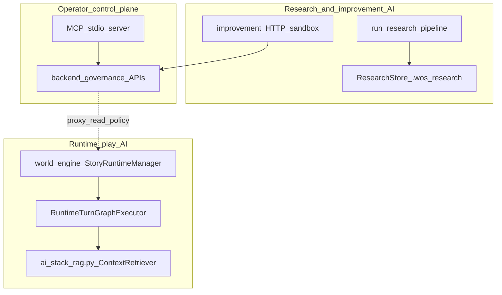
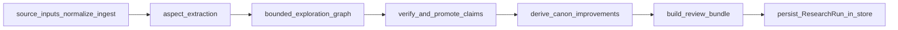
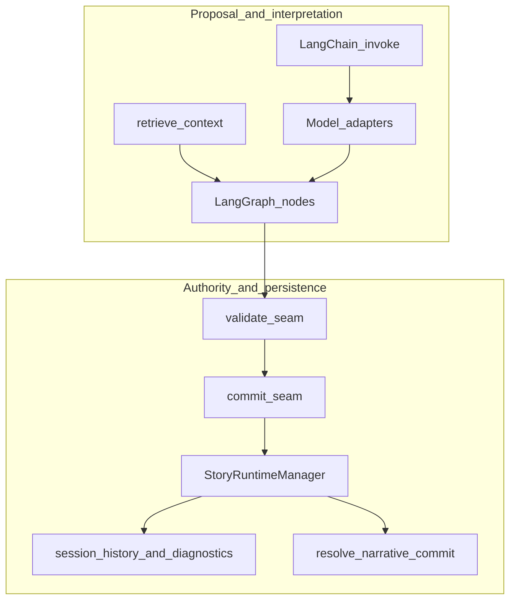
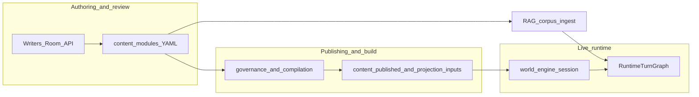
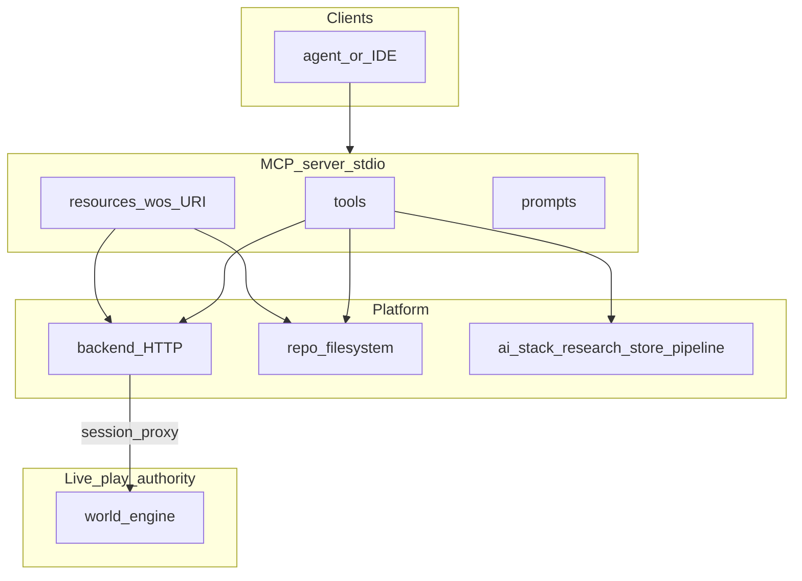
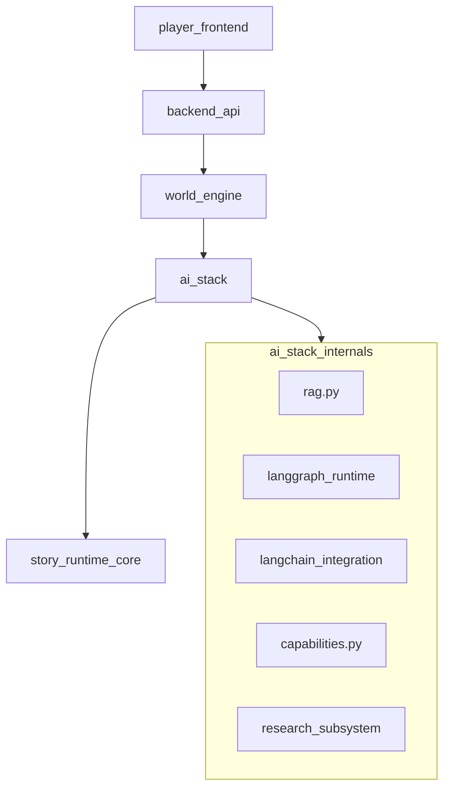
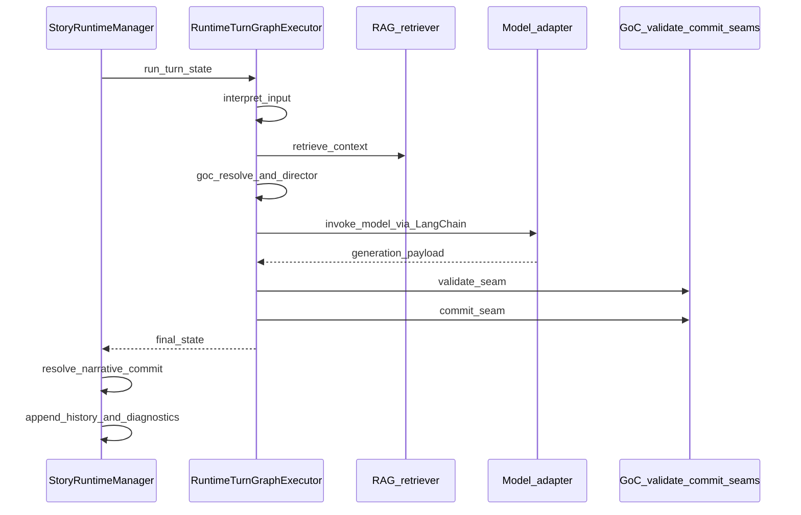

# AI in World of Shadows — Connected System Reference

## Title and purpose

This document is the **canonical spine** for AI in this repository: how retrieval, orchestration, model routing, runtime authority, authoring workflows, **research and canon-improvement tooling**, and **operator surfaces (including MCP)** fit together. It is written for contributors who need a **system picture**, not a collection of disconnected buzzwords.

**Companion pages** (detail, maintained alongside code):

- [AI stack overview](../technical/ai/ai-stack-overview.md)
- [How AI fits the platform](../start-here/how-ai-fits-the-platform.md)
- [RAG](../technical/ai/RAG.md), [LLM / SLM routing](../technical/ai/llm-slm-role-stratification.md)
- [Improvement and research loops](../technical/ai/improvement_loop_in_world_of_shadows.md)
- [LangGraph](../technical/integration/LangGraph.md), [LangChain](../technical/integration/LangChain.md), [MCP](../technical/integration/MCP.md)
- [Runtime authority and state flow](../technical/runtime/runtime-authority-and-state-flow.md), [World-engine narrative commit](../technical/runtime/world_engine_authoritative_narrative_commit.md)
- [MCP suite map (practical)](../mcp/MVP_SUITE_MAP.md) and [MCP server developer guide](../dev/tooling/mcp-server-developer-guide.md)

---

## Scope and source of truth

**Order of truth:**

1. **Implementation** in this repository (Python modules, server entrypoints, contracts under `docs/` that are explicitly normative).
2. **Runtime- and server-facing code paths** (world-engine turn loop, backend HTTP routes, MCP stdio server).
3. **Documentation** that is kept aligned with the above.
4. **Tests** as supporting evidence for behavior, not as a substitute for reading production code.
5. **Inference** — only when the code is genuinely ambiguous; label it explicitly.

**Archive warning:** Older summaries under [`docs/archive/architecture-legacy/`](../archive/architecture-legacy/) may describe components as “planned.” When archive text disagrees with the current tree, **trust the implemented modules** (for example `ai_stack/langgraph_runtime.py`, `ai_stack/research_langgraph.py`, `tools/mcp_server/server.py`) and the normative slice contracts linked from this doc.

**Graph version (code):** `RUNTIME_TURN_GRAPH_VERSION` in `ai_stack/version.py`.

---

## Executive overview

**Reading shorthand:** **LLM** means a large language model pool (higher-capacity adapters); **SLM** means a small or efficient model pool (faster or cheaper adapters). **GoC** means the God of Carnage vertical slice contract family (`docs/VERTICAL_SLICE_CONTRACT_GOC.md`).

World of Shadows uses **three distinguishable AI-related planes** that share libraries but serve different jobs:

| Plane | Role | Primary anchors |
|--------|------|------------------|
| **Runtime play AI** | Per-turn interpretation, retrieval, direction, model calls, validation/commit inside the live narrative pipeline | `ai_stack/langgraph_runtime.py`, `world-engine/app/story_runtime/manager.py` |
| **Research / improvement AI** | Bounded exploration over sources, structured claims, optional canon-issue and **non-publish** proposal previews; **separate** sandbox experiment loop for module variants | `ai_stack/research_*.py`, `ai_stack/canon_improvement_engine.py`, `backend/app/api/v1/improvement_routes.py` |
| **Operator / control-plane AI** | Tools and APIs for inspection, diagnostics, governance packages—not a second story runtime | `tools/mcp_server/`, backend governance and session APIs |

Across all planes: **models and graphs propose**; **validation, commit rules, and the session host** decide what becomes **live session truth**. RAG supplies **context**, not canon. **MCP** exposes **tools, resources, and prompts** for operators; it does not replace the play service’s authority.

### Diagram: AI planes in World of Shadows

*Anchored in:* `ai_stack/langgraph_runtime.py` (runtime graph), `ai_stack/research_langgraph.py` (research pipeline), `tools/mcp_server/server.py` (MCP control plane).

**What this clarifies:** Runtime play, research storage, sandbox improvement, and MCP sit in **different authority zones**. They may share **routing and capability** patterns in the backend, but they are not one interchangeable “AI blob.”

---

## AI as participant, not authority

### Plain language

AI helps interpret input, retrieve relevant text, propose narrative structure, run bounded research, and enrich operator workflows. It does **not** own committed story state: the platform **checks** proposals and **records** only what rules allow.

### Technical precision

- **`ai_stack`:** Turn graph execution, RAG, LangChain bridges, **capabilities** (`ai_stack/capabilities.py`), **research pipeline** (`ai_stack/research_langgraph.py`, `research_store.py`). Outputs are **inputs to validation** or **review-bound artifacts** until host or governance accepts them.
- **`story_runtime_core`:** Shared adapters, registry patterns used by world-engine and backend paths.
- **`world-engine`:** Authoritative host for live `StorySession` lifecycle, turn execution, diagnostics, and bounded narrative commit after the graph returns (`world-engine/app/story_runtime/manager.py`).
- **`backend`:** Policy, auth, Writers’ Room, improvement HTTP surfaces, proxy to play—**not** a parallel authoritative runtime for the canonical play path.

### Why this matters

Without this split, debugging “why did the scene change?” collapses into opaque model behavior. The repo encodes separation: graph diagnostics, validation outcomes, commit records, and `resolve_narrative_commit` give inspectable reasons.

### What this is not

Not the claim that “the LLM is only chat.” Models can be deeply involved—but **authority** for committed runtime effects is **elsewhere**.

### Neighbors

Feeds every later section: RAG, LangGraph, LangChain, routing, capabilities, research store, MCP.

---

## The major AI building blocks

Each subsection: **plain language** → **technical** → **why WoS** → **what it is not** → **neighbors**.

### LLM — synthesis under guardrails

**Plain:** Larger models are used where nuanced language or structured narrative output is needed; routing can prefer cheaper models for smaller jobs.

**Technical:** `TaskKind` values such as `narrative_formulation` and `scene_direction` are **LLM-biased** in `TASK_ROUTING_MODE` (`backend/app/runtime/model_routing.py`). On the canonical GoC (God of Carnage) play path, the **world-engine** graph invokes the routed adapter after `route_model` (`ai_stack/langgraph_runtime.py`). Traces capture routing decisions and degradation. Backend `execute_turn_with_ai` uses a **separate** multi-stage routing path when enabled ([llm-slm-role-stratification.md](../technical/ai/llm-slm-role-stratification.md)).

**Why WoS:** Drama and ambiguity need capacity; the project still refuses to let that capacity short-circuit validation.

**Not:** LLM output is not canonical authored YAML and not committed runtime truth until seams and host resolution say so.

**Neighbors:** SLM-biased stages; LangChain parsers; RAG context; GoC slice seams.

### SLM — fast, bounded work

**Plain:** Smaller or cheaper models handle classification-like or preflight work when policy allows.

**Technical:** `TASK_ROUTING_MODE` marks several task kinds as **SLM-first** (e.g. `classification`, `cheap_preflight`, `ranking`). Staged orchestration in `backend/app/runtime/runtime_ai_stages.py` (from `execute_turn_with_ai` in `backend/app/runtime/ai_turn_executor.py`) runs preflight → signal → ranking → conditional synthesis with explicit traces when stages skip or degrade. Session metadata can disable staging (`runtime_staged_orchestration`).

**Why WoS:** Cost, latency, and predictable bounded calls matter at scale.

**Not:** SLM-first routing does not mean “SLM replaces the LangGraph turn graph” on the world-engine path; it shapes **which adapter** runs for **which routing request** on backend-orchestrated surfaces.

**Neighbors:** `routing_registry_bootstrap.py`, `model_routing_evidence.py`, Writers’ Room and improvement routes (shared routing evidence shapes).

### LangGraph — orchestration without owning the session

**Plain:** LangGraph defines the **order of steps** in a turn: interpret, retrieve, align to slice, direct, call the model, normalize, validate, commit, render, package.

**Technical:** `RuntimeTurnGraphExecutor` (`ai_stack/langgraph_runtime.py`) compiles a `StateGraph` whose nodes include `interpret_input`, `retrieve_context`, `goc_resolve_canonical_content`, director nodes, `route_model`, `invoke_model`, optional `fallback_model`, `proposal_normalize`, `validate_seam`, `commit_seam`, `render_visible`, `package_output`.

**Why WoS:** A single explicit graph makes operator diagnostics (`graph_diagnostics`, node outcomes, fallback markers) possible.

**Not:** LangGraph does not replace `StoryRuntimeManager`; the host still owns `turn_counter`, `history`, `diagnostics`, `resolve_narrative_commit`, and narrative threads.

**Neighbors:** LangChain inside `invoke_model`; RAG in `retrieve_context`; world-engine calls `turn_graph.run(...)` then persists.

### LangChain — integration inside nodes, not a second runtime

**Plain:** LangChain builds prompts and parses structured model output where the project uses that stack.

**Technical:** `invoke_runtime_adapter_with_langchain` bridges templates and parsers in the graph; Writers’ Room uses `invoke_writers_room_adapter_with_langchain` and retriever bridges (`docs/technical/integration/LangChain.md`).

**Why WoS:** Structured JSON and retriever integration without forking a separate orchestration framework.

**Not:** LangChain is not the authority for validation/commit; it is an invocation helper.

**Neighbors:** LangGraph `invoke_model`; graph fallback when mock or unparseable.

### RAG — retrieval is context, not canon

**Plain:** The system searches project-owned material to build **context packs** for prompts.

**Technical:** `ai_stack/rag.py` — local corpus (e.g. under `.wos/rag/`), sparse and optional hybrid embeddings, profiles and governance lanes. Ingestion paths are documented in [RAG.md](../technical/ai/RAG.md).

**Why WoS:** Grounding in repository text improves relevance while keeping governance separate from “what the model read last.”

**Not:** Retrieved chunks are not authoritative narrative state; authored module YAML under `content/modules/` remains the slice’s primary authored source unless product policy says otherwise.

**Neighbors:** `retrieve_context` node; capability `wos.context_pack.build`; Writers’ Room domains.

### Governed capabilities (inside processes)

**Plain:** Named, mode-gated operations (context packs, transcripts, review bundles, research explore) run **inside** backend or graph code with schemas and audit semantics—not as ad-hoc string APIs.

**Technical:** `ai_stack/capabilities.py` defines capabilities such as `wos.context_pack.build`, `wos.transcript.read`, `wos.review_bundle.build`, and the research/canon tools (`wos.research.explore`, …) with `CapabilityKind`, per-capability **allowed_modes** (for example `runtime` / `writers_room` / `improvement` / `admin` for core narrative workflows, and `research` / `admin` / `improvement` for the research surface), plus denial/audit behavior.

**Why WoS:** Same vocabulary for “what is allowed in which mode” across runtime, Writers’ Room, improvement, and MCP catalog mirroring.

**Not:** Capabilities are **not** the full MCP product; MCP adds **transport, suite filtering, resources, prompts**, and stdio JSON-RPC (`tools/mcp_server/server.py`).

**Neighbors:** [MCP.md](../technical/integration/MCP.md); `mcp_canonical_surface.py` for tool descriptors and suite membership.

---

## Research, sandbox improvement, and canon improvement (first-class)

This is a **real subsystem**, not a footnote: structured intake, exploration graphs, claims, validation promotion rules, review bundles, and deterministic canon-issue/proposal derivation live under `ai_stack/research_*.py`, `ai_stack/canon_improvement_engine.py`, and `ai_stack/research_contract.py`.

### Plain language

**Research** here means: ingest source material, extract **aspects**, run **budget-limited** exploration that branches hypotheses, promote **claims** when evidence and contradiction checks allow, optionally derive **canon issues** and **improvement proposals** as **review-only** artifacts. Nothing in this path automatically rewrites `content/modules/` or live session state.

**Sandbox improvement** (backend) is a **separate** loop: variant modules, isolated experiment runs, metrics, recommendation packages for governance—documented in [improvement_loop_in_world_of_shadows.md](../technical/ai/improvement_loop_in_world_of_shadows.md).

### Technical precision

- **Contracts and enums:** `ai_stack/research_contract.py` — `ResearchStatus`, exploration relation types, abort reasons, canon issue and proposal types, legal status transitions.
- **Persistence:** `ai_stack/research_store.py` — JSON store at `.wos/research/research_store.json` (schema `research_store_v1`), buckets for sources, anchors, aspects, exploration nodes/edges, claims, issues, proposals, runs.
- **Pipeline orchestration:** `ai_stack/research_langgraph.py` — `run_research_pipeline` runs normalize/ingest (`research_ingestion.py`), aspect extraction (`research_aspect_extraction.py`), bounded exploration (`research_exploration.py`), claim verification (`research_validation.py`), canon improvement derivation (`canon_improvement_engine.py`), and embeds a **review bundle** in the run record (`build_review_bundle`). Bundle flags include `canon_mutation_permitted: false`.
- **Canon improvement engine:** `ai_stack/canon_improvement_engine.py` — keyword-driven issue classification from validated claims, `ImprovementProposalRecord` with `preview_patch_ref` and `mutation_allowed: false` in previews.
- **Orchestration entry (deterministic Python):** `ai_stack/research_langgraph.py` sequences the stages above for callers such as MCP (`tools/mcp_server/tools_registry.py`). Despite the filename, this module does **not** compile a LangGraph `StateGraph`; runtime turn orchestration remains in `langgraph_runtime.py`.

### Why this matters in World of Shadows

Authors and operators need a **bounded** way to turn notes and sources into **structured, inspectable** artifacts that can feed human review—without conflating “exploration output” with “published canon” or “committed play state.”

### What this is not

- Not automatic publishing of modules.
- Not a replacement for the runtime turn graph.
- Not the same as sandbox **experiment** metrics (that loop lives under improvement HTTP APIs).

### Neighbors

- **MCP `wos-ai` suite** tools call into `research_langgraph` and the store (`tools/mcp_server/tools_registry.py`).
- **Capabilities:** Research-related capabilities use allowed modes `research`, `admin`, and `improvement` in `capabilities.py` (audit-required); they are distinct from the core `runtime` / `writers_room` context-pack surface.
- **RAG:** The research subsystem persists to `.wos/research/`; **retrieval** for research-shaped prompts can use `RetrievalDomain.RESEARCH` / profile `research_eval` when callers build `RetrievalRequest` that way ([RAG.md](../technical/ai/RAG.md)).
- **Sandbox improvement:** shares **model routing evidence** patterns with Writers’ Room but uses different persistence and endpoints.

### Diagram: Research pipeline (control flow)

*Anchored in:* `ai_stack/research_langgraph.py` (`run_research_pipeline`), `ai_stack/research_exploration.py`, `ai_stack/research_validation.py`, `ai_stack/canon_improvement_engine.py`.

**What this clarifies:** Exploration and canon-improvement derivation are **sequential stages inside one pipeline**; the bundle explicitly marks governance posture (`silent_mutation_blocked`, `canon_mutation_permitted: false` in `build_review_bundle`).

---

## Runtime authority and AI boundaries

### Plain language

**Live play** is owned by **world-engine**. AI produces **proposals** and **diagnostics**; **validation/commit** rules and the session host decide what is **remembered** as committed turn history.

### Technical precision

- **Inside the graph:** `validate_seam` → `commit_seam` (GoC slice seams; `ai_stack/goc_turn_seams.py` and contract docs).
- **Host after `run()`:** `resolve_narrative_commit` builds `StoryNarrativeCommitRecord` (`world-engine/app/story_runtime/commit_models.py`).
- **Backend `ai_turn_executor`:** Documented as **transitional** for in-process `SessionState` loops—not a parallel live runtime to world-engine.

### Diagram: Proposal vs authority

*Anchored in:* `ai_stack/langgraph_runtime.py`, `world-engine/app/story_runtime/manager.py`.

---

## From authored material to live runtime

### Plain language

Authors work in **module sources** and review flows; publishing and compilation make content available to the game; **RAG** may ingest overlapping paths for **prompt context**—but **runtime projection** and **contracts** define what the play host uses.

### Technical precision

- **Authored source:** `content/modules/` (slice canon for the GoC vertical slice, per platform docs).
- **RAG:** Broader paths; see [RAG.md](../technical/ai/RAG.md).
- **Writers’ Room:** Backend `/api/v1/writers-room/...` with LangChain-backed flows.

### Diagram: Content and context lifecycles

---

## MCP — control plane, not a second runtime

### Plain language

MCP is a **stdio JSON-RPC server** that exposes **tools** (actions), **resources** (stable `wos://` reads), and **prompts** (workflow recipes), grouped into **suites** for least-privilege use. It reaches the **backend** and **repo filesystem**; it does not silently become the authoritative turn engine.

### Technical precision

- **Descriptors and suites:** `ai_stack/mcp_canonical_surface.py` — `CANONICAL_MCP_TOOL_DESCRIPTORS`, `McpSuite` (`wos-admin`, `wos-author`, `wos-ai`, `wos-runtime-read`, `wos-runtime-control`), tool classes (`read_only`, `review_bound`, `write_capable`), `build_compact_mcp_operator_truth`.
- **Server:** `tools/mcp_server/server.py` — `initialize` advertises tools, resources, prompts; `handle_tools_call` enforces `WOS_MCP_OPERATING_PROFILE` for write-capable tools.
- **Resources and prompts:** `ai_stack/mcp_static_catalog.py` + `tools/mcp_server/resource_prompt_support.py`.
- **Capability mirror:** `wos.capabilities.catalog` tool uses `capability_records_for_mcp()` — **no** `CapabilityRegistry.invoke` through MCP (`mcp_canonical_surface.py` module docstring).

### Diagram: MCP vs runtime and backends

*Anchored in:* `tools/mcp_server/server.py`, `tools/mcp_server/backend_client.py`, `ai_stack/mcp_canonical_surface.py`.

**What this clarifies:** MCP is an **operator/agent front-end**. It may trigger **guarded** backend calls (for example session snapshot or `execute_turn` policy); it does **not** replace `StoryRuntimeManager` or module publish workflows.

**Full reference:** [MCP.md](../technical/integration/MCP.md), [MVP_SUITE_MAP.md](../mcp/MVP_SUITE_MAP.md).

---

## How the layers work together (runtime turn)

High-level node order lives in `RuntimeTurnGraphExecutor._build_graph` and [ai-stack-overview.md](../technical/ai/ai-stack-overview.md). Normative field names: [`VERTICAL_SLICE_CONTRACT_GOC.md`](../VERTICAL_SLICE_CONTRACT_GOC.md).

**Not every HTTP handler runs the full LangGraph path** — follow the call chain from the handler you care about (`backend` vs `world-engine`).

### Diagram: Primary runtime components

---

## Telemetry and diagnostics

### Plain language

Turns emit **structured diagnostics**: graph health, validation hints, trace IDs—so operators can answer “what path ran?” without reading raw prompts.

### Technical precision

- **Graph:** `graph_diagnostics` on turn state.
- **Session events:** `StoryRuntimeManager` appends diagnostics (`retrieval`, `model_route`, `graph`, `validation_outcome`, `committed_result`, …).
- **Trace ID:** Backend may forward `X-WoS-Trace-Id` toward world-engine (`backend/app/services/game_service.py` pattern).

**Not:** A guarantee that every deployment exports to a third-party APM; the repo emphasizes JSON-shaped diagnostics and logs.

---

## AI turn execution sequence (canonical play)

`StoryRuntimeManager.execute_turn` (simplified): increment counter → `turn_graph.run(...)` → `resolve_narrative_commit(...)` → `update_narrative_threads(...)` → append `history` / `diagnostics` → return event payload.

---

## System-wide interaction model

| Layer | Responsibility |
|--------|------------------|
| Frontend | UX, calls backend |
| Backend | Auth, governance, Writers’ Room, improvement, proxy to play |
| World-engine | Session authority, invokes `ai_stack` graph |
| ai_stack | RAG, graph, LangChain, capabilities, research pipeline |
| story_runtime_core | Shared adapters / interpretation |
| MCP / Admin | Operator tooling and visibility |

**Typical live turn:** Client → Backend → World-engine → LangGraph (RAG + director + model + seams) → Manager persistence → Response with visible bundle and diagnostics.

**Typical review workflow:** Writers’ Room API → LangChain-backed **draft** outputs for humans—not automatic promotion to live play.

**Research workflow:** Source inputs → `run_research_pipeline` → persisted run + bundle → human review; optional MCP tools under `wos-ai` suite.

---

## Open seams and growth (honest)

- **Backend `ai_turn_executor`:** Transitional for in-process `SessionState`; keep separate from world-engine GoC path.
- **LangGraph checkpointing:** Described in [LangGraph.md](../technical/integration/LangGraph.md); verify before assuming durable graph replay in production.
- **Research `wos.research.validate` (MCP):** Returns a **summary view** of an existing run’s claim ids (`tools/mcp_server/tools_registry.py`); full verification runs inside `run_research_pipeline` via `verify_and_promote_claims` (`ai_stack/research_validation.py`).

---

## Conclusion

AI in World of Shadows is a **relationship system**: **RAG** supplies retrieved context; **LangGraph** supplies ordered **runtime** orchestration; **LangChain** supplies structured invocation; **routing** assigns LLM- vs SLM-biased work; **capabilities** govern named operations inside services; **research and canon-improvement** supply **bounded, review-bound** structured artifacts; **MCP** supplies **operator control-plane** tools, resources, and prompts; **world-engine** supplies **runtime authority** after validation and commit.

**One sentence:** Retrieval and exploration feed **proposals and review artifacts**; seams, the session host, and governance feeds feed **truth and publish decisions**.

---

## Navigation

| Topic | Document |
|--------|----------|
| Graph nodes and diagnostics | [LangGraph.md](../technical/integration/LangGraph.md) |
| RAG profiles and ingestion | [RAG.md](../technical/ai/RAG.md) |
| Routing matrix and traces | [llm-slm-role-stratification.md](../technical/ai/llm-slm-role-stratification.md) |
| Research vs sandbox improvement | [improvement_loop_in_world_of_shadows.md](../technical/ai/improvement_loop_in_world_of_shadows.md) |
| MCP suites, tools, resources | [MCP.md](../technical/integration/MCP.md), [MVP_SUITE_MAP.md](../mcp/MVP_SUITE_MAP.md) |
| Play vs backend ownership | [runtime-authority-and-state-flow.md](../technical/runtime/runtime-authority-and-state-flow.md) |
| Normative GoC contract | [VERTICAL_SLICE_CONTRACT_GOC.md](../VERTICAL_SLICE_CONTRACT_GOC.md) |
