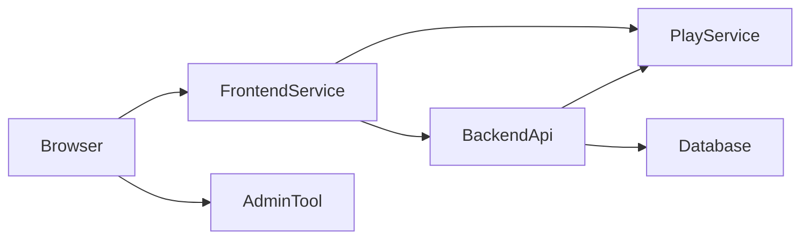

# Architecture Overview

World of Shadows uses a multi-service architecture with explicit ownership boundaries.

## Services

- `frontend/` - player/public presentation
- `administration-tool/` - admin/management presentation (separate by design)
- `backend/` - API/business/auth/policy integration service
- `world-engine/` - authoritative runtime and websocket execution

## Interaction model

## Key decisions

1. Backend does not host canonical player/public HTML pages.
2. Legacy `backend/app/web/*` exists only for compatibility redirects and infrastructure fallback.
3. Administration UI is intentionally isolated in `administration-tool/`.
4. Runtime execution authority remains in `world-engine`.

## Related docs

- `docs/architecture/ServerArchitecture.md`
- `docs/architecture/FrontendBackendRestructure.md`
- `docs/architecture/ai_stack_in_world_of_shadows.md`
- `docs/architecture/runtime_authority_decision.md`
- `docs/architecture/canonical_authored_content_model.md`
- `docs/architecture/player_input_interpretation_contract.md`
- `docs/development/LocalDevelopment.md`
- `docs/operations/RUNBOOK.md`
