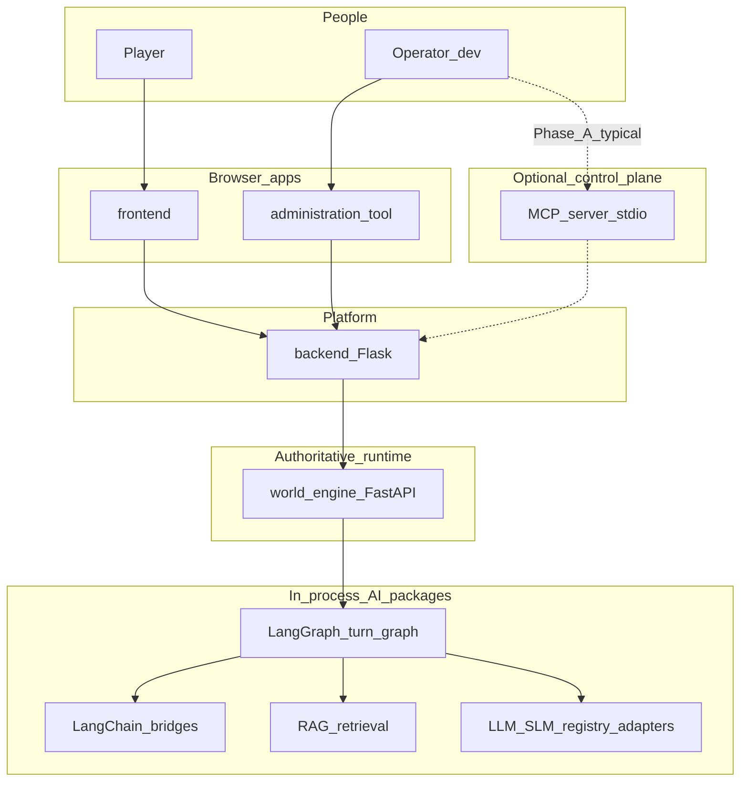
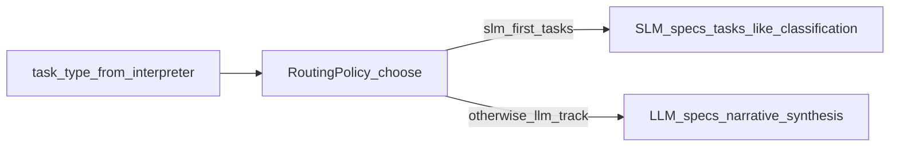
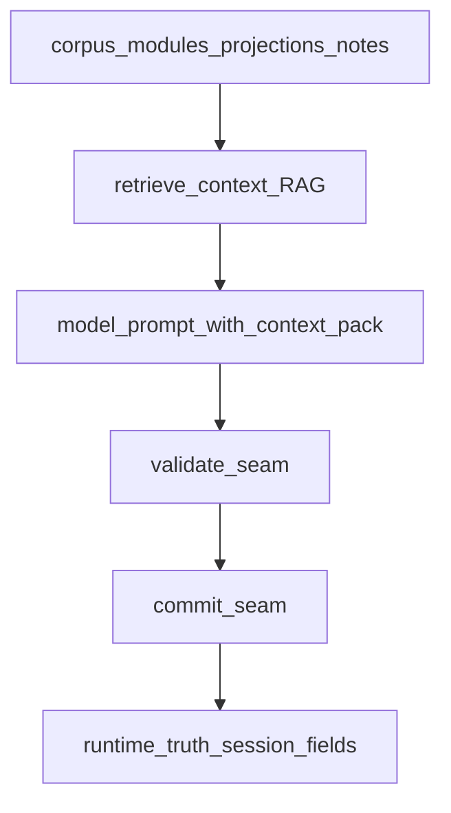
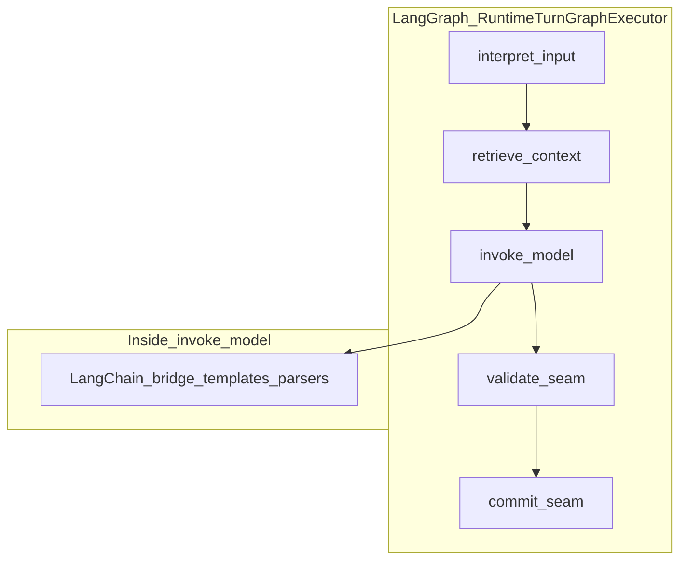
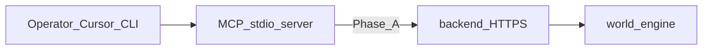
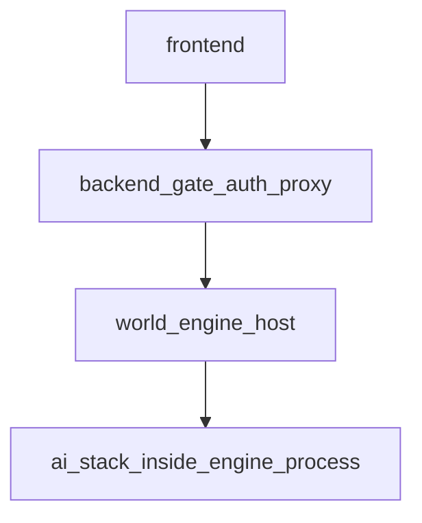
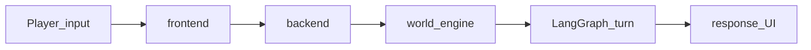
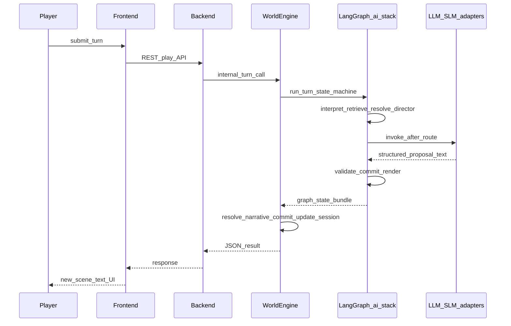
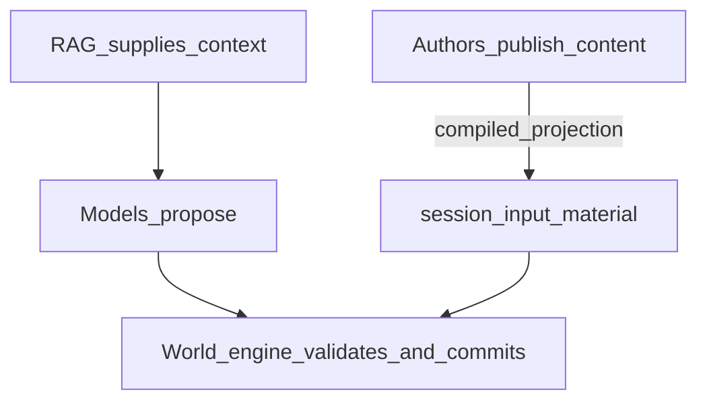

# AI stack in World of Shadows — Easy system explainer

## Title and purpose

This document explains **how the AI-related parts of World of Shadows fit together**: models, retrieval, orchestration libraries, the backend, the **World Engine**, **MCP**, and what the **player** actually sees.

It is **connected explanation**, not a buzzword list. For “how to start the repo,” see [Getting started with World of Shadows](getting_started_with_world_of_shadows.md). For the play service alone, see [World Engine — easy runbook](world_engine_runbook_easy.md).

---

## A note about source of truth

Order of trust:

1. **Code** — especially `ai_stack/`, `story_runtime_core/`, `world-engine/app/story_runtime/`, `backend/app/services/`.
2. **Docs** — e.g. `docs/technical/ai/ai-stack-overview.md`, `docs/start-here/how-ai-fits-the-platform.md`, `docs/technical/integration/LangGraph.md`, `docs/technical/integration/LangChain.md`, `docs/technical/integration/MCP.md`.

If product language and file names differ, this text points to the **nearest real seam**.

---

## The shortest useful picture of the whole system

### Simple explanation

1. The **player** types or clicks in the **frontend**.
2. The **backend** receives the request, checks **who you are** and **policy**, and forwards **play work** to the **World Engine** (play service).
3. Inside the engine, a **turn pipeline** runs: interpret input, **look up context**, align to authored story material, call **models** where needed, then **check** and **commit** what is allowed.
4. **AI helpers** (retrieval, prompts, structured parsing, graph steps) run **inside** that pipeline—they do **not** silently rewrite the official game state on their own.
5. The **result** (text, state summaries, errors) travels back through the backend to the **player**.

### What this means in the actual system

- Story turns: `StoryRuntimeManager.execute_turn` in `world-engine/app/story_runtime/manager.py` calls `RuntimeTurnGraphExecutor.run` from `ai_stack/langgraph_runtime.py`, then `resolve_narrative_commit` in `world-engine/app/story_runtime/commit_models.py`.
- Player-facing HTTP still goes through **`backend/`** for typical deployments (`backend/app/services/game_service.py` and related routes).

### Why it matters

You can tell a clear story: **suggest → validate → commit → show**—not “the model said it, so it happened.”

### What it is not

The AI stack folder (`ai_stack/`) is **not** a separate server you must start for a normal play loop; it is **libraries** loaded by the **World Engine** (and used from **backend** paths like Writers’ Room).

**In plain words:** The player talks to **websites and APIs**. The **engine** runs the **official turn machine**. **AI** is fuel for steps inside that machine.

### Big picture — players, gate, engine, AI libraries, operators

**Title:** One map of the main roles.

**Seams:** `world-engine/app/story_runtime/manager.py`, `ai_stack/langgraph_runtime.py`, `backend/app/services/game_service.py`, `tools/mcp_server/`.

**What to notice:** **LangGraph / LangChain / RAG / models** sit **under** the **World Engine** for runtime turns, not beside it as a second game server.

---

## Why the system uses more than one kind of model (LLM and SLM)

### Simple explanation

An **LLM** (large language model) is a big general model, good for rich language and synthesis. An **SLM** (small language model) is a smaller, often faster or cheaper model, good for simpler classification-style jobs. This project may route **different step types** to **different providers** so you do not use a sledgehammer for every nail.

### What this means in the actual system

- **Specs** (name, provider, `llm_or_slm`, timeouts) live in `story_runtime_core/model_registry.py` (`ModelSpec`, `build_default_registry`).
- **Routing** uses `RoutingPolicy.choose(task_type=...)` — certain **task types** prefer **SLM-first**; narrative-style work trends toward **LLM** with an SLM **fallback** id when registered (`RoutingPolicy` in the same file).
- **Adapters** that actually call APIs: `story_runtime_core/adapters.py` (`OpenAIChatAdapter`, `OllamaAdapter`, `MockModelAdapter`) — env vars like `OPENAI_API_KEY`, `OLLAMA_BASE_URL`.

### Why it matters

Cost, latency, and reliability can be balanced. A failed or missing key on one provider can degrade into **mock** or fallback paths while the graph still records what happened (`ai_stack/langgraph_runtime.py`).

### What it is not

Neither LLM nor SLM **is** the World Engine. They are **tools the engine’s pipeline may invoke** after **routing** chooses a provider.

**In plain words:** “Big model vs small model” is a **resource choice per job**, not the place where the story’s **official** scene id is stored.

### LLM vs SLM — different jobs in the pipeline

**Title:** Routing sends different work to different model classes.

**Seams:** `story_runtime_core/model_registry.py`, `ai_stack/langgraph_runtime.py` (`route_model` node).

**What to notice:** The **graph** asks “which model family?” before **`invoke_model`**.

---

## Why looking things up is not the same as knowing what is true (RAG)

### Simple explanation

**Retrieval** means: “Before we ask the model, **search** our own texts (modules, notes, projections) and **attach** the best snippets as **context** in the prompt.” **RAG** (retrieval-augmented generation) is that pattern: **look up**, then **generate** with those hints.

### What this means in the actual system

- Implementation: `ai_stack/rag.py` — domains such as **`runtime`**, **`writers_room`**, **`improvement`**, **`research`** (`RetrievalDomain`).
- On the **live turn graph**, the node **`retrieve_context`** builds a `RetrievalRequest` with domain **`RUNTIME`** (see `docs/technical/integration/LangGraph.md`, `ai_stack/langgraph_runtime.py`).
- Governance and lanes (what may surface to which caller) are part of the same module’s design; comments describe corpus storage under `.wos/rag/` and policy-style gates.

### Why it matters

Grounding reduces **hallucinated lore**. The player gets answers that **cite the same material** the team authored.

### What it is not

Retrieved text is **evidence for the model**, not **automatic game truth**. **Runtime truth** for story sessions still comes from **validation/commit** and engine-side records (`world-engine/app/story_runtime/commit_models.py`).

**In plain words:** RAG is a **library assistant** handing sticky notes to the model. The **referee** still decides what counts as an allowed state change.

### RAG truth boundary

**Title:** Context vs committed runtime.

**Seams:** `ai_stack/rag.py`, `ai_stack/langgraph_runtime.py`, `ai_stack/goc_turn_seams.py`, `world-engine/app/story_runtime/commit_models.py`.

**What to notice:** **RAG** feeds **prompt assembly**; **commit** sits **after** model proposals are checked.

---

## How LangChain helps and how LangGraph guides

### LangChain — integration helper, not the brain

#### Simple explanation

**LangChain** (here) is used to **shape prompts** and **parse structured outputs** (JSON-like shapes) when calling a model adapter—so the system gets **typed fields** instead of loose prose everywhere.

#### What this means in the actual system

- Primary area: `ai_stack/langchain_integration/` — e.g. `invoke_runtime_adapter_with_langchain` used from the LangGraph **`invoke_model`** node (`docs/technical/integration/LangChain.md`, `ai_stack/langgraph_runtime.py`).
- Writers’ Room uses parallel helpers (`invoke_writers_room_adapter_with_langchain`) from **backend** services (`backend/app/services/writers_room_service.py`).

#### Why it matters

Parser errors and template usage become **inspectable** alongside graph diagnostics instead of hidden regex hacks.

#### What it is not

LangChain **does not** define the **order** of turn steps and **does not** replace **validate/commit** authority (`docs/technical/integration/LangChain.md`).

---

### LangGraph — ordered steps for a controlled turn

#### Simple explanation

**LangGraph** implements a **state machine**: a fixed **sequence** (and small branches like **fallback**) for one narrative **turn**—interpret, retrieve, resolve content, direct drama, route model, invoke, normalize, validate, commit, render, package.

#### What this means in the actual system

- `RuntimeTurnGraphExecutor` in `ai_stack/langgraph_runtime.py` builds a `StateGraph` over `RuntimeTurnState`.
- Node order matches `docs/technical/integration/LangGraph.md` (interpret → retrieve → … → package_output).

#### Why it matters

Debugging is **node-level** (“which step failed?”) using `nodes_executed`, `node_outcomes`, and related diagnostics on the turn record.

#### What it is not

LangGraph is **not** the session host: counters, history append, and `resolve_narrative_commit` live in **`StoryRuntimeManager`** (`world-engine/app/story_runtime/manager.py`).

**In plain words:** **LangGraph** is the **recipe**; **LangChain** is a **utensil** used in one cooking step; **neither** is the **restaurant license** (authority).

### LangChain vs LangGraph — different layer

**Title:** Graph wraps steps; LangChain serves one step.

**Seams:** `ai_stack/langgraph_runtime.py`, `ai_stack/langchain_integration/bridges.py`.

**What to notice:** **LangChain** is **nested inside** a **single node**; the **graph** owns **before and after**.

---

## How MCP helps without becoming the world

### Simple explanation

**MCP** (Model Context Protocol) is a way for **tools** (search filesystem, call APIs, fetch resources) to talk to an **AI-enabled client** in a standard shape. In this repo, the **MCP server** is mainly an **operator / developer control plane**: stdio tools and resources—not the live player’s game brain.

### What this means in the actual system

- Server: `tools/mcp_server/` (see `docs/technical/integration/MCP.md`, `docs/mcp/MVP_SUITE_MAP.md`).
- Typical Phase A pattern: MCP runs **locally**, talks to **backend** over HTTPS (`docs/mcp/01_M0_host_and_runtime.md`).
- Canonical surface helpers: `ai_stack/mcp_canonical_surface.py` (per `docs/technical/ai/ai-stack-overview.md`).

### Why it matters

Operators can **inspect** health, content, and traces **without** merging that machinery into every player turn.

### What it is not

MCP is **not** `world-engine/` and **not** a replacement for **runtime authority** on sessions.

**In plain words:** MCP is a **walkie-talkie for staff**; the **match** still happens on the **field** (World Engine).

### MCP beside the runtime

**Title:** Operator path vs play host.

**Seams:** `tools/mcp_server/`, `docs/mcp/01_M0_host_and_runtime.md`, `world-engine/app/main.py`.

**What to notice:** No required arrow **MCP → world-engine** for normal player play.

---

## Why the backend is the gate and the engine is the judge

### Backend

#### Simple explanation

The **backend** is the main **API and policy gate**: login, data, forums, content compilation, and **proxying** to the play service. Browsers talk to it **first** for most flows.

#### What this means in the actual system

- Flask app under `backend/`; integration with play via `backend/app/services/game_service.py`.
- Also hosts Writers’ Room HTTP APIs (`backend/app/api/v1/writers_room_routes.py`) that use `ai_stack` from **backend** processes.

#### Why it matters

**Security and consistency** concentrate at the edge the UI already trusts.

#### What it is not

The backend **does not** replace the World Engine as **authoritative live play host** for story runtime (`docs/ADR/adr-0001-runtime-authority-in-world-engine.md`).

---

### World Engine

#### Simple explanation

The **World Engine** (`world-engine/`) runs **live sessions**. For story mode it **executes** the turn graph and then **commits** narrative results under rules (`resolve_narrative_commit`).

#### What this means in the actual system

`StoryRuntimeManager` in `world-engine/app/story_runtime/manager.py` wires `ai_stack` at startup and runs `execute_turn`.

#### Why it matters

Someone must be the **referee** for “what is true in this session right now.”

#### What it is not

Not the **admin UI**, not the **canonical YAML editor**, not **MCP**.

**In plain words:** Backend **delivers** the request safely; engine **decides** what the session may record.

### Backend, World Engine, and AI packages

**Title:** Gate vs host vs in-process AI.

**Seams:** `backend/app/services/game_service.py`, `world-engine/app/story_runtime/manager.py`, `ai_stack/langgraph_runtime.py`.

**What to notice:** **AI_stack** executes **inside** the **engine process** for story turns, not as a separate public microservice in the default design.

---

## What the player actually experiences

### Simple explanation

The player sees **pages**, **scene text**, **input boxes**, and sometimes **errors** or **degraded** notices. They do **not** open LangGraph, tweak RAG indexes, or “SSH into the model.”

### What this means in the actual system

- UI: `frontend/` routes such as play shell flows exercised in `frontend/tests/test_routes_extended.py`.
- The **visible bundle** and committed summaries are produced after graph **render** and **package** stages and returned through backend orchestration.

### Why it matters

**Playability** depends on the **whole chain**: if retrieval is empty, the model may be blinder; if validation blocks a bad proposal, the player may see a safer continuation.

### What it is not

The player is **not** responsible for knowing **which node** ran—unless you expose diagnostics to operators only.

**In plain words:** The player feels **one story**; underneath, it is a **pipeline** with guardrails.

### Player to result — simplified flow

**Title:** One click’s journey.

**Seams:** `frontend/` play routes, `backend/app/services/game_service.py`, `world-engine/app/story_runtime/manager.py`.

**What to notice:** **LangGraph** is **inside** `WE`, not a box the player visits.

---

## How all of this works together

### Simple explanation

**Order of participation** on a typical **God of Carnage** story turn:

1. **Frontend → backend** — HTTP with auth/session context.
2. **Backend → world-engine** — internal play API for the turn.
3. **World-engine** — `execute_turn` runs **LangGraph**:
   - **interpret** player text (`story_runtime_core` interpreter),
   - **retrieve_context** (**RAG** / `ai_stack/rag.py`),
   - **resolve** canonical YAML slice (`goc_resolve_canonical_content`),
   - **director** nodes (GoC dramatic planning surfaces),
   - **route_model** (**LLM/SLM** policy from `story_runtime_core`),
   - **invoke_model** (often **LangChain** bridge to adapter),
   - **proposal_normalize**,
   - **validate_seam** / **commit_seam** (**GoC seams** — `ai_stack/goc_turn_seams.py`),
   - **render_visible** / **package_output**.
4. **World-engine** — **`resolve_narrative_commit`** updates **session truth** (scene id, commit record).
5. **Response** bubbles to **frontend** for display.

**Operators** may use **MCP** against **backend** in parallel; that path does not replace steps 3–4.

### What this means in the actual system

Anchors: `world-engine/app/story_runtime/manager.py`, `ai_stack/langgraph_runtime.py`, `ai_stack/goc_turn_seams.py`, `world-engine/app/story_runtime/commit_models.py`, `docs/technical/ai/ai-stack-overview.md`.

### Why it matters

This is the **cooperation story**: each layer has a **job**, and **only some layers may commit truth**.

### What it is not

Not every module has the same **GoC depth**; planner support can be **module-gated** (`ai_stack/semantic_planner_effect_surface.py`).

**In plain words:** Think **conveyor belt** with **inspectors** at the end—not a **free-for-all chat**.

### Whole system — one sequence (story turn)

**Title:** End-to-end meaningful path.

**Seams:** `world-engine/app/story_runtime/manager.py`, `ai_stack/langgraph_runtime.py`, `story_runtime_core/adapters.py`, `backend/app/services/game_service.py`.

**What to notice:** **Models** return **before** **validate/commit**; **session update** happens **after** the graph returns to the manager.

---

## Who gets to decide what is true

### Simple explanation

- **Authored truth** — YAML modules under `content/modules/` (compiled/served via backend).
- **Retrieved context** — evidence packs for prompts (`ai_stack/rag.py`); helpful, not automatically canonical.
- **Model output** — **proposal** payload until seams allow more.
- **Runtime session truth** — committed fields such as **current scene** after `resolve_narrative_commit` (`world-engine/app/story_runtime/commit_models.py`) and related session state in `StorySession` (`world-engine/app/story_runtime/manager.py`).

### What this means in the actual system

ADR and runtime docs: `docs/ADR/adr-0001-runtime-authority-in-world-engine.md`, `docs/technical/runtime/runtime-authority-and-state-flow.md`.

### Why it matters

Prevents **“the model drifted, so the canon drifted”** failures.

### What it is not

**MCP** and **research** pipelines do not silently overwrite live player canon without governance (`docs/technical/ai/ai-stack-overview.md`).

**In plain words:** Everyone can **suggest**; the **engine + contracts** **sign the receipt**.

### Authority summary

**Title:** Who may commit live play truth.

**Seams:** `content/modules/`, `ai_stack/rag.py`, `ai_stack/goc_turn_seams.py`, `world-engine/app/story_runtime/commit_models.py`.

**What to notice:** **D** is the **narrow neck** for **session-local committed narrative state**.

---

## Why this architecture matters

### Simple explanation

Stories need **continuity** and **fair consequences**. Separating **gate** (backend), **host** (engine), **orchestration** (LangGraph), **calls** (LangChain/adapters), **memory for prompts** (RAG), and **operator tools** (MCP) keeps each part **replaceable** and **inspectable** without collapsing into one blob.

### What this means in the actual system

You can read **one file** for graph order (`ai_stack/langgraph_runtime.py`), **one file** for commit semantics (`commit_models.py`), and **one area** for retrieval policy (`ai_stack/rag.py`).

### Why it matters

Onboarding and incident response get faster: symptoms map to **layers**.

### What it is not

Not a claim that every future feature stays in this exact shape—check **contracts** in `docs/dev/contracts/normative-contracts-index.md` when you change behavior.

---

## Conclusion

In World of Shadows, **LLMs and SLMs** are **routed tools** (`story_runtime_core/model_registry.py`, `adapters.py`). **RAG** **feeds** prompts with **project text** (`ai_stack/rag.py`) but is **not** session truth. **LangGraph** **orders** turn steps (`ai_stack/langgraph_runtime.py`). **LangChain** **helps** structured **model calls** inside a graph node (`ai_stack/langchain_integration/`). **MCP** helps **operators** via **tools** (`tools/mcp_server/`), not as the **runtime**. The **backend** is the **main gate** for browsers and many APIs; the **World Engine** is the **authoritative play host** that **runs** the graph and **commits** what counts (`world-engine/app/story_runtime/manager.py`). The **player** sees **one experience** built from that whole chain.

**Read next:** [How AI fits the platform](../start-here/how-ai-fits-the-platform.md) · [AI stack overview (technical)](../technical/ai/ai-stack-overview.md) · [Connected system reference](../ai/ai_system_in_world_of_shadows.md)
