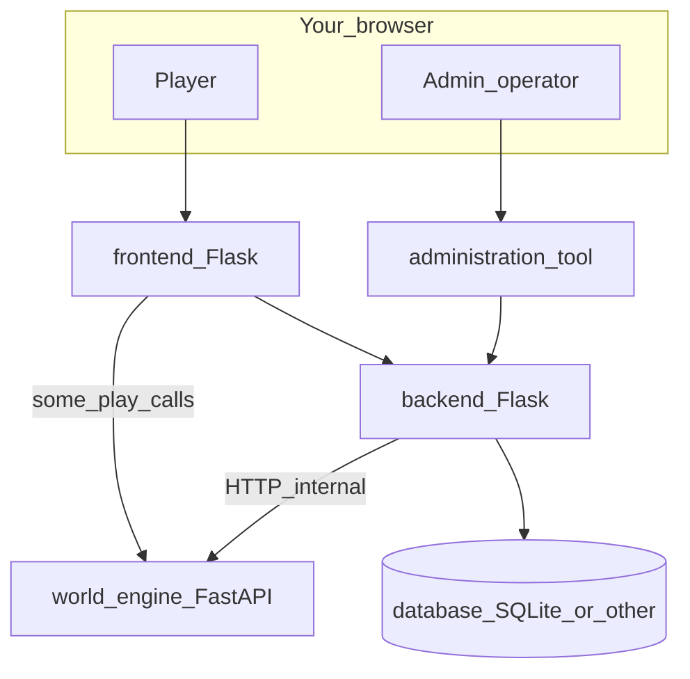
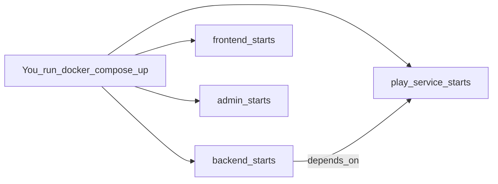
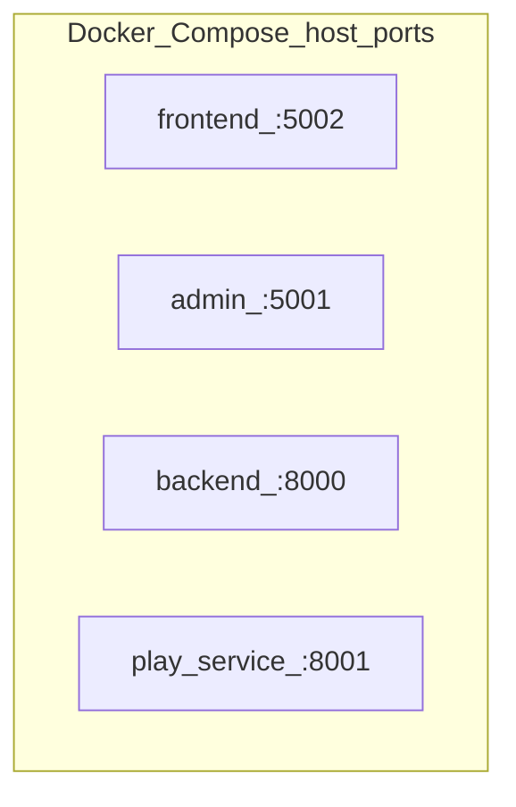
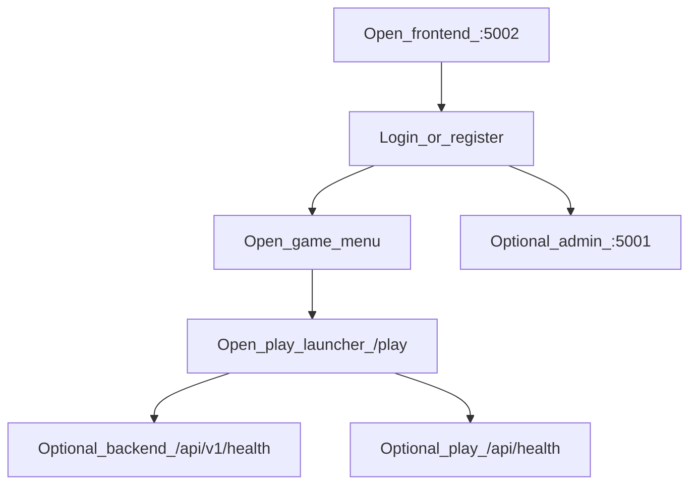
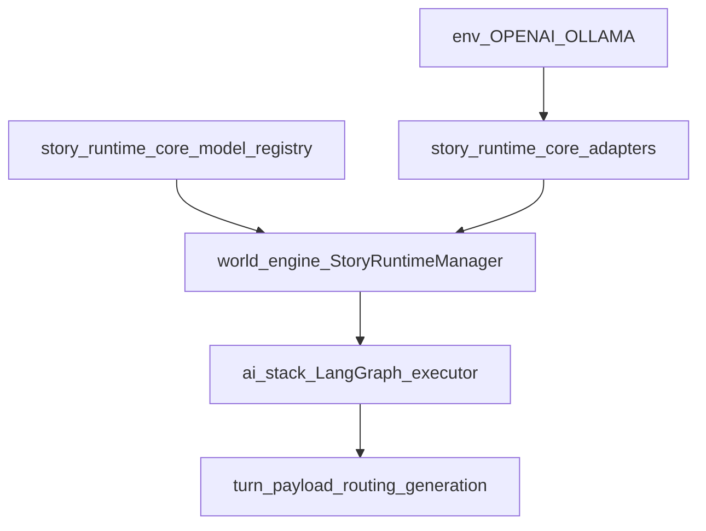
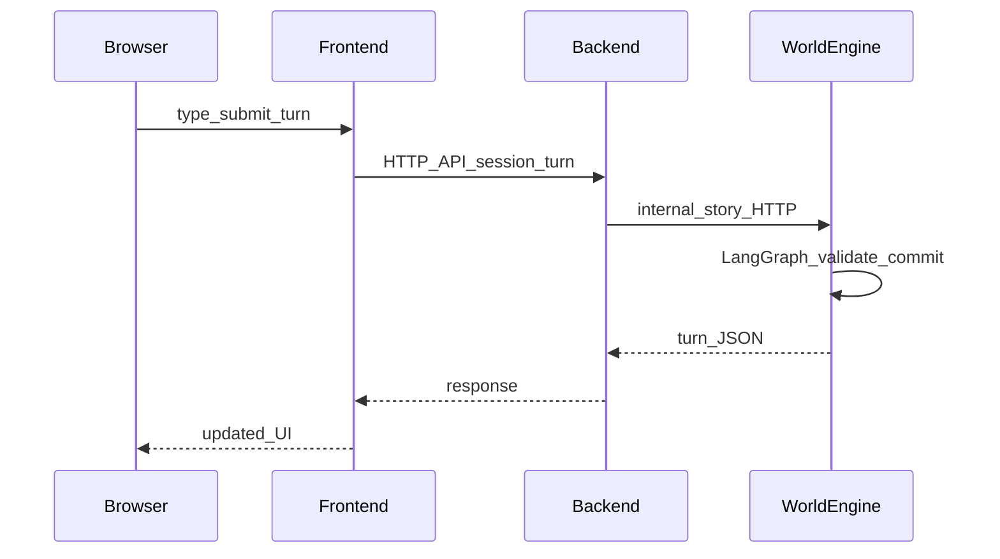
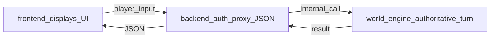
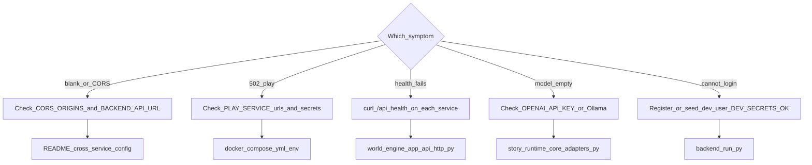

# Getting started with World of Shadows — Easy tutorial

## Title and purpose

This tutorial helps you go from **“I cloned the repository”** to **“the stack runs, I know which window is which, I know where models are configured, and I tried a first play path.”**

It is **practical**: real commands, real ports, and real file paths from the repo—not a substitute for the deeper architecture runbook ([World Engine — easy runbook](world_engine_runbook_easy.md)).

---

## A note about source of truth

Steps and URLs are taken from:

1. **`docker-compose.yml`** (recommended all-in-one local stack)
2. **`README.md`** and **`docs/development/LocalDevelopment.md`** (bare-metal order and ports)
3. **`.env.example`** files at repo root, `backend/`, `world-engine/`, `administration-tool/`
4. **`story_runtime_core/model_registry.py`** and **`story_runtime_core/adapters.py`** (model routing and env-driven providers)

If your checkout differs from `main`, re-check those files first.

---

## What World of Shadows consists of

### What this section helps you do

Build a simple mental map so you do not open the wrong browser tab and wonder why nothing matches.

### Simple explanation

World of Shadows is **several programs that work together**:

- **Frontend** — what players use in the browser (login, game menu, play screen).
- **Backend** — accounts, APIs, database, and the “front door” that talks to the play service for you.
- **World-engine (play service)** — the **FastAPI** service that runs **live play**: sessions, WebSocket template runs, and **authoritative** story turns for modules like **God of Carnage**.
- **Administration-tool** — a **separate** admin website for operators (manage routes, inspector workbench, etc.).
- **AI stack (`ai_stack/`)** — not a separate process you start for a basic loop; it is **Python code** loaded by the world-engine when story turns run (LangGraph, retrieval, GoC director).
- **MCP** — optional **developer/operator tooling** (a small server under `tools/mcp_server/`) that talks to the **backend** over HTTP in typical setups—not something every beginner must install on day one.

**LLM** and **SLM** (large / small language models): in this repo they are **routed by task type** to registered **providers** (`openai`, `ollama`, `mock`) with configuration mostly via **environment variables** and code registry—not a single “model settings” page in the player UI.

### What this means in the actual repository

| Piece | Folder | You start it? |
|-------|--------|----------------|
| Player UI | `frontend/` | Yes (or via Compose) |
| Admin UI | `administration-tool/` | Optional |
| Platform API | `backend/` | Yes (or via Compose) |
| Play / world-engine | `world-engine/` | Yes (or via Compose) |
| AI orchestration | `ai_stack/` | No separate service—used inside world-engine |
| Canonical story YAML | `content/modules/` | Edited as content; compiled/served through backend |

**Which matters first for a beginner:** get **play-service + backend + frontend** healthy; add **administration-tool** when you need `/manage/*`.

### What to do now

Skim the big-picture diagram below, then jump to [The easiest first way to boot the system](#the-easiest-first-way-to-boot-the-system).

### What to expect next

You will pick **one** startup path (Docker recommended), bring services up, and open specific URLs.

### Big picture — the parts that talk to each other

**Title:** World of Shadows — main runnable services.



**Seams:** `docker-compose.yml`, `README.md` (architecture diagram).

**What to notice:** Players use **frontend** and **backend**; **world-engine** runs the **live** play host. The frontend may also reach the play service for ticket/WebSocket-style flows depending on configuration (`PLAY_SERVICE_PUBLIC_URL` in `docker-compose.yml`).

**In plain words:** You will juggle **three or four URLs** in development. That is normal—they are different small servers.

---

## The easiest first way to boot the system

### What this section helps you do

Run everything with **one command family** and matching ports, without installing Python four times first.

### Simple explanation

**Recommended for beginners:** **Docker Compose** at the **repository root** using **`docker-compose.yml`**. It builds and wires **backend**, **frontend**, **administration-tool**, and **play-service** with consistent secrets and internal hostnames.

### What this means in the actual repository

From the repo root:

```bash
docker compose up --build
```

**Source:** `docker-compose.yml`, `README.md` § Docker Compose.

**Important port difference (read this once):**

| Surface | URL when using **root Compose** |
|---------|----------------------------------|
| Backend API | `http://localhost:8000` (mapped **8000→8000** in container) |
| Player frontend | `http://localhost:5002` |
| Administration tool | `http://localhost:5001` |
| Play service (world-engine) | `http://localhost:8001` (host **8001** → container **8000**) |

When you run services **bare metal** without Docker, the backend defaults to **`http://127.0.0.1:5000`** instead—see `docs/development/LocalDevelopment.md`. Beginners often confuse **5000** vs **8000**; match the path you chose.

### What to do now

1. Install **Docker Desktop** (or a compatible engine).
2. From the repo root, copy environment template: **`.env.example` → `.env`** and set at least **`SECRET_KEY`** and **`JWT_SECRET_KEY`** (comments in `.env.example` explain length).
3. Run `docker compose up --build` and wait until logs show the services listening.

### What to expect next

You should be able to open `http://localhost:5002` (frontend) and `http://localhost:8001/api/health` (play service) and see responses (see [How you know startup worked](#how-you-know-startup-worked)).

### Startup path — recommended beginner order

**Title:** Compose brings up four services together.



**Seams:** `docker-compose.yml` (`depends_on: play-service` under `backend`).

**What to notice:** Backend waits for the play container to start; you still need **both** healthy for full play flows.

---

## What to configure first

### What this section helps you do

Avoid “blank page” or “CORS” failures on first load.

### Simple explanation

- **Secrets:** backend needs strong enough **`JWT_SECRET_KEY`** (see `.env.example`).
- **Cross-origin (CORS):** when frontend and backend are different ports, backend must list frontend (and admin) origins. **Compose already sets** `CORS_ORIGINS` for `5001` and `5002` in `docker-compose.yml`.
- **Backend ↔ play-service:** they must share **`PLAY_SERVICE_SHARED_SECRET`** (backend) and **`PLAY_SERVICE_SECRET`** (world-engine)—Compose sets matching `local-dev-shared-secret` values.
- **Internal API key:** `PLAY_SERVICE_INTERNAL_API_KEY` / `X-Play-Service-Key`—Compose sets `local-dev-internal-key` on both sides.

### What this means in the actual repository

- Root **`.env.example`** — backend-oriented variables (also documents frontend/admin/play URLs for bare metal).
- **`world-engine/.env.example`** — `PLAY_SERVICE_SECRET`, `PLAY_SERVICE_INTERNAL_API_KEY`, optional content sync from backend.

### What to do now

For Compose: ensure **`.env`** exists with valid secrets. For bare metal: copy the “Cross-service configuration” block from **`README.md`** or **`docs/development/LocalDevelopment.md`** into each service’s environment.

### What to expect next

Browser calls from `localhost:5002` to `localhost:8000` succeed without network errors.

**In plain words:** Think of configuration as **three handshakes**: browser→backend, backend→database, backend→play-service.

---

## Starting the system step by step (two paths)

### Path A — Recommended for beginners: Docker Compose

**Commands (repo root):**

```bash
cp .env.example .env
# Edit .env: set SECRET_KEY and JWT_SECRET_KEY at minimum
docker compose up --build
```

**Source:** `docker-compose.yml`, `README.md`.

### Path B — Bare metal (when you prefer local Python)

**Order (from `README.md`):**

1. **Backend** — migrate DB, run Flask:

```bash
cd backend
pip install -r requirements.txt
flask init-db
flask db upgrade
python run.py
```

2. **World-engine** — note port **8001** to match README examples:

```bash
cd world-engine
pip install -r requirements.txt
python -m uvicorn app.main:app --reload --port 8001
```

3. **Frontend:**

```bash
cd frontend
pip install -r requirements.txt
python run.py
```

4. **Administration-tool (optional):**

```bash
cd administration-tool
pip install -r requirements.txt
python app.py
```

**Source:** `README.md` § Local development quick start, `docs/development/LocalDevelopment.md`.

Set env vars as in **`README.md` § Cross-service configuration (example)** so `BACKEND_API_URL`, `PLAY_SERVICE_*`, and `CORS_ORIGINS` line up.

### Service map — ports to remember

**Title:** Where each program listens (typical dev).



**Seams:** `docker-compose.yml`.

**What to notice:** **Backend is 8000** in Compose, **5000** on bare metal—pick one mental model and stick to it.

### How you know startup worked

| Check | Where | Good sign |
|-------|--------|-----------|
| Play service | `http://localhost:8001/api/health` | JSON like `{"status":"ok"}` — see `world-engine/app/api/http.py` |
| Play readiness (more detail) | `http://localhost:8001/api/health/ready` | `status: ready` and store info |
| Backend | `http://localhost:8000/api/v1/health` (Compose) or `http://127.0.0.1:5000/api/v1/health` (bare) | Healthy payload — `backend/app/api/v1/system_routes.py` |
| Frontend | `http://localhost:5002` | Login or home page renders |

---

## What to open first after startup

### What this section helps you do

Land in the **player** experience first, not the backend HTML island.

### Simple explanation

- **Player site:** **`http://localhost:5002`** (`frontend/`).
- **Backend root** **`/`** redirects to **`/backend`** — that is a **developer/operator info** area, not the main game UI (`docs/development/LocalDevelopment.md`).
- **Admin:** **`http://localhost:5001`** when you need management pages.

### What to do now

Open the **frontend** first. If you need a user account, use **Register** / **Login** on that site (`docs/user/getting-started.md`).

### Fast local account (developers)

To avoid email verification friction locally, backend offers dev-only CLI commands when **`DEV_SECRETS_OK=1`**—see **`backend/run.py`** (`seed-dev-user`). Example pattern (bare-metal backend shell):

```bash
# In backend venv, with DEV_SECRETS_OK=1 in environment
flask seed-dev-user --username devuser --password YourStrongPass1 --superadmin
```

**Source:** `backend/run.py`, `.env.example` comments on `DEV_SECRETS_OK`.

**In plain words:** Normal players register through the UI; developers often seed one user for speed.

---

## Your first guided tour

### What this section helps you do

Walk the system once in a sensible order so it stops feeling random.

### Simple explanation

1. **Frontend home** — confirm the public shell loads (`http://localhost:5002`).
2. **Sign in** — use your account or a seeded dev user.
3. **Game menu** — frontend exposes a hub toward play (routes like `/game-menu` exist in tests under `frontend/tests/`).
4. **Play launcher** — path **`/play`** loads templates from the backend bootstrap API (`frontend/tests/test_routes.py` mocks `/api/v1/game/bootstrap`).
5. **Backend health** — open **`/api/v1/health`** on your backend base URL to confirm the API is alive.
6. **Play health** — open **`/api/health`** on port **8001** to confirm world-engine is alive.
7. **Admin (optional)** — `http://localhost:5001` → sign in → explore `/manage/*` when your user has rights (inspector workbench lives under manage templates in `administration-tool/`).

### First tour — beginner path

**Title:** After containers are up, click in this order.



**Seams:** `frontend/tests/test_routes.py`, `backend/app/api/v1/system_routes.py`, `world-engine/app/api/http.py`.

**What to notice:** **Play** flows still depend on **backend + play-service** both working.

---

## Where to find AI and model-related settings

### What this section helps you do

Set expectations: **there is no single “pick my model” screen in the player UI** in this repository. Configuration is **code + environment**.

### Simple explanation

- **Registry (which models exist for routing):** `story_runtime_core/build_default_registry()` registers specs such as **`openai:gpt-4o-mini`**, **`ollama:llama3.2`**, **`mock:deterministic`** (`story_runtime_core/model_registry.py`).
- **Adapters (how a call is made):** `story_runtime_core/build_default_model_adapters()` maps provider names to implementations (`story_runtime_core/adapters.py`).
- **Environment variables that matter:**
  - **`OPENAI_API_KEY`** — required for OpenAI calls; if missing, the OpenAI adapter returns failure metadata (`adapters.py`).
  - **`OLLAMA_BASE_URL`** — defaults to `http://127.0.0.1:11434` for local Ollama (`OllamaAdapter`).
- **Routing:** `RoutingPolicy.choose(task_type=...)` picks **SLM-first** tasks vs **LLM** tasks using the registry (`model_registry.py`). The running graph records **`selected_provider`** in routing diagnostics (`ai_stack/langgraph_runtime.py`).

### What this means in the actual repository

World-engine constructs the registry and adapters in **`StoryRuntimeManager.__init__`** (`world-engine/app/story_runtime/manager.py` imports `build_default_registry` / `build_default_model_adapters`).

**How to confirm what path is active without a UI:**

- Run a story turn and inspect the **turn record / diagnostics** returned to the client (fields like **`model_route`**, **`graph`**, **`selected_provider`** in `StoryRuntimeManager.execute_turn` payload—`world-engine/app/story_runtime/manager.py`).
- For **operators**, read-only admin projections under backend routes such as **`/api/v1/admin/ai-stack/...`** (`backend/app/api/v1/ai_stack_governance_routes.py`) surface inspector-style health—not a casual “model dropdown” for players.

### Model / AI configuration discovery map

**Title:** Where “which model?” is actually decided.



**Seams:** `story_runtime_core/model_registry.py`, `story_runtime_core/adapters.py`, `world-engine/app/story_runtime/manager.py`, `ai_stack/langgraph_runtime.py`.

**What to notice:** **Environment** keys enable real providers; **mock** is always available for deterministic tests.

**In plain words:** To “connect ChatGPT,” set **`OPENAI_API_KEY`** in the environment **of the process running the world-engine**, then restart. To use **Ollama**, run Ollama locally and ensure **`OLLAMA_BASE_URL`** matches.

---

## How to try your first game or session

### What this section helps you do

Reach a **God of Carnage**-backed flow—the repo’s **MVP vertical slice** (`README.md`, `content/modules/god_of_carnage/`).

### Simple explanation

1. Be logged into the **frontend**.
2. Open the **play launcher** (`/play`).
3. Start a session for template **`god_of_carnage`** when it appears in the bootstrap list (see tests expecting that id: `frontend/tests/test_routes.py`).
4. On the play shell page, submit **natural language** input; the frontend posts to backend/play orchestration (e.g. execute routes exercised in `frontend/tests/test_routes_extended.py`).

### What this means in the actual repository

- **Content authority:** `content/modules/god_of_carnage/` — `docs/start-here/god-of-carnage-as-an-experience.md`.
- **Player expectations:** `docs/user/god-of-carnage-player-guide.md`.
- **Runtime authority:** turns execute in **world-engine** story runtime (`world-engine/app/story_runtime/manager.py`), not “whatever the model said” without commit rules.

### What success looks like

- Scene text or narrator output updates turn by turn.
- No repeated **502** / **play service** errors in the browser network tab (backend could not reach world-engine).

### What failure often looks like

- **CORS or network errors** — backend URL wrong in frontend env.
- **Play errors** — `PLAY_SERVICE_INTERNAL_URL` / secrets mismatch between backend and world-engine.
- **Model errors** — generation degrades or errors if **`OPENAI_API_KEY`** missing while routing selects OpenAI; check turn diagnostics for `adapter_not_registered` or `missing_openai_api_key` patterns from `ai_stack/langgraph_runtime.py` / `adapters.py`.

### First play flow — request walkthrough

**Title:** Simplified player turn path.



**Seams:** `backend/app/services/game_service.py`, `world-engine/app/story_runtime/manager.py`, `docs/technical/runtime/a1_free_input_primary_runtime_path.md` (for the documented primary path details).

**In plain words:** Your text hits **frontend → backend → world-engine**; the **engine** runs the heavy turn pipeline.

### Backend, world-engine, and frontend during that one click

**Title:** Who does what in one interaction.



**Seams:** `frontend/` play routes, `backend/app/services/game_service.py`, `world-engine/app/story_runtime/manager.py`.

**What to notice:** **Frontend** does not replace **world-engine**; it **shows** what the platform returns.

---

## MCP and AI surfaces — what a beginner needs first

### What this section helps you do

Know what MCP is and **defer** it without guilt.

### Simple explanation

**MCP (Model Context Protocol)** here is mainly a **stdio tool server** (`tools/mcp_server/`) that exposes **tools and read-only resources** to an AI-enabled editor or operator workflow. Phase A docs say it typically talks to the **backend** over HTTPS (`docs/mcp/01_M0_host_and_runtime.md`), **not** inside every player turn.

### What this means in the actual repository

- Server entry: `python -m tools.mcp_server.server` (see repo **`README.md`** § MCP).
- Example client snippet: **`.mcp.json`** uses `BACKEND_BASE_URL` (defaults to **`http://localhost:8000`**—aligned with **Compose** backend port, not bare-metal **5000**).

### What to do now

**Skip MCP** until the core stack runs and you can play a turn. Then read **`docs/technical/integration/MCP.md`** and **`docs/mcp/MVP_SUITE_MAP.md`**.

### What to expect next

MCP helps **inspect and operate** around the platform; it does **not** replace **`world-engine/`** as the play host.

---

## What to do if the first start goes wrong

### What this section helps you do

Fix the **most common** first-hour problems without reading the entire ops manual.

### Simple explanation

Start from **network truth**: can your browser reach each port? Do secrets match? Is the backend pointing at the **same** play URL you think?

### Troubleshooting map

**Title:** Where to look first.



**Seams:** `docker-compose.yml`, `.env.example`, `story_runtime_core/adapters.py`, `backend/run.py`, `world-engine/app/api/http.py`.

| Symptom | Likely cause | Where to verify |
|---------|----------------|-----------------|
| Frontend “network error” | Wrong `BACKEND_API_URL` or CORS | `frontend` env, backend `CORS_ORIGINS` — `README.md` |
| Play / story errors | Backend cannot reach play service | `PLAY_SERVICE_INTERNAL_URL`, shared secret — `docker-compose.yml` |
| `missing_openai_api_key` in behavior | OpenAI routed but key unset | `OPENAI_API_KEY` — `story_runtime_core/adapters.py` |
| Cannot log in locally | Verification or no user | `docs/user/getting-started.md`, `flask seed-dev-user` — `backend/run.py` |
| Wrong backend port confusion | Compose vs bare metal | This tutorial § Service map |

**In plain words:** **Nine times out of ten**, it is a **URL or secret mismatch**, not a mysterious story bug.

---

## Where to go next once it works

### What this section helps you do

Turn a working stack into **learning paths** by topic.

### Suggested next clicks

| Interest | Go here |
|----------|---------|
| **Playing / slice story** | `docs/user/god-of-carnage-player-guide.md`, `docs/start-here/god-of-carnage-as-an-experience.md` |
| **Easy world-engine explanation** | `docs/easy/world_engine_runbook_easy.md` |
| **Developer onboarding** | `docs/dev/onboarding.md`, `docs/dev/contributing.md` |
| **AI stack detail** | `docs/technical/ai/ai-stack-overview.md`, `docs/start-here/how-ai-fits-the-platform.md` |
| **Contracts (when changing code)** | `docs/dev/contracts/normative-contracts-index.md` |
| **Operations** | `docs/admin/operations-runbook.md` |
| **MCP (later)** | `docs/technical/integration/MCP.md`, `tools/mcp_server/` |

### What to do now

Pick **one** line in the table above and read for fifteen minutes, then run **one** extra experiment (e.g. toggle only **`OPENAI_API_KEY`** and compare turn diagnostics).

### What to expect next

You will recognize **which log line belongs to which service**—the sign that the system is no longer a single blur.

---

## Conclusion

**Recommended for beginners:** use **`docker compose up --build`** from the repo root (`docker-compose.yml`), open **`http://localhost:5002`**, confirm **`http://localhost:8001/api/health`**, then walk **login → game menu → play → God of Carnage**. **Model routing** is defined in **`story_runtime_core/model_registry.py`** and activated through adapters reading **`OPENAI_API_KEY`** / **`OLLAMA_BASE_URL`** (`story_runtime_core/adapters.py`). **MCP** is optional operator tooling, not part of the first play loop.

You now have both a **running system** and a **map** for where to read next—without mistaking the backend HTML shell for the player game, or the AI stack folder for something you must “start” like a server.
