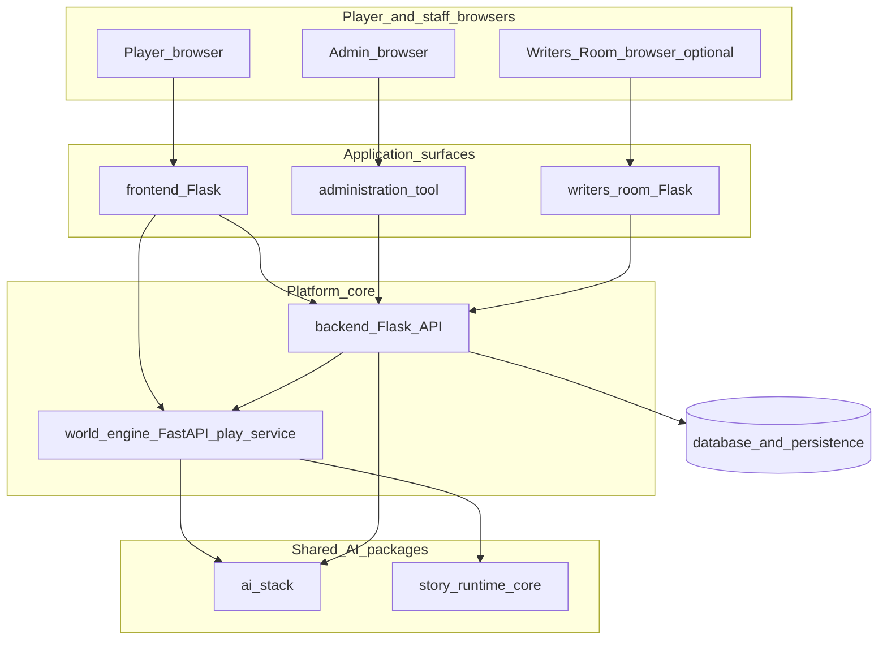
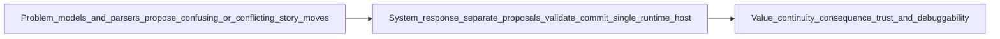
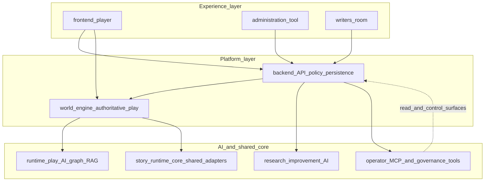
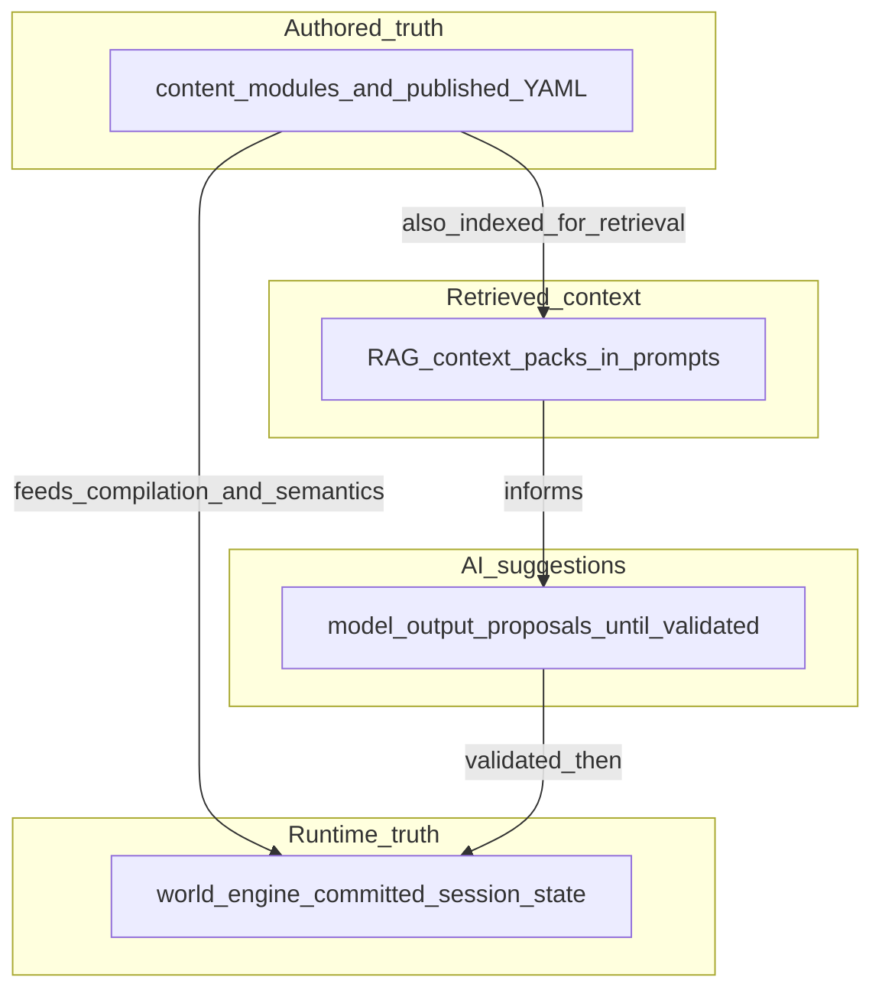
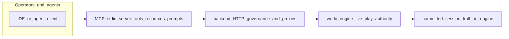
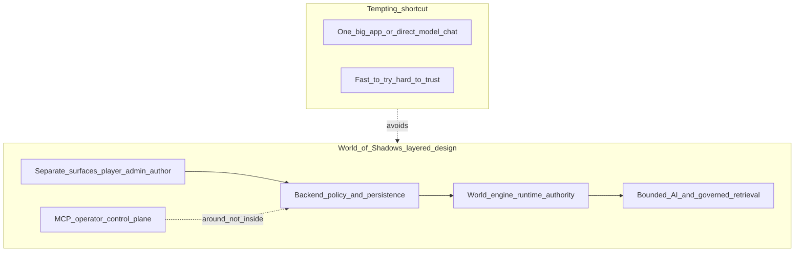
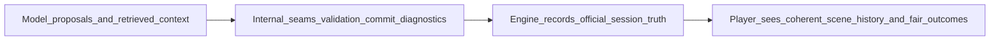
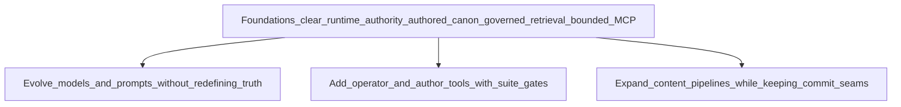

# What World of Shadows is — and why it works this way

## Title and purpose

This document explains **World of Shadows** as a whole: what it is trying to become, what problem it solves, what value it is meant to create, and **why** the architecture is shaped the way it is.

It is written for **technical readers**, **non-specialists**, **stakeholders**, and **new contributors** who want a trustworthy mental model before diving into every file.

**Companion detail:** For AI-specific plumbing, see [`docs/ai/ai_system_in_world_of_shadows.md`](../ai/ai_system_in_world_of_shadows.md). For the World Engine alone, see [`world_engine_runbook_easy.md`](world_engine_runbook_easy.md).

---

## A note about source of truth

Facts here follow this order:

1. **What the repository actually implements** (services under `frontend/`, `backend/`, `world-engine/`, `administration-tool/`, `writers-room/`, packages `ai_stack/` and `story_runtime_core/`, content under `content/modules/`).
2. **Normative documentation** (for example [`docs/governance/adr-0001-runtime-authority-in-world-engine.md`](../governance/adr-0001-runtime-authority-in-world-engine.md), [`docs/start-here/how-ai-fits-the-platform.md`](../start-here/how-ai-fits-the-platform.md), [`docs/technical/architecture/service-boundaries.md`](../technical/architecture/service-boundaries.md)).
3. **Architecture and governance docs** linked from the root [`README.md`](../../README.md).

**Honest caveat:** Some **backend** paths are explicitly **transitional** (orchestration and legacy shims). Where the tree shows migration in progress, this document describes the **intended authority split** (ADR-0001) and notes that a few call paths may still be in flux—see [`docs/technical/architecture/backend-runtime-classification.md`](../technical/architecture/backend-runtime-classification.md).

**Inference** (labeled when used): Product intent beyond what code enforces is inferred only from stated docs and structure, not from marketing language.

---

## The shortest useful explanation

**World of Shadows** is a **multi-service narrative game platform**: player web apps, an API and persistence layer, an **authoritative play runtime** (the World Engine), and a shared **AI stack** (retrieval, turn orchestration, guarded tooling) used during live play and in operator/author workflows.

**In plain words:** It is built for **guided interactive drama**—scene-led play where “what just became true in the story” is **decided by rules and the runtime**, not only by whatever a language model said in the moment.

**Anchors:** [`README.md`](../../README.md) (product framing and service table), [`docs/ROADMAP_MVP_VSL.md`](../ROADMAP_MVP_VSL.md) (MVP vertical slice direction).

---

## What the system is really trying to do

### Simple explanation

The system tries to run **live narrative sessions** where players experience **continuity and consequence**: what you did last turn still matters, and what happens next is **coherent** with authored story material and fair rules.

### What this means in the actual system

- **Authored story** lives largely as **YAML-first modules** under `content/modules/` (for example the God of Carnage slice).
- **Live play** is hosted by **`world-engine/`** (FastAPI): sessions, WebSockets, and—for story mode—turn execution that ends in **validation and commit** seams, not raw model output.
- **Platform services** (`backend/`) handle accounts, policy, persistence, content tooling, and integration with the play service—**without** replacing the engine as the authority for committed play state (ADR-0001).

### Why this matters

If “the story state” lived in five places, you would get **contradictions** players can feel: the UI says one scene, the database another, the model “remembers” a third.

### Why it is done this way instead of another way

A **single authoritative runtime host** for live narrative execution is an explicit **architectural decision** to prevent duplicate business logic and conflicting session state across Flask layers and experiments (`docs/governance/adr-0001-runtime-authority-in-world-engine.md`).

### What it is not

- **Not** “just a chat UI on top of an API.” Chat-shaped UX may exist, but **commit authority** is a separate concern (`world-engine/app/story_runtime/manager.py`, `ai_stack/langgraph_runtime.py`).
- **Not** a single monolith that happens to call OpenAI once. The repo is **several deployable apps** with clear seams (`docs/technical/architecture/service-boundaries.md`).

---

## What problem the system is actually solving

### Simple explanation

**AI-driven interactive story** is hard because models are **great at language** and **bad at being a single source of truth**. They can hallucinate, drift, or disagree with authored canon. Simpler systems often let “the last model message” silently become reality.

### What this means in the actual system

The platform separates:

- **Proposals** (model output, parser output, suggestions),
- **Checks** (contracts, validation seams),
- **Commits** (what the session officially records after rules agree).

That pattern is spelled out for the God of Carnage path in contract docs such as [`docs/CANONICAL_TURN_CONTRACT_GOC.md`](../CANONICAL_TURN_CONTRACT_GOC.md) and implemented around `resolve_narrative_commit` in the story runtime (`world-engine/app/story_runtime/manager.py`, `world-engine/app/story_runtime/commit_models.py`).

### Why this matters

When something goes wrong, you need an answer that is not “the model felt like it.” You need **inspectable reasons**: validation outcomes, commit records, diagnostics (`docs/technical/runtime/runtime-authority-and-state-flow.md`).

### Why it is done this way instead of another way

Letting the model own state is **faster to prototype** and **catastrophic to operate**: non-reproducible bugs, un-auditable moderation, and player distrust.

### What it is not

- **Not** the claim that AI is unimportant. Models are **deeply involved**—they are just **not the boss of committed truth** (`docs/start-here/how-ai-fits-the-platform.md`).

---

## What value the system is meant to create

### For players

- **Continuity:** A stable notion of “where we are in the story” after each turn.
- **Consequence:** Actions can matter because the runtime **records** allowed effects instead of only echoing text.
- **Trust:** When the world behaves oddly, the system can be **debugged** along seams rather than treated as opaque magic.

### For authors and operators

- **Authored canon** stays a **human-owned** artifact in repository content (`content/modules/`), not something silently rewritten by retrieval or chat.
- **Operational surfaces** (admin app, MCP suites, backend diagnostics) support **governance and inspection** without pretending to be the live game loop (`administration-tool/`, `tools/mcp_server/server.py`).

### For the project long-term

Clean **authority boundaries** make it possible to evolve AI models, add tooling, and scale operations **without** merging every concern into one brittle program (ADR-0001 consequences section).

**Anchor:** Root [`README.md`](../../README.md) positions the MVP as **guided interactive drama**, not a generic chatbot.

### What it is not

- **Not** a promise that every future feature exists today. This section describes **why the foundation is shaped** for serious narrative systems—not a hype roadmap.

---

## Why the system is split into major parts

### Simple explanation

Different people and programs need **different doors** into the system. Players need a **game-shaped** experience. Operators need **safe tools**. The **running world** needs a **referee**. Trying to cram all of that into one undifferentiated app usually means **everyone gets a worse, less safe interface**.

### What this means in the actual system

| Part | Role (grounded) | Anchor |
|------|------------------|--------|
| **Frontend** | Player/public web UI; talks to backend and browser-reachable play URLs | `frontend/`, [`service-boundaries.md`](../technical/architecture/service-boundaries.md) |
| **Backend** | APIs, auth, persistence, content/compiler integration, proxies to play | `backend/` |
| **World Engine** | Authoritative live play: sessions, WebSockets, story turn execution | `world-engine/app/main.py`, `world-engine/app/story_runtime/manager.py` |
| **Administration tool** | Separate admin UI; backend APIs only | `administration-tool/` |
| **Writers’ Room UI** | Optional small Flask UI calling backend Writers’ Room routes | `writers-room/` |
| **AI stack** | RAG, LangGraph runtime graph, bridges, capabilities | `ai_stack/` |
| **Shared runtime core** | Shared interpretation/adapters consumed by engine (and related paths) | `story_runtime_core/` |
| **MCP server** | Operator/agent control plane: tools, resources, prompts | `tools/mcp_server/server.py`, `ai_stack/mcp_canonical_surface.py` |

### Why this matters

Separation is how you keep **player trust**, **operator safety**, and **engineering clarity** at the same time.

### Why it is done this way instead of another way

One giant service tends to **mix permissions**, **mix concerns**, and **hide bugs**. The repo’s **service-boundaries** doc is essentially a contract: who owns HTML, who owns sockets, who owns committed play (`docs/technical/architecture/service-boundaries.md`).

### What it is not

- **Not** an argument that microservices are “cool.” The split matches **roles and risk**: what must never be casually exposed to a browser tab vs what must be **authoritative** during play.

### Diagram: big picture — main parts and how they relate

*Anchored in:* `README.md` service table, `docs/technical/architecture/service-boundaries.md`.

**What to notice:** Players primarily touch **`frontend`**, but **live play authority** sits in **`world-engine`**. **Backend** sits between many concerns and persistence, but is **not** the authoritative host for committed narrative execution (ADR-0001).

---

## Why the World Engine exists

### Simple explanation

Someone has to be the **referee** for a live session: “Did that move count? What is officially true now?” In World of Shadows, that referee is the **World Engine**.

### What this means in the actual system

The engine is a **FastAPI** app that hosts **`RuntimeManager`** (template/lobby/run experiences) and **`StoryRuntimeManager`** (guided story sessions), wired in `world-engine/app/main.py`. Story turns invoke graph execution (`ai_stack/langgraph_runtime.py`) and then **narrative commit resolution**—see `world-engine/app/story_runtime/manager.py` and the easy runbook [`world_engine_runbook_easy.md`](world_engine_runbook_easy.md).

### Why this matters

**Continuity and consequence** need a **single place** that says: after this turn, we are **officially** in scene X.

### Why it is done this way instead of another way

If Flask handlers, background jobs, and model calls each “update the story,” you lose **one ledger** for the session. ADR-0001 names **`world-engine`** as the **authoritative runtime host** for story sessions (`docs/governance/adr-0001-runtime-authority-in-world-engine.md`).

### What it is not

- **Not** the place where canonical YAML is **authored**; that remains `content/modules/` and compilation paths (`world_engine_runbook_easy.md`).

### Diagram: system purpose — problem, response, value

*Anchored in:* `docs/start-here/how-ai-fits-the-platform.md` (AI suggests → runtime decides), ADR-0001.

**What to notice:** The **value** is not “more AI.” It is **reliable official state** after **rules**.

---

## Why AI exists — and why AI is bounded

### Simple explanation

**AI** here means software that **generates and interprets language** (and related structured outputs). It is useful for **rich narration**, **interpretation**, and **operator workflows**. It is **not trusted** to silently become the **database of what happened**.

### What this means in the actual system

The connected reference describes **three AI-related planes** that share libraries but serve different jobs: **runtime play AI**, **research/improvement AI**, and **operator/control-plane AI** (`docs/ai/ai_system_in_world_of_shadows.md`). Across them: **models and graphs propose**; **validation, commit rules, and the session host** decide live truth.

**Anchors:** `ai_stack/langgraph_runtime.py`, `ai_stack/research_langgraph.py`, `tools/mcp_server/server.py`.

### Why this matters

Bounded AI preserves **creative power** without sacrificing **accountability**.

### Why it is done this way instead of another way

**“Let the model run the game”** is simple to demo and painful to ship: inconsistent canon, weak moderation story, and debugging nightmares.

### What it is not

- **Not** anti-AI. The stack is **deeply integrated**—it is **pro-integration, anti-confusion-of-roles**.

### Diagram: layered architecture — cooperating layers

*Anchored in:* `README.md` services table, `docs/ai/ai_system_in_world_of_shadows.md` (three planes).

**What to notice:** **AI** appears in multiple **lanes**, but **live committed play** is anchored at **`world-engine`**, not at MCP or a generic backend handler.

---

## Why retrieval and governed context exist

### Simple explanation

Sometimes the system needs to **look things up**: prior scenes, docs, notes, published modules. **Looking something up** is not the same as **declaring truth**. Retrieval is **context for thinking**; **canon** and **committed runtime state** live elsewhere.

### What this means in the actual system

`ai_stack/rag.py` builds **context packs** from configured repository paths, with **domains** and **governance lanes** so draft or internal material does not pretend to be published canon at runtime (`docs/technical/ai/RAG.md`). Diagnostics can summarize retrieval governance without changing ranking (`ai_stack/retrieval_governance_summary.py`).

### Why this matters

Without governance, **the last retrieved note** can **steer** the model as if it were **official story**, even when it should not.

### Why it is done this way instead of another way

**Naive RAG** (“dump files into a vector DB and pray”) is easy; **wrong** for a canon-sensitive game where **visibility** and **roles** matter.

### What it is not

- **Not** a substitute for `content/modules/` or session commits (`docs/technical/ai/RAG.md`).

### Diagram: truth boundaries — four kinds of “text”

*Anchored in:* `docs/technical/ai/RAG.md` (truth table), `world-engine/app/story_runtime/manager.py` (session authority).

**What to notice:** **Retrieval** points **into** the model’s working memory; **commit** points **into** the **official session ledger**. Those arrows are **not interchangeable**.

---

## Why MCP and operations surfaces exist

### Simple explanation

**MCP** (Model Context Protocol) here is a **standard way** for tools and agents to call **a controlled menu of operations**: health checks, file reads, research helpers, guarded diagnostics. It is a **control plane around the system**, not the **storytelling heart**.

### What this means in the actual system

`tools/mcp_server/server.py` exposes suites such as `wos-admin`, `wos-author`, `wos-ai`, `wos-runtime-read`, and `wos-runtime-control`, filtered via `ai_stack/mcp_canonical_surface.py` (`docs/technical/integration/MCP.md`, `docs/mcp/MVP_SUITE_MAP.md`). MCP reaches the play world **through backend policy and proxies**, not as a shadow runtime (`docs/technical/integration/MCP.md`).

### Why this matters

Operators need **repeatable**, **reviewable** access patterns. **Least-privilege suites** beat ad-hoc scripts scattered across laptops.

### Why it is done this way instead of another way

Giving agents **raw database credentials** or **unbounded shell** is faster—and **unsafe**. MCP is **bounded surface area by design**.

### What it is not

- **Not** a second `StoryRuntimeManager`. MCP **does not replace** world-engine authority (`docs/technical/integration/MCP.md`).

### Diagram: operations and control plane around the world

*Anchored in:* `tools/mcp_server/server.py`, `docs/technical/integration/MCP.md`.

**What to notice:** MCP **touches** the system through **known doors** (backend, filesystem rules, suite filters). It does **not** silently become **the runtime**.

---

## Why backend, admin, Writers’ Room, QA, and player surfaces differ

### Simple explanation

**Not everyone should see the same buttons.** Players need **immersion and safety**. Staff need **moderation and configuration**. Authors need **review workflows**. Engineers need **diagnostics**. If you merge those into one UI, you usually merge **permissions** too.

### What this means in the actual system

- **Player UI:** `frontend/` (`docs/technical/architecture/service-boundaries.md`).
- **Admin UI:** `administration-tool/` — separate app, backend APIs only.
- **Writers’ Room UI:** optional `writers-room/` → `/api/v1/writers-room/...` on backend (`README.md`).
- **QA and tests:** `tests/`, `backend/tests/`, engine and ai_stack tests—**evidence**, not product surfaces.

### Why this matters

**Security and narrative trust** are both **interface problems**. Separate surfaces support **separate threat models**.

### Why it is done this way instead of another way

A single “god mode” web app is **convenient in demos** and **expensive in production**.

### What it is not

- **Not** a claim that every role has a perfect UI today—**the architecture prepares** for **clear separation** even as features grow.

---

## Why the architecture is this shape — and not a simpler one

This section names the **most tempting shortcuts** and why the repository refuses them.

### Why not “frontend talks directly to the model”?

**Simple** and **opaque**: you lose **server-side rules**, **consistent commits**, and **auditable diagnostics**. The implemented path routes play through **`world-engine`** with graph stages and seams (`ai_stack/langgraph_runtime.py`, `world-engine/app/story_runtime/manager.py`).

### Why not “backend stores everything and is enough”?

Backend **does** store a lot—but **authoritative live narrative execution** is split out so policy/orchestration does not **fork** into a second hidden runtime (ADR-0001). *Transitional shims exist; the decision is still explicit.*

### Why not “engine does everything including all CMS and accounts”?

The engine would **inherit every product concern**, explode in scope, and blur **player-time** vs **operator-time** operations (`docs/technical/architecture/service-boundaries.md`).

### Why not “MCP controls the world”?

MCP is **tooling**. Letting agents become the runtime **bypasses player protections** and **product policy** (`docs/technical/integration/MCP.md`).

**In plain words:** Each shortcut **saves typing early** and **costs trust later**. The layering buys **seams you can reason about**.

### Diagram: “why not simpler?” — shortcut vs layered design

*Anchored in:* ADR-0001, `docs/start-here/how-ai-fits-the-platform.md`.

**What to notice:** The **real design** trades **some moving parts** for **clear ownership** and **safer evolution**.

---

## What the player really gets from all this

### Simple explanation

Most players will never read `ai_stack/` or MCP docs. They still **feel** the architecture when:

- the **story remembers**,
- **consequences stick**,
- weirdness can be **traced** instead of hand-waved,
- **safety and canon** feel **intentional**, not accidental.

### What this means in the actual system

Player-visible routes live in `frontend/`; live session behavior is owned by `world-engine/`; AI proposes inside graph stages documented in [`docs/VERTICAL_SLICE_CONTRACT_GOC.md`](../VERTICAL_SLICE_CONTRACT_GOC.md) for the GoC slice.

### Why this matters

**Trust** is a **product feature** for narrative games—especially when AI is involved.

### Why it is done this way instead of another way

**Cheap demos** optimize for **one wow moment**. **Serious narrative systems** optimize for **the tenth hour** still feeling coherent.

### What it is not

- **Not** a guarantee of perfection. It is a guarantee of **structure**: when things break, the system has **places to look**.

### Diagram: player benefit flow — inside work → outside feeling

*Anchored in:* `world-engine/app/story_runtime/manager.py` (commit), `frontend/` (presentation).

**What to notice:** The **player benefit** is **downstream** of **discipline** they never have to name.

---

## What this architecture makes possible over time

### Simple explanation

If you get **authority**, **content**, and **tooling boundaries** right, you can **swap models**, **add operator tools**, and **grow content pipelines** without rewriting the universe every six months.

### What this means in the actual system

The repo already separates **runtime play AI**, **research/improvement AI**, and **operator MCP** (`docs/ai/ai_system_in_world_of_shadows.md`). RAG domains separate **who should see which material** (`docs/technical/ai/RAG.md`). That is **scaffolding** for richer workflows—not a promise that every workflow is finished.

### Why this matters

**Inference:** Platforms that confuse **tooling** with **truth** tend to **ossify early**—they cannot evolve safely.

### Why it is done this way instead of another way

**Big-bang rewrite** is the hidden tax of **“just ship fast”** without seams.

### What it is not

- **Not** a roadmap of fictional features—only an honest read of **what good boundaries enable**.

### Diagram: growth path — foundations → safe evolution

*Anchored in:* `docs/governance/adr-0001-runtime-authority-in-world-engine.md` (consequences), modular packages `ai_stack/`, `story_runtime_core/`.

**What to notice:** **Growth** hangs off **stable seams**, not off **one-off scripts**.

---

## Conclusion

World of Shadows is **not “just an AI roleplay app.”** It is a **multi-service narrative platform** that uses AI **seriously** by **refusing** to let AI be the **silent owner of reality**.

The **World Engine** is the **live referee**. **Authored modules** are the **human-owned story ground**. **Retrieval** is **governed context**. **MCP** is **operator tooling**, not the game. **Separate surfaces** protect **players and staff**.

**If you remember one sentence:** *Models propose; rules and the runtime decide; players feel the difference.*

---

## Quick anchor index (for contributors)

- **Runtime authority decision:** `docs/governance/adr-0001-runtime-authority-in-world-engine.md`
- **Service ownership:** `docs/technical/architecture/service-boundaries.md`
- **AI spine:** `docs/ai/ai_system_in_world_of_shadows.md`
- **AI plain summary:** `docs/start-here/how-ai-fits-the-platform.md`
- **RAG and truth vs retrieval:** `docs/technical/ai/RAG.md`
- **MCP integration:** `docs/technical/integration/MCP.md`, `docs/mcp/MVP_SUITE_MAP.md`
- **World Engine easy runbook:** `docs/easy/world_engine_runbook_easy.md`
- **Repository overview:** `README.md`
