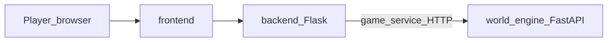
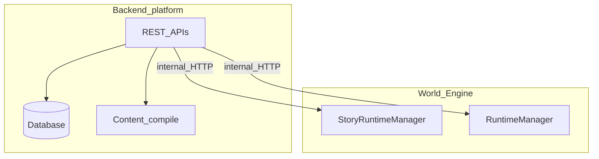
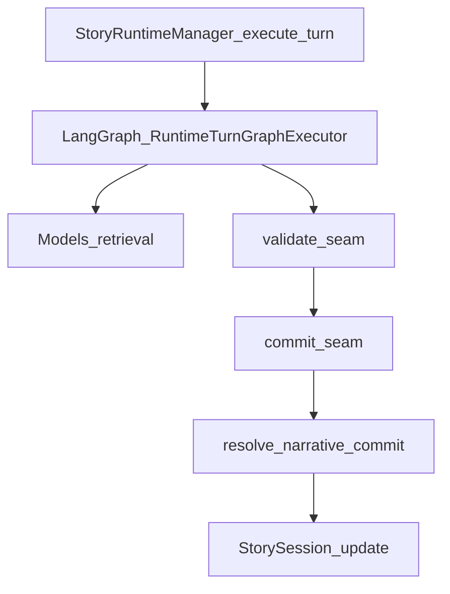
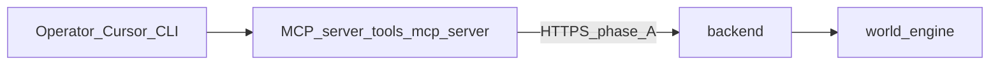
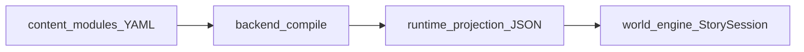
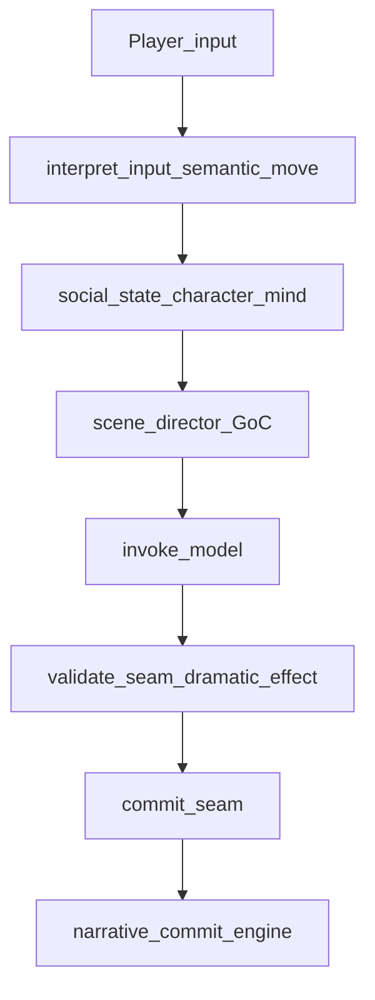
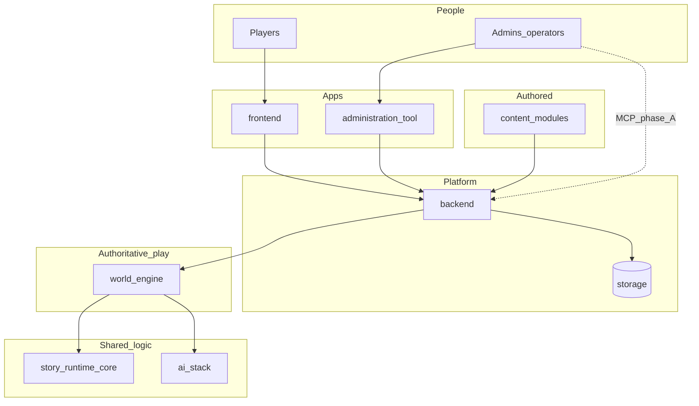
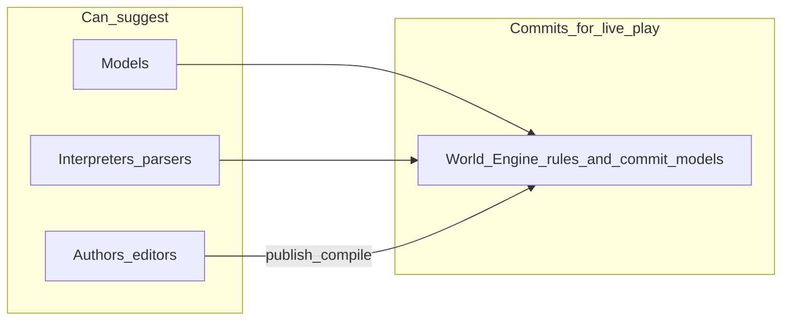

# World Engine — Easy Reading Runbook

## Title and purpose

This runbook explains the **World Engine** in **World of Shadows** in calm, concrete language. It is meant for readers who are not deep in the codebase, while still staying faithful to how the repository actually works.

**What you will get:** a mental model of what goes in, what happens inside, what comes out, what the engine **decides**, and what it **does not let other parts decide**.

---

## A note about source of truth

Facts here follow this order:

1. **What the code does** (especially under `world-engine/`, `ai_stack/`, and `story_runtime_core/`).
2. **Existing architecture docs** (for example `docs/technical/runtime/world_engine_authoritative_runtime_and_system_interactions.md` and ADR-0001).
3. **Tests and reports** as supporting context only.

If something is not named exactly the same way in code as in product language, this document says so and points to the **nearest real seam** (a file or function where behavior is observable).

**Repository anchors for this rule:** `docs/governance/adr-0001-runtime-authority-in-world-engine.md`, `world-engine/app/main.py`.

---

## The shortest useful explanation

The World Engine is the **play service** that runs **live game sessions**. It is the place that remembers, for a running session, **what is officially true right now**—for example which story scene you are in—after rules have checked any suggestions from AI or parsers.

**In plain words:** Other parts of the system can *suggest* moves or text. The engine is where many of those suggestions either become **real for the session** or get **blocked**, according to contracts.

---

## What the World Engine really is

### Simple explanation

Imagine a referee at a live match. Players act, coaches shout ideas, cameras record—but the referee decides what counts as a legal play and updates the official score. The World Engine is like that referee for **running narrative sessions**: it listens, gathers advice, applies rules, and updates the **official session state**.

### What this means in the actual system

In this repository, the World Engine is the **FastAPI application** in `world-engine/`. On startup it creates two hosts:

- **`RuntimeManager`** — for **template / lobby / run** experiences: rooms, tickets, WebSocket play, snapshots (`world-engine/app/runtime/manager.py`, `world-engine/app/runtime/engine.py`).
- **`StoryRuntimeManager`** — for **guided story sessions**: turns, AI graph execution, and **narrative commits** (`world-engine/app/story_runtime/manager.py`).

Both live in one process, wired in `world-engine/app/main.py`. HTTP routes live in `world-engine/app/api/http.py`; WebSocket routes in `world-engine/app/api/ws.py`.

### Why it matters

If “what happened” lived in three different places (database row, Flask handler, and model output), players would see contradictions. One **authoritative host** for live play prevents that.

### What it is not

- It is **not** “the whole website.” The player UI is largely `frontend/` talking to `backend/`.
- It is **not** “the AI.” Models run **inside** orchestration the engine triggers, but **commit** logic is separate.
- It is **not** the place where canonical YAML is authored; that is **`content/modules/`** and backend compilation paths.

---

## What the World Engine is responsible for

### Simple explanation

The engine **owns the live session clock and ledger** for the kinds of play it hosts: who is in a run, what the transcript says, or—in story mode—which scene is **committed** after a turn.

### What this means in the actual system

| It owns / decides | Anchors |
|---------------------|---------|
| **Story session objects** in memory (`StorySession`: module, projection, scene id, history tail) | `world-engine/app/story_runtime/manager.py` |
| **Turn execution** for story: calls `RuntimeTurnGraphExecutor.run`, then `resolve_narrative_commit` | `manager.py`, `ai_stack/langgraph_runtime.py`, `world-engine/app/story_runtime/commit_models.py` |
| **Run / lobby state** for template experiences | `world-engine/app/runtime/engine.py`, `world-engine/app/runtime/store.py` |
| **WebSocket command processing** after ticket checks | `world-engine/app/api/ws.py`, `world-engine/app/auth/tickets.py` |

### Why it matters

**Continuity and consequence** need a single place that says: “After this turn, we are **officially** in scene X,” not “the model felt like scene X.”

### What it is not

The engine does **not** replace long-term platform accounts, billing, forums, or admin publishing workflows—those are **`backend/`** and **`administration-tool/`** concerns (`docs/technical/architecture/architecture-overview.md`).

---

## How the World Engine works in simple steps (story turn)

### Simple explanation

1. Something happens: the player sends text (or a structured command is derived from it).
2. The system **receives** the turn for a known session.
3. The engine runs a **pipeline** (the LangGraph turn graph in `ai_stack/langgraph_runtime.py`) that interprets input, pulls context, calls models, and runs **validation** and **commit seams** (`goc_turn_seams.py` helpers).
4. The engine **resolves** what scene is **allowed** to commit (`resolve_narrative_commit` in `commit_models.py`).
5. It **updates** `StorySession` (scene id, history, threads, diagnostics).
6. The **response** goes back through the backend to whatever UI is driving play.

### What this means in the actual system

`StoryRuntimeManager.execute_turn` (`world-engine/app/story_runtime/manager.py`) increments the turn counter, calls `self.turn_graph.run(...)`, then builds a `StoryNarrativeCommitRecord` via `resolve_narrative_commit`, updates `current_scene_id`, and appends a rich event to `session.history`.

### Why it matters

You can read one function and see the **spine** of “suggest → check → commit → remember.”

### What it is not

This is **not** a guarantee that every module has the same richness as God of Carnage (GoC); support levels for semantic planner features are **module-aware** (`ai_stack/semantic_planner_effect_surface.py`).

---

## How it works with the player

### Simple explanation

The player uses the public app. That app talks to the **backend** first. The backend is the **front door** for auth and policy; it reaches the play service on internal URLs when a session or run needs the engine.

### What this means in the actual system

The end-to-end “free text turn” path is documented as going **through Flask** before the internal play call—see `docs/technical/runtime/a1_free_input_primary_runtime_path.md`. The backend’s `game_service` module (`backend/app/services/game_service.py`) is the integration seam that speaks HTTP to the world-engine.

### Why it matters

Players rarely “hit FastAPI directly” in production wiring; they hit **platform APIs** that **proxy** to the engine. That protects keys and keeps one security model at the edge.

### What it is not

The engine is **not** responsible for player login UX; that belongs to backend/auth flows.

**Diagram — player path to the engine**

**Seams:** `backend/app/services/game_service.py`, `frontend/` (play shell).

**What to notice:** The engine sits **behind** the backend for typical player operations.

---

## How it works with the backend

### Simple explanation

Think of the backend as **city hall** (accounts, content pipeline, admin APIs) and the engine as the **sports arena** where the live match runs. City hall sells tickets and rules; the arena hosts the official clock.

### What this means in the actual system

- Backend persists platform data, compiles modules, and exposes REST to UIs.
- Backend calls world-engine for **runs, tickets, transcripts**, and **story session** operations (`game_service.py`).
- Configuration uses internal base URLs such as `PLAY_SERVICE_INTERNAL_URL` (see backend deployment docs).

### Why it matters

**Separation of concerns:** you do not want SQL transactions and WebSocket fan-out interleaved in one giant app.

### What it is not

Backend must **not** re-implement authoritative turn commit logic in Flask for live play—see `docs/technical/architecture/backend-runtime-classification.md` and ADR-0001.

**Diagram — backend and World Engine**

**Seams:** `backend/app/services/game_service.py`, `world-engine/app/main.py`.

**What to notice:** One arrow family for **data/admin**, another for **live play**.

---

## How it works with AI

### Simple explanation

**Artificial intelligence** here means models and retrieval helping to **interpret** player text and **propose** dramatic content. **Runtime** means the controlled pipeline that runs those steps. **Commit** means the moment proposals become **official session effects** only if allowed.

### What this means in the actual system

- `StoryRuntimeManager` constructs `RuntimeTurnGraphExecutor` from `ai_stack/langgraph_runtime.py`.
- The graph includes nodes such as `interpret_input`, `retrieve_context`, `invoke_model`, `validate_seam`, `commit_seam`, `render_visible` (see `RuntimeTurnGraphExecutor._build_graph`).
- Narrative truth for scenes is finalized in `resolve_narrative_commit` (`world-engine/app/story_runtime/commit_models.py`), not by raw model text alone.

### Why it matters

This is how the product keeps the promise: **AI suggests → runtime decides → players see validated results** (`docs/start-here/how-ai-fits-the-platform.md`).

### What it is not

The model is **not** allowed to invent open-ended canon or bypass validation; contracts like `docs/MVPs/MVP_VSL_And_GoC_Contracts/CANONICAL_TURN_CONTRACT_GOC.md` exist to keep behavior bounded.

**Diagram — AI and World Engine (authority)**

**Seams:** `world-engine/app/story_runtime/manager.py`, `ai_stack/langgraph_runtime.py`, `world-engine/app/story_runtime/commit_models.py`.

**What to notice:** **AI sits inside the graph**, but **narrative commit** is a distinct, engine-side resolution step.

---

## How it works with MCP

### Simple explanation

**MCP** (Model Context Protocol) in this repo is primarily **operator tooling**: a way for approved tools to **inspect** or **trigger platform operations** from a development or admin context. It is **not** a second hidden game engine inside every turn.

### What this means in the actual system

- MCP server code lives under `tools/mcp_server/`.
- Phase A decision: MCP runs **locally** for operators and talks to the **backend** over HTTPS (`docs/mcp/01_M0_host_and_runtime.md`).
- Suites include read and control surfaces documented in `docs/mcp/MVP_SUITE_MAP.md` and `docs/technical/integration/MCP.md`.

### Why it matters

Operators get transparency (health, content, diagnostics) **without** merging that machinery into the player hot path.

### What it is not

MCP does **not** replace **`world-engine/`** as the authoritative play host for live sessions.

**Diagram — MCP around the platform**

**Seams:** `tools/mcp_server/`, `docs/mcp/01_M0_host_and_runtime.md`, `backend/app/services/game_service.py`.

**What to notice:** MCP attaches to **backend/ops**, not inside `execute_turn`.

---

## How it works with authored content

### Simple explanation

Stories are written as **modules** (YAML and assets). That material is **authored truth**. The running game uses **compiled projections** and feeds the engine can load—**not** arbitrary draft text from a random file.

### What this means in the actual system

- Canonical modules: `content/modules/` (see `docs/start-here/what-is-world-of-shadows.md`).
- Backend compilation: e.g. `backend/app/content/compiler/compiler.py` (`compile_module` referenced in technical docs).
- Story sessions carry a `runtime_projection` dict prepared for the engine (`StorySession` in `manager.py`).
- Template runs can load remote template payloads via `world-engine/app/content/backend_source.py` when configured.

### Why it matters

You want **reviewed structure** (scenes, transitions) to ground runtime checks. Otherwise the AI would be “making up the rulebook and playing at the same time.”

### What it is not

The engine should **not** treat any uncompiled scratch document as canonical module truth.

**Diagram — authored content to runtime**

**Seams:** `content/modules/`, `backend/app/content/compiler/compiler.py`, `world-engine/app/story_runtime/manager.py`.

**What to notice:** **Compile** sits between **authoring** and **session memory**.

---

## Where the “social semantic planner” fits

### Naming note (important)

You may hear **social semantic planner** or **semantic dramatic planner**. In the repository, the implemented idea is a **bounded semantic dramatic planner** for **God of Carnage**: structured records and graph stages that interpret **social moves**, track **interpersonal state**, and plan **scene direction**—while staying **advisory** until validation and commit succeed (`docs/MVPs/MVP_Semantic_Dramatic_Planner/ROADMAP_MVP_SEMANTIC_DRAMATIC_PLANNER.md`).

### Simple explanation

- **Semantic** ≈ “what does the player’s move *mean* in story terms?” (not just keywords).
- **Social** ≈ “who is under pressure, who reacts, what relationships feel like on stage.”
- **Planner** ≈ “choose plausible dramatic parameters within authored bounds”—not rewrite canon freely.

### What this means in the actual system

- Graph state carries planner fields such as `semantic_move_record`, `social_state_record`, `character_mind_records`, `scene_plan_record`, `dramatic_effect_outcome` (`RuntimeTurnState` in `ai_stack/langgraph_runtime.py`; comment notes they are **advisory until validation/commit**).
- Contracts include `ai_stack/semantic_move_contract.py`, `ai_stack/social_state_contract.py`, `ai_stack/scene_plan_contract.py`.
- GoC-specific builders include `ai_stack/social_state_goc.py`, `ai_stack/semantic_move_interpretation_goc.py`, and scene direction in `ai_stack/scene_director_goc.py`.
- Module support level is explicit (`ai_stack/semantic_planner_effect_surface.py`): full path for `god_of_carnage`, waived / not equivalent for other modules.

### Why it matters

This is how the system scales **dramatic intelligence** without giving models a **second truth channel**. Planner output must flow through the same **validation/commit** seams as everything else.

### What it is not

It is **not** a separate microservice pretending to be the runtime. Roadmap text is explicit: stay **inside the turn graph** (`docs/MVPs/MVP_Semantic_Dramatic_Planner/ROADMAP_MVP_SEMANTIC_DRAMATIC_PLANNER.md`).

**Diagram — planner inside the engine-authorized pipeline**

**Seams:** `ai_stack/langgraph_runtime.py`, `ai_stack/scene_director_goc.py`, `ai_stack/goc_turn_seams.py`, `world-engine/app/story_runtime/commit_models.py`.

**What to notice:** **Planner-shaped stages** appear **before** commit, but **engine commit** still closes the loop.

---

## Big picture — World Engine in the system

**Seams:** `docker-compose.yml` (service layout), `world-engine/app/main.py`, `docs/technical/architecture/architecture-overview.md`.

**What to notice:** **world_engine** is the **play host**; **backend** is the **platform edge**; **ai_stack** is **turn intelligence** invoked from the engine’s story path.

---

## Authority boundary — who decides what

**Seams:** `docs/governance/adr-0001-runtime-authority-in-world-engine.md`, `world-engine/app/story_runtime/commit_models.py`.

**In plain words:** Suggestions can come from many places; **session truth** for authoritative play is **decided under engine contracts**.

---

## What the World Engine refuses to do (boundaries)

### Simple explanation

The engine focuses on **running** authorized play state. It refuses to become the entire company platform.

### What belongs where

| Concern | Primary home | Why |
|--------|----------------|-----|
| Live session authority for story + template runs | `world-engine/` | ADR-0001 |
| Accounts, billing, forums, wiki | `backend/` | Platform scope |
| Admin UX | `administration-tool/` | Operator surface |
| Canonical YAML authoring source | `content/modules/` | Authored truth |
| AI orchestration details | `ai_stack/` | Invoked by engine; not a second host |
| Operator debug MCP tools | `tools/mcp_server/` | Control plane, not player runtime |
| Shared interpretation contracts | `story_runtime_core/` | Library shared with backend/engine |

### What it is not

The engine does **not** “own publishing approval queues” or replace **governance UIs**—those remain backend/admin responsibilities (`docs/technical/runtime/world_engine_authoritative_runtime_and_system_interactions.md`).

---

## Why this architecture matters

### Simple explanation

Stories feel fair when **consequences stick** and **rules are consistent**. A single authoritative play host makes that possible. AI can make scenes vivid, but **players trust** the system when **commits** are explainable and bounded.

### What this means in the actual system

You can inspect `StoryNarrativeCommitRecord` (`commit_models.py`) for stable **reason codes** and committed scene ids—useful for operators and tests (`world-engine/tests/test_story_runtime_narrative_commit.py`).

### Why it matters

When something looks “wrong,” you know whether to debug **graph stages**, **commit rules**, **content compilation**, or **proxy wiring**—because the seams are real files, not folklore.

---

## Conclusion

The World Engine is the **FastAPI play service** (`world-engine/`) that hosts **authoritative live state** for **template runs** and **story sessions**. Players reach it **through the backend**; **AI** helps inside a **single turn graph**; **MCP** helps operators **around** the platform; **authored modules** supply **ground truth** after compilation. The **bounded semantic / social planner** (GoC) lives **inside that graph** as structured **advisory** state until **validation and commit**—and **narrative commit** on the engine side remains the clear seam for **what became true** in the session.

**Deep dive (technical spine):** [`world_engine_authoritative_runtime_and_system_interactions.md`](../technical/runtime/world_engine_authoritative_runtime_and_system_interactions.md)

**Plain-language AI:** [`how-ai-fits-the-platform.md`](../start-here/how-ai-fits-the-platform.md)
