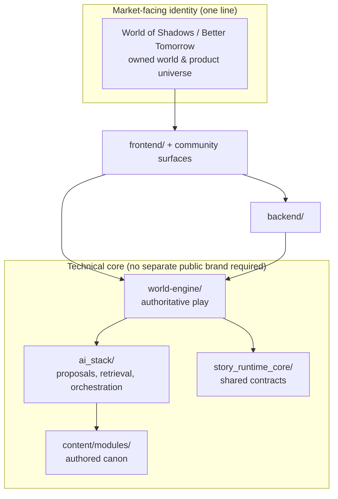
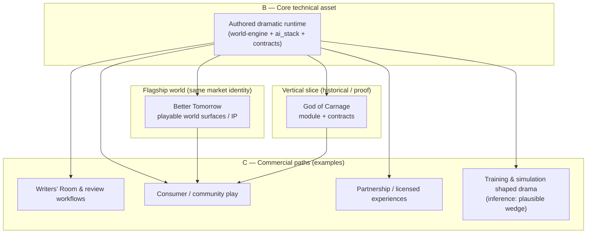
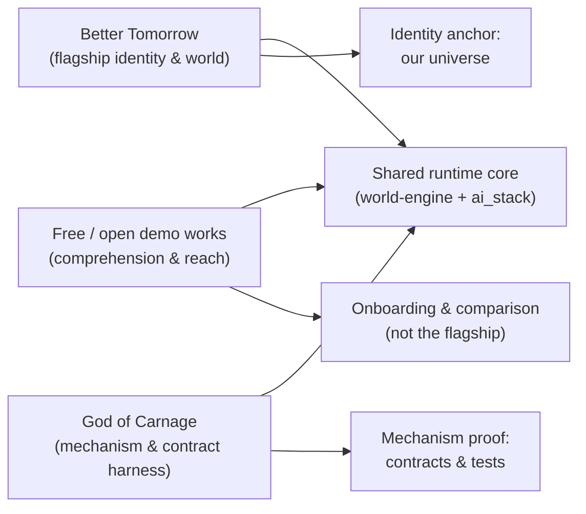
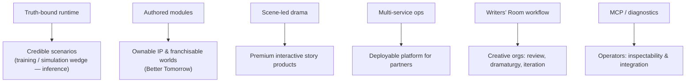
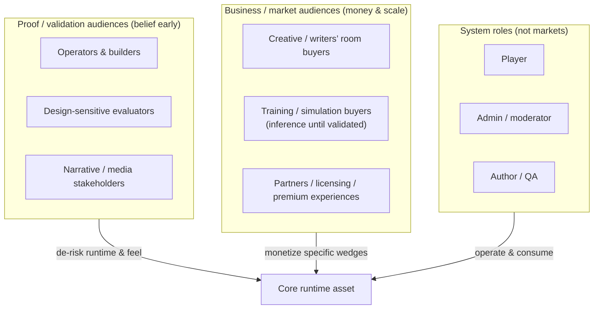

# World of Shadows / Better Tomorrow — product identity, core asset, and what we actually sell

> **Projection governance**
> contractify-projection:
>   source_contracts:
>     - CTR-NORM-INDEX-001
>     - CTR-GOC-VERTICAL-SLICE
>     - CTR-WRITERS-ROOM-PUBLISHING-FLOW
>   projection_weight: low

## Title and purpose

This document is a **founder- and stakeholder-grade** explanation of **World of Shadows** and **Better Tomorrow** as **one market-facing product identity**, of the **runtime system beneath it** as a **separate technical core asset**, and of how **demonstrations, vertical slices, and commercial paths** relate without blurring into each other.

It is written to be **read aloud**, **taken seriously**, and **checked against the repository**—not to sound like a pitch deck, a task report, or generic AI marketing.

**Companion reads:** [`docs/start-here/what-is-world-of-shadows.md`](../start-here/what-is-world-of-shadows.md), [`docs/easy/what_world_of_shadows_is_and_why_it_works_this_way.md`](what_world_of_shadows_is_and_why_it_works_this_way.md), [`docs/MVPs/MVP_World_Of_Shadows/ROADMAP_MVP_WORLD_OF_SHADOWS.md`](../MVPs/MVP_World_Of_Shadows/ROADMAP_MVP_WORLD_OF_SHADOWS.md).

**Regeneration history:** An earlier prompt spec lives at [`docs/easy/PROMPT_WOS_PRODUCT_AUDIENCE_AND_USP_EXPLAINER_EASY.md`](PROMPT_WOS_PRODUCT_AUDIENCE_AND_USP_EXPLAINER_EASY.md). **Index of easy docs:** [`docs/easy/README.md`](README.md).

---

## Source of truth

Facts follow this order:

1. **Implementation** — `frontend/`, `backend/`, `world-engine/`, `administration-tool/`, `writers-room/`, `ai_stack/`, `story_runtime_core/`, `content/modules/`, `tools/mcp_server/`.
2. **Current documentation** — [`README.md`](../../README.md), [`docs/start-here/what-is-world-of-shadows.md`](../start-here/what-is-world-of-shadows.md), [`docs/start-here/how-ai-fits-the-platform.md`](../start-here/how-ai-fits-the-platform.md).
3. **Roadmap and architecture** — [`docs/MVPs/MVP_World_Of_Shadows/ROADMAP_MVP_WORLD_OF_SHADOWS.md`](../MVPs/MVP_World_Of_Shadows/ROADMAP_MVP_WORLD_OF_SHADOWS.md), [`docs/ADR/adr-0001-runtime-authority-in-world-engine.md`](../ADR/adr-0001-runtime-authority-in-world-engine.md), [`docs/technical/content/writers-room-and-publishing-flow.md`](../technical/content/writers-room-and-publishing-flow.md).
4. **Tests and reports** — supporting evidence only.
5. **Inference** — labeled explicitly when the repo does not state a commercial or packaging decision.

---

## The shortest useful explanation

**Market-facing identity:** The product line is presented as **Better Tomorrow (World of Shadows)** in the root [`README.md`](../../README.md). Treat **World of Shadows** and **Better Tomorrow** as **one public universe of product and story**—the **owned world people are invited into**—not as “a platform brand” with “a decorative sub-brand.”

**Technical core:** Under that identity sits a **multi-service narrative platform**: player and admin web apps, APIs and persistence, an **authoritative play runtime** in `world-engine/`, and an **AI stack** that **proposes** turns while **runtime rules validate and commit** what becomes true ([`docs/start-here/how-ai-fits-the-platform.md`](../start-here/how-ai-fits-the-platform.md)).

**In plain words:** The **name and world** make the product **legible and memorable**. The **runtime** makes interactive drama **honest**—so the story cannot silently turn into “whatever the model last said.”

**What this is not:** It is not claiming that every commercial wedge is already validated; see **Audience commitments** and **Inference** notes below.

---

## What the product identity really is

### Plain language

The **product identity** is the **market-facing whole**: the **World of Shadows / Better Tomorrow** line—**narrative game and community platform**, **scene-led drama**, **owned setting and IP surface**—as people and partners would describe it before they care about repository folders.

### Precise product reading

- The repository README titles the project **Better Tomorrow (World of Shadows)** and describes a **multi-service narrative game platform** with player app, admin app, backend, world-engine, AI stack, and modules ([`README.md`](../../README.md)).
- [`docs/start-here/what-is-world-of-shadows.md`](../start-here/what-is-world-of-shadows.md) aligns: narrative game and community platform, with README also using the **Better Tomorrow (World of Shadows)** line; docs often say **World of Shadows** as the primary documentation name—**both refer to the same product family**, not two stacked products.
- Concrete **in-world** surfacing exists in code (e.g. `better_tomorrow_district_alpha`, “Better Tomorrow” in site settings) in `backend/app/content/builtins.py` and `world-engine/app/content/builtins.py`.

### Why it matters

If identity is fuzzy, **everything downstream**—partnerships, pricing, creative investment, community—gets fuzzy. **One clear identity** is an asset, not cosmetics.

### What it is not

- **Not** “Better Tomorrow is only a skin.” The **world and title** are part of **what is being built and sold** as the **public face** of the line.
- **Not** “the runtime has a separate consumer brand today.” The **runtime** is the **engine room**; it does **not** need its own public trademark to be valuable ([`docs/ADR/adr-0001-runtime-authority-in-world-engine.md`](../ADR/adr-0001-runtime-authority-in-world-engine.md) names **world-engine** as authority host—an engineering seam, not a second product logo).

### Commitment

We commit to speaking **externally** in a way that treats **World of Shadows / Better Tomorrow** as **one identity**, and to keeping **technical seams** (services, ADRs) **off the marquee** unless a technical audience needs them.

---

### Diagram 1 — Identity structure (market face vs engine room)

**Title:** One market-facing identity sits above the authoritative runtime stack

**What to notice:** **Identity** is **one layer** for the outside world. **world-engine**, **ai_stack**, and **modules** are **how** the promise is kept—not a competing brand.

**Anchor:** [`README.md`](../../README.md), ADR-0001 [`docs/ADR/adr-0001-runtime-authority-in-world-engine.md`](../ADR/adr-0001-runtime-authority-in-world-engine.md).

---

## Why Better Tomorrow is not “just branding”

### Plain language

**Better Tomorrow** is not wallpaper. It is the **named, buildable world** that makes the platform **emotionally and commercially concrete**: something to **show**, **extend**, and **protect** as **your own** creative and IP surface.

### Precise reading

- The product line is introduced as **Better Tomorrow (World of Shadows)** at the repository root ([`README.md`](../../README.md)).
- Experience templates and builtins bind **Better Tomorrow** to **playable content** (e.g. `better_tomorrow_district_alpha`) in `world-engine/app/content/builtins.py` / `backend/app/content/builtins.py`.
- That means **Better Tomorrow** is **continuity between marketing, UI, and authored experience shape**—not a tagline bolted onto a generic engine demo.

### Why it matters

**Legibility** (“what is this?”), **memory** (“what did I play?”), and **partnership clarity** (“what are we licensing or co-producing?”) all improve when **the world has a name** that **matches** what ships.

### What it is not

- **Not** a claim that every Better Tomorrow experience is **finished** or **freeze-complete**. Roadmap and stakeholder docs still require **shipped vs planned** honesty ([`docs/presentations/goc-vertical-slice-stakeholder-brief.md`](../presentations/goc-vertical-slice-stakeholder-brief.md)).

### Commitment

We commit to treating **Better Tomorrow** as **part of asset value**—creative, strategic, and eventually commercial—not as an expendable label.

---

## The deeper asset beneath the world: the runtime system

### Plain language

Beneath the **named world** is a **serious runtime**: **authored interactive dramatic machinery** where **AI suggests**, **rules and engines decide** what is true in-session, and **continuity** can be **engineered**, not merely hoped for from prompts.

### Precise reading

- **World of Shadows** (the roadmap thesis) is **not a chatbot**: it is an **authored interactive dramatic runtime** with **truth-governed, scene-led** play ([`docs/MVPs/MVP_World_Of_Shadows/ROADMAP_MVP_WORLD_OF_SHADOWS.md`](../MVPs/MVP_World_Of_Shadows/ROADMAP_MVP_WORLD_OF_SHADOWS.md) §2).
-- **Play authority** lives in **`world-engine/`** per ADR-0001 ([`docs/ADR/adr-0001-runtime-authority-in-world-engine.md`](../ADR/adr-0001-runtime-authority-in-world-engine.md)).
- **AI** fits as **proposal → validation → commit** ([`docs/start-here/how-ai-fits-the-platform.md`](../start-here/how-ai-fits-the-platform.md)); GoC slice graphs and contracts are implemented around [`ai_stack/langgraph_runtime.py`](../../ai_stack/langgraph_runtime.py) and [`docs/MVPs/MVP_VSL_And_GoC_Contracts/CANONICAL_TURN_CONTRACT_GOC.md`](../MVPs/MVP_VSL_And_GoC_Contracts/CANONICAL_TURN_CONTRACT_GOC.md).

### Why it matters

The **world** wins attention; the **runtime** wins **trust and repeatability**. Without the second, the first collapses into **forgettable chat**.

### What it is not

- **Not** a second **public** product identity that must be marketed separately **today**. It is the **reusable core** that can power **multiple worlds and wedges** over time.
- **Not** finished “platform completeness.” The MVP roadmap explicitly warns against **architecture depth** substituting for **felt user value** ([`docs/MVPs/MVP_World_Of_Shadows/ROADMAP_MVP_WORLD_OF_SHADOWS.md`](../MVPs/MVP_World_Of_Shadows/ROADMAP_MVP_WORLD_OF_SHADOWS.md) §3.2–3.3).

### Commitment

We commit to **investing in runtime truth boundaries** (authority, validation, commit, diagnostics) as **long-lived asset**, independent of whichever **vertical slice** is on the poster this quarter.

---

### Diagram 2 — Asset layering: core, world, slice, commercial paths

**Title:** Do not confuse the engine, the flagship world, the proof slice, or the go-to-market wedge

**What to notice:** **GoC** and **Better Tomorrow** both **ride on** the **same runtime**; neither **is** the runtime. **Commercial paths** are **how money and adoption happen**—they are **not** the same box as **IP** or **slice**.

**Anchors:** `content/modules/god_of_carnage/`, `better_tomorrow_district_alpha` in `world-engine/app/content/builtins.py`, [`docs/MVPs/MVP_World_Of_Shadows/ROADMAP_MVP_WORLD_OF_SHADOWS.md`](../MVPs/MVP_World_Of_Shadows/ROADMAP_MVP_WORLD_OF_SHADOWS.md) §4.4.

**Inference:** **Training/simulation** as a labeled wedge is **not** spelled out in [`README.md`](../../README.md); it is included as a **plausible** application of **scene-bound, truth-stable interaction**—to be validated like any other market bet.

---

## Why God of Carnage was useful but is not the long-term anchor

### Plain language

**God of Carnage** is the **wind tunnel**: a **first vertical slice** used to **prove** interpretation, scene shape, validation, and continuity. It is **not** the **permanent face** of **World of Shadows / Better Tomorrow** in the market.

### Precise reading

- GoC is the **first MVP vertical slice** in roadmap and glossary terms ([`docs/MVPs/MVP_World_Of_Shadows/ROADMAP_MVP_WORLD_OF_SHADOWS.md`](../MVPs/MVP_World_Of_Shadows/ROADMAP_MVP_WORLD_OF_SHADOWS.md) §2, §6; [`docs/reference/glossary.md`](../reference/glossary.md)).
- The roadmap states clearly: GoC is a **runtime proof module**, **not** proof of **broad market pull** ([`docs/MVPs/MVP_World_Of_Shadows/ROADMAP_MVP_WORLD_OF_SHADOWS.md`](../MVPs/MVP_World_Of_Shadows/ROADMAP_MVP_WORLD_OF_SHADOWS.md) §4.4).
- Normative contracts bind the slice ([`docs/MVPs/MVP_VSL_And_GoC_Contracts/VERTICAL_SLICE_CONTRACT_GOC.md`](../MVPs/MVP_VSL_And_GoC_Contracts/VERTICAL_SLICE_CONTRACT_GOC.md), [`docs/MVPs/MVP_VSL_And_GoC_Contracts/CANONICAL_TURN_CONTRACT_GOC.md`](../MVPs/MVP_VSL_And_GoC_Contracts/CANONICAL_TURN_CONTRACT_GOC.md)).

### Why it matters

Teams confuse **learning vehicles** with **franchise anchors** all the time. That confusion **weakens IP strategy** and **over-claims** what a mechanism demo **proves** commercially.

### What it is not

- **Not** “GoC is throwaway engineering.” It remains **central** to **contracts, tests, and operational truth** until superseded by explicit product policy.
- **Not** a promise about **exact retirement dates** in this document; that is **release strategy**, not something every normative file fixes.

### Commitment

We commit to **praising GoC for what it proved** (runtime and dramatic machinery) and to **not** letting it **define** the **long-term market identity** of **Better Tomorrow / World of Shadows**.

---

## Why free or openly available works strengthen demonstration without replacing the flagship

### Plain language

**Free or familiar demonstration material** helps people **understand the mechanism quickly**. It should **feed comprehension and comparison**, not **replace** the **owned flagship world** as the **center of gravity** for identity.

### Precise reading

- The roadmap’s framing separates **runtime validation** from **genre/market validation** ([`docs/MVPs/MVP_World_Of_Shadows/ROADMAP_MVP_WORLD_OF_SHADOWS.md`](../MVPs/MVP_World_Of_Shadows/ROADMAP_MVP_WORLD_OF_SHADOWS.md) §4.4)—the same logic applies to **choice of demo story**: accessible demos **reduce friction**; they do not **transfer IP equity**.
- Multiple experience templates can coexist in builtins and modules (e.g. GoC-related and **Better Tomorrow** district content in `world-engine/app/content/builtins.py`).

### Why it matters

**Onboarding speed** and **IP strength** are both real—but **different** levers. Using only borrowed demos **weakens equity**; using only original IP **slows comprehension**. A deliberate **two-layer demo strategy** beats either extreme.

### What it is not

- **Not** “free content **is** the product.” It is **supporting proof**.
- **Not** a license to **fork canon** across trees; duplicate-truth risk between `writers-room/` markdown and `content/modules/` is a **known governance issue** ([`docs/technical/content/writers-room-and-publishing-flow.md`](../technical/content/writers-room-and-publishing-flow.md)).

### Commitment

We commit to **using open or familiar demos** where they **accelerate understanding**, while keeping **Better Tomorrow / World of Shadows** as the **named home** people should **remember and return to**.

---

### Diagram 3 — Demonstration strategy (flagship, demos, slice)

**Title:** Better Tomorrow stays central; demos and GoC play different jobs

**Anchors:** [`docs/MVPs/MVP_World_Of_Shadows/ROADMAP_MVP_WORLD_OF_SHADOWS.md`](../MVPs/MVP_World_Of_Shadows/ROADMAP_MVP_WORLD_OF_SHADOWS.md) §4.4, `content/modules/god_of_carnage/`, [`README.md`](../../README.md).

---

## The real unique selling points

These are **differentiators tied to behavior**, not adjectives.

1. **Truth-bound dramatic runtime** — Models **propose**; **validation and commit** decide what becomes session truth ([`docs/start-here/how-ai-fits-the-platform.md`](../start-here/how-ai-fits-the-platform.md), [`docs/technical/runtime/runtime-authority-and-state-flow.md`](../technical/runtime/runtime-authority-and-state-flow.md)).

2. **Authored canon in modules** — YAML-first **canonical modules** under `content/modules/` are the **authored source of truth** for runtime and retrieval projections ([`docs/start-here/what-is-world-of-shadows.md`](../start-here/what-is-world-of-shadows.md), [`docs/technical/content/writers-room-and-publishing-flow.md`](../technical/content/writers-room-and-publishing-flow.md)).

3. **Scene-led play, not endless improv** — Roadmap and README position **guided interactive drama** and **scene-led** narrative vs generic chat ([`docs/MVPs/MVP_World_Of_Shadows/ROADMAP_MVP_WORLD_OF_SHADOWS.md`](../MVPs/MVP_World_Of_Shadows/ROADMAP_MVP_WORLD_OF_SHADOWS.md) §2; [`README.md`](../../README.md)).

4. **Operable multi-service architecture** — Separate **player**, **admin**, **API**, **play service** ([`docs/start-here/system-map-services-and-data-stores.md`](../start-here/system-map-services-and-data-stores.md)) supports **scaling and governance** without collapsing everything into one brittle layer.

5. **Review and publishing discipline (Writers’ Room)** — Backend Writers’ Room workflow produces **structured review artifacts**; **publishing authority** stays in **human/backend governance**, not model output alone ([`docs/technical/content/writers-room-and-publishing-flow.md`](../technical/content/writers-room-and-publishing-flow.md)).

6. **Operator tooling (MCP)** — MCP suites expose **read-heavy** (and bounded) **control-plane** tooling for developers/operators ([`docs/technical/integration/MCP.md`](../technical/integration/MCP.md), `tools/mcp_server/`).

### Why USPs must connect to use cases

**Strengths are not revenue.** Revenue comes from **specific buyers** getting **specific outcomes** (faster review cycles, deployable training scenarios, premium interactive experiences, etc.). The next diagram ties **strengths** to **paths**; **viability of each path** remains **hypothesis until validated**.

---

### Diagram 4 — USP → use-case mapping (same engine, different buyers)

**Plain-language read:** One **runtime spine** supports **several buyer stories**. **Priority** and **truth** of each story are **commercial questions**, not something the engine alone answers.

**Anchors:** [`docs/technical/content/writers-room-and-publishing-flow.md`](../technical/content/writers-room-and-publishing-flow.md), [`docs/presentations/executive-summary-world-of-shadows.md`](../presentations/executive-summary-world-of-shadows.md) (partners/investors audience).

**Inference:** **Training/simulation** buyer fit is **logical** from **truth-stable, scene-bound interaction**, but **not** established by a dedicated product doc in-repo at the time of this writing.

---

## The real business / market audiences

**Definition:** People or organizations who might **pay**, **partner**, or **adopt at scale** because a **specific outcome** is worth money.

### 1. Creative rehearsal, writers’ room, dramaturgy buyers

**Plain language:** Teams that **develop narrative IP** and need **reviewable, structured iteration**—not only a chat window for ideas.

**Repo grounding:** Backend **Writers’ Room** path with staged workflow, retrieval, human decision, and **recommendation-only** outputs until publishing applies ([`docs/technical/content/writers-room-and-publishing-flow.md`](../technical/content/writers-room-and-publishing-flow.md)); optional UI in `writers-room/`.

**Why it matters:** This is one of the **clearest B2B-shaped surfaces** in the tree today.

**What it is not:** **Not** autonomous canon writing as a committed launch scope item for the MVP slice roadmap ([`docs/MVPs/MVP_World_Of_Shadows/ROADMAP_MVP_WORLD_OF_SHADOWS.md`](../MVPs/MVP_World_Of_Shadows/ROADMAP_MVP_WORLD_OF_SHADOWS.md) §6.2).

---

### 2. Training / simulation buyers

**Plain language:** Organizations that need **scenario-based practice** where **what happened** is **stable enough** to debrief and audit.

**Repo grounding:** **Inference.** The repository describes a **truth-governed dramatic runtime** ([`docs/MVPs/MVP_World_Of_Shadows/ROADMAP_MVP_WORLD_OF_SHADOWS.md`](../MVPs/MVP_World_Of_Shadows/ROADMAP_MVP_WORLD_OF_SHADOWS.md) §2, §4.1)—a **plausible foundation** for simulation-style products—but **does not** name training/simulation as a committed vertical in [`README.md`](../../README.md).

**Why it matters:** **Money** often lives here for serious interactive systems—but **only if** buyers believe **integrity and operability**.

**What it is not:** **Not** already validated as **primary** revenue by in-repo product docs.

---

### 3. Strategic partners, licensing, premium experience stakeholders

**Plain language:** Publishers, platforms, studios, or venues that want **differentiated interactive story** or **co-production**—not a commodity chat wrapper.

**Repo grounding:** Executive summary explicitly names **executives, partners, investors** as audience ([`docs/presentations/executive-summary-world-of-shadows.md`](../presentations/executive-summary-world-of-shadows.md)); multi-service map supports **integration** ([`docs/start-here/system-map-services-and-data-stores.md`](../start-here/system-map-services-and-data-stores.md)).

**Why it matters:** **Better Tomorrow / World of Shadows** as **one identity** is easier to **license or co-market** than an anonymous engine.

**What it is not:** **Not** a claim that all **structural normalization** work is complete; stakeholder brief notes **dependency and cohesion** risks ([`docs/presentations/goc-vertical-slice-stakeholder-brief.md`](../presentations/goc-vertical-slice-stakeholder-brief.md)).

---

### Primary vs secondary (honest framing)

- **Primary (repo-strong today):** **Consumer/community narrative platform** shape (README + what-is) plus **Writers’ Room workflow** as a **distinct professional surface**.
- **Secondary / hypothesis until validated:** **Training/simulation** packaging; **specific partnership SKUs**.

---

## The proof / validation audiences

**Definition:** People whose **belief** and **feedback** matter **early**, who may **not** be the **first paying market segment**.

The roadmap lists **three MVP-first target user groups** ([`docs/MVPs/MVP_World_Of_Shadows/ROADMAP_MVP_WORLD_OF_SHADOWS.md`](../MVPs/MVP_World_Of_Shadows/ROADMAP_MVP_WORLD_OF_SHADOWS.md) §4.2):

1. **Internal operators and builders** — verify the runtime **works** and can be **operated**.
2. **Design-sensitive early evaluators** — judge whether it feels like **directed drama**, not chat.
3. **Narrative / interactive media stakeholders** — judge whether the approach has **product potential**.

### Why separating them matters

Confusing **proof audiences** with **customer segments** produces **bad forecasts** and **wrong commitments** (“evaluators loved it” ≠ “studios will buy it”).

### What we owe them

- **Clarity** on **shipped vs planned** ([`docs/presentations/goc-vertical-slice-stakeholder-brief.md`](../presentations/goc-vertical-slice-stakeholder-brief.md)).
- **Access** to **diagnostics** and **contracts** where appropriate—not theater.

### Commitment

We commit to **using** these groups to **de-risk the runtime thesis** (H1–H3 in [`docs/MVPs/MVP_World_Of_Shadows/ROADMAP_MVP_WORLD_OF_SHADOWS.md`](../MVPs/MVP_World_Of_Shadows/ROADMAP_MVP_WORLD_OF_SHADOWS.md) §5.1) **without** relabeling them as **“the market.”**

---

## System roles that must not be confused with markets

**Definition:** **Roles inside the system**—essential, but **not** segments for **go-to-market**.

Examples aligned with the repository layout:

| Role | Primary touch | Repository anchor |
|------|----------------|-------------------|
| **Player** | Public play / community | `frontend/`, [`docs/start-here/what-is-world-of-shadows.md`](../start-here/what-is-world-of-shadows.md) |
| **Admin / operator** | Governance dashboards | `administration-tool/`, `backend/` |
| **Moderator** | Community workflows | Forum/moderation docs under `docs/` (e.g. user/admin guides as applicable) |
| **Author** | Canonical YAML and publishing | `content/modules/`, compiler path in [`docs/technical/content/writers-room-and-publishing-flow.md`](../technical/content/writers-room-and-publishing-flow.md) |
| **QA / tester** | Suites, diagnostics | `backend/tests/`, `world-engine/tests/`, `ai_stack/tests/` |

### Plain language

**Players** are not “a vertical” like **training buyers**. **Admins** are not “a market” like **studios**. Mixing these categories makes **roadmaps unreadable**.

### Commitment

We commit to **separate language** for **“who uses the product”** vs **“who buys the product.”**

---

### Diagram 5 — Business audiences vs proof audiences vs system roles

**Anchor:** [`docs/MVPs/MVP_World_Of_Shadows/ROADMAP_MVP_WORLD_OF_SHADOWS.md`](../MVPs/MVP_World_Of_Shadows/ROADMAP_MVP_WORLD_OF_SHADOWS.md) §4.2; [`docs/start-here/system-map-services-and-data-stores.md`](../start-here/system-map-services-and-data-stores.md).

---

## Audience commitments: what is promised, to whom, and on what basis

### Creative / writers’ room / dramaturgy buyers

| Dimension | Commitment |
|-----------|------------|
| **Promise** | A **review-shaped workflow** that combines **retrieval-grounded context**, **model proposals**, and **explicit human decisions**, with outputs treated as **recommendations** until publishing governance applies ([`docs/technical/content/writers-room-and-publishing-flow.md`](../technical/content/writers-room-and-publishing-flow.md)). |
| **Problem** | “Ideas chat” **without** audit trails, **without** canonical alignment, and **without** a path to **published module truth** breaks professional writers’ rooms. |
| **We commit** | To keeping **canonical YAML** as **runtime truth** unless product policy explicitly elevates another path (same doc; duplicate-truth warning). |
| **We do not yet claim** | Fully **productized** enterprise packaging (SLAs, tiering, self-serve onboarding) beyond what the repo implements. |
| **Proof that would convince** | Repeatable **end-to-end reviews** with **stable artifacts**, **clear authority**, and **measured editor time savings** on real modules. |

---

### Training / simulation buyers (inference segment)

| Dimension | Commitment |
|-----------|------------|
| **Promise (hypothesis)** | **Scenario integrity**: interactions that **stay inside authored bounds** and produce **debriefable state** thanks to **validation/commit**—not free-form roleplay only. |
| **Problem** | Training that **feels fluent but lies** destroys **trust** and **auditability**. |
| **We commit** | To **honesty**: this wedge is **not** the documented **primary** README positioning today; it must be **validated** like any new vertical. |
| **We do not yet claim** | Compliance certifications, domain-specific content libraries, or deployed training programs **in-repo**. |
| **Proof that would convince** | Pilot modules with **measurable debrief fidelity** and **operator visibility** into **why** the session state changed. |

---

### Partners / licensing / premium experience stakeholders

| Dimension | Commitment |
|-----------|------------|
| **Promise** | A **multi-service narrative platform** with **clear runtime authority** and **governed AI assistance**—something **integrable** and **explainable** ([`README.md`](../../README.md); [`docs/start-here/how-ai-fits-the-platform.md`](../start-here/how-ai-fits-the-platform.md)). |
| **Problem** | Partners cannot build on **opaque chat demos**; they need **seams**, **contracts**, and **operational clarity**. |
| **We commit** | To **one market identity** (**World of Shadows / Better Tomorrow**) and to **separating shipped vs aspirational** in external narrative ([`docs/presentations/executive-summary-world-of-shadows.md`](../presentations/executive-summary-world-of-shadows.md); stakeholder brief). |
| **We do not yet claim** | All **cross-stack structural moves** are finished; known risks remain ([`docs/presentations/goc-vertical-slice-stakeholder-brief.md`](../presentations/goc-vertical-slice-stakeholder-brief.md)). |
| **Proof that would convince** | **Stable demos**, **clean integration paths**, and **credible governance** stories backed by **running code** and **contracts**. |

---

### Proof audiences (shared)

| Dimension | Commitment |
|-----------|------------|
| **Promise** | A **narrow, testable** experiential claim: truth-bound dramatic runtime **feels different** from generic chat ([`docs/MVPs/MVP_World_Of_Shadows/ROADMAP_MVP_WORLD_OF_SHADOWS.md`](../MVPs/MVP_World_Of_Shadows/ROADMAP_MVP_WORLD_OF_SHADOWS.md) §4.3–§5). |
| **We commit** | To **instrumentation and honesty** about **what passed** and **what did not**. |
| **We do not claim** | That **GoC success** equals **mass-market success** ([`docs/MVPs/MVP_World_Of_Shadows/ROADMAP_MVP_WORLD_OF_SHADOWS.md`](../MVPs/MVP_World_Of_Shadows/ROADMAP_MVP_WORLD_OF_SHADOWS.md) §4.4). |

---

## Why the system is built this way

### Plain language

Because **drama plus community plus operations** cannot share one **silent source of truth** without **eventually lying to someone**.

### Precise reading

- **Containers** separate player UI, admin UI, API, database, play service ([`docs/start-here/system-map-services-and-data-stores.md`](../start-here/system-map-services-and-data-stores.md)).
- **ADR-0001** places **live narrative authority** in **world-engine** ([`docs/ADR/adr-0001-runtime-authority-in-world-engine.md`](../ADR/adr-0001-runtime-authority-in-world-engine.md)).
- **AI** supports turns but does **not** own committed truth ([`docs/start-here/how-ai-fits-the-platform.md`](../start-here/how-ai-fits-the-platform.md)).

### Why it matters

**Serious products** are **operable products**. Layers exist so **teams** can **own** failure modes.

### What it is not

- **Not** “finished migration everywhere.” Some **transitional** backend paths may remain; see [`docs/easy/what_world_of_shadows_is_and_why_it_works_this_way.md`](what_world_of_shadows_is_and_why_it_works_this_way.md) and [`docs/technical/architecture/backend-runtime-classification.md`](../technical/architecture/backend-runtime-classification.md).

---

## Why this is not just another AI product

### Plain language

Many AI products sell **fluency**. This line of work sells **structure**: **memory that is earned**, **scenes that hold**, and **failures that can be traced** to **rules and commits**, not vibes.

### Precise reading

Roadmap falsification modes read like a catalog of **shallow AI story failure** ([`docs/MVPs/MVP_World_Of_Shadows/ROADMAP_MVP_WORLD_OF_SHADOWS.md`](../MVPs/MVP_World_Of_Shadows/ROADMAP_MVP_WORLD_OF_SHADOWS.md) §5.2). The architecture is aimed at **those** failures.

### What it is not

- **Not** “models don’t matter.” They matter; they are simply **not sovereign** over truth ([`docs/start-here/how-ai-fits-the-platform.md`](../start-here/how-ai-fits-the-platform.md)).

---

## What the user, customer, and stakeholder actually get

### Players and community participants

**Coherent scene reality** and **continuity** as **designed outcomes** of runtime commit semantics—not only clever text ([`docs/MVPs/MVP_World_Of_Shadows/ROADMAP_MVP_WORLD_OF_SHADOWS.md`](../MVPs/MVP_World_Of_Shadows/ROADMAP_MVP_WORLD_OF_SHADOWS.md) §4.3).

### Paying / partnering customers (by wedge)

- **Writers’ room buyers:** **Review bundles**, **governance envelopes**, and a path toward **published module truth** ([`docs/technical/content/writers-room-and-publishing-flow.md`](../technical/content/writers-room-and-publishing-flow.md)).
- **Partners:** **Integrable services** and **clear authority story** ([`docs/start-here/system-map-services-and-data-stores.md`](../start-here/system-map-services-and-data-stores.md)).
- **Training/simulation (if pursued):** **Hypothesis-only today**—value would come from **integrity + operability**, not from the **world name alone**.

### Stakeholders evaluating the company

**Honest scope labeling** and **evidence-backed** runtime claims ([`docs/presentations/goc-vertical-slice-stakeholder-brief.md`](../presentations/goc-vertical-slice-stakeholder-brief.md)).

**In plain words:** The **world** makes it **lovable**; the **runtime and wedges** make it **a business**.

---

## What this can grow into over time

### Plain language

If the **core asset** stays strong, the **same engine** can support **more worlds**, **more modules**, **more professional workflows**, and **more partner shapes**—without restarting truth from zero each time.

### Precise reading

- Roadmap **freezes** certain expansions until assumptions are tested ([`docs/MVPs/MVP_World_Of_Shadows/ROADMAP_MVP_WORLD_OF_SHADOWS.md`](../MVPs/MVP_World_Of_Shadows/ROADMAP_MVP_WORLD_OF_SHADOWS.md) §6.4)—growth is **intentionally gated**, not denied.
- **Better Tomorrow** gives a **named place** for **long-term creative compounding** ([`README.md`](../../README.md); builtins templates).

### What it is not

- **Not** a promise that **revenue diversification** is already done. **Commercial paths** still need **evidence**.

### Commitment

We commit to **compounding the runtime asset** and **compounding the world identity** as **parallel** priorities—without **confusing** either for the other.

---

## Conclusion

**World of Shadows / Better Tomorrow** is **one market-facing identity**: the **owned universe** people should understand and remember.

Under it lies a **real runtime asset**: **authored, scene-led, truth-bound** interactive drama machinery centered on **`world-engine/`** authority and **proposal/commit** discipline.

**God of Carnage** remains **historically decisive** as a **vertical slice** and **contract harness**; it is **not** the **long-term anchor** for **market identity**.

**Free demonstrations** can **accelerate comprehension** without **replacing** the **flagship world**.

**Money** follows **clear wedges**—writers’ room workflows, consumer play, partnerships, and **plausible** domains like **training/simulation**—not from **the name alone**.

If one sentence should survive: **love the world in public; earn the business in specific use cases; keep the runtime honest in both.**

---

## Quick anchor index

| Topic | Document |
|--------|-----------|
| Product + services | [`README.md`](../../README.md) |
| Plain “what is it” | [`docs/start-here/what-is-world-of-shadows.md`](../start-here/what-is-world-of-shadows.md) |
| AI proposal vs commit | [`docs/start-here/how-ai-fits-the-platform.md`](../start-here/how-ai-fits-the-platform.md) |
| MVP proof vs market | [`docs/MVPs/MVP_World_Of_Shadows/ROADMAP_MVP_WORLD_OF_SHADOWS.md`](../MVPs/MVP_World_Of_Shadows/ROADMAP_MVP_WORLD_OF_SHADOWS.md) §4 |
| Writers’ Room | [`docs/technical/content/writers-room-and-publishing-flow.md`](../technical/content/writers-room-and-publishing-flow.md) |
| Runtime authority | [`docs/ADR/adr-0001-runtime-authority-in-world-engine.md`](../ADR/adr-0001-runtime-authority-in-world-engine.md) |
| System map | [`docs/start-here/system-map-services-and-data-stores.md`](../start-here/system-map-services-and-data-stores.md) |
