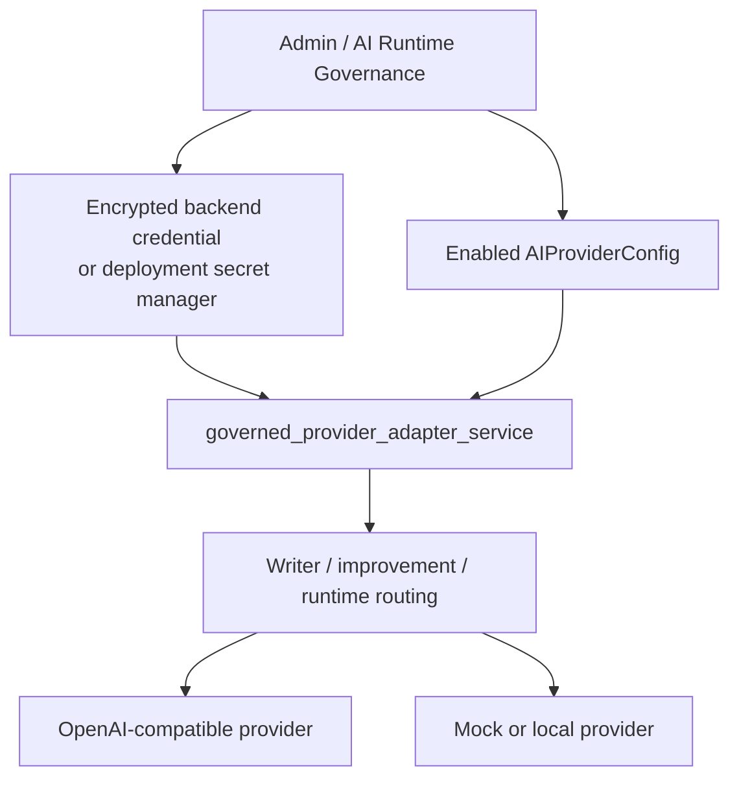

# Provider credential governance and local evaluator evidence

Status date: 2026-05-17

Normative decision record: [ADR-0049: Provider credential governance and local evaluator evidence](../ADR/adr-0049-provider-credential-governance-and-local-evaluator-evidence.md)

## Conclusion

Provider API keys for backend and play-service runtime access are governed credentials, not Compose-owned configuration.

Local evaluators may run through Langfuse, but their judge scores are diagnostic only. Local judge evidence must be marked with `local_only: true` and must not be treated as staging or production promotion evidence.

## Current controls

| Control | Current implementation | Evidence | Boundary |
| --- | --- | --- | --- |
| Compose does not inject direct provider keys | Backend and play-service carry empty overrides for `OPENAI_API_KEY=`, `OPENROUTER_API_KEY=`, `ANTHROPIC_API_KEY=`, and `HF_TOKEN=` | `docker-compose.yml`, `.env.example`, `tests/test_local_langfuse_docker_config.py` | Non-secret provider base URLs may still live in Compose/env config |
| Local bootstrap avoids provider secrets | `docker-up.py` generates and preserves platform secrets, but direct provider keys are not optional bootstrap secrets | `docker-up.py`, `.env.example` | Operators configure provider access through governance or their deployment secret manager |
| Runtime adapters are governed | OpenAI-compatible adapters are built from enabled `AIProviderConfig` rows plus `get_provider_credential_for_runtime`; missing credentials make the adapter unavailable | `backend/app/services/governance/governed_provider_adapter_service.py`, `backend/app/services/writers_room_pipeline_workflow.py`, `backend/app/services/improvement/improvement_task2a_routing.py` | Mock/local adapters remain available without external credentials |
| OpenAI-compatible env fallback is disabled by default | `OpenAIChatAdapter` accepts explicit credentials and does not read `OPENAI_API_KEY` unless explicitly opted in | `story_runtime_core/adapters.py`, `story_runtime_core/tests/test_adapters.py` | Narrow tooling may opt in explicitly, but application runtime must not depend on implicit env keys |
| Readiness names the source | Operator readiness reports `provider_credential_source=backend_governance_or_secret_manager` and derives live capability from governed credentials | `world-engine/app/api/http.py`, `world-engine/tests/test_api_security.py` | Legacy env-key presence flags are compatibility information, not live-provider authority |
| Local judge evidence is marked | Langfuse trace and score metadata carry `evidence_scope=local_langfuse`, `proof_level=local_only`, `local_only: true`, and `live_or_staging_evidence=false` | `story_runtime_core/langfuse_tracing_environment.py`, `world-engine/app/observability/langfuse_adapter.py`, `tools/mcp_server/tools_registry_handlers_langfuse_verify.py` | Local evidence can guide diagnostics but not promotion or runtime truth mutation |

## Runtime credential flow



## Local evaluator evidence contract

Local Langfuse and MCP evidence is useful for development diagnostics. It is not production or staging evidence unless a deployment explicitly records a non-local evidence source and matching environment metadata.

Required local metadata:

```text
evidence_scope=local_langfuse
proof_level=local_only
local_only: true
live_or_staging_evidence=false
```

Consumers must treat any of the following as local-only evidence:

- `local_only` is true
- `proof_level` equals `local_only`
- `evidence_scope` equals `local_langfuse`

Local-only evidence must not:

- mutate commit state
- change `validation_outcome`
- satisfy a production/staging promotion gate
- turn a provider route into a live-ready route without governed credentials

## Operator procedure

### Local development

1. Run `python docker-up.py init-env` or `python docker-up.py up` for local bootstrap.
2. Do not place provider API keys in Compose files.
3. Configure provider access through the Administration Tool / AI Runtime Governance path when a provider-backed evaluator or runtime path is needed.
4. Use local Langfuse scores as diagnostics only. Check metadata for `local_only: true` before citing evidence.

### Production or staging

1. Use a dedicated secret store, orchestrator-native secret, or backend-governance credential store for provider keys.
2. Record the credential source, provider id, rotation owner, and rotation cadence in the operator evidence pack.
3. Do not expose raw provider keys in screenshots, logs, traces, `.env` files, issue trackers, or docs.
4. Verify readiness reports `provider_credential_source=backend_governance_or_secret_manager`.
5. Separate production/staging evaluator evidence from local evidence by environment metadata and evidence scope.

### Adding a provider

1. Add the provider as governed configuration, not as a direct Compose key.
2. Add an encrypted credential lookup path through backend governance or secret-manager integration.
3. Ensure adapter construction fails closed when the credential is absent.
4. Add tests proving Compose does not inherit the raw key and routing filters unavailable adapters.
5. Extend this document and [ADR-0049](../ADR/adr-0049-provider-credential-governance-and-local-evaluator-evidence.md) if the provider changes the boundary.

## Verification commands

Use these commands to re-check repository evidence:

```bash
rg -n "OPENAI_API_KEY=|OPENROUTER_API_KEY=|ANTHROPIC_API_KEY=|HF_TOKEN=" docker-compose.yml .env.example docker-up.py
rg -n "build_governed_provider_adapters|get_provider_credential_for_runtime|AIProviderConfig" backend/app story_runtime_core world-engine/app
rg -n "allow_env_api_key|OpenAIChatAdapter" story_runtime_core/adapters.py story_runtime_core/tests
rg -n "local_only|proof_level|evidence_scope|live_or_staging_evidence" story_runtime_core world-engine/app tools/mcp_server ai_stack
rg -n "provider_credential_source|backend_governance_or_secret_manager" world-engine/app backend/tests world-engine/tests
```

These commands prove repository controls and metadata contracts. They do not prove production secret-store configuration; production deployments must keep external evidence for that.

## Evidence pack for production

For each deployment, keep an internal evidence pack with:

- provider id and enabled model route
- credential source (`backend governance`, `Vault`, cloud secret manager, orchestrator secret, or equivalent)
- key owner and rotation cadence
- last rotation or import timestamp
- access-control policy for who may read or rotate provider secrets
- readiness snapshot showing governed credential source
- evaluator evidence environment and whether it is local, staging, or production

Do not include raw API keys in the evidence pack.

## Non-goals

- This document does not implement a production secret manager.
- This document does not claim local Langfuse evidence is production evidence.
- This document does not remove `.env` as a local bootstrap file for platform secrets and wiring.
- This document does not replace [At-rest encryption evidence](AT_REST_ENCRYPTION.md); provider credential encryption is only one data-protection control.

## Related documentation

- [ADR-0049: Provider credential governance and local evaluator evidence](../ADR/adr-0049-provider-credential-governance-and-local-evaluator-evidence.md)
- [Security documentation](README.md)
- [At-rest encryption evidence and completion plan](AT_REST_ENCRYPTION.md)
- [Security and compliance overview](../admin/security-and-compliance-overview.md)
- [Operations README](../operations/README.md)
