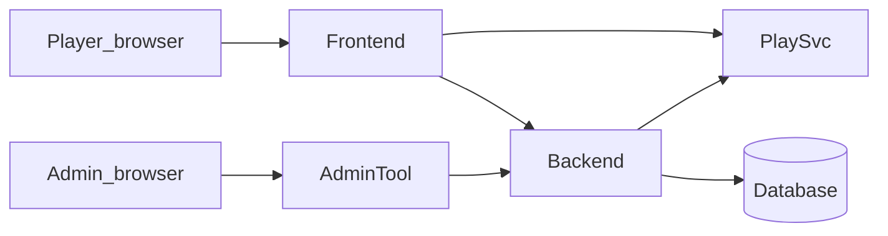

# System map: services and data stores

This page explains **which programs run**, **how they talk**, and **where data lives**, at a **container** level suitable for newcomers, operators, and stakeholders. For code-level seams, see [Runtime authority and state flow](../technical/runtime/runtime-authority-and-state-flow.md) and the [developer seam note](../dev/architecture/runtime-authority-and-session-lifecycle.md).

## Context (who touches the system)

- **Players** use the **frontend** (public site and play shell).
- **Administrators** use the **administration tool**.
- The **backend** centralizes **authenticated APIs**, **business rules**, and **persistence**.
- The **play service** (world-engine) hosts **authoritative game/session runtime** for live play.

## Containers at a glance

| Container / process | Repository path | Typical responsibility |
|---------------------|-----------------|-------------------------|
| Frontend | `frontend/` | Player UI; calls backend API; uses public play URL for runtime |
| Administration tool | `administration-tool/` | Admin UI; calls backend API |
| Backend | `backend/` | Auth, REST API, migrations, content compiler, integration with play service |
| Play service | `world-engine/` | Session lifecycle, turn execution, WebSocket gameplay, runtime persistence |
| Database | external to app code | Owned by backend ORM/migrations |

**Docker Compose:** root `docker-compose.yml` defines `frontend`, `administration-tool`, `backend`, and `play-service` with example environment variables. **Bare-metal local dev** often uses different host ports than Compose; see [Local development and test workflow](../dev/local-development-and-test-workflow.md).

## Data and authority

- **Accounts, forum, news, wiki, admin data:** persisted via **backend** to the **database**.
- **Live narrative session state** for play: owned by the **play service** runtime store (configuration-dependent; see world-engine docs). The **backend** orchestrates bootstrap/tickets and policy integration as implemented in code.
- **Canonical authored narratives:** files under `content/modules/<module_id>/`; the **backend** loads and compiles them into projections consumed by runtime and retrieval paths.

## Important path warning (developers)

The repository may contain **more than one tree** with “world-engine” in the name. The **canonical play service** for architecture discussions is the **top-level** `world-engine/` package. A nested `backend/world-engine/` path has been flagged in audit baselines as a **confusion risk**—treat it as **non-canonical** for “where do I run the play service?” questions unless a maintainer doc explicitly says otherwise.

## Related

- [Runtime authority and state flow](../technical/runtime/runtime-authority-and-state-flow.md) — canonical ownership boundaries.
- [Deployment guide](../admin/deployment-guide.md) — how to run the stack.
- [Glossary](../reference/glossary.md) — play service, backend, module.
