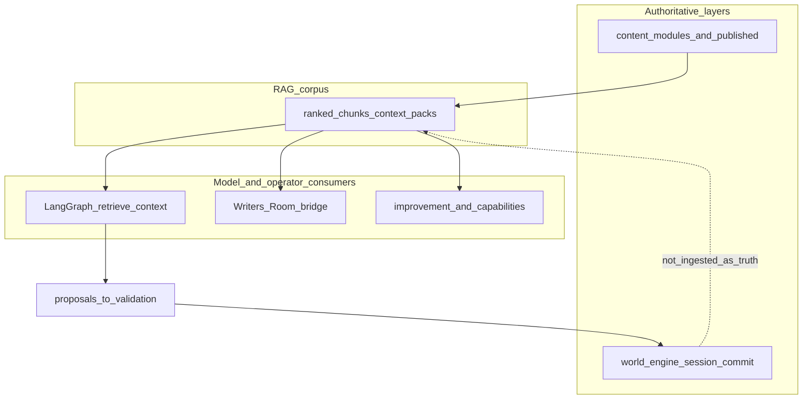

# RAG (retrieval-augmented generation)

**Purpose:** Give **runtime turns**, **Writers’ Room**, **sandbox improvement**, and **research-oriented** callers **project-owned text context** for prompts and diagnostics—while keeping **committed narrative authority** in world-engine and **authored canon** in repository content, not in “whatever the retriever returned last.”

**Spine:** [AI in World of Shadows — Connected System Reference](../../ai/ai_system_in_world_of_shadows.md).

---

## Plain language

**Retrieval** searches a **local** corpus built from checked-in paths (modules, docs, selected reports). Hits are **ranked and packed** into **context packs** for models and operators. That material **informs** generation; it does **not** override slice contracts, validation seams, or published module truth.

## Technical precision

- **Implementation:** `ai_stack/rag.py` — `ContextRetriever`, `ContextPackAssembler`, `RetrievalRequest`, `CorpusChunk`, governance enums.
- **Persistence:** JSON corpus `.wos/rag/runtime_corpus.json` (`PersistentRagStore`); optional dense index `.wos/rag/runtime_embeddings.npz` + `runtime_embeddings.meta.json` (see below).
- **Turn-level governance visibility:** `ai_stack/retrieval_governance_summary.py` — aggregates lane/visibility histograms from hit rows for diagnostics **without** changing ranking (consumes `retrieval["sources"]` rows from the graph).

**Anchors:** `ai_stack/rag.py`, `ai_stack/retrieval_governance_summary.py`, `ai_stack/langgraph_runtime.py` (`_retrieve_context`).

## Why this matters in World of Shadows

Without explicit **domains** and **governance lanes**, draft notes and evaluation JSON could leak into **runtime** prompts as if they were published canon. The code separates **who may see which content classes** and applies **hard gates** (for example draft suppression at runtime when published canonical material exists for the same module).

## What RAG is not

- **Not** authoritative narrative state: session history and commits live under world-engine rules, not the vector store.
- **Not** a hosted multi-tenant vector database: design is **single-host**, linear scan over embeddings when enabled.
- **Not** a substitute for `content/modules/` or `content/published/`: those trees remain **authored sources**; RAG **reads** them (and other configured paths) into chunks.

## Neighbors

- **LangGraph:** `retrieve_context` node uses `RetrievalDomain.RUNTIME` and profile `runtime_turn_support`.
- **LangChain:** Writers’ Room retriever bridge uses `RetrievalDomain.WRITERS_ROOM` / `writers_review` (`ai_stack/langchain_integration/bridges.py`).
- **Capabilities:** `wos.context_pack.build` accepts a payload `domain` (defaults to `runtime`) when assembling packs (`ai_stack/capabilities.py`).
- **Research store:** persisted research artifacts (`.wos/research/`) are a **different** subsystem from the RAG corpus; research **retrieval domain** in RAG is defined for consistent policy when callers use `RetrievalDomain.RESEARCH`.

---

## Authoritative truth vs retrieved context

| Concept | Where it lives | Role |
|---------|----------------|------|
| **Authored canon (modules)** | `content/modules/`, `content/published/` (and governance around them) | Primary human-authored source for slice material. |
| **Runtime committed state** | World-engine session history, narrative commit records | What actually happened in play after validation/commit. |
| **Retrieved chunks** | `.wos/rag/` corpus rows | **Hints and citations** for prompts; may include drafts, transcripts, and docs under policy. |

**Inference:** Product policy could elevate other paths; the **default** engineering assumption in code is: retrieval **never** auto-writes canon or session truth.

---

## Diagram: truth and retrieval boundaries

*Anchored in:* `governance_view_for_chunk` and `DOMAIN_CONTENT_ACCESS` in `ai_stack/rag.py`; session authority in `world-engine/app/story_runtime/manager.py`.

**What this clarifies:** Retrieval **feeds** proposal paths; **seams and host** still separate proposal from committed session outcomes.

---

## Storage and ingestion

- **Local persistence:** default corpus path `.wos/rag/runtime_corpus.json`.
- **Startup:** tries cache load; rebuild when **source fingerprint** changes (selected paths: size + mtime).
- **Corpus metadata:** `index_version`, `corpus_fingerprint`, per-chunk `source_version` / `source_hash`, profile markers.

**Ingestion sources** (policy in `ai_stack/rag.py`):

- `content/**/*` — `.md`, `.json`, `.yml`, `.yaml`
- `docs/technical/**/*.md`
- `docs/reports/**/*.md` (where included by configuration)

Tracked fixture JSON under `backend/fixtures/improvement_experiment_runs/` is **excluded** from the fingerprint glob so sample experiment payloads are not ingested as architecture text.

Chunk metadata includes `source_path`, `source_name`, `content_class`, `source_version` (`sha256:` prefix), `source_hash`, `canonical_priority`, sparse-vector terms, and norms.

---

## Scoring paths

### Sparse (always available)

Canonicalized tokens, concept expansion, IDF-weighted sparse vectors, cosine similarity. If dense/hybrid is off or fails, `ContextRetriever` uses `retrieval_route=sparse_fallback`.

### Dense / hybrid (optional)

- Optional dependency: `fastembed` (see `world-engine/requirements.txt`, `backend/requirements.txt`).
- Model: `BAAI/bge-small-en-v1.5` (ONNX via fastembed), L2-normalized.
- Artifacts: `.wos/rag/runtime_embeddings.npz` + `runtime_embeddings.meta.json`; version mismatches force rebuild.
- **Routing:** `retrieval_route=hybrid` when encoding succeeds; otherwise sparse fallback (`embedding_query_encode_failed` in notes when query-time encode fails).

### Environment variables

| Variable | Effect |
|----------|--------|
| `WOS_RAG_DISABLE_EMBEDDINGS` | `1` / `true` / `yes` forces sparse-only |
| `WOS_RAG_EMBEDDING_CACHE_DIR` | Cache dir for `TextEmbedding` (reproducible CI) |
| `HF_HOME`, `HUGGINGFACE_HUB_CACHE` | May affect hub download layout |

Probe without side effects: `ai_stack.semantic_embedding.embedding_backend_probe()`.

### Profile boosts

Content-class boosts, canonical priority, module match, scene hints — applied on top of hybrid or sparse base scoring (`PROFILE_CONTENT_BOOSTS`, `PROFILE_CANONICAL_WEIGHT` in `ai_stack/rag.py`).

---

## Retrieval domains and default profiles

`RetrievalDomain` selects **which content classes may enter the candidate pool at all** (`DOMAIN_CONTENT_ACCESS` in `ai_stack/rag.py`). Each domain maps to a default **profile** string that tunes hybrid weights, boosts, and governance notes (`DOMAIN_DEFAULT_PROFILE`).

| Domain (enum) | Default profile | Typical callers (examples) |
|---------------|-----------------|-----------------------------|
| `runtime` | `runtime_turn_support` | `RuntimeTurnGraphExecutor._retrieve_context` (`ai_stack/langgraph_runtime.py`) |
| `writers_room` | `writers_review` | `LangChainRetrieverBridge.get_writers_room_documents` (`ai_stack/langchain_integration/bridges.py`) |
| `improvement` | `improvement_eval` | Improvement and eval scenarios; capability-driven packs when domain set |
| `research` | `research_eval` | Defined end-to-end in `rag.py` for research-mode retrieval consistency; use when constructing `RetrievalRequest(domain=...)` for research tooling |

**Plain language:** **Runtime** is the strictest visibility story for live play. **Writers’ Room** sees more draft/review-shaped classes. **Improvement** may rank evaluation artifacts. **Research** aligns retrieval policy with research workflows without conflating them with live-turn defaults.

---

## Diagram: domain → content access → profile

*Anchored in:* `DOMAIN_CONTENT_ACCESS`, `DOMAIN_DEFAULT_PROFILE` in `ai_stack/rag.py`.

**What this clarifies:** **Domain** is a **hard** filter on eligible chunks; **profile** tunes scoring and notes **after** eligibility.

---

## Source governance (retrieval policy)

A **governance layer** maps each chunk to:

- **Evidence lane:** `canonical`, `supporting`, `draft_working`, `internal_review`, `evaluative` — from `ContentClass`, `canonical_priority`, and repo-relative `source_path` (for example `content/published/` vs `content/modules/`).
- **Visibility class:** `runtime_safe`, `writers_working`, `improvement_diagnostic`.

**Policy version string:** `RETRIEVAL_POLICY_VERSION` in `ai_stack/rag.py` is currently `task3_source_governance_v1`. That value is an **opaque, committed identifier** for traces and bundles (so operators can tell which policy semantics produced a pack). It is **not** an operational checklist label for day-to-day reading—behavior is defined by the Python functions (`governance_view_for_chunk`, rerank gates).

**Runtime profile (`runtime_turn_support`):** hard gate drops same-module **draft_working** authored chunks from the rerank pool when a **published canonical** authored chunk (`canonical_priority >= 4`) for that `module_id` is already present.

**Writers’ profile:** broader draft visibility with soft boosts.

**Improvement profile:** adds boosts for policy-guideline chunks and evaluative material per `PROFILE_CONTENT_BOOSTS`.

Outputs expose `source_evidence_lane`, `source_visibility_class`, `policy_note`, and related fields on hits and context packs.

---

## Active wiring (verified call sites)

- **World-engine turn path:** `build_runtime_retriever(...)` / graph `retrieve_context` with `RetrievalDomain.RUNTIME` (`ai_stack/langgraph_runtime.py`).
- **Writers’ Room:** `wos.context_pack.build` in `writers_room` mode; retriever bridge shares semantics (`ai_stack/capabilities.py`, `bridges.py`).
- **Improvement:** uses `RetrievalDomain.IMPROVEMENT` in tests and eval harnesses (`ai_stack/tests/test_rag.py`, `ai_stack/tests/retrieval_eval_scenarios.py`); improvement HTTP flows compose context via capabilities as described in [improvement_loop_in_world_of_shadows.md](improvement_loop_in_world_of_shadows.md).

---

## Limits

- Hybrid retrieval uses **local linear scan** over chunk vectors (no ANN service); first use may download ONNX unless cached.
- OS variance for ONNX and HF cache (for example Windows symlinks)—sparse path remains the portable baseline.
- No in-product retrieval quality dashboard in-repo at time of writing.

---

## Legacy verification and archived material

Embedding hardening notes and older evaluation write-ups live under `docs/archive/rag-task-legacy/` with cross-references in consolidation docs. **Canonical behavior** is always `ai_stack/rag.py` plus the call sites above.

---

## Related

- [LangGraph.md](../integration/LangGraph.md) — `retrieve_context` node.
- [LangChain.md](../integration/LangChain.md) — Writers’ Room retriever bridge.
- [MCP.md](../integration/MCP.md) — operator surface (not RAG storage).
- [improvement_loop_in_world_of_shadows.md](improvement_loop_in_world_of_shadows.md) — sandbox improvement vs research pipeline.
