# AI stack overview

**Connected system reference (spine):** [AI in World of Shadows — Connected System Reference](../../ai/ai_system_in_world_of_shadows.md) ties together runtime play AI, research and canon-improvement, RAG, LangGraph, LangChain, routing, capabilities, MCP, and authority boundaries.

## What exists now

The **AI stack** is not only “the turn graph.” It includes:

- **Runtime play:** LangGraph turn orchestration in world-engine, RAG for `retrieve_context`, LangChain for structured adapter invocation, GoC seams, and model routing.
- **Research and canon improvement (review-bound):** Deterministic pipeline from source intake through exploration, claims, optional canon issues/proposals, and review bundles (`ai_stack/research_langgraph.py` and related `research_*.py` modules, `canon_improvement_engine.py`).
- **Sandbox improvement (governance-adjacent):** Backend HTTP flows for variants, experiments, and recommendation packages ([improvement_loop_in_world_of_shadows.md](improvement_loop_in_world_of_shadows.md)).
- **Governed capabilities:** Mode-gated operations shared across runtime, Writers’ Room, and improvement (`ai_stack/capabilities.py`).
- **Operator MCP surface:** Stdio server exposing tools, resources, and prompts by suite ([../integration/MCP.md](../integration/MCP.md)).

**Runtime authority** stays in world-engine; models produce **proposals** until validation and commit accept them. Research and MCP outputs remain **non-authoritative** for live canon unless human governance promotes them.

## Layers (table)

| Piece | Location | Role |
|-------|----------|------|
| Turn graph | `ai_stack/langgraph_runtime.py` | `RuntimeTurnGraphExecutor` — interpret → retrieve → resolve → director → model → validate/commit → render → package |
| GoC YAML / seams | `ai_stack/goc_yaml_authority.py`, `goc_turn_seams.py`, `scene_director_goc.py` | Canonical slice wiring, validate/commit/render |
| RAG | `ai_stack/rag.py` | Ingestion, ranking, domains (`runtime`, `writers_room`, `improvement`, `research`), governance lanes — [RAG.md](RAG.md) |
| LangChain bridge | `ai_stack/langchain_integration/` | Prompt templates, structured parsers, retriever bridge — [LangChain.md](../integration/LangChain.md) |
| Capabilities | `ai_stack/capabilities.py` | Context pack, transcript, review bundle, research explore — mode gates, audit |
| Research store / pipeline | `ai_stack/research_store.py`, `research_langgraph.py`, `research_exploration.py`, `research_validation.py`, `canon_improvement_engine.py` | Bounded exploration, claims, review bundles, non-publish canon proposals |
| Model routing | `backend/app/runtime/model_routing.py`, `routing_registry_bootstrap.py` | Adapter choice, degradation, traces — [llm-slm-role-stratification.md](llm-slm-role-stratification.md) |
| MCP canonical surface | `ai_stack/mcp_canonical_surface.py`, `tools/mcp_server/` | Suite-scoped tools, resources, prompts |

**Plain-language counterpart:** [how-ai-fits-the-platform.md](../../start-here/how-ai-fits-the-platform.md).

## Graph shape (God of Carnage — runtime)

Normative ordering and state fields: [`docs/VERTICAL_SLICE_CONTRACT_GOC.md`](../../VERTICAL_SLICE_CONTRACT_GOC.md). High level:

```mermaid
flowchart LR
  interpret[interpret_input]
  retrieve[retrieve_context]
  resolve[goc_resolve_canonical_content]
  director[director_nodes]
  model[invoke_model]
  validate[validate_seam]
  commit[commit_seam]
  render[render_visible]
  package[package_output]
  interpret --> retrieve --> resolve --> director --> model --> validate --> commit --> render --> package
```

## Proposal vs commit

`validate_seam` / `commit_seam` enforce separation between **proposal** and **committed** effects. See [`docs/CANONICAL_TURN_CONTRACT_GOC.md`](../../CANONICAL_TURN_CONTRACT_GOC.md).

## Model routing (deep dive)

Production routing, registry bootstrap, staged runtime orchestration, Writers’ Room and improvement surfaces: [llm-slm-role-stratification.md](llm-slm-role-stratification.md).

## Related

- [RAG.md](RAG.md)
- [improvement_loop_in_world_of_shadows.md](improvement_loop_in_world_of_shadows.md)
- [../integration/LangGraph.md](../integration/LangGraph.md)
- [../integration/MCP.md](../integration/MCP.md)
- [../runtime/runtime-authority-and-state-flow.md](../runtime/runtime-authority-and-state-flow.md)
- Contributor shortcuts: [docs/dev/architecture/ai-stack-rag-langgraph-and-goc-seams.md](../../dev/architecture/ai-stack-rag-langgraph-and-goc-seams.md)
