# AI stack overview

Current **AI stack** for World of Shadows: retrieval (RAG), **LangGraph** turn orchestration in world-engine, **LangChain** for structured adapter invocation, a governed **capability** layer (MCP-aligned), and model routing/adapters in `story_runtime_core` and backend services. **Runtime authority** stays in world-engine; models produce **proposals** until validation and commit.

## Layers (what exists now)

| Piece | Location | Role |
|-------|----------|------|
| Turn graph | `ai_stack/langgraph_runtime.py` | `RuntimeTurnGraphExecutor` — interpret → retrieve → route → model → fallback → package |
| GoC YAML / seams | `ai_stack/goc_yaml_authority.py`, `goc_turn_seams.py`, `scene_director_goc.py` | Canonical slice wiring, validate/commit/render |
| RAG | `ai_stack/rag.py` | Ingestion, ranking, profiles, governance lanes — see [`RAG.md`](RAG.md) |
| LangChain bridge | `ai_stack/langchain_integration/` | Prompt templates, structured parsers, retriever bridge — see [`../integration/LangChain.md`](../integration/LangChain.md) |
| Capabilities | `ai_stack/capabilities.py` | `wos.context_pack.build`, `wos.review_bundle.build`, mode gates, audit rows |
| Model routing | `backend/app/runtime/model_routing.py`, registry bootstrap | Adapter choice, degradation, traces (Writers’ Room / improvement share patterns) |

**Plain-language counterpart:** [`docs/start-here/how-ai-fits-the-platform.md`](../../start-here/how-ai-fits-the-platform.md).

## Graph shape (God of Carnage)

Normative ordering and state fields: [`docs/VERTICAL_SLICE_CONTRACT_GOC.md`](../../VERTICAL_SLICE_CONTRACT_GOC.md) (Reality Anchor). At a high level:

```mermaid
flowchart LR
  interpret[interpret_input]
  retrieve[retrieve_context]
  resolve[goc_resolve_canonical_content]
  director[director_nodes]
  model[invoke_model]
  validate[validate_seam]
  commit[commit_seam]
  render[render_visible]
  package[package_output]
  interpret --> retrieve --> resolve --> director --> model --> validate --> commit --> render --> package
```

## Proposal vs commit

`validate_seam` / `commit_seam` enforce separation between **proposal** and **committed** effects. See [`docs/CANONICAL_TURN_CONTRACT_GOC.md`](../../CANONICAL_TURN_CONTRACT_GOC.md).

## Model routing and registry (deep dive)

Production routing, registry bootstrap, Writers’ Room / improvement stages, and inventory validation are documented in detail in [`llm-slm-role-stratification.md`](llm-slm-role-stratification.md). That document still references **archived** Area 2 gate filenames under [`docs/archive/architecture-legacy/`](../archive/architecture-legacy/) for historical traceability.

## Related

- [`RAG.md`](RAG.md)
- [`../integration/LangGraph.md`](../integration/LangGraph.md)
- [`../integration/MCP.md`](../integration/MCP.md)
- [`../runtime/runtime-authority-and-state-flow.md`](../runtime/runtime-authority-and-state-flow.md)
- Dev integration view (contributor shortcuts): [`docs/dev/architecture/ai-stack-rag-langgraph-and-goc-seams.md`](../../dev/architecture/ai-stack-rag-langgraph-and-goc-seams.md)
