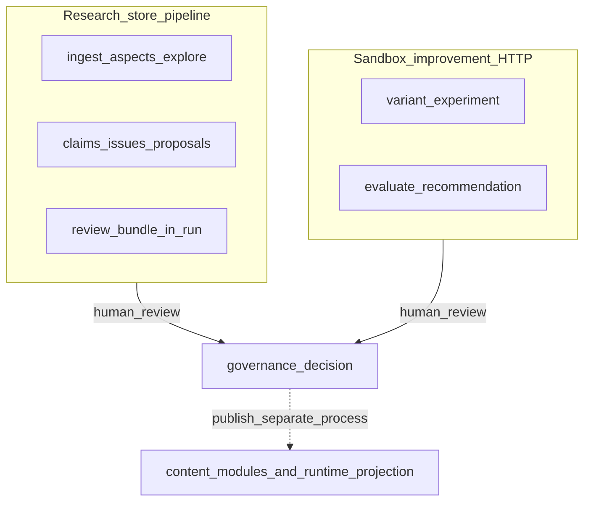

# Improvement and research loops in World of Shadows

World of Shadows has **two complementary loops** that both support **governance and quality** but use **different storage, entrypoints, and outputs**. Neither loop auto-publishes canonical module YAML or replaces the world-engine turn authority.

**Spine:** [AI in World of Shadows — Connected System Reference](../../ai/ai_system_in_world_of_shadows.md).

---

## 1. Sandbox improvement loop (backend HTTP)

**Purpose:** Compare **baseline** vs **candidate** module variants under isolated execution, compute metrics, and persist **recommendation packages** for human governance.

**Anchors:** `backend/app/api/v1/improvement_routes.py`, improvement services under `backend/app/services/` (variants, experiments, evaluation), capability invocations such as `wos.context_pack.build`, `wos.transcript.read`, `wos.review_bundle.build` from `ai_stack/capabilities.py`.

### Canonical workflow (API-shaped)

1. Select baseline (`baseline_id`, for example slice module family).
2. Create candidate variant with explicit lineage and mutation plan.
3. Run sandbox experiment (`execution_mode=sandbox`, non-authoritative publish state).
4. Evaluate outputs; build recommendation draft with metrics and comparison deltas.
5. Enrich with retrieval paths, transcript evidence, governance review bundle references.
6. Expose via `GET /api/v1/improvement/recommendations` for inspection.

`POST /api/v1/improvement/experiments/run` returns **`workflow_stages`** (ordered steps with timestamps) persisted on the **`recommendation_package`**. The package’s **`evidence_bundle`** ties together context-pack paths, transcript evidence, and review bundle metadata.

### Model routing on this surface

After deterministic evaluation scaffolding, bounded **preflight** and **synthesis** stages may call `route_model` with adapter specs aligned to Writers’ Room. Traces use the same **`routing_evidence`** shape as other product surfaces; missing adapters produce explicit skip reasons—**models do not override** threshold or governance semantics.

**Anchors:** `backend/app/services/improvement_task2a_routing.py` (implementation module for bounded recommendation-stage routing), `backend/app/runtime/model_routing_evidence.py`.

### Honest product gaps

Large-scale statistical experiment grids, dedicated triage UI, and full database-backed experiment storage may lag the JSON-oriented implementation—verify `backend` modules for current persistence.

---

## 2. Research store and canon-improvement pipeline (`ai_stack`)

**Purpose:** Turn **source inputs** into a **structured, inspectable** artifact chain: normalized sources, **aspects**, bounded **exploration graph**, **claims**, optional **canon issues** and **improvement proposals**, and a **review bundle** embedded in a **research run** record.

**Anchors:**

- `ai_stack/research_contract.py` — statuses, exploration enums, issue/proposal taxonomies, legal state transitions.
- `ai_stack/research_store.py` — JSON persistence under `.wos/research/research_store.json`
- `ai_stack/research_langgraph.py` — `run_research_pipeline`, `build_review_bundle`, helpers (`inspect_source`, `exploration_graph`, …). **Note:** orchestration here is **sequential Python**, not a compiled LangGraph `StateGraph` (see `research_langgraph.py` module docstring).
- `ai_stack/research_ingestion.py`, `research_aspect_extraction.py`, `research_exploration.py`, `research_validation.py`
- `ai_stack/canon_improvement_engine.py` — deterministic issue/proposal derivation from validated claims

### Pipeline stages (control flow)

1. **Intake:** Normalize and ingest sources; anchors and segments (`research_ingestion.py`).
2. **Aspects:** Extract and store aspect records per source (`research_aspect_extraction.py`).
3. **Exploration:** Bounded graph of hypotheses with budgets and abort reasons (`research_exploration.py`).
4. **Claims:** Promote exploration nodes to claims when schema, evidence anchors, and contradiction scans allow (`research_validation.py` — `verify_and_promote_claims`).
5. **Canon improvement:** Derive `CanonIssueRecord` / `ImprovementProposalRecord` rows with **non-publish** previews (`canon_improvement_engine.py` — `derive_canon_improvements`).
6. **Bundle:** `build_review_bundle` attaches governance flags (`canon_mutation_permitted: false`, `silent_mutation_blocked: true`, `review_safe` heuristic).
7. **Persist:** `ResearchRunRecord` stored via `ResearchStore.upsert_run`.

### Diagram: research pipeline vs sandbox improvement

*Anchors:* `ai_stack/research_langgraph.py`, `backend/app/api/v1/improvement_routes.py`.

**What this clarifies:** Both loops end in **human governance**; neither writes canon or live session truth by default.

---

## 3. MCP exposure (`wos-ai` suite)

Operators and agents invoke research tools through the MCP server; handlers call the same Python functions as in-process capabilities.

**Anchors:** `tools/mcp_server/tools_registry.py` (`run_research_pipeline`, `build_research_bundle`, `propose_canon_improvement`, …), `ai_stack/mcp_canonical_surface.py` (suite `wos-ai`).

**Note on `wos.research.validate`:** The MCP handler returns a **summary** of claim ids already produced for a run (`handle_research_validate` in `tools_registry.py`); **full** verification runs inside `run_research_pipeline` via `verify_and_promote_claims` (`ai_stack/research_validation.py`). Treat the MCP tool as a **workflow checkpoint**, not a second verification engine.

---

## Related documentation

- [MCP.md](../integration/MCP.md) — suite model, tools vs resources vs prompts
- [MVP_SUITE_MAP.md](../../mcp/MVP_SUITE_MAP.md) — tool/suite listing
- [llm-slm-role-stratification.md](llm-slm-role-stratification.md) — shared `routing_evidence` shapes across Writers’ Room and improvement HTTP
- [RAG.md](RAG.md) — retrieval domains (including `research` policy in `rag.py`)
