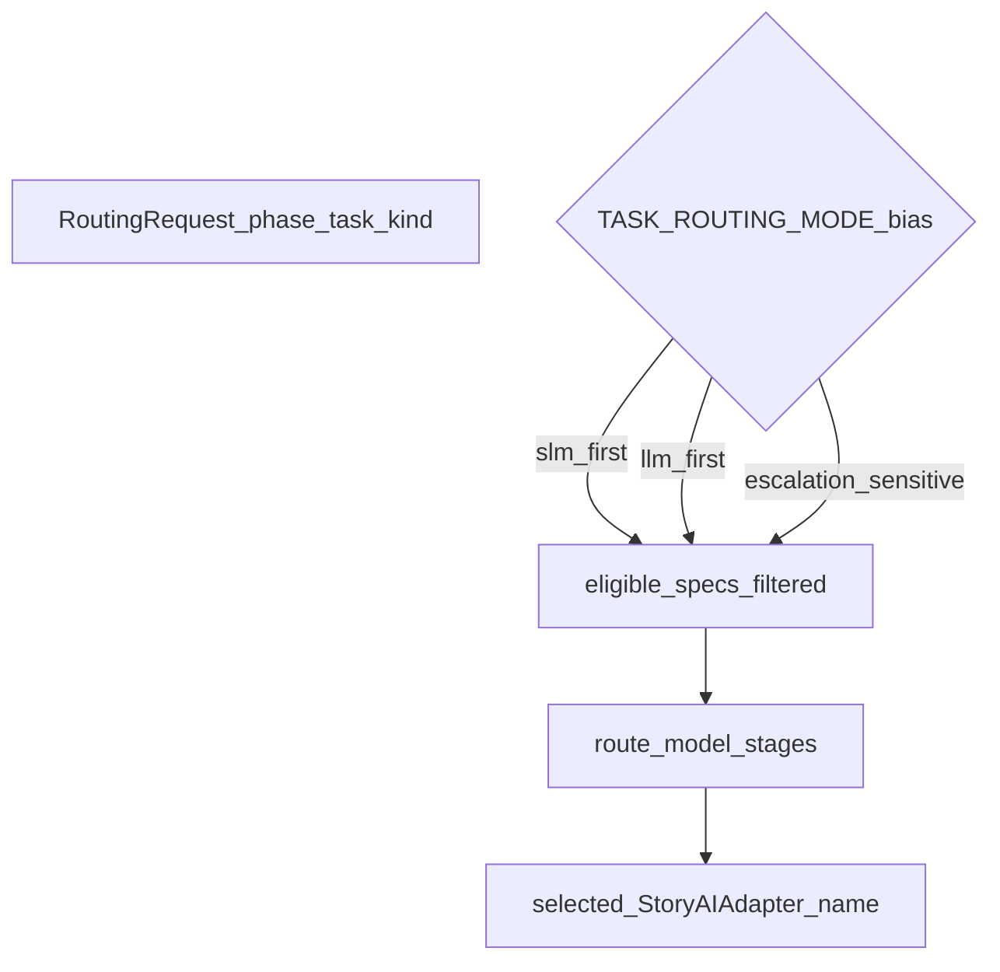

# LLM / SLM role stratification (technical reference)

This document explains **how the backend chooses which registered model adapter** handles a given **routing request** (workflow phase, task kind, and structured-output needs). It is aligned with `backend/app/runtime/model_routing.py` and related modules.

- **LLM** (large language model): in this codebase, “LLM-biased” task kinds prefer **higher-capacity** adapter pools for nuanced generation.
- **SLM** (small or efficient language model): “SLM-first” kinds prefer **faster or cheaper** pools for bounded tasks such as classification or ranking.

**Spine (system context):** [AI in World of Shadows — Connected System Reference](../../ai/ai_system_in_world_of_shadows.md).

---

## What this subsystem does

- **Selects an adapter name** (and echoes provider/model metadata from the adapter’s specification).
- **Does not** call cloud providers itself; execution stays in `StoryAIAdapter` implementations at call sites.
- **Applies deterministic policy** (`route_model`) with inspectable reason codes, fallback chains, and flags such as `escalation_applied` / `degradation_applied`.
- **Feeds shared evidence shapes** (`routing_evidence`, operator-facing rollups) consumed by backend-orchestrated runtime, Writers’ Room, and improvement HTTP paths.

**Anchors:** `backend/app/runtime/model_routing_contracts.py`, `backend/app/runtime/model_routing.py`, `backend/app/runtime/adapter_registry.py`, `backend/app/runtime/model_routing_evidence.py`.

---

## Core modules

| Concern | File | Role |
|---------|------|------|
| Request/decision contracts | `backend/app/runtime/model_routing_contracts.py` | `RoutingRequest`, `RoutingDecision`, `AdapterModelSpec`, enums |
| Policy | `backend/app/runtime/model_routing.py` | `TASK_ROUTING_MODE`, `route_model()` |
| Registry | `backend/app/runtime/adapter_registry.py` | Adapter instances and specs; `register_adapter_model` |
| Bootstrap | `backend/app/runtime/routing_registry_bootstrap.py` | Registers in-repo specs (for example mock) at app startup when enabled |
| Inventory checks | `backend/app/runtime/model_inventory_contract.py`, `model_inventory_report.py` | Coverage tuples per surface; deterministic reports |
| Writers’ Room specs | `backend/app/services/writers_room_model_routing.py` | Maps product model rows to `AdapterModelSpec` |
| Improvement recommendation routing | `backend/app/services/improvement_task2a_routing.py` | Bounded preflight + synthesis stages for recommendation packages (see appendix for filename history) |
| Staged runtime orchestration | `backend/app/runtime/runtime_ai_stages.py`, `backend/app/runtime/ai_turn_executor.py` | Preflight → signal → ranking → conditional synthesis |
| Operator audit rollups | `backend/app/runtime/operator_audit.py`, `backend/app/runtime/area2_operator_truth.py` | Timelines and legibility fields derived from traces (implementation filenames retain a legacy prefix; see appendix) |

---

## Role matrix (encoded in code)

`TASK_ROUTING_MODE` maps each `TaskKind` to:

- **SLM-first:** for example `classification`, `trigger_signal_extraction`, `repetition_consistency_check`, `ranking`, `cheap_preflight`
- **LLM-first:** for example `scene_direction`, `conflict_synthesis`, `narrative_formulation`, `social_narrative_tradeoff`, `revision_synthesis`
- **Escalation-sensitive:** for example `ambiguity_resolution`, `continuity_judgment`, `high_stakes_narrative_tradeoff` — optional `EscalationHint` values narrow toward LLM-class pools when rules fire

**Anchor:** `backend/app/runtime/model_routing.py`.

---

## Diagram: routing request to adapter

*Anchored in:* `route_model` and `TASK_ROUTING_MODE` in `backend/app/runtime/model_routing.py`.

**What this clarifies:** **Bias** shapes the **eligible pool** before deterministic pick and degrade rules run.

---

## Stages inside `route_model` (deterministic)

`route_model` runs **once per routing decision**; internal ordering handles exclusions, mandatory escalation to LLM-class pools when rules fire, role-family preference from `TASK_ROUTING_MODE`, deterministic primary pick, degrade/widen via `fallback_chain`, and structured-output gap handling. Full precedence of `RouteReasonCode` values is defined in code comments in `model_routing.py`.

**Anchors:** `backend/app/runtime/model_routing.py`, tests under `backend/tests/runtime/`.

---

## Surfaces that call routing

### Backend-orchestrated runtime (`execute_turn_with_ai`)

`execute_turn_with_ai` in `backend/app/runtime/ai_turn_executor.py` may run **multi-stage** orchestration via `runtime_ai_stages.py` when `runtime_staged_orchestration` is enabled in session metadata. Stages issue separate `RoutingRequest` values; traces record explicit skips (for example ranking not required when signal allows SLM-only). Setting `runtime_staged_orchestration: false` restores a simpler single-route path for regressions.

**Anchors:** `backend/app/runtime/ai_turn_executor.py`, `backend/app/runtime/runtime_ai_stages.py`.

**Authority note:** This backend path is **not** the same executable path as world-engine’s `RuntimeTurnGraphExecutor`, which applies routing **inside** the LangGraph turn graph via `story_runtime_core` (`ai_stack/langgraph_runtime.py`). Which surface is **primary** for live play is a product/deployment concern; the code keeps both paths explicit.

For the **importable map** of which backend surface owns “primary routing authority” vs translation layers, see `backend/app/runtime/area2_routing_authority.py` (`AREA2_AUTHORITY_REGISTRY`). Plain-language: it prevents two competing routing policies from silently applying to the same canonical HTTP handler.

### Writers’ Room

`backend/app/services/writers_room_service.py` uses specs from `writers_room_model_routing.py` and **two** routing stages (preflight + synthesis), each attaching `routing_evidence` where applicable.

### Improvement HTTP

`backend/app/api/v1/improvement_routes.py` uses bounded model stages **after** deterministic recommendation scaffolding (see `improvement_task2a_routing.py`); traces remain explicit when no adapter resolves.

---

## Shared `routing_evidence`

Built by `build_routing_evidence` in `backend/app/runtime/model_routing_evidence.py`:

- Requested phase/task, selected adapter/provider/model, `route_reason_code`, `fallback_chain`, escalation/degradation flags
- Optional compact diagnostics (`diagnostics_overview`, `diagnostics_flags`, `diagnostics_causes`) — deterministic indexes over the same facts, not a second policy engine
- Execution alignment fields when callers know which adapter actually ran

---

## Not the same as `role_contract.py`

`backend/app/runtime/role_contract.py` defines **interpreter / director / responder** sections inside **one** structured adapter output (intra-call shape).

Routing here is **cross-adapter** selection: which registered model handles which **routing request**. Keep the two concepts separate.

---

## Honest limits

- Tier and cost/latency alignment in `route_model` are **deterministic heuristics** until production telemetry informs tuning.
- Empty spec store (bootstrap disabled, no `register_adapter_model`) yields `no_eligible_adapter`; some call paths still fall back to a passed executable adapter—read the specific integration.
- `register_adapter` without matching spec updates can leave **stale metadata**; prefer `register_adapter_model` when specs matter (`adapter_registry.py`).

---

## Appendix: legacy filenames and archived planning language

Some Python modules still use **internal delivery-era filenames** (`area2_*`, `improvement_task2a_*`). Those strings are **not** operational vocabulary for new contributors: treat them as **repository anchors** only.

**Routing authority registry:** `backend/app/runtime/area2_routing_authority.py` — maps canonical backend surfaces (runtime, Writers’ Room, improvement) to authoritative vs supporting routing layers. The module docstring may still mention old planning IDs; **behavior** is defined by `AREA2_AUTHORITY_REGISTRY` and its dataclasses.

**Archived milestone docs** (task IDs, gate tables, closure reports) live under `docs/archive/architecture-legacy/` for historical traceability only. **Canonical routing behavior** is defined by the current Python modules listed in the tables above.

---

## Related

- [LangGraph.md](../integration/LangGraph.md) — world-engine turn graph routing (separate call path).
- [improvement_loop_in_world_of_shadows.md](improvement_loop_in_world_of_shadows.md) — sandbox improvement vs research pipeline.
- [AI system spine](../../ai/ai_system_in_world_of_shadows.md) — three AI planes overview.
