# Backend in World of Shadows

## Title and purpose

This document is the **canonical technical reference** for the **Flask backend** (`backend/`) in World of Shadows. It explains the backend as (1) a subsystem with clear boundaries, (2) the **central API and policy surface** other parts of the platform talk to, and (3) a **single monolithic service body** whose routing, security, sessions, and integrations form one coherent story.

**Repository anchors:** `backend/app/__init__.py`, `backend/app/api/__init__.py`, `docs/technical/architecture/backend-runtime-classification.md`.

---

## Scope and source of truth

**In scope:** The Python Flask application under `backend/app/`: application factory, HTTP blueprints, authentication and authorization, rate limiting, observability hooks, persistence (SQLAlchemy), and HTTP clients that call the World Engine play service.

**Out of scope (by design):** Authoritative live narrative/runtime execution inside the Flask process; the World Engine service implementation under `world-engine/`; frontend SPAs; external MCP server processes (except how the backend exposes **ingest and admin surfaces** for MCP operations).

**Source-of-truth order:** (1) implementation in `backend/`, (2) existing repo docs—especially `docs/technical/architecture/backend-runtime-classification.md` and `docs/technical/architecture/canonical_runtime_contract.md`, (3) tests under `backend/tests/`, (4) clearly labeled **inference** where the code does not name a concern explicitly.

---

## Executive overview

The backend is **Better Tomorrow / World of Shadows’ primary HTTP API**: it owns user accounts, roles, feature-area governance, content and forum surfaces, admin dashboards, bridges to the **World Engine** for **live play**, and operator-facing diagnostics. It is **not** a second runtime: in-process session and AI paths are explicitly **non-authoritative** and exist for tests, tooling, and transitional compatibility (`docs/technical/architecture/backend-runtime-classification.md`).

**Why this matters:** Confusing “API host” with “runtime host” breaks operational mental models (where transcripts live, which process enforces run identity, what restarts wipe). This document keeps those distinctions explicit.

**Anchors:** `backend/app/services/game_service.py`, `backend/app/api/v1/session_routes.py`.

---

## The backend in one sentence

The backend is a **Flask monolith** that exposes **`/api/v1` JSON APIs**, **`/backend` operator HTML**, and **legacy web compatibility redirects**, while enforcing **JWT user auth**, **optional service tokens** (`MCP_SERVICE_TOKEN`, `N8N_SERVICE_TOKEN`), **feature- and area-based authorization**, **rate limits**, and **HTTP security headers**—and it **mediates** (but does not replace) access to the **World Engine** via `game_service`.

**Anchors:** `backend/app/__init__.py`, `backend/app/auth/permissions.py`, `backend/app/auth/feature_registry.py`.

---

## One service body, many responsibility zones

### Plain language

Think of the backend as **one building** with **different rooms**: public lobby, member services, moderator offices, admin vault, operator workshop, and pipes to other buildings (engine, mail, future frontends).

### Technical precision

Monolithic here means **one deployable Flask process** with shared extensions (`backend/app/extensions.py`: SQLAlchemy, JWT, Limiter, Mail, CORS) and a **single API blueprint** mounted at `/api/v1` (`backend/app/api/__init__.py`). Internal “zones” are **organizational**, implemented as route modules and services:

| Zone | Primary artifacts | Responsibility |
|------|-------------------|----------------|
| **API shell** | `api_v1_bp` hooks in `backend/app/api/v1/__init__.py` | Trace IDs (`X-WoS-Trace-Id`), response headers, selective audit for `/sessions` paths |
| **Identity & sessions (user)** | `auth_routes.py`, `user_routes.py`, JWT callbacks in `extensions.py` | Register, login, JWT access/refresh, blacklist/revocation, `allowed_features` in `/auth/me` |
| **Authorization plane** | `auth/permissions.py`, `auth/feature_registry.py`, `auth/admin_security.py` | Roles (`user`, `moderator`, `admin`, `qa`), feature IDs, area scoping, admin export hardening |
| **Player / game HTTP** | `game_routes.py`, `game_content_service.py`, `game_profile_service.py` | Runs/templates via `game_service`, characters/saves; hybrid identity from **Flask session** or **optional JWT** |
| **Content & community** | `wiki_*`, `forum_routes.py`, `news_routes.py`, `slogan_routes.py`, `site_routes.py` | Editorial and community surfaces |
| **Admin & moderation** | `admin_routes.py`, `*_admin_routes.py`, `analytics_routes.py` | Metrics, logs, exports, assignments |
| **Engine bridge** | `game_service.py`, `play_service_control_service.py`, `session_routes.py` | HTTP to play service; **non-authoritative** in-process session mirror |
| **AI governance & improvement** | `ai_stack_governance_routes.py`, `improvement_routes.py`, `writers_room_routes.py` | Evidence APIs, experiments (JWT), RAG/capability stack usage in improvement loop |
| **MCP operations** | `mcp_operations_routes.py`, `mcp_operations_service.py` | Telemetry ingest (service token); admin cockpit (JWT + feature) |
| **Diagnostics** | `system_diagnosis_routes.py`, `info/routes.py` | Aggregated diagnosis; static operator pages under `/backend` |
| **Runtime library (in-repo)** | `app/runtime/` | Shared models/policies/tests; **not** mounted as a second public play host |

### Why this matters in World of Shadows

The product’s **trust boundary** for “who can do what” lives largely here. The **runtime authority** for live play is deliberately **outsourced** to the World Engine; the backend’s job is to **authenticate callers**, **apply policy**, and **call the engine** with validated contracts.

### How it connects to adjacent subsystems

- **world-engine:** Consumer of nested-run V1 HTTP API (`canonical_runtime_contract.md`); see § [How the engine is reached without becoming the API](#how-the-engine-is-reached-without-becoming-the-api).
- **Frontends / admin tool:** Expected consumers of `/api/v1` and configured via `FRONTEND_URL`, `ADMINISTRATION_TOOL_URL` (`web/routes.py`, `info/routes.py` context).
- **MCP:** Ingest and read surfaces on the backend; MCP remains a **client/process** of these APIs, not a duplicate backend.

### What the backend explicitly does not own

- **Sovereign live run state** (lobby, committed turns, canonical transcripts as defined by play service)—World Engine.
- **Browser UI** for players (redirected when `FRONTEND_URL` is set).
- **MCP server process lifecycle** (only APIs and persistence for operations telemetry).

**Diagram — Backend internal zones (monolith)**

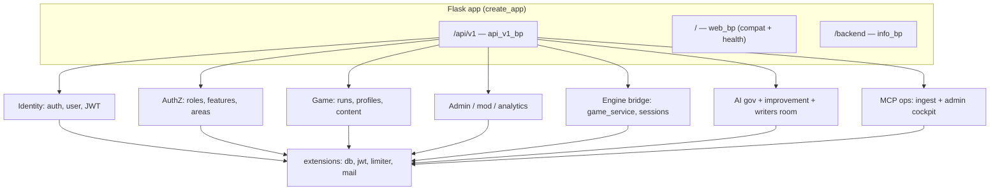

**What to notice:** One blueprint family (`/api/v1`) carries most integration traffic; `/backend` is explicitly **operator/developer HTML**, not the player app.

**Anchors:** `backend/app/api/v1/__init__.py`, `backend/app/info/routes.py`, `backend/app/web/routes.py`.

---

## Where routing becomes policy

### Plain language

URLs are grouped so that **who you are** (anonymous user, logged-in player, moderator, admin, automation with a secret) determines **which doors** you can use.

### Technical precision

- **API v1:** `register_api` mounts `api_v1_bp` at `/api/v1` (`backend/app/api/__init__.py`). Route modules are imported in `backend/app/api/v1/__init__.py` (side-effect registration on the blueprint).
- **Operator info:** `info_bp` at `/backend` (`backend/app/__init__.py`).
- **Legacy web:** `web_bp` at `/` for `/health`, redirects to frontend for `/login`, `/play`, etc. (`backend/app/web/routes.py`).
- **CSRF:** `CSRFProtect` applies globally but **`api_v1_bp` is exempt** (`backend/app/__init__.py`) so JSON clients use JWT/service tokens instead of form CSRF.

**Route families (illustrative, not exhaustive):**

| Prefix / pattern | Typical guards | Purpose |
|------------------|----------------|---------|
| `/api/v1/auth/*`, `/api/v1/users/*` | Mixed public + JWT | Registration, login, tokens, profile |
| `/api/v1/game/*` | Session and/or JWT (`game_routes._current_user`) | Play runs, templates, tickets, profiles |
| `/api/v1/admin/*` | `require_jwt_admin` and/or `require_jwt_moderator_or_admin` + `@require_feature(...)` | Metrics, logs, exports, MCP cockpit, AI stack evidence, system diagnosis, play-service control |
| `/api/v1/operator/mcp-telemetry/ingest` | `require_mcp_service_token` | MCP process telemetry append |
| `/api/v1/sessions/*` | Mixed: **service token** for many reads; turn execution bridges engine | Operator/MCP/test bridge; **warnings** in JSON |
| `/api/v1/improvement/*` | `@jwt_required()` | Authenticated improvement loop (not a public surface) |

### Why this matters

Misconfigured routes are **authorization bugs**. The backend uses **composable decorators** (`require_jwt_admin`, `require_jwt_moderator_or_admin`, `require_feature`, `require_mcp_service_token`, `require_editor_or_n8n_service`) so policy is visible at the **route definition**.

### Connections

Administration tool and dashboards are expected to call **`/api/v1/admin/...`** with JWTs carrying sufficient **role** and **feature_area** assignments.

### Not owned here

**WebSocket gameplay protocol** termination (when used) is centered on the play service URL space; the backend exposes **HTTP** helpers such as websocket URL resolution in `game_service`.

**Diagram — Routing landscape**

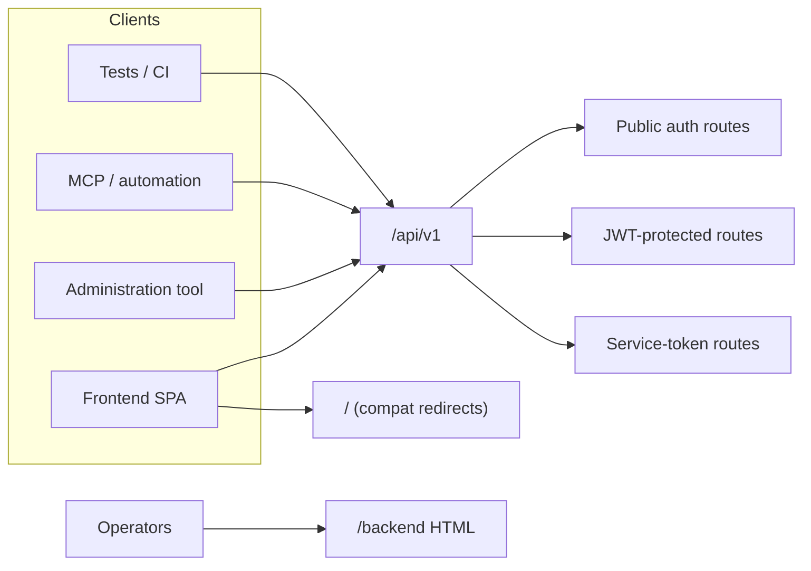

**Anchors:** `backend/app/api/v1/auth_routes.py`, `backend/app/api/v1/game_routes.py`, `backend/app/api/v1/admin_routes.py`, `backend/app/api/v1/mcp_operations_routes.py`.

---

## Security and trust boundaries

### Plain language

The backend decides **whether you are allowed in** (authentication), **what you may touch** (roles, bans, feature flags, areas), and **how hard an automated client may knock** (rate limits).

### Technical precision

**Authentication (users):** Flask-JWT-Extended (`backend/app/extensions.py`, `auth_routes.py`). Access and refresh tokens; **blocklist** via `TokenBlacklist` and refresh revocation (`extensions.py` `token_in_blocklist_loader`). Production requires strong `JWT_SECRET_KEY` and email verification policy checks in `create_app` (`backend/app/__init__.py`).

**Authorization:** `backend/app/auth/permissions.py` centralizes role checks and `get_current_user()`. `backend/app/auth/feature_registry.py` maps **feature IDs** to **minimum roles** and **optional area restrictions** (`user_can_access_feature`). Banned users fail feature checks.

**Service authentication:**

- **`MCP_SERVICE_TOKEN`:** Bearer token compared in constant time (`backend/app/api/v1/auth.py`) for selected operator/MCP endpoints (e.g. session snapshots, telemetry ingest). If unset, affected routes return **503 MISCONFIGURED**.
- **`N8N_SERVICE_TOKEN` / `X-Service-Key`:** Optional machine path for editor workflows (`_is_n8n_service_request` in `permissions.py`).

**Transport and headers:** Optional HTTPS redirect when `ENFORCE_HTTPS` (`create_app`). Security headers include CSP (with `connect-src` extended by `PLAY_SERVICE_PUBLIC_URL`), `X-Frame-Options: DENY`, HSTS when HTTPS enforced (`backend/app/__init__.py`).

**Rate limiting:** Flask-Limiter with key function preferring JWT user id (`get_rate_limit_key` in `extensions.py`); test-mode proxy limiter for pytest.

**Admin-sensitive exports:** `admin_security` wrapper on sensitive CSV export (`admin_routes.py`).

### Why this matters

JWT + feature areas allow **fine-grained staff tooling** without duplicating admin trees per deployment. Service tokens separate **human staff sessions** from **automation** with static secrets (rotation and deployment discipline required—**operational inference**).

### Connections

World Engine calls from `game_service` use **`PLAY_SERVICE_SHARED_SECRET`** and internal URL (see `game_service.py`)—a **backend→engine** trust lane distinct from user JWT.

### Not owned here

**End-user device security**, **CDN rules**, and **engine-side authorization** for in-run actions are outside this codebase.

**Diagram — Security boundary**

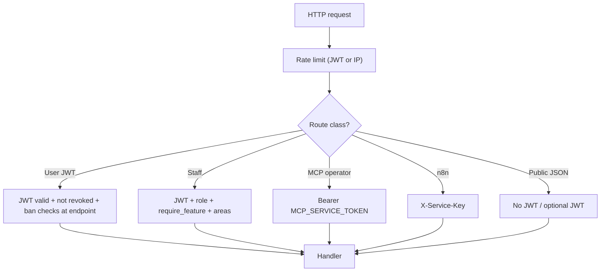

**Anchors:** `backend/app/extensions.py`, `backend/app/api/v1/auth.py`, `backend/app/auth/admin_security.py`.

---

## Sessions, tokens, and trust boundaries

### Plain language

“Session” means **two different things**: a **logged-in user** (JWT or legacy cookie session for some game routes) and an **in-memory story session** used for diagnostics—**not** the live game server.

### Technical precision

1. **User session (API):** Stateless **JWT** in `Authorization: Bearer` for most `/api/v1` clients. `auth_routes` issues access/refresh tokens; logout blacklists access `jti` and revokes refresh rows.
2. **Legacy Flask session:** `game_routes._current_user` reads `session["user_id"]` **or** optional JWT—**dual path** for compatibility (`backend/app/api/v1/game_routes.py`).
3. **Story / runtime session (backend memory):** `POST /api/v1/sessions` creates in-process `SessionState` with explicit **warnings** that it is **not** authoritative live runtime (`session_routes.py` docstring and response `warnings`). When `world_engine_story_session_id` exists in metadata, GET diagnostics/state may **overlay** engine truth via `game_service` (`session_routes.py`).
4. **Play run session (authoritative):** Created via `game_service.create_run` / templates / tickets—**engine-side** identity (`game_service.py`, `canonical_runtime_contract.md`).

### Why this matters

Operators and tests can use `/api/v1/sessions` **without** pretending the Flask process hosts production play. Warnings in JSON are part of the **contract**.

### Connections

MCP and tests use **service token** reads; moderators/admins use **JWT + features** for AI stack evidence that **aggregates** backend session + engine diagnostics (`ai_stack_governance_routes.py`).

### Not owned here

**Canonical turn history** for live runs in production is **not** `backend`’s in-memory store.

**Diagram — Identity and session kinds**

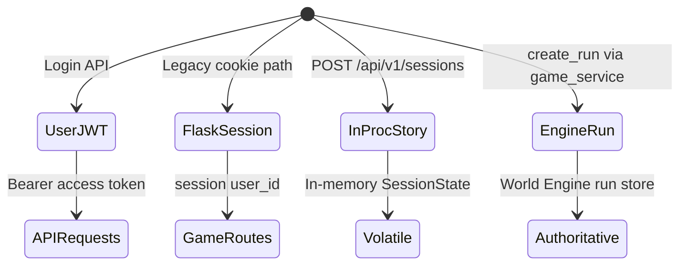

**Anchors:** `backend/app/api/v1/auth_routes.py`, `backend/app/api/v1/session_routes.py`, `backend/app/api/v1/game_routes.py`.

---

## How the engine is reached without becoming the API

### Plain language

The backend **asks** the World Engine to run the game; it does **not** silently **be** the game server for live play.

### Technical precision

- **HTTP client:** `backend/app/services/game_service.py` uses `httpx` against `PLAY_SERVICE_INTERNAL_URL` / public URL with shared-secret signing (details in file). Responses are validated for **nested-run V1** consistency (`canonical_runtime_contract.md`).
- **Classification:** `docs/technical/architecture/backend-runtime-classification.md` states authoritative live play runs in World Engine; in-process `RuntimeManager` / W2 paths are **deprecated transitional**.
- **Session routes:** Turn execution on `/sessions/.../turns` **proxies** to `execute_story_turn_in_engine` when engine session id is present (`session_routes.py`); audit via `log_world_engine_bridge` (`observability/audit_log.py`).
- **Play service control:** Admin routes persist **desired posture** and apply/test—**application-level**, not container orchestration (`play_service_control_routes.py`, `play_service_control_service.py`).

### Why this matters

The backend can restart without being treated as **run host**. Integration bugs surface as **`GameServiceError`** and structured bridge errors in JSON.

### Connections

CSP `connect-src` allows browser clients to talk to `PLAY_SERVICE_PUBLIC_URL` when configured (`create_app`).

### Not owned here

**Engine’s internal graph**, **scene execution**, and **WebSocket fanout** implementation.

**Diagram — Backend ↔ World Engine**

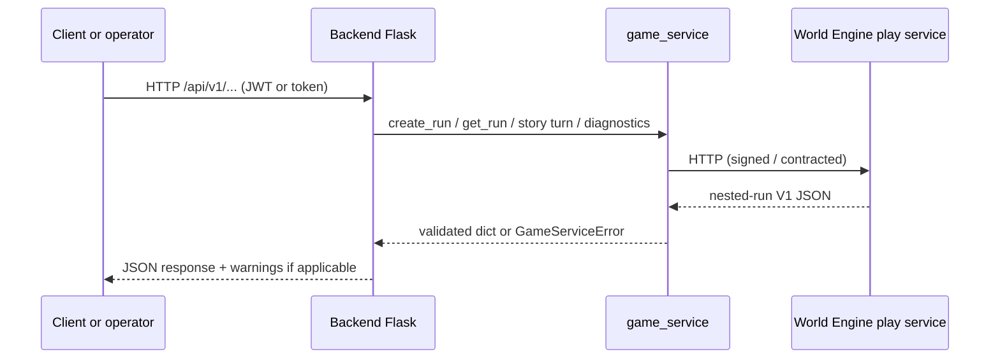

**Anchors:** `backend/app/services/game_service.py`, `backend/app/api/v1/session_routes.py`, `docs/technical/architecture/canonical_runtime_contract.md`.

---

## Admin, mod, QA: different doors into the same backend

### Plain language

Staff share one API, but **permissions** shrink or expand the menu per person.

### Technical precision

- **Roles:** `User.ROLE_MODERATOR`, `ROLE_ADMIN`, `ROLE_QA` (`backend/app/models/user.py`); allowed role names enumerated in `permissions.py` (`ALLOWED_ROLES`).
- **Moderator vs admin:** Many content routes use `require_jwt_moderator_or_admin` + `require_feature(FEATURE_MANAGE_*)` (`wiki_admin_routes.py`, `forum` admin paths, `ai_stack_governance_routes.py`, `mcp_operations_routes.py`). Stricter financial/sensitive areas use **`require_jwt_admin`** only (e.g. `play_service_control_routes.py`, some `admin_routes.py`).
- **Feature areas:** `user_can_access_feature` implements global vs area-scoped access (`feature_registry.py`). Users with **no** area rows bypass area filter (documented legacy behavior in docstring—**know this for deployments**).
- **QA:** Role exists in model and permission vocabulary; specific QA-only route modules should be verified per feature—**inference:** QA workflows often piggyback **JWT test users** and **service-token** session reads in CI (`backend/tests/`).

### Why this matters

“Moderator” is **not** “mini-admin” everywhere: **feature IDs** still gate routes.

### Connections

Administration tool URL is surfaced on `/backend` pages for operators (`info/routes.py`).

### Not owned here

**HR / org chart**—only roles and areas stored in DB.

**Diagram — Actor → surface**

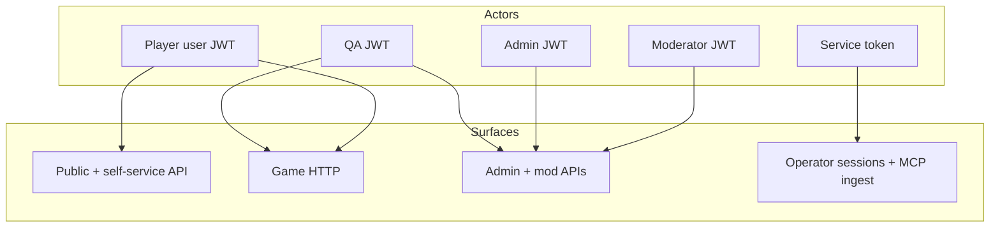

**Anchors:** `backend/app/auth/feature_registry.py`, `backend/app/api/v1/admin_routes.py`, `backend/app/api/v1/ai_stack_governance_routes.py`.

---

## AI-related layers: evidence, improvement, not runtime authority

### Plain language

The backend exposes **governance and improvement** APIs around AI; it does not claim that **all model calls** happen only inside Flask.

### Technical precision

- **Governance / evidence:** `ai_stack_governance_routes.py` serves moderator/admin, feature `FEATURE_MANAGE_GAME_OPERATIONS`, aggregating **session evidence** and inspector projections; uses `ai_stack_evidence_service`, `inspector_*` services.
- **Improvement loop:** `improvement_routes.py` requires `@jwt_required()` for variants, experiments, recommendations—invokes RAG/capability stack from `ai_stack` package (`build_runtime_retriever`, capabilities). This is **backend-orchestrated experimentation**, not player-facing runtime.
- **In-process runtime AI path:** Classified as transitional / test / tooling in `backend-runtime-classification.md` (`ai_adapter.py`, orchestrators).

### Why this matters

AI **policy and evidence** are centralized for auditability; **live inference** may span engine and other hosts—backend is **coordination and storage**, not the whole AI system.

### Connections

Cross-read: `docs/ai/ai_system_in_world_of_shadows.md` for product-level AI narrative (ensure consistency with code-owned boundaries).

### Not owned here

**Model weights**, **provider routing in production inference** inside World Engine processes—treat as **adjacent systems**.

**Diagram — Backend ↔ AI concerns**

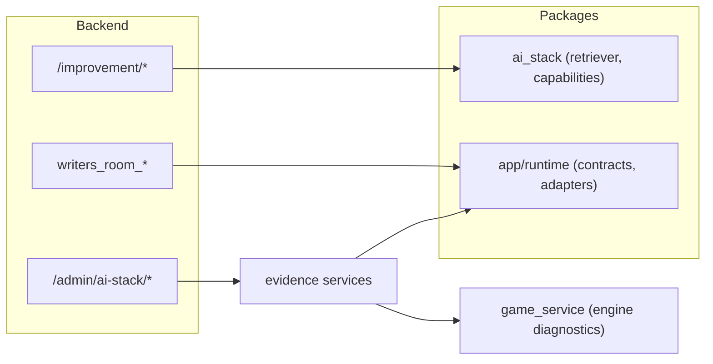

**Anchors:** `backend/app/api/v1/ai_stack_governance_routes.py`, `backend/app/api/v1/improvement_routes.py`, `backend/app/services/ai_stack_evidence_service.py`.

---

## MCP: control plane meets backend, not a second monolith

### Plain language

MCP processes **push telemetry** and **read operator session JSON** using **secrets**, while humans use **admin pages** backed by the same database.

### Technical precision

- **Ingest:** `POST /api/v1/operator/mcp-telemetry/ingest` — `require_mcp_service_token`, body size and record limits (`mcp_operations_routes.py`, `mcp_operations_service.py`).
- **Admin cockpit:** `/api/v1/admin/mcp/*` — `require_jwt_moderator_or_admin` + `require_feature(FEATURE_MANAGE_MCP_OPERATIONS)`.
- **Session reads:** Multiple `GET /api/v1/sessions/...` handlers use `require_mcp_service_token` (`session_routes.py`).

### Why this matters

MCP is an **automation client**. The backend remains the **persistence and policy authority** for ingested data and staff visibility.

### Connections

Model `mcp_ops_telemetry` (see `backend/app/models/mcp_ops_telemetry.py`) backs storage—**anchor** for DB schema readers.

### Not owned here

**MCP server implementation** in this repo (if any) is separate from these **HTTP surfaces**.

**Diagram — Backend ↔ MCP**

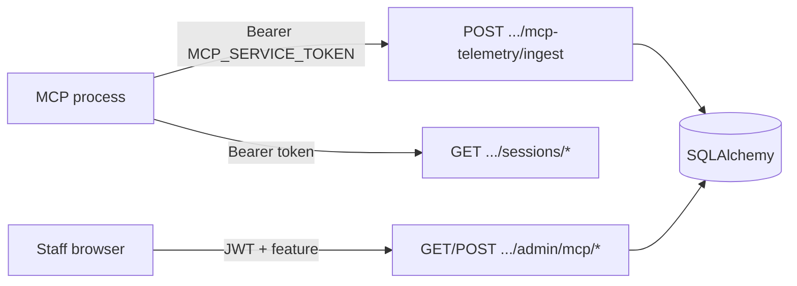

**Anchors:** `backend/app/api/v1/mcp_operations_routes.py`, `backend/app/api/v1/session_routes.py`, `backend/app/models/mcp_ops_telemetry.py`.

---

## Observability and operational visibility

### Plain language

Requests get a **trace id**, sensitive actions can land in **JSON audit logs**, and operators can hit **diagnosis** endpoints.

### Technical precision

- **Trace:** `X-WoS-Trace-Id` accepted/propagated on `api_v1_bp` (`backend/app/api/v1/__init__.py`); `trace.py` uses contextvars.
- **Audit:** `observability/audit_log.py` — `log_api_endpoint` for `/sessions` paths in `after_request`; `log_world_engine_bridge`, `log_turn_request`, workflow audits for improvement loop.
- **Activity logs:** `activity_log_service`, `log_activity` used across routes (e.g. AI stack views).
- **System diagnosis:** `GET /api/v1/admin/system-diagnosis` — aggregated, cached, feature-gated (`system_diagnosis_routes.py`, `system_diagnosis_service.py`).
- **Operator HTML:** `/backend/operations` etc. (`info/routes.py`).

### Why this matters

Operational visibility is **not** runtime authority: logs help **debug** bridge failures (`world_engine_unreachable` patterns in session responses).

### Connections

Metrics for admin dashboards: `admin_routes.py` `/admin/metrics`.

### Not owned here

Full **distributed tracing backend** (Jaeger/OTel) if not configured—**inference** from current code: structured logs and headers are the primary hooks.

**Diagram — Observability path**

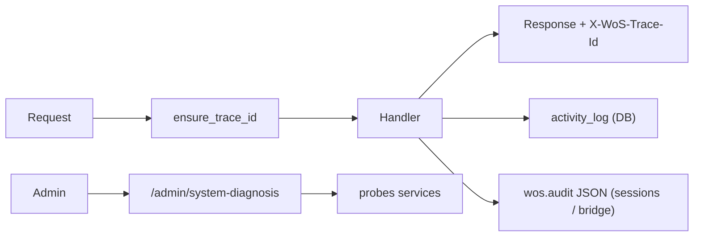

**Anchors:** `backend/app/api/v1/__init__.py`, `backend/app/observability/audit_log.py`, `backend/app/api/v1/system_diagnosis_routes.py`.

---

## Deployment topology (conceptual)

### Plain language

In a typical deployment, browsers talk to **frontend**, **backend**, and sometimes **play service** origins; the backend also calls the engine **server-to-server**.

### Technical precision

Environment variables from `config.py` wire URLs: `FRONTEND_URL`, `ADMINISTRATION_TOOL_URL`, `PLAY_SERVICE_PUBLIC_URL`, `PLAY_SERVICE_INTERNAL_URL`, database URI, mail, CORS origins.

**Diagram — Services**

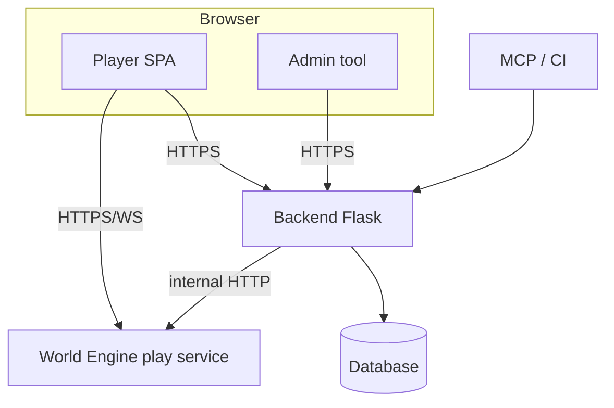

**Anchors:** `backend/app/config.py`, `backend/app/__init__.py` (CSP connect-src), `backend/app/services/game_service.py`.

---

## Full system interaction picture

### Plain language

Almost every subsystem **touches** the backend for **identity, policy, or persistence**; only **live runtime** centers on the engine.

### Technical precision

| Subsystem | Interaction pattern | Key seams |
|-----------|---------------------|-----------|
| **world-engine** | Backend calls HTTP play API | `game_service.py`, `canonical_runtime_contract.md` |
| **MCP** | Service token + admin JWT | `auth.py`, `mcp_operations_routes.py`, `session_routes.py` |
| **AI layers** | Governance & improvement routes + `ai_stack` | `ai_stack_governance_routes.py`, `improvement_routes.py` |
| **User flows** | Auth, game, wiki, forum | `auth_routes.py`, `game_routes.py`, `wiki_routes.py`, `forum_routes.py` |
| **Admin flows** | `/api/v1/admin/*`, exports | `admin_routes.py`, `play_service_control_routes.py` |
| **Moderation** | Mod role + features | `feature_registry.py`, mod-gated admin modules |
| **QA / verification** | pytest + optional service token | `backend/tests/conftest.py`, session/MCP tests |

**Diagram — Backend as coordination hub**

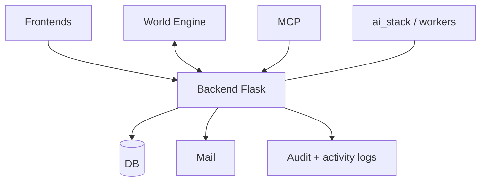

**Anchors:** `backend/app/__init__.py`, `backend/app/api/v1/__init__.py`, `docs/technical/architecture/backend-runtime-classification.md`.

---

## Open seams, transitional areas, and future growth

1. **Dual identity in `game_routes`:** Flask session + optional JWT—documented in code; long-term **inference** may favor JWT-only for consistency.
2. **In-process runtime:** Explicitly transitional; migrate callers to engine-only flows per `backend-runtime-classification.md`.
3. **Area assignment legacy rule:** Users with no areas still pass some feature checks—**behavioral seam** documented in `user_can_access_feature`.
4. **Distributed tracing:** Trace IDs exist; full trace export pipeline **not verified** in this pass—**inference**.

**Anchors:** `backend/app/api/v1/game_routes.py`, `backend/app/auth/feature_registry.py`.

---

## Conclusion

The World of Shadows backend is **one Flask monolith** that **organizes access**: JWTs for people, service tokens for automation, feature areas for staff, and **`game_service`** for **World Engine** integration. It **must not** be mistaken for the **live narrative runtime**—that role belongs to the **World Engine**, with the backend acting as **gatekeeper, integrator, and operator console**.

### Suggested cross-links

- `docs/technical/architecture/backend-runtime-classification.md`
- `docs/technical/architecture/canonical_runtime_contract.md`
- `docs/ai/ai_system_in_world_of_shadows.md`
- `docs/dev/architecture/ai-stack-rag-langgraph-and-goc-seams.md` (if present in tree)

### File index (quick navigation)

| Area | Path |
|------|------|
| App factory | `backend/app/__init__.py` |
| API mount | `backend/app/api/__init__.py` |
| Blueprint hooks | `backend/app/api/v1/__init__.py` |
| Permissions | `backend/app/auth/permissions.py` |
| Features | `backend/app/auth/feature_registry.py` |
| Service token | `backend/app/api/v1/auth.py` |
| Engine client | `backend/app/services/game_service.py` |
| Sessions bridge | `backend/app/api/v1/session_routes.py` |
| MCP ops | `backend/app/api/v1/mcp_operations_routes.py` |
| AI governance | `backend/app/api/v1/ai_stack_governance_routes.py` |
| Improvement | `backend/app/api/v1/improvement_routes.py` |
| Observability | `backend/app/observability/audit_log.py`, `trace.py` |

---

*Document generated to match repository state as of authoring; when code and prose diverge, **prefer the code** and update this file.*
