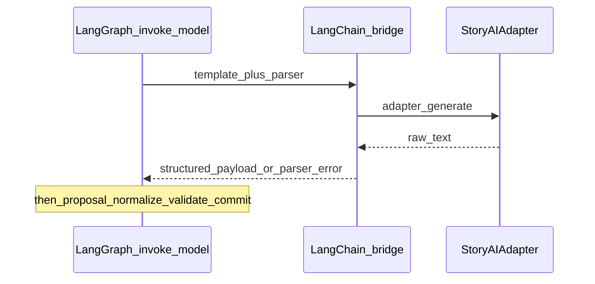

# LangChain integration

**LangChain** in this repository means: **prompt templates**, **structured output parsing** (typically Pydantic-oriented), and **retriever bridges** that call the same RAG stack as runtime—**not** a second narrative authority and **not** a replacement for GoC validation or commit seams.

**Spine:** [AI in World of Shadows — Connected System Reference](../../ai/ai_system_in_world_of_shadows.md).

---

## Plain language

When the system needs a model to return **JSON-shaped** narrative or review data, LangChain helpers build the chat prompt and parse the response into typed structures. When Writers’ Room needs **documents** from the corpus, a retriever bridge asks `ai_stack/rag.py` with the **writers’** retrieval domain, not the live-turn profile.

## Technical precision

| Path | Primary files | Role |
|------|----------------|------|
| Runtime turn | `ai_stack/langgraph_runtime.py`, `ai_stack/langchain_integration/bridges.py` | `invoke_runtime_adapter_with_langchain` inside the LangGraph `invoke_model` node; attaches parser metadata and errors to the generation payload. |
| Writers’ Room | `backend/app/services/writers_room_service.py`, `bridges.py` | `invoke_writers_room_adapter_with_langchain`, `WritersRoomStructuredOutput`; document preview via `LangChainRetrieverBridge.get_writers_room_documents` with `RetrievalDomain.WRITERS_ROOM` / profile `writers_review`. |
| Capability tooling | `bridges.py` | `build_capability_tool_bridge` for review-oriented tool surfaces that share LangChain patterns. |

**Anchors:** `ai_stack/langchain_integration/__init__.py`, `ai_stack/langchain_integration/bridges.py`.

## Why this matters in World of Shadows

One integration style avoids scattering ad-hoc “call OpenAI and regex JSON” logic. Parser failures and template usage become **inspectable fields** (`langchain_parser_error`, `langchain_prompt_used`, `structured_output`) alongside graph diagnostics.

## What LangChain is not

- **Not** where committed story state is decided: `validate_seam` / `commit_seam` and the world-engine host still own authority ([LangGraph.md](LangGraph.md), `world-engine/app/story_runtime/manager.py`).
- **Not** LangGraph: LangChain does **not** define the turn node graph; it serves **single-step** adapter invocation helpers (plus retriever bridge utilities).

## Neighbors

- **LangGraph:** wraps runtime invocation as one node in the ordered turn graph.
- **RAG:** same `ContextRetriever` / `RetrievalRequest` types; domain and profile differ by caller ([RAG.md](../ai/RAG.md)).
- **Backend routing:** Writers’ Room and improvement HTTP paths use **backend** `route_model` and `routing_evidence`—parallel concept to graph-internal routing ([llm-slm-role-stratification.md](../ai/llm-slm-role-stratification.md)).

---

## Bounded bypass (mock and parse skips)

If the primary adapter fails and recovery uses the default **mock** adapter, generation may fall back to raw `adapter.generate` with `adapter_invocation_mode: raw_adapter_fallback` and a `bypass_note`. When mock output is not JSON, structured parsing is skipped—same **honesty** pattern as LangGraph’s `fallback_model` branch.

**Anchors:** `ai_stack/langgraph_runtime.py` (`invoke_model` / fallback interaction), `ai_stack/langchain_integration/bridges.py`.

---

## Diagram: where LangChain sits relative to LangGraph (runtime)

*Anchored in:* `invoke_runtime_adapter_with_langchain` usage from `ai_stack/langgraph_runtime.py`.

**What this clarifies:** LangChain is the **adapter call harness** for that node; the graph still runs **normalize → validate → commit** afterward.

---

## Package surface

`ai_stack/langchain_integration/` — runtime and Writers’ Room invoke helpers, retriever bridge, capability tool bridge.

---

## Related

- [LangGraph.md](LangGraph.md) — full turn node order and authority split.
- [RAG.md](../ai/RAG.md) — domains, profiles, governance.
- [ai-stack-overview.md](../ai/ai-stack-overview.md) — stack map.
