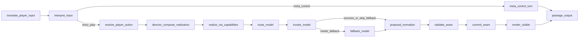
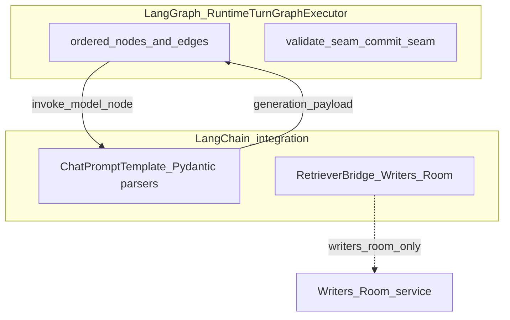

# LangGraph integration

**Model Context Protocol (MCP)** and this page serve different jobs: MCP is the **operator control plane** (stdio tools, resources, prompts). **LangGraph** is the **in-process orchestration library** that orders the **runtime narrative turn** inside `ai_stack` while **world-engine** remains the session authority. See [MCP.md](MCP.md) and [LangChain.md](LangChain.md) for those surfaces.

**Spine:** [AI in World of Shadows — Connected System Reference](../../ai/ai_system_in_world_of_shadows.md).

---

## Plain language

LangGraph answers: **in what order** does a live turn interpret input and then either enter the story-play pipeline or a deterministic control branch? For story-play input, the graph pulls retrieval context, aligns to slice YAML, runs direction logic, calls a model, normalizes output, validates, commits, renders, and packages results. For Meta/OOC control input, it records a structured control event and packages diagnostics without story retrieval, model invocation, or story-state commit. It is a **visible state machine** so operators can see which nodes ran and whether a branch or fallback path was taken.

## Technical precision

- **Public surface:** `ai_stack/langgraph_runtime.py` exports `RuntimeTurnGraphExecutor`.
- **Graph wiring implementation:** `ai_stack/langgraph_runtime_executor.py` — class `RuntimeTurnGraphExecutor`, method `_build_graph`.
- **Compiled graph:** a single `StateGraph` over `RuntimeTurnState` (typed dict fields for inputs, retrieval, routing, generation, diagnostics, seam outcomes).
- **Conditional edge:** after `interpret_input`, `_route_after_interpret_input` routes `player_input_kind=meta` to `meta_control_turn`; all story-play input continues to `resolve_player_action`.
- **Player-turn path (ADR-0062):** after `resolve_player_action`, every story-play turn follows the **Director realization thin path** — `director_compose_realization` → `realize_via_capabilities` → `route_model` → `invoke_model` → seams. The removed `authoritative_action_resolution` deterministic short path and `_route_after_resolve_player_action` router are no longer used.
- **LDSS / dramatic pipeline nodes** (`retrieve_context`, `goc_resolve_canonical_content`, director assess/select, `derive_*`, `synthesize_context`, `assemble_model_context`) remain compiled in the graph for future re-entry but are **not** on the default player-turn edge list.
- **Conditional edge:** after `invoke_model`, `_next_step_after_invoke` routes either to `fallback_model` or `proposal_normalize` depending on invocation success and adapter policy.

**Node list (current graph shape):**

1. `translate_player_input` — semantic translation ingress (ADR-0055).
2. `interpret_input` — interpreter output and task hint (`classification` vs `narrative_formulation`).
3. `meta_control_turn` — deterministic non-story branch for Meta/OOC input; skips story action resolution, retrieval, model invocation, `validate_seam`, and `commit_seam`, then goes directly to `package_output`.
4. `resolve_player_action` — story/action interpretation and affordance framing for normal story-play input.
5. `director_compose_realization` — composes `realization_plan.v1` (`ai_stack/director_realization_composer.py`).
6. `realize_via_capabilities` — builds narrator/actor prompt from selected capability; sets `model_prompt` for routing.
7. `route_model` — selects adapter via `story_runtime_core` routing policy (thin path: immediately after `realize_via_capabilities`).
8. `invoke_model` — structured invocation via LangChain bridge when configured (`invoke_runtime_adapter_with_langchain`).
9. `fallback_model` — optional recovery when primary invocation fails.
10. `proposal_normalize` — normalize model proposal payload.
11. `validate_seam` — GoC validation seam (`ai_stack/goc_turn_seams.py`).
12. `commit_seam` — GoC commit seam.
13. `render_visible` — visible bundle for the player-facing layer.
14. `package_output` — final packaging; graph ends at `END`.

**LDSS / dramatic pipeline nodes (compiled, not on default player thin path):** `retrieve_context`, `goc_resolve_canonical_content`, `director_assess_scene`, `director_select_dramatic_parameters`, `derive_scene_energy`, `derive_pacing_rhythm`, `derive_social_pressure`, `derive_sensory_context`, `derive_improvisational_coherence`, `derive_information_disclosure`, `derive_dramatic_irony`, `derive_relationship_state`, `derive_meta_narrative_awareness`, `synthesize_context`, `assemble_model_context`.

**Meta/OOC control markers:** `meta_control_turn` sets `generation_required=false`, `adapter_invocation_mode=meta_control_path`, `graph_path_summary=meta_control_deterministic`, and `commit_not_applicable=true`. These are diagnostics and repro fields, not story truth.

**Anchors:** `ai_stack/langgraph_runtime.py` (public graph surface), `ai_stack/langgraph_runtime_executor.py` (graph wiring), `ai_stack/runtime_turn_contracts.py` (turn state and health fields), `docs/MVPs/MVP_VSL_And_GoC_Contracts/VERTICAL_SLICE_CONTRACT_GOC.md` (normative GoC checklist).

## Why this matters in World of Shadows

Turn debugging depends on **node-level outcomes**, not only final text. The graph records `nodes_executed`, `node_outcomes`, `fallback_markers`, and execution health (`healthy` | `model_fallback` | `degraded_generation` | `graph_error`) so session diagnostics can answer “which step failed?” without reproducing the full prompt.

## What LangGraph is not

- **Not** the session host: `StoryRuntimeManager` in world-engine increments counters, appends history, runs `resolve_narrative_commit`, and owns persistence after `run()` returns (`world-engine/app/story_runtime/manager.py`).
- **Not** the research pipeline: `ai_stack/research_langgraph.py` sequences research stages in **plain Python**; the filename is historical—the research path does **not** compile a LangGraph `StateGraph` for production orchestration.
- **Not** a durable replay engine by default: checkpoint persistence is explicitly deferred; traces and deterministic fallback take precedence in the current design (verify before assuming checkpoint replay in a given deployment).

## Neighbors

- **LangChain:** prompt templates and parsers **inside** `invoke_model` ([LangChain.md](LangChain.md)).
- **RAG:** `retrieve_context` node on the story-play path only; governance and domains live in `ai_stack/rag.py` ([RAG.md](../ai/RAG.md)).
- **Capabilities:** separate governed operations invoked from backend or tooling, not a replacement for this graph ([capabilities.py](../../../ai_stack/capabilities.py)).

---

## Diagram: runtime turn graph (implementation order)

*Anchored in:* `RuntimeTurnGraphExecutor._build_graph` in `ai_stack/langgraph_runtime_executor.py`.

**What this clarifies:** Default player turns use the **thin path** (ADR-0062): Resolver output is composed by the Director, realized via named capabilities, then routed to a single model invocation before validation and commit. LDSS/dramatic-pipeline nodes remain in the codebase but are not on this edge list. Meta/OOC control input is explicit: it packages structured control diagnostics without story retrieval, model invocation, `validate_seam`, or `commit_seam`. Fallback is an **explicit** branch after `invoke_model`, not a silent retry inside validation.

**Removed (2026-05-19):** `authoritative_action_resolution` and `_route_after_resolve_player_action` — see [ADR-0062](../../ADR/adr-0062-director-realization-thin-path.md).

---

## Diagram: LangGraph vs LangChain in this repository

*Anchored in:* `ai_stack/langgraph_runtime.py` (graph), `ai_stack/langchain_integration/bridges.py` (invoke and retriever bridges).

**What this clarifies:** LangGraph owns **order and branch structure**; LangChain owns **how a single adapter call is templated and parsed**. Writers’ Room additionally uses retriever bridging outside this graph.

---

## Seed graphs (non-runtime)

Minimal **seed** graphs for product experiments—not the canonical play path:

- `build_seed_writers_room_graph()` — Writers’ Room workflow seed.
- `build_seed_improvement_graph()` — improvement workflow seed.

**Anchors:** `ai_stack/langgraph_runtime.py` (functions near file end).

---

## Related

- [LangChain.md](LangChain.md) — structured invocation and bridges.
- [RAG.md](../ai/RAG.md) — retrieval domain, profiles, governance.
- [VERTICAL_SLICE_CONTRACT_GOC.md](../../MVPs/MVP_VSL_And_GoC_Contracts/VERTICAL_SLICE_CONTRACT_GOC.md) — GoC graph checklist.
- [runtime-authority-and-state-flow.md](../runtime/runtime-authority-and-state-flow.md) — who commits session truth.
